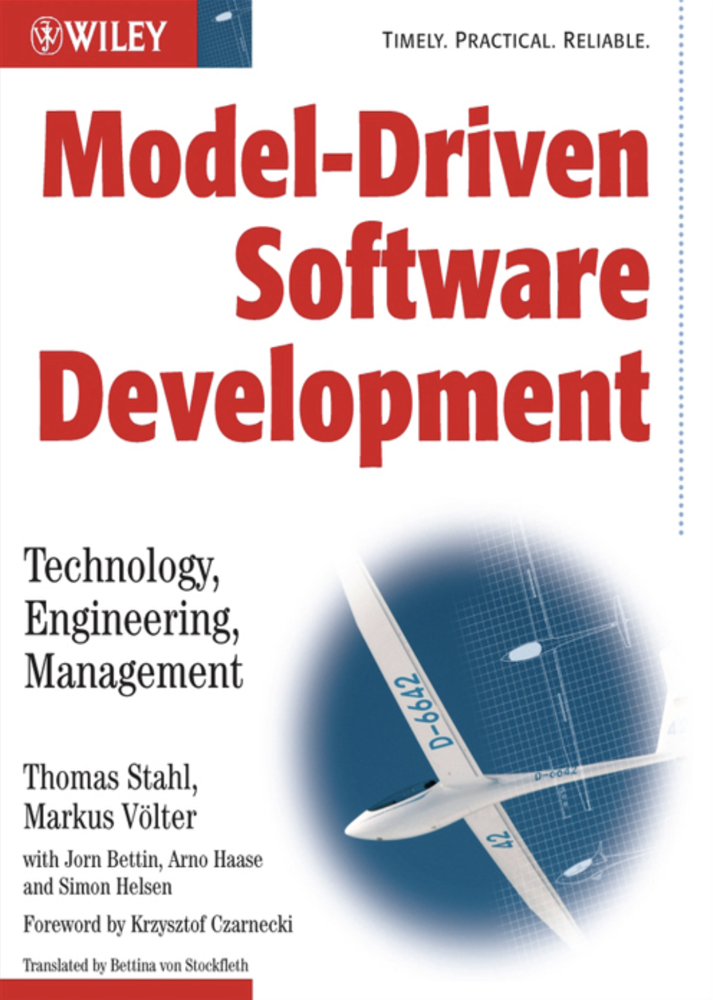

## MDSD 模型驱动软件开发：中文版（非盈利，非官方）
<!--  -->

[序言](ch0/0.md)

[1 引言](ch1/0.md)
* [1.1 本书的主题](ch1/1.md)
* [1.2 目标受众](ch1/2.md)
* [1.3 本书的目标](ch1/3.md)
* [1.4 本书的范围](ch1/4.md)
* [1.5 本书的结构和读者指南](ch1/5.md)
* [1.6 配套网站](ch1/6.md)
* [1.7 作者简介](ch1/7.md)
* [1.8 关于封面](ch1/8.md)
* [1.9 致谢](ch1/9.md)

[2 MDSD 基本概念和术语](ch2/0.md)
* [2.1 挑战](ch2/1.md)
* [2.2 MDSD的目标](ch2/2.md)
* [2.3 MDSD的方法](ch2/3.md)
* [2.4 基本术语](ch2/4.md)
* [2.5 架构为中心的 MDSD](ch2/5.md)

[3 案例研究： 典型Web应用程序](ch3/0.md)
