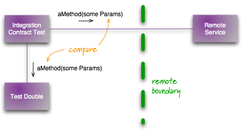

# 契约测试（Contract Test）
| [Martin Fowler](https://martinfowler.com/)| |
|:---|:---|
|| |
|[原文](https://martinfowler.com/bliki/ContractTest.html)| 2011/1/12|

🔖 测试类别

---

使用测试替身最常见的情况之一是与外部服务通信时。
通常，这类服务由不同的团队维护，可能受制于缓慢且不可靠的网络，甚至它们本身也可能不可靠。
这就是为什么测试替身很方便 —— 它能防止你自己的测试变得缓慢和不可靠。
但针对替身进行测试总是引发一个问题：替身是否确实是外部服务的准确表示，以及如果外部服务更改了其契约会发生什么？

 

处理这个问题的一个好方法是继续针对替身运行你自己的测试，但除此之外，还要定期运行一组独立的契约测试。
这些测试检查针对你的测试替身的所有调用是否返回与调用外部服务相同的结果。
任何契约测试的失败都意味着你需要更新你的测试替身，并且可能需要更新你的代码以考虑到服务契约的变化。

<ins>这些测试不必作为常规部署流水线的一部分运行。
你的常规流水线基于你代码变更的节奏，而这些测试需要基于外部服务变更的节奏。
通常，每天运行一次就足够了</ins>。

契约测试的失败不一定像普通测试失败那样中断构建。
然而，它应该触发一个任务来使事情重新保持一致。
这可能涉及更新测试和代码，使它们与外部服务重新保持一致。
同样可能的是，它会触发与外部服务维护者的对话，讨论变更并提醒他们他们的更改如何影响其他应用程序。

如果该服务被用作生产应用程序的一部分，与外部服务提供者的沟通甚至更重要。
在这种情况下，契约变更可能会破坏生产应用程序，引发紧急修复和与提供者团队的紧急对话。

为了减少意外契约中断的可能性，转向 [消费者驱动的契约](https://martinfowler.com/articles/consumerDrivenContracts.html) 方法是有用的。
你可以通过让提供者团队拥有你的契约测试副本来促进这一点，以便他们可以将其作为构建流水线的一部分运行。

当像这样测试外部服务时，通常最好针对外部服务的测试实例进行。
偶尔你别无选择，只能命中生产实例，此时你需要与提供者沟通，让他们知道发生了什么，并对测试的操作格外小心。

契约测试检查外部服务调用的契约，但不一定检查确切的数据。
通常，存根会快照特定日期的响应，因为数据的格式比实际数据更重要。
在这种情况下，即使实际数据已更改，契约测试也需要检查格式是否相同。

构建这些测试替身的最佳方法之一是使用 [自初始化伪造对象](https://martinfowler.com/bliki/SelfInitializingFake.html) 。

### 修订记录
- 2018-01-01：最初此 bliki 条目标题为 “集成契约测试”。
自其编写以来，“契约测试” 一词已被广泛用于指代这些测试，因此我更改了 bliki 条目。
