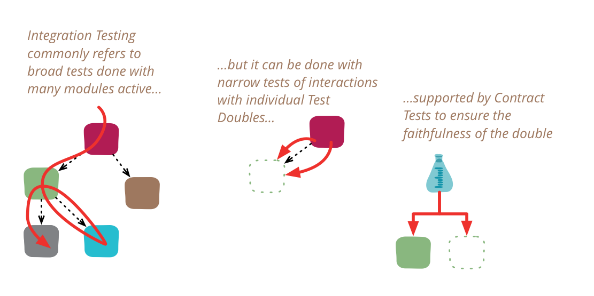

# 集成测试

| [Martin Fowler](https://martinfowler.com/)| |
|:---|:---|
|| |
|[原文](https://martinfowler.com/bliki/IntegrationTest.html)| 2018/1/16|

🔖 测试类别

---

集成测试用于确定独立开发的软件单元在相互连接时是否能正常工作。
即使在软件行业宽松的标准下，这个术语也已经变得模糊不清，因此我在写作中一直谨慎使用它。
特别是，许多人认为集成测试必然是范围广泛的，而实际上它们可以通过更窄的范围更有效地完成。

与这类事情通常的情况一样，最好从一些历史开始。
当我第一次了解集成测试时，那是在 20 世纪 80 年代，瀑布模型对软件开发思想有着主导影响。
在一个较大的项目中，我们会有一个设计阶段，该阶段会指定系统中各个模块的接口和行为。
然后，模块会被分配给开发人员编程。
一个程序员负责一个模块并不罕见，但这个模块会足够大，以至于可能需要数月时间来构建。
所有这些工作都是在隔离状态下完成的，当程序员认为模块完成时，他们会将其交给 QA 进行测试。

测试的第一部分是单元测试，它会根据设计阶段完成的规范单独测试该模块。
一旦完成，我们就会进入集成测试，其中各种模块被组合在一起，或者组成整个系统，或者组成重要的子系统。

集成测试的目的，顾名思义， **是测试多个独立开发的模块是否能按预期协同工作** 。
它通过激活多个模块并对它们运行更高级别的测试来确保它们协同工作。
这些模块可以是单个可执行文件的一部分，也可以是独立的。

从 2010 年代的角度来看，这些测试混淆了两个不同的事物：

- 测试独立开发的模块是否能正常协同工作
- 测试由多个模块组成的系统是否能按预期工作

这两件事很容易混淆，毕竟，如果不将购物车和目录模块都激活到同一个环境中并运行同时测试这两个模块的测试，你还能怎样测试它们呢？

2010 年代的观点提供了另一种选择，这种选择在 1980 年代很少被考虑。
在这种选择中，我们通过测试购物车中与目录交互的代码部分，并针对目录的 [测试替身](./test-double.md) 执行它，来测试购物车和目录模块的集成。
如果测试替身是目录的忠实替身，那么我们就可以测试目录的所有交互行为，而无需激活完整的目录实例。
如果它们是单体应用程序中的独立模块，这可能不是什么大问题，
但如果目录是一个独立的服务，需要自己的构建工具、环境和网络连接，这就是一个大问题。
对于服务，这类测试可以针对进程内测试替身运行，也可以使用像 [mountebank](http://www.mbtest.dev/) 这样的工具针对网络替身运行。

针对测试替身进行集成测试的一个明显问题是，该替身是否真正忠实。
但我们可以使用 [契约测试](./contract-test.md) 来单独测试这一点。

使用窄 (narrow) 集成测试和契约测试的组合，我可以确信能够与外部服务集成，而无需针对该服务的真实实例运行测试，这大大简化了我的构建过程。
采取这种做法的团队可能仍然会使用所有真实服务进行某种形式的端到端系统测试，但如果这样做，也只是非常有限路径的最终冒烟测试。
拥有成熟的 [生产环境中的 QA](https://martinfowler.com/articles/qa-in-production.html) 能力也很有帮助，如果这种能力足够成熟，甚至可能根本不需要进行端到端系统测试。

 

问题在于，对于集成测试的构成，我们至少有（至少）两种不同的概念。

窄集成测试

- 只执行我的服务中与独立服务通信的那部分代码
- 使用这些服务的测试替身，可以是进程内或远程的
- 因此由许多范围狭窄的测试组成，范围通常不比单元测试大（通常与单元测试使用相同的测试框架运行）

宽集成测试

- 需要所有服务的运行版本，需要大量的测试环境和网络访问
- 通过所有服务执行代码路径，而不仅仅是负责交互的代码

有大量的软件开发人员，对他们来说 “集成测试” 只意味着 “宽集成测试”，当他们遇到使用窄方法的人时，这会导致很多混淆。

如果你唯一的集成测试是宽集成测试，你应该考虑探索窄风格，因为它可能会显著提高你的测试速度、易用性和弹性。
<ins>由于窄集成测试范围有限，它们通常运行得非常快，因此可以在 [部署流水线](https://martinfowler.com/bliki/DeploymentPipeline.html) 的早期阶段运行，一旦失败就能提供更快的反馈。</ins>

仿佛术语上的混淆还不够，在 2010 年代末，随着 “集成测试” 的另一种用法，情况变得更糟了。
这源于 [单元测试](./unit-test.md) 含义的分歧。
一些人将单元测试定义为我所说的独立型单元测试，即除了被测对象之外的所有程序元素都被测试替身替换。
鉴于这个狭隘的定义，一些作者将 “集成测试” 定义为社交型单元测试。

所有这些就是我为什么对 “集成测试” 持谨慎态度的原因。
当我读到它时，我会寻找更多上下文，以便知道作者真正指的是哪种。
如果我谈论宽集成测试，我更喜欢使用 “系统测试” 或 “端到端测试”。
对于窄集成测试，我没有更好的名称，所以我确实使用它（但加上 “窄” 以帮助向读者表明这些测试的性质）。
我继续将两种类型的测试都称为 “单元测试”，当需要区分时使用独立型/社交型。

### 致谢
Birgitta Böckeler, Brian Oxley, Dave Rice, Deepti Mittal, Jonny Leroy, Kief Morris, Raimund Klein, Rogerio Chaves, 和 Tiago Griffo 在我们的内部邮件列表中讨论过这篇文章的草稿。

### 修订记录
- 2021年6月3日更新，将对 “集成测试” 用于指代社交型单元测试的用法从脚注移到正文中。
