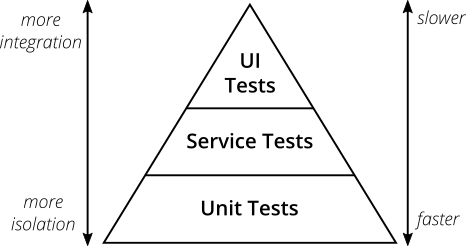
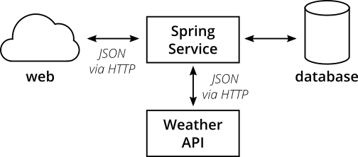
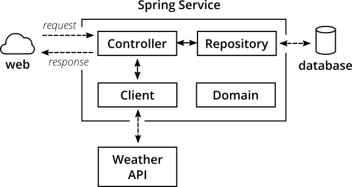
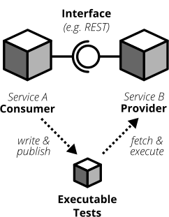

# 实用测试金字塔

<i>“测试金字塔” 是一个隐喻，指导我们将软件测试按不同粒度分组，并给出每个分组应包含多少测试的建议。
  尽管测试金字塔的概念已经存在一段时间，团队在实际落地时仍然面临困难。
  本文重新审视测试金字塔的原始概念，并展示如何将其付诸实践。
  文章指出在金字塔的不同层级应关注哪些类型的测试，并提供如何实现这些测试的实用示例</i>。

|[Ham Vocke](http://www.hamvocke.com/)| |
|:---|---:|
| |Ham 是 Thoughtworks 德国公司的一名软件开发人员和顾问。厌倦了凌晨 3 点手动部署软件后，他将持续交付和勤勉的自动化加入了自己的工具箱，并开始帮助团队可靠且高效地交付高质量软件。他通过用滑稽行为惹恼他人来弥补所节省的时间。|
| [原文](https://martinfowler.com/articles/practical-test-pyramid.html) |2018/1/26|

🔖 测试

---

<br/>

可用于生产的软件在上线之前需要经过测试。
随着软件开发这门学科的成熟，软件测试方法也日趋成熟。
开发团队已经从大量的手工软件测试人员转向自动化大部分测试工作。
自动化测试使团队能够在几秒或几分钟内（而不是几天或几周）了解他们的软件是否出了问题。

由自动化测试推动的显著缩短的反馈循环，与敏捷开发实践、持续交付和 DevOps 文化相辅相成。
拥有有效的软件测试方法使团队能够快速且有信心地行动。

本文探讨了一个全面、响应迅速、可靠且可维护的测试组合应该是什么样子 —— 无论你是在构建微服务架构、移动应用还是物联网生态系统。
我们还将深入探讨构建有效且可读的自动化测试的细节。

## （测试）自动化的重要性

软件已成为我们所处世界的重要组成部分。
它已经超越了其早期单纯的提高企业效率的目的。
如今，公司都在努力寻找成为一流数字化企业的方法。
作为用户，我们每个人都每天与越来越多的软件打交道。
创新的车轮正转得越来越快。

如果你想跟上步伐，就必须寻找在不牺牲质量的情况下更快交付软件的方法。
持续交付 ——一种自动确保你的软件随时可以发布到生产环境的实践—— 可以帮助你做到这一点。
通过持续交付，你使用构建流水线来自动测试你的软件并将其部署到测试和生产环境。

手动构建、测试和部署越来越多的软件很快就会变得不可能 —— 除非你想把所有时间都花在手动、重复的工作上，而不是交付可工作的软件。
自动化一切 ——从构建到测试、部署和基础设施—— 是你唯一的出路。

<br/>
*Fig 1：使用构建流水线自动且可靠地将软件交付到生产环境*

传统上，软件测试是过度手动的工作，通过将应用程序部署到测试环境，然后执行一些黑盒式测试，例如通过点击用户界面来检查是否有任何问题。
通常这些测试会由测试脚本指定，以确保测试人员进行一致的检查。

显而易见，手动测试所有更改是耗时、重复且乏味的。
重复会导致无聊，无聊会导致错误，并让你在一周结束前就想换一份工作。

幸运的是，重复性任务有补救措施：自动化。

自动化重复性测试可以极大地改变你作为软件开发人员的生活。
自动化这些测试后，你不再需要盲目地遵循点击协议来检查你的软件是否仍然正常工作。
自动化你的测试后，你可以毫无顾虑地更改你的代码库。
如果你曾经尝试过在没有适当测试套件的情况下进行大规模重构，我敢打赌你知道这是一种多么可怕的经历。
你怎么知道你是否在过程中意外地破坏了东西？
好吧，你通过点击所有手动测试用例来检查，就是这样。
但说实话：你真的喜欢那样吗？
在进行大规模更改时，能在几秒钟内知道是否破坏了东西，同时悠闲地喝上一口咖啡，怎么样？
如果你问我的话，这听起来更愉快。

## 测试金字塔

如果你打算认真对待软件的自动化测试，有一个关键概念你应该了解：测试金字塔。
Mike Cohn 在他的著作《Succeeding with Agile》中提出了这一概念。
它是一个很好的视觉隐喻，告诉你要考虑不同层次的测试，并告诉你在每一层应该进行多少测试。

<br/>
*Fig 2：测试金字塔*

Mike Cohn 最初的测试金字塔由三个层次组成，你的测试套件应该包含（从下到上）：

1. 单元测试
2. 服务测试
3. 用户界面测试

不幸的是，如果你仔细审视，测试金字塔的概念有些不足。
一些人认为 Mike Cohn 测试金字塔的命名或某些概念方面并不理想，我不得不同意这一点。
从现代角度来看，测试金字塔似乎过于简单，因此可能产生误导。

尽管如此，由于其简单性，测试金字塔的本质在建立自己的测试套件时仍然是一个很好的经验法则。
你最好的做法是记住 Cohn 原始测试金字塔中的两点：

- <ins>编写不同粒度的测试</ins>
- <ins>层次越高，测试数量应越少</ins>

遵循金字塔形状来建立一个健康、快速且可维护的测试套件：编写大量小而快的单元测试。
编写一些较粗粒度的测试，以及极少量的从端到端测试应用程序的高层测试。
注意不要最终得到一个 [测试冰淇淋蛋筒](https://alisterscott.github.io/TestingPyramids.html)，那将是一场维护噩梦，并且运行时间过长。

*「译注：ice-cream cone」*<br/>

不要过于拘泥于 Cohn 测试金字塔中各个层的名称。
事实上，它们可能相当误导：“服务测试” 是一个难以把握的术语（Cohn 自己也谈到观察到 [许多开发人员完全忽略这一层](https://www.mountaingoatsoftware.com/blog/the-forgotten-layer-of-the-test-automation-pyramid) ）。
在像 react、angular、ember.js 等单页应用框架盛行的时代，很明显 UI 测试不一定要放在金字塔的最高层 —— 你在所有这些框架中都可以完美地对 UI 进行单元测试。

鉴于原始名称的缺陷，完全可以为你的测试层想出其他名称，只要在你的代码库和团队讨论中保持一致即可。

## 我们将考察的工具和库

- [JUnit](http://junit.org/) ：我们的测试运行器
- [Mockito](http://site.mockito.org/) ：用于 mocking 依赖项
- [Wiremock](http://wiremock.org/) ：用于 stubbing 外部服务
- [Pact](https://docs.pact.io/) ：用于编写 CDC（消费者驱动契约）测试
- [Selenium](http://docs.seleniumhq.org/) ：用于编写 UI 驱动的端到端测试
- [REST-assured](https://github.com/rest-assured/rest-assured) ：用于编写 REST API 驱动的端到端测试

## 示例应用程序

我编写了一个 [简单的微服务](https://github.com/hamvocke/spring-testing) ，包括一个测试套件，其中包含针对测试金字塔不同层次的测试。

该示例应用程序展示了典型微服务的特征。
它提供 REST 接口，与数据库通信，并从第三方 REST 服务获取信息。
它使用 [Spring Boot](https://projects.spring.io/spring-boot/) 实现，即使你以前从未使用过 Spring Boot，也应该能够理解。

请务必查看 [Github 上的代码](https://github.com/hamvocke/spring-testing) 。
README 中包含在你自己的机器上运行应用程序及其自动化测试所需的说明。

### 功能

该应用程序的功能很简单。
它提供了一个包含三个端点的 REST 接口：

- `GET /hello`：返回 “Hello World”。总是如此。
- `GET /hello/{lastname}`：查找具有所提供姓氏的人。如果该人已知，则返回 “Hello {Firstname} {Lastname}”。
- `GET /weather`：返回德国汉堡的当前天气状况。

### 高层结构

在高层，系统具有以下结构：

<br/>
*Fig 3：我们微服务系统的高层结构*

我们的微服务提供了一个可以通过 HTTP 调用的 REST 接口。
对于某些端点，服务将从数据库获取信息。
在其他情况下，服务将通过 HTTP 调用 [外部天气 API](https://darksky.net/) 来获取并显示当前天气状况。

### 内部架构

在内部，Spring Service 具有典型的 Spring 架构：

<br/>
*Fig 4：我们微服务的内部结构*

- **Controller 类**：提供 REST 端点，处理 HTTP 请求和响应
- **Repository 类**：与数据库交互，负责将数据写入持久存储或从持久存储读取数据
- **Client 类**：与其他 API 通信，在我们的案例中，它通过 HTTPS 从 darksky.net 天气 API 获取 JSON 数据
- **Domain 类**：捕获我们的 [领域模型](https://en.wikipedia.org/wiki/Domain_model)，包括领域逻辑（公平地说，在我们的案例中非常琐碎）

有经验的 Spring 开发者可能会注意到这里缺少了一个常用的层：受 [领域驱动设计](https://en.wikipedia.org/wiki/Domain-driven_design) 启发，许多开发者会构建一个由 Service 类组成的服务层。
我决定不在这个应用程序中包含服务层。原因之一是我们的应用程序足够简单，服务层将是一个不必要的间接层。
另一个原因是我认为人们过度使用服务层。
我经常遇到这样的代码库，其中整个业务逻辑都被捕获在 Service 类中。
领域模型仅仅成为数据的载体，而不是行为（ [贫血领域模型](https://en.wikipedia.org/wiki/Anemic_domain_model) ）。
对于每个非平凡的应用程序，这浪费了大量保持代码结构良好和可测试的潜力，并且没有充分利用面向对象的能力。

我们的 Repository 很简单，并提供简单的 CRUD 功能。
为了保持代码简单，我使用了 [Spring Data](http://projects.spring.io/spring-data/) 。
Spring Data 为我们提供了一个简单且通用的 CRUD Repository 实现，我们可以使用它而不必自己编写。
它还负责在测试中启动内存数据库，而不是像在生产环境中那样使用真正的 PostgreSQL 数据库。

请查看代码库并熟悉其内部结构。
这对于我们的下一步 ——测试应用程序—— 将非常有用！

## 单元测试

你的测试套件的基础将由单元测试构成。
单元测试确保你的代码库中的某个单元（你的被测对象）按预期工作。
单元测试在你的测试套件中具有最窄的范围。
你的测试套件中单元测试的数量将大大超过任何其他类型的测试。

<br/>
*Fig 5：单元测试通常用测试替身替换外部协作者*

### 什么是单元？

如果你问三个不同的人 “单元” 在单元测试的上下文中意味着什么，你可能会收到四种不同且略有细微差别的答案。
在某种程度上，这取决于你自己的定义，没有规范的答案也是可以的。

如果你在函数式语言中工作，一个单元很可能是一个单独的函数。
你的单元测试将用不同的参数调用一个函数，并确保它返回预期的值。
<ins>在面向对象语言中，一个单元可以范围从单个方法到整个类</ins>。

### 社交型与独立型

一些人认为，被测对象的所有协作者（例如，被测类调用的其他类）都应该用 mocks 或 stubs 来替代，以实现完美的隔离，并避免副作用和复杂的测试设置。
另一些人则认为，只有那些运行缓慢或有较大副作用（例如访问数据库或进行网络调用的类）的协作者才应该被 stubbed 或 mocked。

[偶尔](./unit-test.md)，人们将这两类测试分别称为 *独立型单元测试* （为所有协作者提供 stub）和 *社交型单元测试* （允许与真实协作者通信）
（Jay Fields 的 [Working Effectively with Unit Tests](https://leanpub.com/wewut) 创造了这些术语）。如
果你有空闲时间，可以深入研究并 [阅读更多关于不同学派的优缺点](./mocks-arent-stubs.md) 。

<ins>归根结底，决定是否采用社交型或独立型单元测试并不重要。
编写自动化测试才是重要的。
就个人而言，我发现我总是两种方法都在用。
当使用真实协作者变得麻烦时，我会慷慨地使用 mocks 和 stubs 。
当我觉得涉及真实协作者能让我对测试更有信心时，我只会 stub 服务的最外层部分</ins>。

### Mocking 与 Stubbing

Mocks 和 Stubs 是两种不同类型的 [测试替身](./test-double.md)（还有不止这两种）。
很多人会将 Mock 和 Stub 这两个术语互换使用。
我认为保持精确并记住它们各自的特性是好的。
你可以使用测试替身来替换生产环境中使用的对象，用有助于测试的实现来替代。

简单来说，就是用某个东西的伪造版本替换真实的东西（例如一个类、模块或函数）。
伪造版本看起来和行为都像真实的东西（对相同的方法调用做出响应），但使用你在单元测试开始时自己定义的预设响应来回答。

使用测试替身并非单元测试所特有。
更复杂的测试替身可以用于以受控方式模拟系统的整个部分。
然而，在单元测试中，你很可能会遇到大量的 Mock 和 Stub（取决于你是社交型还是独立型的开发者），
这仅仅是因为许多现代语言和库使得设置 Mock 和 Stub 变得简单而舒适。

无论你选择哪种技术，很可能你的语言标准库或某个流行的第三方库，都会为你提供优雅的设置 Mock 的方式。
即使从头开始编写自己的 Mock，也只是编写一个与真实签名相同的 fake 类/模块/函数，并在测试中设置它。

你的单元测试将运行得非常快。
在一台不错的机器上，你可以期望在几分钟内运行数千个单元测试。
隔离地测试代码库的小部分，并避免命中数据库、文件系统或发起 HTTP 查询
（通过对这些部分使用 Mock 和 Stub）以保持测试快速。

一旦你掌握了编写单元测试的技巧，你会变得越来越熟练。
Stub 外部协作者，设置一些输入数据，调用你的被测对象，并检查返回值是否符合你的预期。
研究 [测试驱动开发](https://en.wikipedia.org/wiki/Test-driven_development)，让你的单元测试指导你的开发；
如果应用得当，它可以帮助你进入一个良好的流程，并产生良好且可维护的设计，
同时自动生成一个全面且完全自动化的测试套件。
不过，它并非银弹。
继续前进，给它一个真正的机会，看看它是否适合你。

### 测试什么内容？

> **但我真的需要测试这个私有方法**
>
> 如果你发现自己处于一种真的、真的需要测试一个私有方法的情况，你应该退一步问问自己为什么。
我很确定这更多是一个设计问题，而不是作用域问题。
很可能你觉得需要测试一个私有方法，是因为它很复杂，而通过类的公共接口测试这个方法需要大量尴尬的设置。
>
> 每当我发现自己处于这种情况时，我通常得出的结论是，我正在测试的类已经太复杂了。
它做了太多的事情，违反了单一职责原则 —— 即 [SOLID](https://en.wikipedia.org/wiki/SOLID_(object-oriented_design)) 五原则中的 S。
>
> 对我来说经常有效的解决方案是将原始类拆分为两个类。
通常只需要一两分钟的思考，就能找到一个好的方法，将一个大的类切成两个更小、各自有独立职责的类。
我将私有方法（我迫切想要测试的那个）移到新类，并让旧类调用新方法。
瞧，我难以测试的私有方法现在变成了公共方法，可以轻松地进行测试了。
最重要的是，我通过遵守单一职责原则改进了代码的结构。

单元测试的好处在于，你可以为所有生产代码类编写测试，无论它们的功能如何，或者它们属于内部结构的哪个层。
你可以像测试 Repository、领域类或文件读取器一样，对 Controller 进行单元测试。
<ins>只需遵循 **每个生产类对应一个测试类的经验准则** ，你就有了一个好的开始</ins>。

<ins>一个单元测试类至少应该 **测试该类的公共接口** </ins>。
私有方法无论如何都无法测试，因为你根本无法从不同的测试类中调用它们。
受保护或包私有的方法可以从测试类访问（假设你的测试类的包结构与生产类相同），但测试这些方法可能已经过头了。

<ins>编写单元测试时有一条微妙的界线：它们应该确保所有非平凡 (non-trivial) 的代码路径都得到测试（包括正常路径和边缘情况）。
同时，它们不应该与你的实现过于紧密地耦合</ins>。

为什么呢？

过于接近生产代码的测试很快就会变得烦人。
一旦你重构生产代码（快速回顾：重构意味着在不改变外部可见行为的情况下改变代码的内部结构），你的单元测试就会失败。

这样你就失去了单元测试的一大好处：作为代码变更的安全网。
你会变得厌倦于每次重构时那些愚蠢的测试失败，造成更多的工作而不是帮助；而这一切到底是谁的主意？

那该怎么办？
<ins>不要在你的单元测试中反映你的内部代码结构。
相反，测试可观察的行为</ins>。
思考：

> “如果我输入值 x 和 y，结果会是 z 吗？”

而不是：

> “如果我输入 x 和 y，方法会先调用类 A，然后调用类 B，然后返回类 A 的结果加上类 B 的结果吗？”

<ins>私有方法通常应被视为实现细节。
这就是为什么你甚至不应该有测试它们的冲动</ins>。

我经常听到单元测试（或 TDD）的反对者争辩说，编写单元测试成为无意义的工作，你必须测试所有方法才能达到高测试覆盖率。
他们经常引用这样的场景：一个过于热心的团队负责人强迫他们为 getter、setter 和所有其他类型的琐碎代码编写单元测试，以达到 100% 的测试覆盖率。

这其中有太多错误。

<ins>是的，你应该测试公共接口。
然而，更重要的是，你不应测试琐碎的 (trivial) 代码</ins>。
别担心，[Kent Beck 说过这是可以的](https://stackoverflow.com/questions/153234/how-deep-are-your-unit-tests/) 。
你从测试简单的 getter 或 setter 或其他琐碎实现（例如没有任何条件逻辑的）中得不到任何好处。
节省时间，那又是一次你可以参加的会议，万岁！

### 测试结构

适用于所有测试（不仅限于单元测试）的一个良好结构如下：

1. 设置测试数据
2. 调用被测方法
3. 断言返回了预期结果

有一个很好的助记符可以记住这个结构："[Arrange, Act, Assert](https://xp123.com/articles/3a-arrange-act-assert/)"（安排、执行、断言）。
另一个可以使用的助记符受 BDD 启发，即 ["given"、"when"、"then"](https://martinfowler.com/bliki/GivenWhenThen.html) 三元组，其中 given 对应设置，when 对应方法调用，then 对应断言部分。

这种模式也可以应用于其他更高层次的测试。
在每种情况下，它们都能确保你的测试保持易于阅读且一致。
最重要的是，按照这种结构编写的测试往往更简短、更具表现力。

### 实现单元测试

> **专门的测试辅助工具**
>
> 能够为整个代码库编写单元测试，无论你处于应用程序架构的哪个层，都是一件美好的事情。
该示例展示了一个针对 Controller 的简单单元测试。
不幸的是，对于 Spring 的 Controller 来说，这种方法有一个缺点：Spring MVC 的 Controller 大量使用注解来声明它们监听的路径、使用的 HTTP 动词、从 URL 路径或查询参数中解析的参数等等。
仅仅在单元测试中调用 Controller 的方法并不能测试所有这些关键的东西。
幸运的是，Spring 团队提出了一个很好的测试辅助工具，你可以用它来编写更好的 Controller 测试。
请务必查看 [MockMVC](https://docs.spring.io/spring/docs/current/spring-framework-reference/testing.html#spring-mvc-test-server)。
它提供了一个很好的 DSL，你可以用它来向你的 Controller 发送伪造请求，并检查一切是否正常。
我在示例代码库中包含了一个 [示例](https://github.com/hamvocke/spring-testing/blob/master/src/test/java/example/ExampleControllerAPITest.java) 。
许多框架都提供测试辅助工具，使测试代码库的特定方面更加愉快。
请查看你选择的框架的文档，看看它是否为你的自动化测试提供任何有用的辅助工具。

现在我们知道了要测试什么以及如何构建单元测试，我们终于可以看到一个真实的例子了。

让我们以 `ExampleController` 类的一个简化版本为例：

```java
@RestController
public class ExampleController {

    private final PersonRepository personRepo;

    @Autowired
    public ExampleController(final PersonRepository personRepo) {
        this.personRepo = personRepo;
    }

    @GetMapping("/hello/{lastName}")
    public String hello(@PathVariable final String lastName) {
        Optional<Person> foundPerson = personRepo.findByLastName(lastName);

        return foundPerson
                .map(person -> String.format("Hello %s %s!",
                        person.getFirstName(),
                        person.getLastName()))
                .orElse(String.format("Who is this '%s' you're talking about?",
                        lastName));
    }
}
```

一个针对 `hello(lastname)` 方法的单元测试可能如下所示：

```java
public class ExampleControllerTest {

    private ExampleController subject;

    @Mock
    private PersonRepository personRepo;

    @Before
    public void setUp() throws Exception {
        initMocks(this);
        subject = new ExampleController(personRepo);
    }

    @Test
    public void shouldReturnFullNameOfAPerson() throws Exception {
        Person peter = new Person("Peter", "Pan");
        given(personRepo.findByLastName("Pan"))
            .willReturn(Optional.of(peter));

        String greeting = subject.hello("Pan");

        assertThat(greeting, is("Hello Peter Pan!"));
    }

    @Test
    public void shouldTellIfPersonIsUnknown() throws Exception {
        given(personRepo.findByLastName(anyString()))
            .willReturn(Optional.empty());

        String greeting = subject.hello("Pan");

        assertThat(greeting, is("Who is this 'Pan' you're talking about?"));
    }
}
```

我们使用 [JUnit](http://junit.org/)（Java 事实上的标准测试框架）编写单元测试。
我们使用 [Mockito](http://site.mockito.org/) 来用 stub 替换真实的 `PersonRepository` 类进行测试。
这个 stub 允许我们定义 stubbed 方法在测试中应返回的预设响应。
Stubbing 使我们的测试更简单、更可预测，并允许我们轻松地设置测试数据。

遵循 arrange、act、assert 结构，我们编写了两个单元测试 —— 一个正向案例和一个找不到所搜索人员的情况。
第一个正向测试用例创建一个新的 person 对象，并告诉模拟的 repository 在传入 “Pan” 作为 `lastName` 参数值时返回这个对象。
然后测试继续调用应该被测试的方法。
最后它断言响应等于预期的响应。

第二个测试类似，但测试的是被测方法在给定参数下找不到人员时的场景。

## 集成测试

所有非平凡的应用程序都会与其他部分（数据库、文件系统、对其他应用程序的网络调用）进行集成。
在编写单元测试时，这些通常是你为了获得更好的隔离和更快的测试而省略的部分。
<ins>尽管如此，你的应用程序会与其他部分交互，这需要被测试。
[集成测试](./integration-test.md) 就是为了帮助解决这个问题。
它们测试你的应用程序与所有存在于应用程序外部的部分的集成</ins>。

对于你的自动化测试来说，这意味着你不仅需要运行你自己的应用程序，还需要运行你正在集成的组件。
如果你在测试与数据库的集成，你需要在运行测试时运行一个数据库。
为了测试你是否能从磁盘读取文件，你需要将一个文件保存到磁盘，并在集成测试中加载它。

我之前提到过 “单元测试” 是一个模糊的术语，对于 “集成测试” 来说更是如此。
对于某些人来说，集成测试意味着测试通过连接到系统中其他应用程序的整个技术栈。
<ins>我喜欢更狭义地对待集成测试，一次只测试一个集成点，用测试替身替换单独的服务和数据库。
结合契约测试，并对测试替身以及真实实现运行契约测试，你可以设计出更快、更独立、通常更容易推理的集成测试</ins>。

窄 (Narrow) 集成测试位于你的服务的边界。
从概念上讲，它们总是关于触发一个导致与外部部分（文件系统、数据库、单独的服务）集成的操作。
一个数据库集成测试看起来像这样：

<br/>
*Fig 6：数据库集成测试将你的代码与真实数据库集成*

- 启动一个数据库
- 将你的应用程序连接到数据库
- 触发你代码中的一个函数，将数据写入数据库
- 通过从数据库读取数据，检查预期数据是否已被写入数据库

另一个例子，测试你的服务通过 REST API 与独立服务集成，可能如下所示：

<br/>
*Fig 7：这种集成测试检查你的应用程序能否正确地与独立服务通信*

- 启动你的应用程序
- 启动独立服务的一个实例（或具有相同接口的测试替身）
- 触发你代码中的一个函数，从独立服务的 API 读取数据
- 检查你的应用程序能否正确解析响应

<ins>你的集成测试 ——像单元测试一样—— 可以相当白盒。
一些框架允许你在启动应用程序的同时，仍然能够模拟你应用程序的其他部分，以便你可以检查是否发生了正确的交互</ins>。

为所有序列化或反序列化数据的代码片段编写集成测试。这种情况比你想象的更常见。想想看：

- 调用你的服务 REST API
- 对数据库的读写
- 调用其他应用程序的 API
- 对队列的读写
- 写入文件系统

<ins>围绕这些边界编写集成测试，可以确保向这些外部协作者写入数据和从中读取数据能够正常工作</ins>。

<ins>在编写窄集成测试时，你应该致力于在本地运行你的外部依赖：启动一个本地 MySQL 数据库，在本地 ext4 文件系统上进行测试。
如果你与一个独立服务集成，要么在本地运行该服务的一个实例，要么构建并运行一个模拟真实服务行为的伪造版本</ins>。

如果无法在本地运行第三方服务，你应该选择运行一个专用的测试实例，并在运行集成测试时指向该测试实例。
避免在你的自动化测试中与真实的生产系统集成。
向生产系统发送数千个测试请求肯定会让人生气，因为你（在最好的情况下）弄乱了他们的日志，或者（在最坏的情况下）对他们的服务进行了 DoS 攻击。
通过网络与服务集成是广泛集成测试的典型特征，并且会使你的测试变慢，通常也更难编写。

<ins>关于测试金字塔，集成测试的层次高于你的单元测试。
集成诸如文件系统和数据库等慢速部分往往比用 stub 替换这些部分来运行单元测试要慢得多。
它们也可能比小而隔离的单元测试更难编写，毕竟你必须在测试中启动一个外部部分。
尽管如此，它们的优势在于让你确信你的应用程序可以正确地与它需要通信的所有外部部分一起工作。
单元测试无法帮助你做到这一点</ins>。

### 数据库集成

`PersonRepository` 是代码库中唯一的 Repository 类。
它依赖于 Spring Data，并且没有实际的实现。
它只是扩展了 `CrudRepository` 接口并提供了一个单独的方法头。
其余的都是 Spring 的魔法。

```java
public interface PersonRepository extends CrudRepository<Person, String> {
    Optional<Person> findByLastName(String lastName);
}
```

通过 `CrudRepository` 接口，Spring Boot 提供了一个功能完整的 CRUD Repository，包含 `findOne`、`findAll`、`save`、`update` 和 `delete` 方法。
我们自定义的方法定义（`findByLastName()`）扩展了此基本功能，并为我们提供了一种按姓氏获取 `Person` 的方法。
Spring Data 分析方法的返回类型及其方法名，并根据命名约定检查方法名以确定它应该做什么。

<ins>尽管 Spring Data 完成了实现数据库 Repository 的繁重工作，我仍然写了一个数据库集成测试。
你可能会争辩说这是在测试框架，是应该避免的，因为不是我们在测试自己的代码。
尽管如此，我相信在这里至少有一个集成测试是至关重要的。
首先，它测试了我们自定义的 `findByLastName` 方法是否确实按预期行为工作。
其次，它证明我们的 Repository 正确使用了 Spring 的注入，并且可以连接到数据库</ins>。

为了让你更容易在本地机器上运行测试（无需安装 PostgreSQL 数据库），我们的测试连接到一个内存中的 H2 数据库。

我在 `build.gradle` 文件中将 H2 定义为测试依赖项。
测试目录中的 `application.properties` 没有定义任何 `spring.datasource` 属性。
这告诉 Spring Data 使用内存数据库。
由于它在类路径上找到了 H2，因此在运行测试时它会使用 H2。

当使用 `int` 配置文件运行真实应用程序时（例如通过设置环境变量 `SPRING_PROFILES_ACTIVE=int`），它会连接到 `application-int.properties` 中定义的 PostgreSQL 数据库。

我知道，这需要了解和理解大量 Spring 的细节。
要到达那里，你必须仔细阅读 [大量文档](https://docs.spring.io/spring-boot/docs/current/reference/html/boot-features-sql.html#boot-features-embedded-database-support) 。
最终得到的代码看起来很简洁，但如果你不了解 Spring 的细微之处，就很难理解。

<ins>最重要的是，使用内存数据库是有风险的。
毕竟，我们的集成测试针对的是与生产环境不同类型的数据库。
请自行决定你更喜欢 Spring 魔法和简洁代码，还是更倾向于显式但更冗长的实现</ins>。

好了，解释得够多了，这里是一个简单的集成测试，它将一个 `Person` 保存到数据库，并通过姓氏查找它：

```java
@RunWith(SpringRunner.class)
@DataJpaTest
public class PersonRepositoryIntegrationTest {
    @Autowired
    private PersonRepository subject;

    @After
    public void tearDown() throws Exception {
        subject.deleteAll();
    }

    @Test
    public void shouldSaveAndFetchPerson() throws Exception {
        Person peter = new Person("Peter", "Pan");
        subject.save(peter);

        Optional<Person> maybePeter = subject.findByLastName("Pan");

        assertThat(maybePeter, is(Optional.of(peter)));
    }
}
```

你可以看到，我们的集成测试遵循与单元测试相同的 arrange、act、assert 结构。
告诉过你这是一个普适的概念！

### 与独立服务的集成

我们的微服务与 [darksky.net](https://darksky.net/)（一个天气 REST API）通信。
当然，我们希望确保我们的服务能够正确发送请求并解析响应。

<ins>我们希望避免在运行自动化测试时访问真实的 darksky 服务器。
我们免费计划的配额限制只是部分原因。
真正的原因是解耦。
我们的测试应该独立于 darksky.net 那边实际的服务状态运行</ins>。
即使你的机器无法访问 darksky 服务器，或者 darksky 服务器因维护而停机。

我们可以通过在运行集成测试时运行我们自己伪造的 darksky 服务器来避免访问真实的 darksky 服务器。
这听起来像是一项艰巨的任务。
得益于像 [Wiremock](http://wiremock.org/) 这样的工具，这变得非常简单。
请看：

```java
@RunWith(SpringRunner.class)
@SpringBootTest
public class WeatherClientIntegrationTest {

    @Autowired
    private WeatherClient subject;

    @Rule
    public WireMockRule wireMockRule = new WireMockRule(8089);

    @Test
    public void shouldCallWeatherService() throws Exception {
        wireMockRule.stubFor(get(urlPathEqualTo("/some-test-api-key/53.5511,9.9937"))
                .willReturn(aResponse()
                        .withBody(FileLoader.read("classpath:weatherApiResponse.json"))
                        .withHeader(CONTENT_TYPE, MediaType.APPLICATION_JSON_VALUE)
                        .withStatus(200)));

        Optional<WeatherResponse> weatherResponse = subject.fetchWeather();

        Optional<WeatherResponse> expectedResponse = Optional.of(new WeatherResponse("Rain"));
        assertThat(weatherResponse, is(expectedResponse));
    }
}
```

为了使用 Wiremock，我们在一个固定端口（8089）上实例化了一个 `WireMockRule`。
使用 DSL，我们可以设置 Wiremock 服务器，定义它应该监听的端点，并设置它应该响应的预设响应。

接下来，我们调用要测试的方法 ——即调用第三方服务的方法—— 并检查结果是否被正确解析。

重要的是要理解测试是如何知道它应该调用伪造的 Wiremock 服务器而不是真正的 darksky API 的。
秘密在于我们包含在 `src/test/resources` 中的 `application.properties` 文件。
这是 Spring 在运行测试时加载的属性文件。
在此文件中，我们覆盖了诸如 API 密钥和 URL 等配置，用适合我们测试目的的值替换 —— 例如，调用伪造的 Wiremock 服务器而不是真实的服务器：

```
weather.url = http://localhost:8089
```

注意，这里定义的端口必须与我们测试中实例化 `WireMockRule` 时定义的端口相同。
在我们的测试中，通过在我们的 `WeatherClient` 类的构造函数中注入 URL，可以用伪造的 URL 替换真实的天气 API URL：

```java
@Autowired
public WeatherClient(final RestTemplate restTemplate,
                     @Value("${weather.url}") final String weatherServiceUrl,
                     @Value("${weather.api_key}") final String weatherServiceApiKey) {
    this.restTemplate = restTemplate;
    this.weatherServiceUrl = weatherServiceUrl;
    this.weatherServiceApiKey = weatherServiceApiKey;
}
```

通过这种方式，我们告诉我们的 `WeatherClient` 从我们在 `application.properties` 中定义的 `weather.url` 属性中读取 `weatherUrl` 参数的值。

使用像 Wiremock 这样的工具为独立服务编写窄集成测试相当容易。
<ins>不幸的是，这种方法有一个缺点：我们如何确保我们设置的伪造服务器表现得像真实服务器？</ins>
在当前的实现中，独立服务可能会改变其 API，而我们的测试仍然会通过。
现在，我们只是测试我们的 `WeatherClient` 能否解析伪造服务器发送的响应。
这是一个开始，但非常脆弱。
<ins>使用端到端测试，并针对真实服务的测试实例（而不是使用伪造服务）运行测试，可以解决这个问题，
但会使我们依赖于测试服务的可用性。
幸运的是，针对这个困境有一个更好的解决方案：
对伪造和真实服务器都运行契约测试，可以确保我们在集成测试中使用的伪造是一个忠实的测试替身</ins>。
让我们接下来看看这是如何工作的。

## 契约测试

更现代的软件开发组织已经找到了通过将系统开发分散到不同团队来扩展开发工作的方法。
各个团队构建各自独立、松散耦合的服务，而不会互相干扰，并将这些服务集成到一个大的、有凝聚力的系统中。
最近关于微服务的热议正是针对这一点。

将系统拆分成许多小服务通常意味着这些服务需要通过某些（希望是定义良好的，有时是偶然形成的）接口相互通信。

不同应用程序之间的接口可以有不同形式和技术。常见的有：

- 通过 HTTPS 的 REST 和 JSON
- 使用如 [gRPC](https://grpc.io/) 的 RPC
- 使用队列构建事件驱动架构

对于每个接口，都有两方参与：提供者和消费者。
提供者向消费者提供数据。
消费者处理从提供者获取的数据。
在 REST 世界中，提供者构建一个包含所有所需端点的 REST API；
消费者调用此 REST API 以获取数据或触发其他服务中的变更。
在异步、事件驱动的世界中，提供者（通常称为发布者）将数据发布到队列；消费者（通常称为订阅者）订阅这些队列，并读取和处理数据。

<br/>
*Fig 8：每个接口都有一个提供（或发布）方和一个消费（或订阅）方。接口的规范可以被视为一个契约。*

由于你经常将消费方和提供方服务分散在不同团队，
你会发现自己处于必须明确指定这些服务之间接口（即所谓的 **契约** ）的境地。
传统上，公司通过以下方式解决这个问题：

1. 编写一份冗长而详细的接口规范（契约）
2. 根据定义的契约实现提供方服务
3. 将接口规范扔给消费方团队
4. 等待他们实现消费接口的部分
5. 运行一些大规模的手动系统测试，看看一切是否正常
6. 希望两个团队永远遵守接口定义，不会搞砸

更现代的软件开发团队已经用更自动化的方式取代了步骤 5 和 6：
自动化 [契约测试](contract-test.md) 确保消费方和提供方的实现仍然遵守定义的契约。
它们作为一个良好的回归测试套件，并确保偏差能及早被发现。

在一个更敏捷的组织中，你应该采取更高效、更少浪费的路径。
你在同一个组织内构建应用程序。
直接与其他服务的开发人员沟通，而不是将过于详细的文档扔过去，真的不应该太难。
毕竟，他们是你的同事，而不是你只能通过客户支持或法律上无懈可击的合同来沟通的第三方供应商。

<ins>**消费者驱动契约测试 (Consumer-Driven Contract tests)** （CDC tests）让 [消费者驱动契约的实现](https://martinfowler.com/articles/consumerDrivenContracts.html) 。
通过 CDC，接口的消费者编写测试，检查接口是否提供他们所需的所有数据。
消费团队随后发布这些测试，以便发布团队可以轻松获取并执行这些测试。
提供团队现在可以通过运行 CDC 测试来开发他们的 API。
一旦所有测试通过，他们就知道他们已经实现了消费团队所需的一切</ins>。

<br/>
*Fig 9：契约测试确保接口的提供者和所有消费者都遵守定义的接口契约。通过 CDC 测试，接口的消费者以自动化测试的形式发布他们的需求；提供者持续获取并执行这些测试*

这种方法允许提供团队只实现真正必要的内容（保持简单，YAGNI 等等）。
提供接口的团队应持续（在其构建流水线中）获取并运行这些 CDC 测试，以便立即发现任何破坏性变更。
如果他们破坏了接口，他们的 CDC 测试将失败，从而防止破坏性变更上线。
只要测试保持绿色，团队就可以进行任何他们喜欢的更改，而不必担心其他团队。
消费者驱动契约方法将为你提供一个如下所示的流程：

1. 消费团队编写包含所有消费者期望的自动化测试
2. 他们将测试发布给提供团队
3. 提供团队持续运行 CDC 测试并保持它们绿色
4. 一旦 CDC 测试失败，两个团队相互沟通

如果你的组织采用微服务方法，拥有 CDC 测试是建立自治团队的一大步。
CDC 测试是一种促进团队沟通的自动化方式。
它们确保团队之间的接口在任何时候都能正常工作。
CDC 测试失败是一个很好的指标，表明你应该走到受影响的团队那里，就任何即将到来的 API 变更进行交流，并确定如何继续前进。

CDC 测试的简单实现可以像向 API 发起请求并断言响应包含所需的一切那样简单。
然后你将这些测试打包为可执行文件（.gem、.jar、.sh），并将其上传到其他团队可以获取的地方（例如像 [Artifactory](https://www.jfrog.com/artifactory/) 这样的制品仓库）。

在过去几年中，CDC 方法变得越来越流行，已经构建了多个工具来使编写和交换它们更容易。

[Pact](https://github.com/realestate-com-au/pact) 可能是目前最著名的工具。
它有一种成熟的方法来为消费者和提供者端编写测试，开箱即用地为你提供独立服务的 stubs，并允许你与其他团队交换 CDC 测试。
Pact 已被移植到许多平台，可以与 JVM 语言、Ruby、.NET、JavaScript 等一起使用。

如果你想开始使用 CDC 但不知道如何入手，Pact 可能是一个合理的选择。
[文档](https://docs.pact.io/) 起初可能数量很大。
请耐心并仔细阅读。
它有助于牢固理解 CDC，这反过来使你更容易与其他团队合作时倡导使用 CDC。

<ins>消费者驱动契约测试可以真正改变游戏规则，有助于建立能够快速且有信心地行动的自治团队。
请帮自己一个忙，研究这个概念并尝试一下。一套可靠的 CDC 测试对于在不破坏其他服务和引起其他团队大量挫败感的情况下快速行动是非常宝贵的</ins>。

### 消费者测试（我们的团队）

我们的微服务消费了天气 API。
因此，我们有责任编写一个消费者测试，定义我们对契约（即天气服务与我们微服务之间的 API）的期望。

首先，我们在 `build.gradle` 中包含一个用于编写 Pact 消费者测试的库：

```
testCompile('au.com.dius:pact-jvm-consumer-junit_2.11:3.5.5')
```

借助这个库，我们可以实现一个消费者测试并使用 Pact 的模拟服务：

```java
@RunWith(SpringRunner.class)
@SpringBootTest
public class WeatherClientConsumerTest {

    @Autowired
    private WeatherClient weatherClient;

    @Rule
    public PactProviderRuleMk2 weatherProvider =
            new PactProviderRuleMk2("weather_provider", "localhost", 8089, this);

    @Pact(consumer="test_consumer")
    public RequestResponsePact createPact(PactDslWithProvider builder) throws IOException {
        return builder
                .given("weather forecast data")
                .uponReceiving("a request for a weather request for Hamburg")
                    .path("/some-test-api-key/53.5511,9.9937")
                    .method("GET")
                .willRespondWith()
                    .status(200)
                    .body(FileLoader.read("classpath:weatherApiResponse.json"),
                            ContentType.APPLICATION_JSON)
                .toPact();
    }

    @Test
    @PactVerification("weather_provider")
    public void shouldFetchWeatherInformation() throws Exception {
        Optional<WeatherResponse> weatherResponse = weatherClient.fetchWeather();
        assertThat(weatherResponse.isPresent(), is(true));
        assertThat(weatherResponse.get().getSummary(), is("Rain"));
    }
}
```

如果你仔细观察，会发现 `WeatherClientConsumerTest` 与 `WeatherClientIntegrationTest` 非常相似。
这次我们使用的是 Pact，而不是用 Wiremock 来作为服务器 stub。
实际上，消费者测试的工作方式与集成测试完全相同：我们用 stub 替换真实的第三方服务器，定义预期的响应，并检查我们的客户端能否正确解析响应。
从这个意义上说，`WeatherClientConsumerTest` 本身就是一个窄集成测试。
<ins>与基于 Wiremock 的测试相比，它的优势在于每次运行时都会生成一个 pact 文件（位于 `target/pacts/<pact-name>.json`）。
这个 pact 文件以一种特殊的 JSON 格式描述了我们对于契约的期望</ins>。
然后可以使用这个 pact 文件来验证我们的 stub 服务器是否表现得像真实服务器。
我们可以获取这个 pact 文件并将其交给提供接口的团队。
他们获取这个 pact 文件，并使用其中定义的期望来编写提供者测试。
通过这种方式，他们测试其 API 是否满足我们的所有期望。

你可以看到，这就是 CDC 中 “消费者驱动” 部分的来源。
消费者通过描述他们的期望来驱动接口的实现。
提供者必须确保他们满足所有期望，这样他们的工作就完成了。
没有镀金，没有 YAGNI 之类的东西。

将 pact 文件传递给提供团队可以通过多种方式实现。
一种简单的方式是将它们提交到版本控制中，并告诉提供团队始终获取最新版本的 pact 文件。
更高级的方式是使用制品仓库、像 Amazon S3 这样的服务或 pact broker。
从简单开始，根据需要发展。

在实际应用程序中，你不需要同时为客户端类保留集成测试和消费者测试。
示例代码库同时包含两者是为了向你展示如何使用其中任何一种。
如果你想使用 Pact 编写 CDC 测试，我建议坚持使用后者。
编写测试的工作量是相同的。
使用 Pact 的好处是，你会自动获得一个包含契约期望的 pact 文件，其他团队可以使用它轻松实现其提供者测试。
当然，这只有在你能够说服其他团队也使用 Pact 时才有意义。
如果这行不通，使用集成测试和 Wiremock 的组合是一个不错的备选方案。

### 提供方测试（另一方团队）

提供方测试需要由提供天气 API 的人员来实现。
我们消费的是 darksky.net 提供的公共 API。
理论上，darksky 团队会在他们那边实现提供方测试，以检查他们是否破坏了其应用程序与我们服务之间的契约。

显然，他们不会关心我们简陋的示例应用程序，也不会为我们实现 CDC 测试。
这是面向公众的 API 与采用微服务的组织之间的重大区别。
面向公众的 API 无法考虑到每一个消费者，否则他们将无法前进。
在你们自己的组织内部，你们可以 ——也应该—— 这样做。
你的应用很可能最多只为少数消费者服务。
为这些接口编写提供方测试以保持系统稳定是可行的。

提供方团队获取 pact 文件，并针对他们的提供方服务运行它。
为此，他们实现一个提供方测试，该测试读取 pact 文件，stubs 一些测试数据，并针对他们的服务运行 pact 文件中定义的期望。

Pact 团队已经编写了几个用于实现提供方测试的库。
他们的主要 [GitHub 仓库](https://github.com/DiUS/pact-jvm) 可以让你很好地了解哪些消费者和提供方库可用。
选择一个最适合你技术栈的。

为了简单起见，假设 darksky API 也是用 Spring Boot 实现的。
在这种情况下，他们可以使用 [Spring pact provider](https://github.com/DiUS/pact-jvm/tree/master/pact-jvm-provider-spring) ，它可以很好地与 Spring 的 MockMVC 机制集成。
一个假设的、由 darksky.net 团队实现的提供方测试可能如下所示：

```java
@RunWith(RestPactRunner.class)
@Provider("weather_provider") // 与我们的 clientConsumerTest 中的 "provider_name" 相同
@PactFolder("target/pacts") // 告诉 pact 从哪里加载 pact 文件
public class WeatherProviderTest {
    @InjectMocks
    private ForecastController forecastController = new ForecastController();

    @Mock
    private ForecastService forecastService;

    @TestTarget
    public final MockMvcTarget target = new MockMvcTarget();

    @Before
    public void before() {
        initMocks(this);
        target.setControllers(forecastController);
    }

    @State("weather forecast data") // 与我们的 clientConsumerTest 中的 "given()" 相同
    public void weatherForecastData() {
        when(forecastService.fetchForecastFor(any(String.class), any(String.class)))
                .thenReturn(weatherForecast("Rain"));
    }
}
```

可以看到，提供方测试所需要做的只是加载一个 pact 文件
（例如，通过使用 `@PactFolder` 注解来加载之前下载的 pact 文件），
然后定义如何为预定义的状态提供测试数据（例如，使用 Mockito 模拟）。
这里不需要实现自定义测试。
这些都派生自 pact 文件。
重要的是，提供方测试必须在提供者名称和状态声明方面与消费者测试有匹配的对应关系。

### 提供方测试（我们的团队）

我们已经看到了如何测试我们的服务与天气提供者之间的契约。
对于这个接口，我们的服务充当消费者，天气服务充当提供者。
再进一步思考，我们会发现我们的服务也充当其他人的提供者：我们提供了一个 REST API，其中包含几个可供其他人消费的端点。

正如我们刚刚了解到契约测试非常流行，我们当然也为这个契约编写一个契约测试。
幸运的是，我们使用的是消费者驱动的契约，所以所有消费团队都会发送他们的 Pact 给我们，
我们可以用它来为我们的 REST API 实现提供方测试。

首先，将 Pact provider 的 Spring 库添加到我们的项目中：

```
testCompile('au.com.dius:pact-jvm-provider-spring_2.12:3.5.5')
```

实现提供方测试遵循与前面描述的相同模式。
为了简单起见，我只是将来自我们 [简单消费者](https://github.com/hamvocke/spring-testing-consumer) 的 pact 文件检入到我们服务的仓库中。
这使我们的目的更容易实现，在现实场景中，你可能将使用更复杂的机制来分发你的 pact 文件。

```java
@RunWith(RestPactRunner.class)
@Provider("person_provider") // 与 pact 文件中的 "provider_name" 部分相同
@PactFolder("target/pacts") // 告诉 pact 从哪里加载 pact 文件
public class ExampleProviderTest {

    @Mock
    private PersonRepository personRepository;

    @Mock
    private WeatherClient weatherClient;

    private ExampleController exampleController;

    @TestTarget
    public final MockMvcTarget target = new MockMvcTarget();

    @Before
    public void before() {
        initMocks(this);
        exampleController = new ExampleController(personRepository, weatherClient);
        target.setControllers(exampleController);
    }

    @State("person data") // 与消费者测试中的 "given()" 部分相同
    public void personData() {
        Person peterPan = new Person("Peter", "Pan");
        when(personRepository.findByLastName("Pan")).thenReturn(Optional.of(peterPan));
    }
}
```

所示的 `ExampleProviderTest` 需要根据我们获得的 pact 文件提供状态，仅此而已。
一旦我们运行提供方测试，Pact 将获取 pact 文件并向我们的服务发起 HTTP 请求，然后服务根据我们设置的状态进行响应。

## UI 测试

大多数应用程序都有某种用户界面。
通常，在 Web 应用程序的上下文中，我们谈论的是 Web 界面。
<ins>人们常常忘记，REST API 或命令行界面与花哨的 Web 用户界面一样，都是用户界面</ins>。

UI 测试测试应用程序的用户界面是否正常工作。
用户输入应触发正确的操作，数据应呈现给用户，UI 状态应按预期变化。

<br/>

UI 测试和端到端测试有时（如 Mike Cohn 所述）被认为是同一回事。
对我来说，这混淆了两个相当正交的概念。

<ins>是的，端到端测试你的应用程序通常意味着通过用户界面驱动测试。
然而，反过来并不成立</ins>。

<ins>测试你的用户界面不一定要以端到端的方式进行。
根据你使用的技术，测试用户界面可以像为前端 JavaScript 代码编写一些单元测试（后端被 stubbed ）一样简单</ins>。

<ins>对于传统的 Web 应用程序，可以使用像 [Selenium](http://docs.seleniumhq.org/) 这样的工具来测试用户界面。
如果你将 REST API 视为你的用户界面，那么通过围绕你的 API 编写适当的集成测试，你就拥有了所需的一切</ins>。

对于 Web 界面，你可能想要测试多个方面：行为、布局、可用性或符合企业设计只是其中的几个。

幸运的是，测试用户界面的行为相当简单。
你在这里点击，在那里输入数据，并希望用户界面的状态相应地改变。
现代单页应用框架（[react](https://facebook.github.io/react/)、[vue.js](https://vuejs.org/)、[Angular](https://angular.io/) 等）通常自带自己的工具和辅助工具，允许你以相当低层（单元测试）的方式彻底测试这些交互。
即使你使用纯 JavaScript 自行实现前端，你也可以使用像 [Jasmine](https://jasmine.github.io/) 或 [Mocha](http://mochajs.org/) 这样的常规测试工具。
对于更传统的、服务端渲染的应用程序，基于 Selenium 的测试将是你最好的选择。

测试你的 Web 应用程序的布局保持不变则稍微困难一些。
根据你的应用程序和用户的需求，你可能希望确保代码更改不会意外破坏网站的布局。

问题在于，计算机在检查某些东西是否 “看起来不错” 方面是出了名的糟糕（也许将来一些聪明的机器学习算法可以改变这一点）。

<ins>如果你想在构建流水线中自动检查你的 Web 应用程序的设计，有一些工具可以尝试</ins>。
这些工具大多数利用 Selenium 在不同的浏览器和格式中打开你的 Web 应用程序，截取屏幕截图，并将这些截图与之前截取的屏幕截图进行比较。
如果新旧截图以意外的方式不同，工具会通知你。

[Galen](http://galenframework.com/) 是这些工具之一。
但如果你有特殊需求，即使自己构建解决方案也不是太难。
我合作过的一些团队构建了 [lineup](https://github.com/otto-de/lineup) 及其基于 Java 的对应工具 [jlineup](https://github.com/otto-de/jlineup) 来实现类似的功能。
这两个工具都采用了我之前描述的基于 Selenium 的方法。

<ins>一旦你想测试可用性和 “看起来不错” 的因素，你就离开了自动化测试的领域</ins>。
这是你应该依赖 [探索性测试](https://en.wikipedia.org/wiki/Exploratory_testing)、
可用性测试（甚至可以像 [走廊测试](https://en.wikipedia.org/wiki/Usability_testing#Hallway_testing) 一样简单）以及与用户展示的领域，以了解他们是否喜欢使用你的产品，并且能够使用所有功能而不会感到沮丧或烦恼。

## 端到端测试

通过用户界面测试已部署的应用程序是你可以测试应用程序的最端到端的方式。
前面描述的、由 WebDriver 驱动的 UI 测试是端到端测试的一个很好的例子。

<br/>
*Fig 11：端到端测试测试你的整个、完全集成的系统*

当你需要决定软件是否正常工作时，端到端测试（也称为 [宽堆栈测试](https://martinfowler.com/bliki/BroadStackTest.html) ）给你最大的信心。
[Selenium](http://docs.seleniumhq.org/) 和 [WebDriver Protocol](https://www.w3.org/TR/webdriver/) 允许你通过自动驱动（无头）浏览器访问已部署的服务、执行点击、输入数据和检查用户界面状态来自动化测试。
你可以直接使用 Selenium，也可以使用构建在其之上的工具，[Nightwatch](http://nightwatchjs.org/) 就是其中之一。

端到端测试有其自身的问题。
它们以不稳定著称，并且经常由于意想不到和不可预见的原因而失败。
很多时候它们的失败是误报。
你的用户界面越复杂，测试往往就越不稳定。
浏览器怪癖、时序问题、动画和意外的弹出对话框只是让我花费更多时间调试的部分原因，我不愿承认这一点。

在微服务世界中，还有一个大问题是谁负责编写这些测试。
由于它们跨越多个服务（你的整个系统），没有哪个团队单独负责编写端到端测试。

如果你有一个集中式的质量保证团队，他们看起来很适合。
<ins>然而，拥有一个集中式的 QA 团队是一个很大的反模式，在 DevOps 世界中，你的团队应该是真正跨职能的，它不应该有一席之地</ins>。
谁应该拥有端到端测试，没有简单的答案。
也许你的组织有一个实践社区或质量协会可以负责这些。
找到正确答案高度依赖于你的组织。

此外，端到端测试需要大量维护，并且运行相当缓慢。
考虑到一个拥有多个微服务的系统环境，你甚至无法在本地运行端到端测试 —— 因为这同样需要在本地启动所有微服务。
祝你好运，在一台开发机上启动数百个应用程序而不烧毁内存。

<ins>由于维护成本高，你应该将端到端测试的数量减少到最低限度</ins>。

<ins>考虑用户与你的应用程序进行的高价值交互。
尝试定义能够体现产品核心价值的用户旅程，并将这些用户旅程中最重要的步骤转化为自动化端到端测试</ins>。

如果你正在构建一个电子商务网站，最有价值的客户旅程 (customer journey) 可能是用户搜索产品、将其放入购物车并进行结账。
就这样。
只要这个旅程仍然有效，你应该不会遇到太多麻烦。
也许你还会发现一两个关键的用户旅程，可以将其转化为端到端测试。
除此之外的任何东西，很可能带来更多痛苦而非帮助。

<ins>记住：在你的测试金字塔中，已经有许多较低层级，你已经测试了各种边缘情况和与系统其他部分的集成。
没有必要在更高层级重复这些测试。
高维护工作和大量误报会拖慢你的速度，并导致你很快失去对测试的信任</ins>。

### 用户界面端到端测试

对于端到端测试，[Selenium](http://docs.seleniumhq.org/) 和 [WebDriver](https://www.w3.org/TR/webdriver/) 协议是许多开发者的首选工具。
使用 Selenium，你可以选择你喜欢的浏览器，让它自动调用你的网站，点击这里和那里，输入数据并检查用户界面中的变化。

<ins>Selenium 需要一个它可以启动并用于运行测试的浏览器</ins>。
针对不同的浏览器，有多种所谓的 “驱动 (drivers)” 可供选择。
[选择一个](https://www.mvnrepository.com/search?q=selenium+driver)（或多个）并将其添加到你的 `build.gradle` 中。
<ins>无论你选择哪种浏览器，你都需要确保团队中的所有开发人员以及你的 CI 服务器都在本地安装了正确版本的浏览器</ins>。
保持同步可能非常痛苦。
对于 Java，有一个名为 [webdrivermanager](https://github.com/bonigarcia/webdrivermanager) 的小型库，可以自动下载并设置你想要的浏览器的正确版本。
将这两个依赖项添加到你的 `build.gradle` 中，你就可以开始了：

```
testCompile('org.seleniumhq.selenium:selenium-chrome-driver:2.53.1')
testCompile('io.github.bonigarcia:webdrivermanager:1.7.2')
```

在你的测试套件中运行一个完整的浏览器可能会很麻烦。
特别是在使用持续交付时，运行你流水线的服务器可能无法启动包含用户界面的浏览器（例如，因为没有可用的 X-Server）。
你可以通过启动一个虚拟 X-Server（如 [xvfb](https://en.wikipedia.org/wiki/Xvfb) ）来解决这个问题。

一种更新的方法是使用无头浏览器（即没有用户界面的浏览器）来运行你的 WebDriver 测试。
直到最近，[PhantomJS](http://phantomjs.org/) 一直是用于浏览器自动化的领先无头浏览器。
自从 [Chromium](https://developers.google.com/web/updates/2017/04/headless-chrome) 和 [Firefox](https://developer.mozilla.org/en-US/Firefox/Headless_mode) 都宣布在其浏览器中实现了无头模式以来，PhantomJS 突然变得过时了。
毕竟，使用用户实际使用的浏览器（如 Firefox 和 Chrome）来测试你的网站，比仅仅因为对你作为开发者方便而使用人工浏览器更好。

无头 Firefox 和 Chrome 都是全新的，尚未被广泛用于实现 WebDriver 测试。
我们希望保持简单。
与其费力使用前沿的无头模式，不如坚持使用 Selenium 和常规浏览器的经典方式。
一个简单的端到端测试，启动 Chrome，导航到我们的服务并检查网站内容，如下所示：

```java
@RunWith(SpringRunner.class)
@SpringBootTest(webEnvironment = SpringBootTest.WebEnvironment.RANDOM_PORT)
public class HelloE2ESeleniumTest {

    private WebDriver driver;

    @LocalServerPort
    private int port;

    @BeforeClass
    public static void setUpClass() throws Exception {
        ChromeDriverManager.getInstance().setup();
    }

    @Before
    public void setUp() throws Exception {
        driver = new ChromeDriver();
    }

    @After
    public void tearDown() {
        driver.close();
    }

    @Test
    public void helloPageHasTextHelloWorld() {
        driver.get(String.format("http://127.0.0.1:%s/hello", port));

        assertThat(driver.findElement(By.tagName("body")).getText(), containsString("Hello World!"));
    }
}
```

请注意，只有在你运行此测试的系统（你的本地机器、你的 CI 服务器）上安装了 Chrome 时，此测试才会运行。

该测试很直接。
它使用 `@SpringBootTest` 在一个随机端口上启动整个 Spring 应用程序。
然后我们实例化一个新的 Chrome WebDriver，告诉它导航到我们微服务的 `/hello` 端点，
并检查它是否在浏览器窗口中打印了 "Hello World!"。
很酷！

### REST API 端到端测试

<ins>在测试应用程序时，避免使用图形用户界面可以是一个好主意，
这样可以产生比完整的端到端测试更稳定的测试，同时仍然覆盖应用程序栈的很大一部分。
当通过应用程序的 Web 界面进行测试特别困难时，这可以派上用场</ins>。
也许你甚至没有 Web UI，而是提供 REST API
（因为你在某个地方有一个单页应用与该 API 通信，或者仅仅因为你鄙视所有漂亮闪亮的东西）。
无论哪种方式，一种在图形用户界面之下进行测试的 [皮下测试](./subcutaneous-test.md) 可以让你在不牺牲太多信心的情况下走得很远。
如果你像我们的示例代码一样提供 REST API，这正是合适的方法：

```java
@RestController
public class ExampleController {
    private final PersonRepository personRepository;

    // 为了清晰起见而缩短

    @GetMapping("/hello/{lastName}")
    public String hello(@PathVariable final String lastName) {
        Optional<Person> foundPerson = personRepository.findByLastName(lastName);

        return foundPerson
             .map(person -> String.format("Hello %s %s!",
                     person.getFirstName(),
                     person.getLastName()))
             .orElse(String.format("Who is this '%s' you're talking about?",
                     lastName));
    }
}
```

让我再向你展示一个库，它在测试提供 REST API 的服务时非常有用。
[REST-assured](https://github.com/rest-assured/rest-assured) 是一个库，它提供了一个很好的 DSL，用于向 API 发起真正的 HTTP 请求并评估你收到的响应。

```java
@RunWith(SpringRunner.class)
@SpringBootTest(webEnvironment = SpringBootTest.WebEnvironment.RANDOM_PORT)
public class HelloE2ERestTest {

    @Autowired
    private PersonRepository personRepository;

    @LocalServerPort
    private int port;

    @After
    public void tearDown() throws Exception {
        personRepository.deleteAll();
    }

    @Test
    public void shouldReturnGreeting() throws Exception {
        Person peter = new Person("Peter", "Pan");
        personRepository.save(peter);

        when()
                .get(String.format("http://localhost:%s/hello/Pan", port))
        .then()
                .statusCode(is(200))
                .body(containsString("Hello Peter Pan!"));
    }
}
```

同样，我们使用 `@SpringBootTest` 启动整个 Spring 应用程序。
在这种情况下，我们通过 `@Autowired` 注入 `PersonRepository`，以便我们可以轻松地将测试数据写入数据库。
当我们现在要求 REST API 向我们的朋友 “Mr Pan” 说 “hello” 时，我们得到了一个友好的问候。
太棒了！
如果你甚至没有 Web 界面，这已经足够作为端到端测试了。

## 验收测试——你的功能是否正常工作？

<ins>在测试金字塔中，你越往上移动，就越有可能进入测试你所构建的功能是否从用户角度正确工作的领域</ins>。
你可以将应用程序视为黑盒，并将测试中的焦点从

> “当我输入值 x 和 y 时，返回值应为 z”

转向

> “given 一个已登录的用户”
>
> “and 有一篇 ‘自行车’ 的文章”
>
> “when 用户导航到 ‘自行车’ 文章的详情页面”
>
> “and 点击 ‘添加到购物车’ 按钮”
>
> “then ‘自行车’ 文章应该在他们的购物篮中”

有时你会听到 [功能测试](https://en.wikipedia.org/wiki/Functional_testing) 或 [验收测试](https://en.wikipedia.org/wiki/Acceptance_testing#Acceptance_testing_in_extreme_programming) 这些术语。
有时有人会告诉你功能测试和验收测试是不同的东西。
有时这些术语被混淆。
有时人们会无休止地争论措辞和定义。
这种讨论往往是混乱的一个相当大的来源。

<ins>事情是这样的：在某一点上，你应该确保从用户的角度（而不仅仅是从技术角度）测试你的软件是否正常工作。
你如何称呼这些测试真的不是那么重要。
然而，拥有这些测试是重要的。
选择一个术语，坚持它，并编写这些测试</ins>。

这也是人们谈论 BDD 以及允许你以 BDD 方式实现测试的工具的时刻。
<ins>BDD 或以 BDD 风格编写测试可以是一个很好的技巧，可以将你的思维方式从实现细节转向用户需求。
继续前进，试试看</ins>。

你甚至不需要采用像 [Cucumber](https://cucumber.io/) 那样完整的 BDD 工具（尽管你可以）。
一些断言库（如 [chai.js](http://chaijs.com/guide/styles/#should) ）允许你使用 should 风格的关键字编写断言，这可以使你的测试更具 BDD 风格。
即使你不使用提供这种标记的库，巧妙且良好结构的代码也能让你编写以用户行为为中心的测试。一些辅助方法/函数可以让你走得很远：

```python
# 一个示例验收测试（Python）

def test_add_to_basket():
    # given
    user = a_user_with_empty_basket()
    user.login()
    bicycle = article(name="bicycle", price=100)

    # when
    article_page.add_to_basket(bicycle)

    # then
    assert user.basket.contains(bicycle)
```

验收测试可以有不同的粒度级别。
大多数时候，它们会是相当高层的，并通过用户界面测试你的服务。
<ins>然而，重要的是要理解，从技术上讲，没有必要在测试金字塔的最高层编写验收测试。
如果你的应用程序设计和手头场景允许你在较低层编写验收测试，那就去做吧。
拥有低层测试比拥有高层测试更好。
验收测试的概念 ——证明你的功能对用户而言是正确工作的—— 与你的测试金字塔是完全正交的</ins>。

## 探索性测试

即使是最勤奋的测试自动化工作也不是完美的。
有时你会在自动化测试中遗漏某些边缘情况。
有时，通过编写单元测试几乎不可能检测到特定的缺陷。
某些质量问题甚至在你的自动化测试中都不会变得明显（想想设计或可用性）。
尽管你在测试自动化方面尽了最大努力，某种程度的手动测试仍然是一个好主意。

<br/>
*Fig 12：使用探索性测试来发现构建流水线未发现的所有质量问题*

<ins>在你的测试组合中包括 [探索性测试](https://en.wikipedia.org/wiki/Exploratory_testing) 。
这是一种手动测试方法，强调测试人员的自由和创造力，以发现运行系统中质量问题。
只需定期花一些时间，卷起袖子，尝试破坏你的应用程序。
使用破坏性思维，想出引发应用程序中问题和错误的方法。
记录你发现的所有内容以供后续参考。
注意缺陷、设计问题、响应时间慢、缺失或误导性的错误消息，以及作为软件用户会令你烦恼的一切</ins>。

<ins>好消息是，你可以愉快地将大部分发现自动化成测试。
为你发现的缺陷编写自动化测试可以确保将来不会有该缺陷的回归。
此外，它可以帮助你在错误修复期间缩小问题的根本原因</ins>。

在探索性测试期间，你会发现一些未被注意而溜过构建流水线的问题。
不要沮丧。
这是关于构建流水线成熟度的很好反馈。
与任何反馈一样，确保对其采取行动：思考你可以做些什么来避免将来出现这类问题。
也许你遗漏了某些自动化测试。
也许你在这个迭代中只是对自动化测试马虎了，需要在将来更彻底地测试。
也许有一个闪亮的新工具或方法，你可以在流水线中使用它来避免将来这些问题。
确保对其采取行动，这样你的流水线和整个软件交付将随着时间推移变得更加成熟。

## 关于测试术语的困惑

讨论不同的测试分类总是很困难。
我说的单元测试与你的理解可能略有不同。
集成测试则更糟糕。
对于某些人来说，集成测试是一个非常宽泛的活动，测试贯穿整个系统的许多不同部分。
对我而言，它是一件相当狭窄的事情，一次只测试与一个外部部分的集成。
有些人称它们为集成测试，有些人称它们为组件测试，有些人更喜欢服务测试这个术语。
甚至其他人会争辩说，这三个术语都是完全不同的东西。
没有对错之分。
软件开发社区根本没有设法就测试的明确定义达成一致。

<ins>不要太纠结于坚持使用模棱两可的术语</ins>。
你称之为端到端、宽栈 (broad stack) 测试还是功能测试并不重要。
你的集成测试对你意味着与另一家公司的人不同并不重要。
是的，如果我们的职业能够就一些明确定义的术语达成一致并坚持下去，那将是非常好的。
不幸的是，这还没有发生。
而且由于在编写测试时有很多细微差别，它实际上更像是一个光谱，而不是一堆离散的桶，这使得一致的命名更加困难。

<ins>重要的收获是，你应该找到适合你和你的团队的术语。
清楚你想要编写的不同类型的测试。
在团队中就命名达成一致，并就每种测试类型的范围达成共识。
如果你能在团队（甚至可能在组织内）保持一致性，这才是你应该关心的全部</ins>。
[Simon Stewart](https://testing.googleblog.com/2010/12/test-sizes.html) 在描述谷歌使用的方法时很好地总结了这一点。
我认为这完美地展示了过于纠结于名称和命名约定根本不值得麻烦。

## 将测试纳入部署流水线

如果你在使用持续集成或持续交付，你将有一个 [部署流水线](https://martinfowler.com/bliki/DeploymentPipeline.html) ，每次对软件进行更改时，它都会运行自动化测试。
通常，这个流水线分为几个阶段，逐渐给你更多信心，相信你的软件已准备好部署到生产环境。
<ins>了解了所有这些不同类型的测试，你可能想知道应该如何将它们放置在部署流水线中。
要回答这个问题，你只需要考虑持续交付的一个基本价值观（实际上也是极限编程和敏捷软件开发的 [核心价值观](http://www.extremeprogramming.org/values.html) 之一）： **快速反馈** </ins>。

一个好的构建流水线会尽快告诉你搞砸了。
你不想等一个小时才发现你最近的更改破坏了一些简单的单元测试。
如果你的流水线需要那么长时间才能给你反馈，你很可能已经回家了。
你可以通过将运行快速的测试放在流水线的早期阶段，在几秒钟或几分钟内获得这些信息。
相反，你将运行时间较长的测试 ——通常是范围较广的测试—— 放在较后阶段，以免延迟快速运行测试的反馈。
<ins>你会看到，定义部署流水线的阶段不是由测试的类型驱动的，而是由它们的速度和范围驱动的。
考虑到这一点，将一些范围非常窄且运行快速的集成测试与单元测试放在同一阶段，可能是一个非常合理的决定 —— 仅仅是因为它们给你更快的反馈，而不是因为你想要沿着测试的形式类型划清界限</ins>。

## 避免测试重复

<ins>现在你已经知道应该编写不同类型的测试，还有一个陷阱需要避免：在金字塔的不同层级重复测试</ins>。
虽然你的直觉可能会说没有 “测试太多” 这回事，但让我向你保证，确实有。
<ins>测试套件中的每一个测试都是额外的负担，并非没有代价。
编写和维护测试需要时间。
阅读和理解他人的测试需要时间。
当然，运行测试也需要时间</ins>。

与生产代码一样，你应该追求简单并避免重复。
<ins>在实现测试金字塔的上下文中，你应该记住两条经验法则</ins>：

- <ins>如果高层测试发现了一个错误，而没有低层测试失败，你需要编写一个低层测试</ins>
- <ins>尽可能将测试推向测试金字塔的下方</ins>

第一条规则很重要，因为低层测试能让你更好地缩小错误范围并以隔离的方式重现它们。
它们运行得更快，并且在调试手头问题时不会那么臃肿。
而且它们将作为未来良好的回归测试。
第二条规则对于保持你的测试套件快速运行很重要。
<ins>如果你已经在低层测试中自信地测试了所有条件，就没有必要在测试套件中保留高层测试。
它不会增加更多 “一切正常” 的信心</ins>。
冗余测试将在你的日常工作中变得烦人。
你的测试套件会变慢，并且当你更改代码行为时，你需要更改更多的测试。

换一种说法：如果高层测试能给你更多信心，确信你的应用程序正常工作，你就应该拥有它。
为 Controller 类编写单元测试有助于测试 Controller 本身的逻辑。
然而，这不会告诉你该 Controller 提供的 REST 端点是否确实响应 HTTP 请求。
所以你向上移动测试金字塔，并添加一个测试来检查这一点 —— 但仅此而已。
<ins>你不会在高层测试中再次测试低层测试已经覆盖的所有条件逻辑和边缘情况。
确保高层测试专注于低层测试无法覆盖的部分</ins>。

<ins>在删除不提供任何价值的测试时，我很严格。
我删除那些已经在低层覆盖的高层测试（假设它们不提供额外价值）</ins>。
如果可能，我用低层测试替换高层测试。
有时这很难，特别是当你意识到编写一个测试是辛苦工作时。
要警惕沉没成本谬误，果断按下删除键。
<ins>没有理由在一个已经不再提供价值的测试上浪费更多宝贵的时间</ins>。

## 编写干净的测试代码

与一般编写代码一样，编写良好、干净的测试代码需要非常小心。
在你开始编写自动化测试套件之前，这里有一些关于编写可维护测试代码的额外提示：

- 测试代码与生产代码同等重要。
给予它同样程度的关注和重视。
“这只是测试代码” 不是为邋遢代码辩护的合理借口。

- 每个测试只测试一个条件。
这有助于保持你的测试简短且易于推理。

- “arrange, act, assert” 或 “given, when, then” 是保持测试结构良好的好的助记符。

- 可读性很重要。
不要试图过于 DRY。
如果重复能提高可读性，重复是可以接受的。
尝试在 [DRY 和 DAMP](https://stackoverflow.com/questions/6453235/what-does-damp-not-dry-mean-when-talking-about-unit-tests) 代码之间找到平衡。

- 当有疑问时，使用 [规则三](https://blog.codinghorror.com/rule-of-three/) 来决定何时重构。
先使用，再复用。

## 结论

就是这样！
我知道这是一篇漫长而艰难的阅读，用来解释为什么以及如何测试你的软件。
好消息是，这些信息是相当永恒的，并且独立于你正在构建的软件类型。
无论你是在处理微服务架构、物联网设备、移动应用还是 Web 应用程序，本文的经验教训都可以应用于所有这些领域。

我希望这篇文章中有些有用的内容。
现在，请继续查看 [示例代码](https://github.com/hamvocke/spring-testing) ，并将这里解释的一些概念应用到你的测试组合中。
拥有一个稳固的测试组合需要一些努力。
从长远来看，它会得到回报，并且会让你的开发者生活更加安宁，相信我。

**致谢**

感谢 Clare Sudbery、Chris Ford、Martha Rohte、Andrew Jones-Weiss、David Swallow、Aiko Klostermann、Bastian Stein、Sebastian Roidl 和 Birgitta Böckeler 对本文早期草稿提供的反馈和建议。
感谢 Martin Fowler 的建议、见解和支持。

**重要修订**

- 2018年2月26日：发布关于 UI 测试的部分
- 2018年2月22日：发布关于契约测试的部分
- 2018年2月20日：发布关于集成测试的部分
- 2018年2月15日：发布关于单元测试的部分
- 2018年2月14日：首次发布，介绍金字塔和示例应用程序
