# 自动化测试：策略

2023-12-05 📂 测试 📂 架构和设计 [原文](https://www.kamilgrzybek.com/blog/posts/automated-tests-strategy)

<br/>

## 引言

在前面的文章中，我阐述了自动化软件测试的原因以及如何实现 [可测试的架构](https://continuousdelivery.com/implementing/architecture/) 。

在这篇文章中，我将描述软件开发中最关键的方面之一 —— **测试策略** 。

<ins>测试策略涉及确定我们将测试什么、测试多少以及如何测试。
策略将为我们设定方向（路线图），而实施将遵循该方向</ins>。

> “没有战术的策略是通往胜利最慢的路。没有策略的战术是失败前的喧嚣。”
> <p align="right">——孙武</p>

*「译注：上文中的引用是杜撰出来的」*

## 评估标准

众所周知，与软件架构相关的每一个决策，都会导致某些 [质量属性](../mmonolith/drivers.md) 得到更好的满足，而以牺牲其他属性为代价。
自动化测试领域也是如此。
一种方法可能在一个领域具有优势，而在另一个领域则可能完全不起作用。

<ins>因此， **不存在一种普遍适用、始终有效的测试自动化方法** 。
然而，在给定的上下文中，创建最佳测试策略时，有一些值得遵循的一般原则和规则</ins>。

<ins>我将通过一个示例来讨论这些原则，在该示例中，我将逐步介绍与自动化相关的各种方法和技巧，并根据三个标准来评估每一种技巧</ins>：

- <ins>*确定性（Certainty）* ：
我的测试在多大程度上让我确信系统按需求规范工作？
我是否确定系统没有严重错误？
测试通过是否意味着我可以部署系统并发布功能？
我是否信任我的测试套件？</ins>

- <ins>*执行速度（Execution speed）* ：
测试运行的速度有多快？
我需要等待多长时间才能获得肯定的验证？
我能否并行化测试？
反馈循环的持续时间是多少？</ins>

- <ins>*可维护性（Maintainability）* ：
维护一组测试有多容易？
需求的一个小变化是否需要大量的测试更改？
实现的更改是否需要测试更改？
测试是否脆弱？
测试是否易于编写，更重要的是，日后是否易于理解？</ins>

## 示例

让我们考虑以下用例的测试策略。
假设我们要自动测试 “生成报价（Generate an Offer）” 用例。
在这种情况下，我们不关注我们将生成什么样的报价 —— 它可以是任何物品（汽车、家具等）。

生成报价涉及以下步骤：

1. **检查物品在仓库中是否有货** 。我们假设此信息存在于外部系统中，我们需要通过适当的服务来检索它。

2. **检索用于计算报价的数据** 。我们假设计算报价所需的所有数据都在我们系统的数据库中。

3. **通过应用程序中的计算来生成报价** 。

4. **保存报价** —— 将整个报价永久存储在数据库中。

5. **发送包含报价的电子邮件**，通知客户他们的报价。

让我们看一下这个过程是如何进行的示意图：

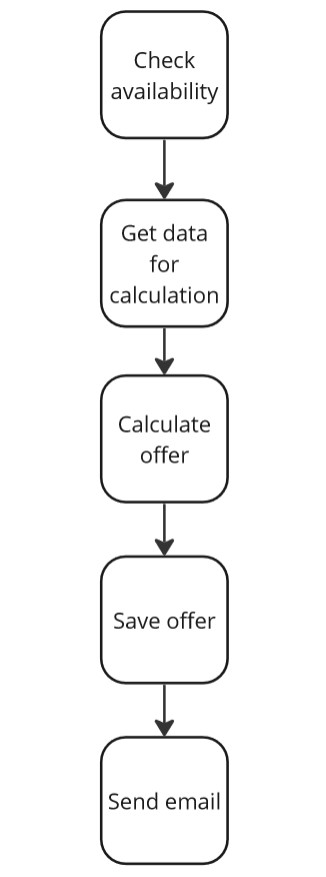<br/>
*生成报价用例*

我们还将研究实现这样一个用例的伪代码可能是什么样子：

```csharp
public void GenerateOffer(OfferData offerData)
{
    var isAvailable = // Direct API CALL.

    if (isAvailable)
    {
        var dataToCalculation = // SQL statements to get data

        var offer = // Offer calculation logic

        // SQL statement to save offer
    
        // SMTP client execution to send email
    }
}
```

让我们思考一下，对于这样的用例，什么是最优的测试策略。

<ins>然而，在此之前， **关键是要考虑我们拥有的依赖关系类型** ，因为这将影响我们的策略</ins>。
根据描述，外部服务负责检查可用性和发送电子邮件。
我们自己的数据库负责存储和检索报价数据：

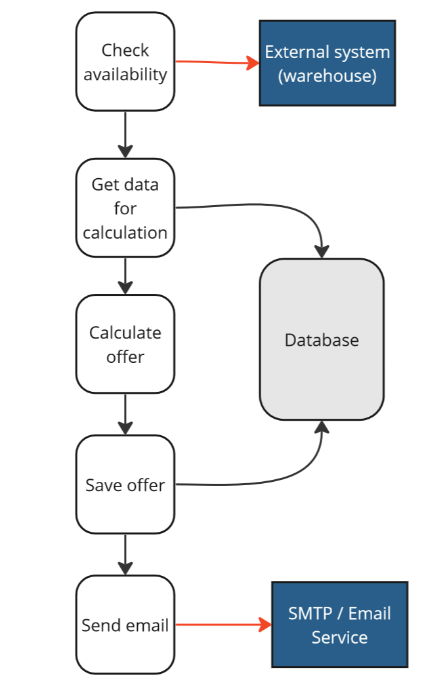<br/>
*生成报价用例*

## 策略 0——无自动化

首先也是最重要的，我们总是需要问自己，自动化某个特定用例是否值得。
在某些情况下，由于各种因素，自动化的成本如此之高，以至于最好不要引入自动化测试。
然而，根据我的经验，这种情况非常罕见，缺乏自动化测试更多是疏忽和借口的后果。

假设我们不想引入自动化测试。
如果发生这种情况，我们系统中的每一次更改都将需要手动测试来验证该过程。
如果我们在手动测试期间跳过或犯了一个错误，那么可能会发现某个功能不起作用。
这可能是因为不同地方的错误导致的，例如：

- 可用性检查 —— 我们期望从外部系统获得 `true` 或 `false` 值，但收到了 `0` 或 `1`。
- 检索用于报价计算的数据 —— 我们在编写 SQL 脚本时犯了错误。
- 报价计算 —— 我们在计算中犯了逻辑错误。
- 保存报价 —— 我们在 ORM 中将报价对象错误地映射到了数据库中的表。
- 电子邮件发送 —— 在发送过程中，我们将消息的主题与内容弄混了。

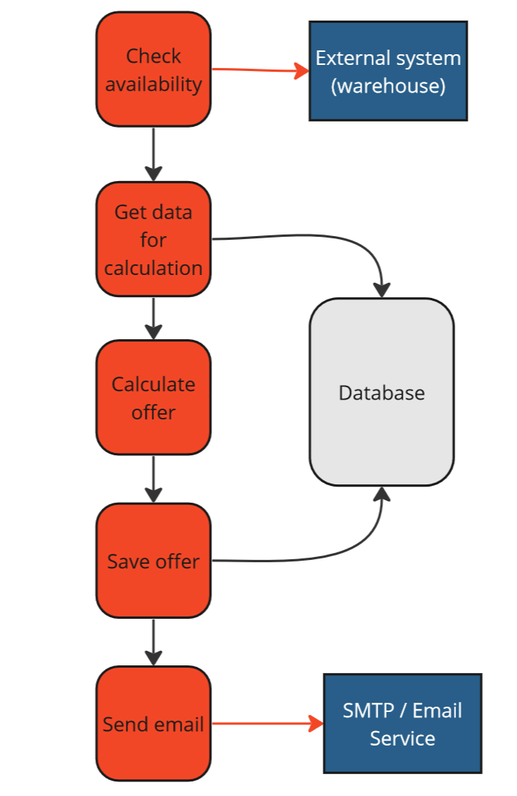<br/>
*生成报价用例——无自动化*

如你所见，很多事情都可能出错。
如果我们希望以 [演进的方式](https://www.thoughtworks.com/insights/decoder/e/evolutionary-architecture) 工作，利用 [持续交付](https://continuousdelivery.com/) 的优势，
并快速部署和发布后续更改，那么在这种情况下，没有自动化测试我们无法做到这一点。
让我们看看如何做到这一点。

## 策略 1——Mockist（伦敦学派）

我们将采用的第一种策略涉及使用模拟（mocking，即所谓的伦敦学派 / Mockist）。
<ins>该学派建议我们应独立于所有协作者，并在此过程中，在完全隔离的情况下测试我们的用例</ins>。

根据之前展示的伪代码，我们无法立即将自己与依赖项隔离。因此，我们需要在开始时引入中间对象：

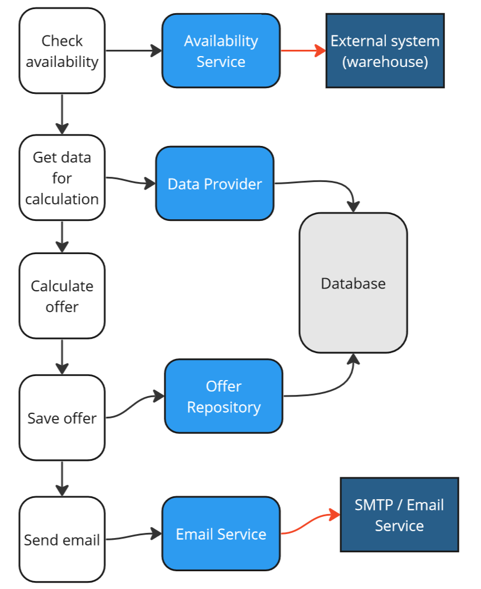<br/>
*生成报价用例——中间人*

在测试期间，我们将能够替换这些对象，从而将自己与真实的依赖关系隔离开来。
尽管这是 Mockist 学派，但在此情况下，区分两种类型的中间对象是值得的，正如 Gerard Meszaros 在他的 [书中](https://www.amazon.com/xUnit-Test-Patterns-Refactoring-Addison-Wesley-ebook/dp/B004X1D36K) 所写的那样：

- **Stub** —— 允许我们隔离依赖关系并启用测试，但不是验证 (verification) 的对象。
我们在准备被测系统 (SUT)（GIVEN 部分）时设置它们，但 **不在断言中使用它们** （THEN 部分）。

- **Mock** —— 允许我们隔离依赖关系、启用测试，并且是验证 (verification) 的对象。
我们将在准备 SUT（GIVEN 部分）时设置它们，并 **在断言中使用它们** （THEN 部分）。

在示例中，`_availabilityService` 和 `_dataProvider` 是 stubs，而 `_offerRepository` 和 `_emailService` 是 mocks：

让我们看看现在的伪生产代码会是什么样子：

```csharp
public void GenerateOffer(OfferData offerData)
{
    var isAvailable = _availabilityService.Check(offerData.ProductId);

    if (isAvailable)
    {
        var dataToCalculation = _dataProvider.GetDataForCalculation(...);

        var offer = CalculateOffer(dataToCalculation);

        _offerRepository.Add(offer);
    
        _emailService.SendEmail(...)
    }
}

public void Test()
{
    // Given
    _availabilityService.Check().Returns(true); // Stub
    _dataProvider.GetDataForCalculation(...).Returns(data); // Stub
    _offerRepository.Setup(); // Mock 设置 
    _emailService.Setup(); // Mock 设置 
    
    // When
    GenerateOffer(offerData);
    
    // Then
    _offerRepository.Add(offer).ExecutedOnce() // Mock 验证
    _emailService.Add(offer).ExecutedOnce() // Mock 验证
}
```

完全隔离使我们有机会完全在内存中测试用例。
**我将这类测试定义为单元测试**（社区中对单元测试没有统一的明确定义）。

这些将是最快的测试类型。
此外，在发生错误的情况下，我们将立即知道哪个组件不能正常工作。

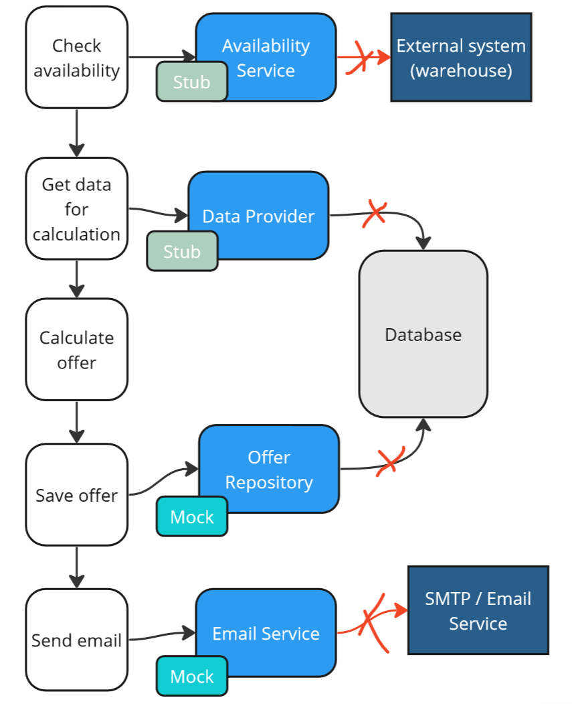<br/>
*生成报价用例——中间人：stubs 和 mocks*

然而，采用这样的测试策略，我们能确定我们的系统按照预期工作吗？
我们能将它部署到生产环境吗？

<ins>不幸的是，在现实中，我们只测试了流程本身的编排，而在我们 stubbed 的组件中仍然存在出错的可能性。
我们的测试可能是绿色的，但在生产环境中仍然可能出现严重错误。
我们将会有 [假阴性](https://testfully.io/blog/false-positive-false-negative/) 的测试</ins>。

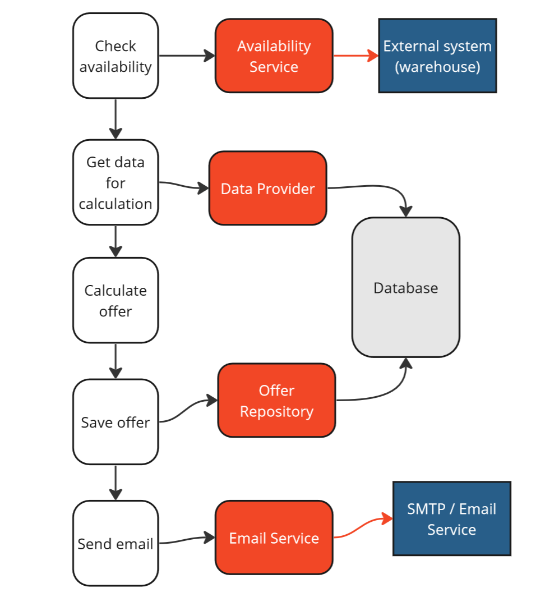<br/>
*策略 1——Mockist——验证*

<ins>此外，伦敦学派的测试会导致实现细节泄露到测试中</ins>。
如你所见，我们的测试知道我们有像 `_dataProvider` 和 `_offerRepository` 这样的对象，而这些都是实现细节。
如果我们想要更改或移除这些对象，我们将不得不同时修改我们的测试。
<ins>因此，我们测试的可维护性降低了</ins>。

最终，对这种策略的评估如下：

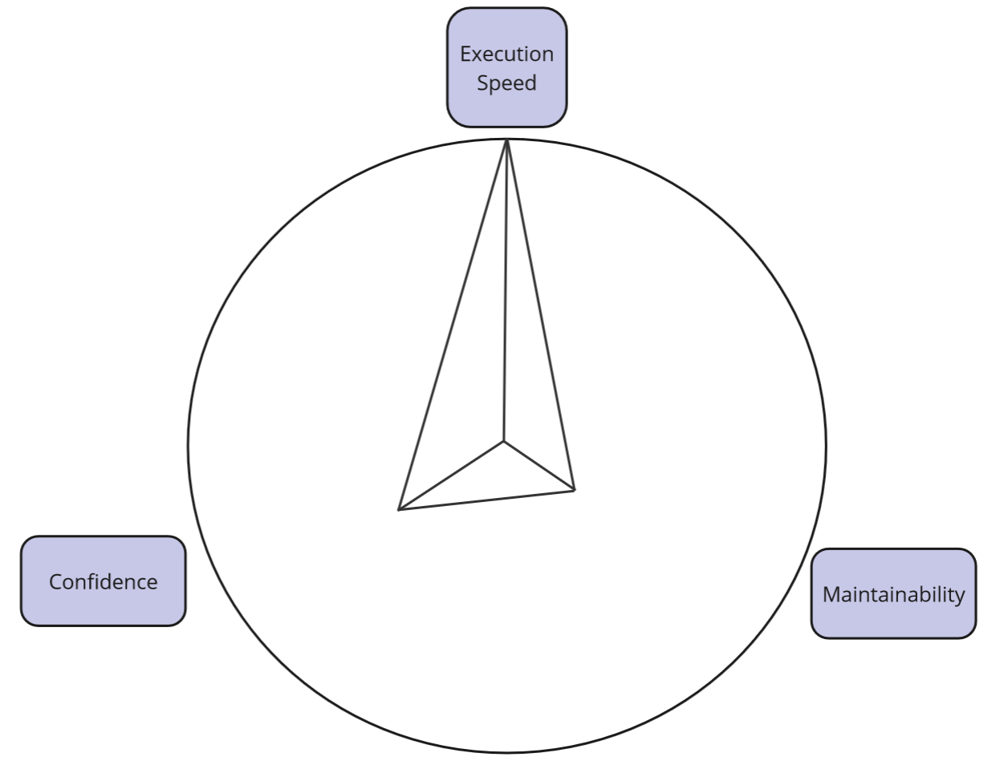<br/>
*策略1——Mockist——评估*

如你所见，测试速度超快，但不幸的是，它们不能提供足够的信心，而且维护它们可能具有挑战性。让我们看看我们能做些什么。

## 策略 2——经典方法（Classical）具备数据库种子

由于 mocking 方法没有产生最佳结果，让我们尝试所谓的经典方法（即芝加哥学派）。

<ins>**对于我们可以控制的依赖项，我们不会使用 stubs 和 mocks** 。
相反，我们将在真实的依赖项上进行测试，仅对那些我们无法控制的依赖项进行 stubbing 和 mocking</ins>。

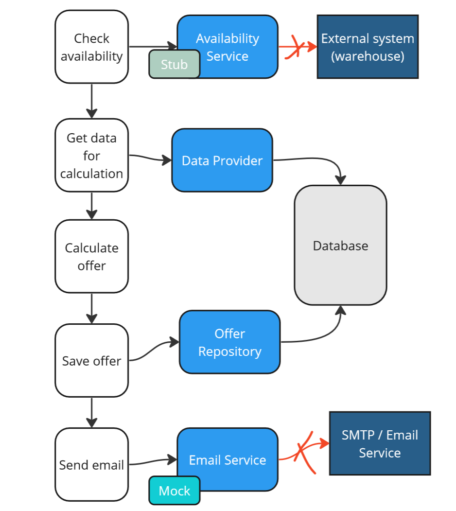<br/>
*策略2——使用真实的、可控的依赖项*

这种方法将允许我们在 [模块](../mmonolith/primer.md) 级别执行测试。
我将这类测试称为集成测试（integration tests）。

<i>PS：集成测试是另一个非常宽泛、不统一的定义。
  有些人称之为组件测试。
  你怎么称呼它们都行，只要保持一致 —— 它们是测试一个内聚逻辑整体的测试。</i>

<ins>为了测试的确定性和更容易的运行与维护，与外部系统隔离是必要的</ins>。

让我们看看代码：

```csharp
public void Test()
{
    // Given
    _availabilityService.Check().Returns(true); // Stub
    _emailService.Setup(); // Mock setup
    
    Database.Seed(…); // 写入真实数据库
    
    // When
    Handle(command);
    
    // Then
    var data = Database.GetData(); // 针对真实数据库进行断言
    Assert(data);
    _emailService.Add(offer).ExecutedOnce() // Mock 验证
}
```

如本例所示，在 GIVEN 部分，我们向测试环境（例如，在 docker 容器中）中预置的数据库灌入测试数据；
在 THEN 部分，我们使用查询取回数据以进行进一步的断言。

这些测试将比内存中的测试 **慢得多** ，因为我们要连接到数据库。
然而，乍一看，这一次我们似乎相当确信系统将在生产环境中正确工作。

<ins>不幸的是，事实并非如此！它甚至比以前更糟。
为什么？ **因为我们正在测试的系统状态可能永远不会在生产环境中出现** ！
这一切根源在于直接操作数据库来复现系统状态。
这类测试只会掩盖真实情况，抬高我们的心理预期，然而实际上，我们会面临线上故障的风险。
这又是假阴性问题</ins>。

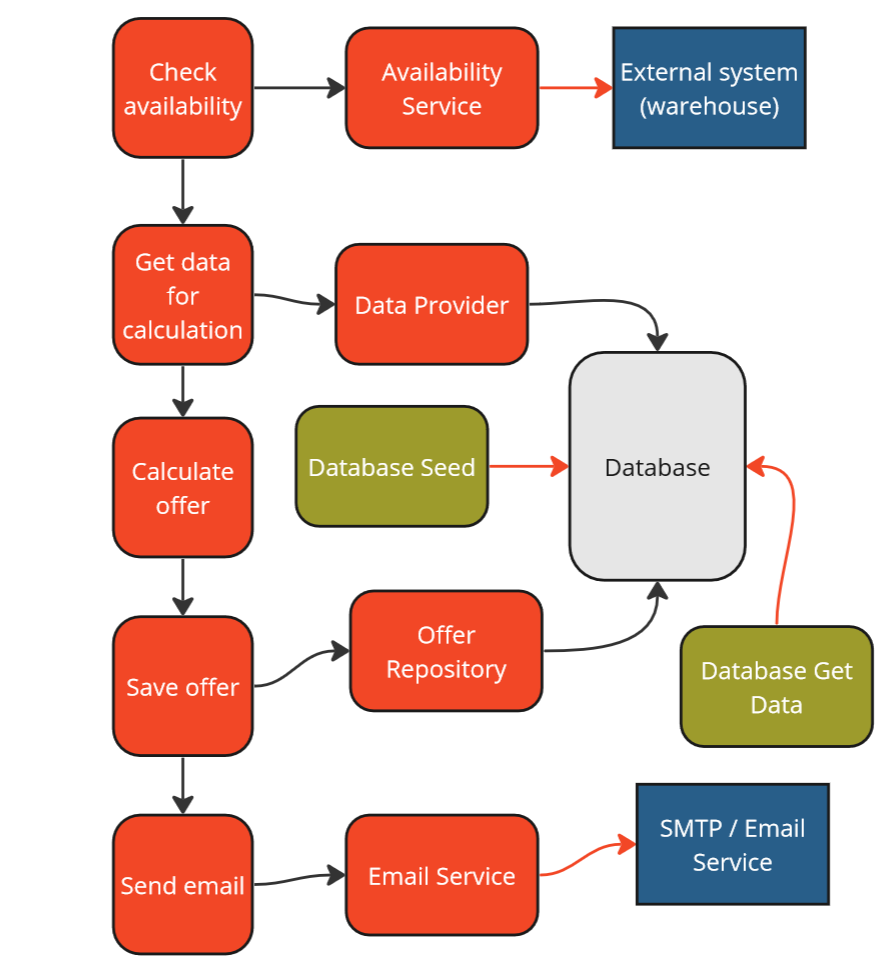<br/>
*策略2——带有数据库种子的经典方法——一切在生产环境中都可能无法工作*

<ins>此外，测试的可维护性也降低了，因为我们的测试依赖于数据库结构的变化 —— 即依赖于实现</ins>。

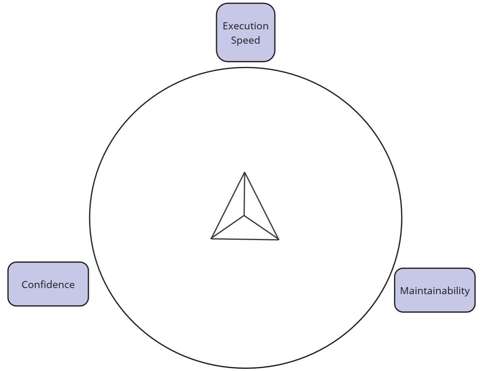<br/>
*策略2——带有数据库种子的经典方法——评估*

<ins>总之，我们增加了执行时间，降低了信心，并降低了可维护性——这根本不是一个好的策略</ins>！

## 策略 3——使用 API 的经典方法

策略 2 被证明是非常低效的，但我们可以很容易地让它对我们有利。
我们所需要做的就是利用诸如更高级别 [封装](https://www.kamilgrzybek.com/blog/posts/domain-model-encapsulation-ef) 之类的良好实践，并且不是从数据库层面创建被测系统 (SUT)，而是 **使用我们系统/模块的 API** —— 因为这才是它将在生产环境中工作的方式。

<ins>基于 API 进行测试</ins>：

- <ins>我们有信心，如果测试对我们有效，生产环境中的系统也可能会正常工作</ins>。
- <ins>我们依赖抽象而不是实现细节，这使得此类测试更容易维护</ins>。

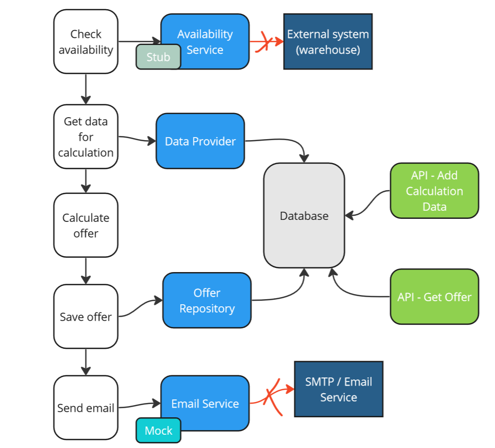<br/>
*策略 3——使用 API 的经典方法*

```csharp
public void Test()
{
    // Given
    _availabilityService.Check().Returns(true); // Stub
    _emailService.Setup(); // Mock setup
    
    Api.AddData(…) // 模块 API 的使用
    
    // When
    Handle(command);
    
    // Then
    var data = Api.GetOffer(…); // 模块 API 的使用
    Assert(data);
    _emailService.Add(offer).ExecutedOnce() // Mock 验证
}
```

<ins>通过这种方式，我们增加了对系统在生产环境中运行的信心，并使得测试更易于维护。
我们有信心，我们在很大程度上正在重现生产环境中的系统状态</ins>。

直接向数据库填充种子数据是测试自动化中最常见的错误之一。
我们的设置越不像生产环境，我们对解决方案的信心就越低。

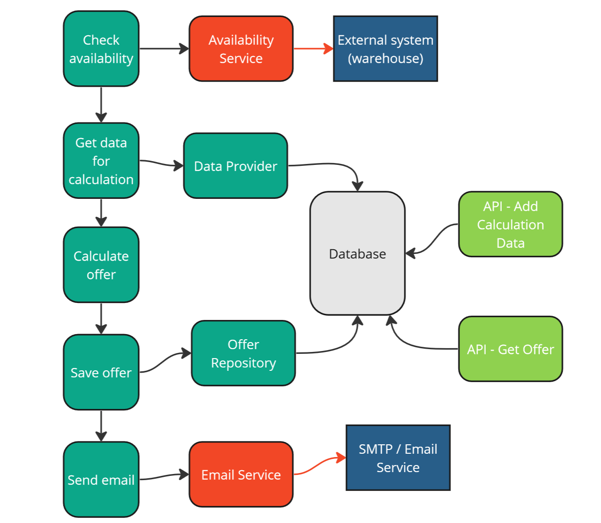<br/>
*策略 3——使用 API 的经典方法——验证*

与策略 2 相比，我们测试套件的速度保持不变，但我们将在下一点中解决这个问题。

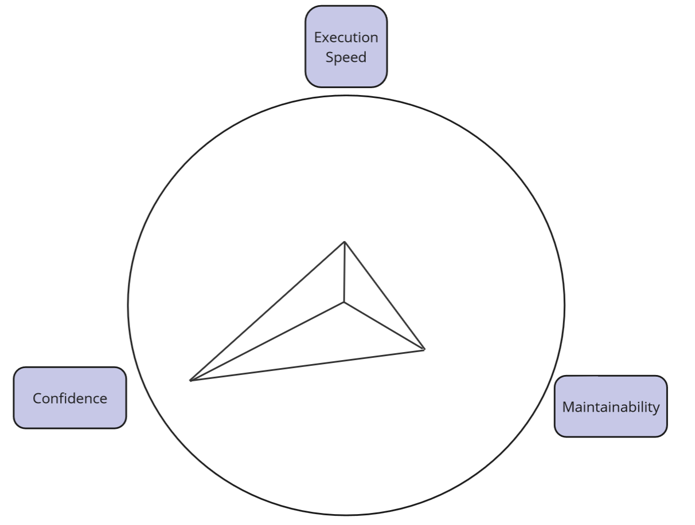<br/>
*策略 3——使用 API 的经典方法——评估*

## 策略 4——使用领域 + API 的经典方法

策略 3 看起来很有希望，但对于更复杂的项目来说，它并不理想。
我们肯定希望进一步提高测试的可维护性并减少其执行时间。
我们如何实现这一点呢？

在这里，领域 (Domain) 和单元测试（内存中）为我们提供了帮助。
如果我们设法将领域概念和业务逻辑提取到领域层中（例如，使用 [DDD](https://www.kamilgrzybek.com/blog/posts/clean-domain-model-attributes) 的战术模式），我们就可以在单元级别测试我们的领域。

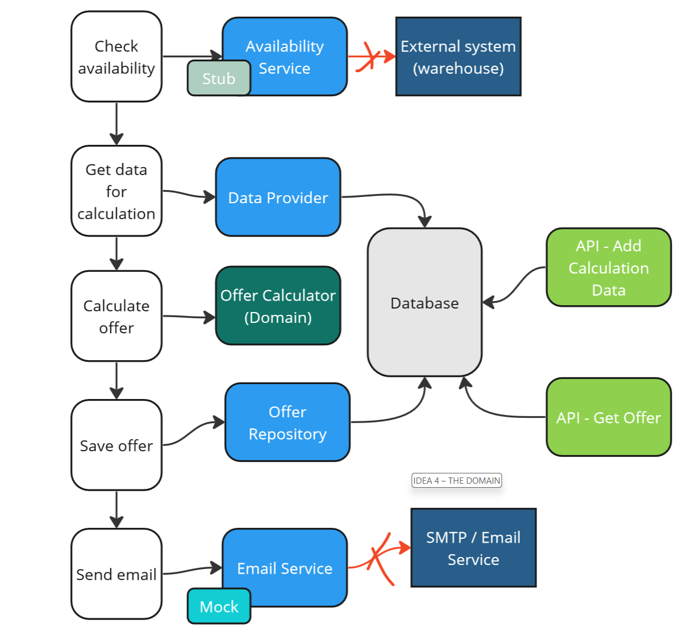<br/>
*策略 4——使用 API + 领域 (Domain) 的经典方法*

这些单元测试将比更重的集成测试快得多，也更容易维护。
这是否意味着我们应该放弃后者？
当然不是。
单元测试验证我们的领域 (Domain)，而集成测试覆盖单个用例以及与可控依赖项之间的通信。

<ins>在我们的示例中，我们可以提取 `Offer Calculator` 的概念，将其编写为 [纯函数](https://en.wikipedia.org/wiki/Pure_function) 的形式，并对所有排列进行单元测试。
集成测试将确保数据被正确传递到计算器，但不会测试所有的变体 —— 那将由单元测试覆盖</ins>。

```csharp
public class OfferCalculator
{
    public Result Calculate(input)
    {
        var discount = 0;
        if (input.IsVip)
        {
            discount = 0.2;
        }
        
        ...
    }
}

public void Test()
{
    // Given
    var inputData = new InputData(...);
    
    // When
    var result = OfferCalculator.Calculate(inputData);
    
    // Then
    Assert(result);
}
```

通过这种方法，一些集成测试将转变为单元测试，为我们提供：

- 更大的信心——我们可以测试更多
- 更好的可维护性——内存中的测试更容易设置
- 更快的执行速度。

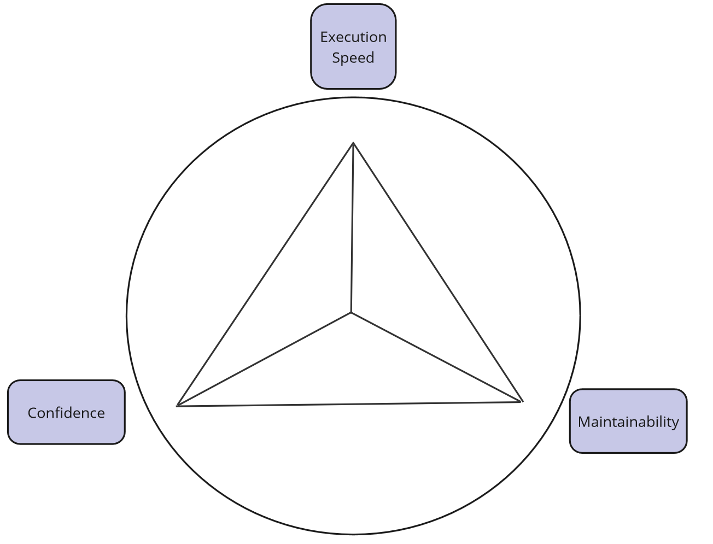<br/>
*策略 4——使用 API + 领域 (Domain) 的经典方法——评估*

## 策略 4 备选方案——使用内存数据库

在某些情况下，<ins>如果我们优先考虑测试速度而不是系统正常工作的确定性，我们可以修改策略 4，引入内存数据库而不是真实数据库</ins>。

*「译注：什么情况下使用内存数据库没有说明！」*

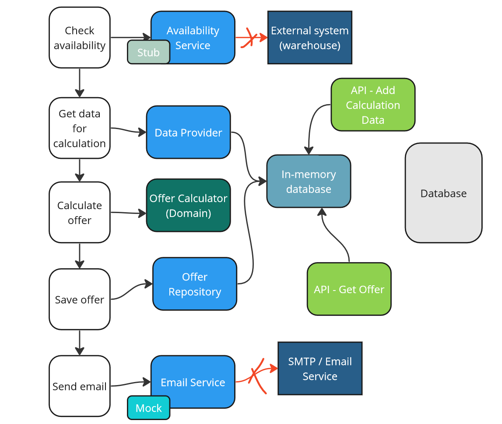<br/>
*策略 4 备选方案——使用 API + 领域 (Domain) + 内存数据库的经典方法*

<ins>这种解决方案将显著加快测试速度，但我们无法 100% 确定系统在生产环境中会正确运行。
内存数据库与真实数据库之间总会存在一些差异 —— 我们需要意识到这一点</ins>。

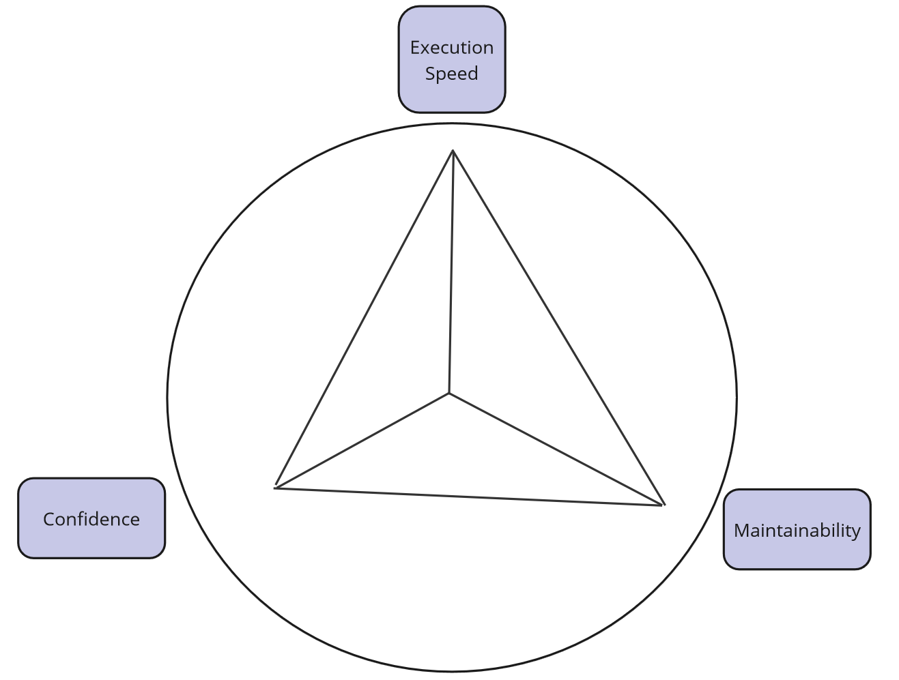<br/>
*策略 4 备选方案——使用 API + 领域 (Domain) + 内存数据库的经典方法——评估*

<ins>另一种替代方案是混合模型。
对于每次提交运行的流水线 (pipelines)，我们可以使用内存数据库，同时偶尔或在部署前使用真实数据库。
这种解决方案的缺点是，指示错误操作的 [反馈循环](https://en.wikipedia.org/wiki/Feedback) 更长，影响团队的工作流程，并可能阻碍最佳的持续集成和交付</ins>。

## 系统测试

<ins>到目前为止，我一直在讨论系统特定单个部分（模块）的测试。
然而，这样的测试是不够的；因此，我们还应该自动化整个系统的行为，包括那些我们无法控制的依赖项。
系统测试 (System tests) 就是为此目的服务的，问题在于，它们应该有多少？</ins>

<ins>如果我们选择了一个好的测试策略（隔离测试我们的模块），那么系统测试的数量应该等于这些模块之间的集成数量。
模块之间的通信越多（无论是同步的，例如通过 REST，还是异步的，例如通过事件），我们就需要编写越多的此类测试</ins>。

<ins>这就是为什么尽可能隔离地测试模块至关重要，类似于单元测试和集成测试之间的关系 —— 我们编写的单元测试越多，覆盖我们用例所需的集成测试就越少。
同样，我们在模块级别测试得越多，我们在整个系统级别需要执行的测试就越少</ins>。

为什么我们希望系统测试尽可能少？
因为它们的可维护性非常低 —— 设置它们很困难，而且它们执行很多任务。

此外，它们非常慢 —— 与所有模块/服务的通信需要更长的时间，而且我们对它的控制力很小。

此外，系统测试通常难以自动化，因为尝试使用难以控制的依赖项来引入确定性可能会非常昂贵。

[契约测试 (Contract tests)](https://pactflow.io/blog/what-is-contract-testing/) 也越来越常用（在分布式环境中很流行），这意味着系统测试的数量可以进一步减少。

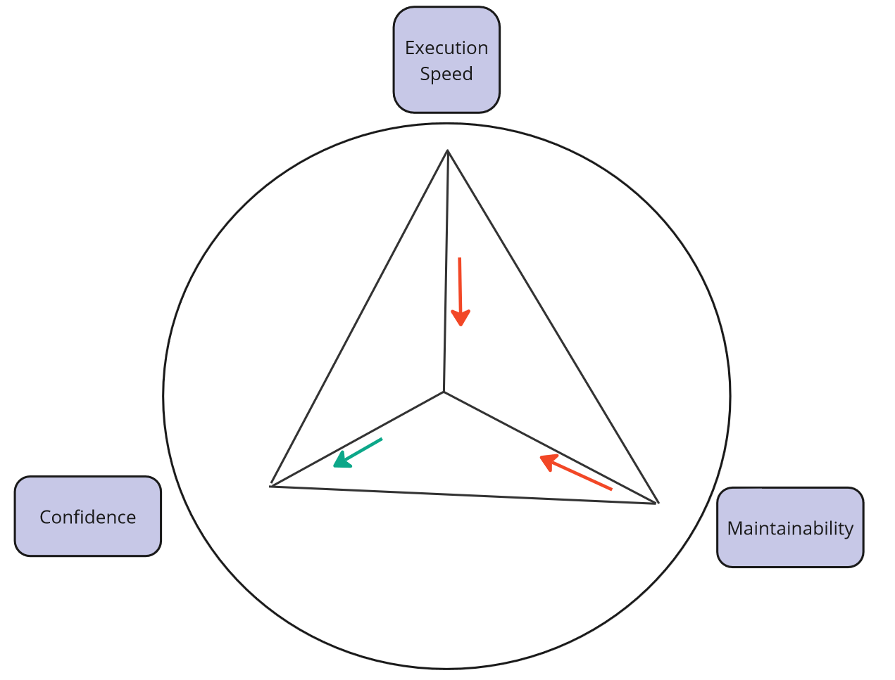<br/>
*系统测试——评估*

## GUI 测试

最后，我想分析通过图形用户界面 (GUI) 进行的测试。

我在这里刻意避免使用 “端到端 (End-to-End)” 测试这个术语，因为这种指代是模糊的。
对一个人来说，它可能意味着通过图形用户界面的测试，而对另一个人来说，它可能指的是底层 API 的测试。

GUI 测试的主要优点是，它们提供了更大的信心，确信我们的系统正常工作。
另一方面，它们有几个缺点：

- 它们非常慢。
- 它们准备起来具有挑战性。
- 它们难以维护 —— 通常，图形用户界面的更改（即使没有业务逻辑的更改）也需要修改测试。
- 它们通常不允许测试某些系统行为，因为这些行为不是通过图形用户界面触发的（例如，处理来自外部系统的消息）。

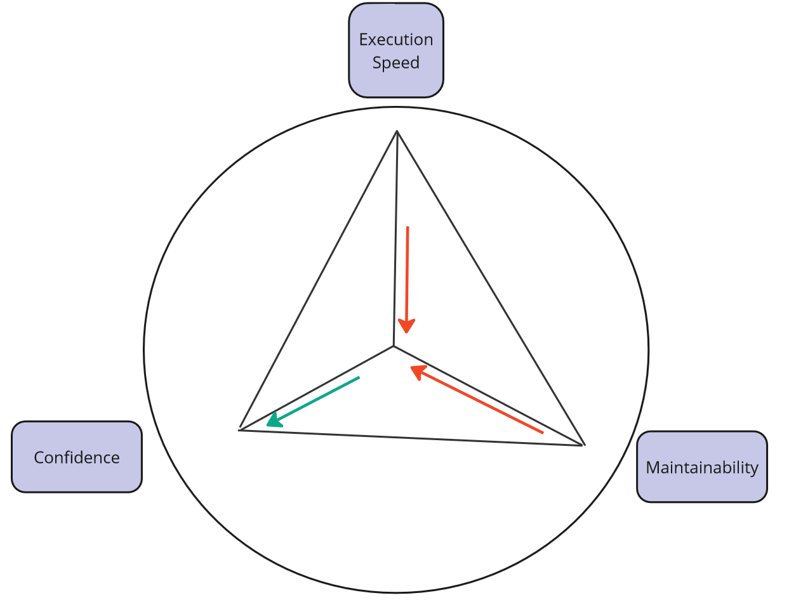<br/>
*GUI 测试——评估*

<ins>基于这些原因，GUI 测试应该谨慎使用</ins>。
不幸的是，我在测试/QA 社区以及一般的项目团队中观察到的趋势是，手动测试的自动化主要涉及通过图形用户界面自动化测试。

在我看来，这是一个重大的错误，原因如上所述，并且考虑到整体测试策略。
这样的测试使我们的系统难以修改，增加项目成本，并阻止我们在此场景中利用其他级别的测试。
我们在此情况下的策略不是最优的。

<ins>我绝对不认为这样的测试是不必要的。
它们与其他任何级别的测试一样是必需的，但它们的数量应该被精心选择、深思熟虑，并加以限制</ins>。

## 总结

- 测试策略应考虑优化三个主要因素 —— 测试提供的信心、它们的速度和可维护性。

- mock/stub 所有依赖项的测试（Mockist，即伦敦学派）不能给我们足够的信心，确信系统会正常工作。

- 引入集成测试并在真实依赖项上进行测试（经典方法，即芝加哥学派）会增加对系统运行的信心。
然而，只有当我们的测试设置与生产环境相同时，这才有意义。
我们应该始终引用我们模块的 API。

- 仅靠集成测试就能提供很高的信心，但它们的速度和可维护性并不高效。

- 为了提高整个测试套件的可维护性和速度，引入在内存中运行并有效测试我们领域的单元测试。
为了实现这一点，使用适当的、以 [领域驱动的架构](../mmonolith/ddd.md)，允许引入此类测试。

- 在单元测试（领域测试）和集成测试（用例测试和依赖项测试）之间取得适当的平衡，是测试策略的一个关键方面。

- 我们可以使用内存数据库来提高测试速度。
然而，这将降低我们对系统在生产环境中运行的信心。
我们也可以采用混合方法，但这会延长反馈循环。

- 系统测试很慢且难以维护，因此仅在集成点处应用它们来测试整个系统。
考虑其他方法，如契约测试 (contract testing)。

- GUI 测试提供很高的信心，但非常慢且更难维护。应谨慎编写最少数量的 GUI 测试。

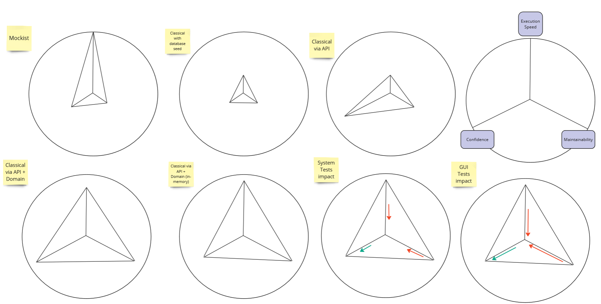<br/>
*测试策略——总结*

## 推荐阅读
- [《Growing Object-Oriented Software, Guided by Tests》](https://www.amazon.com/Growing-Object-Oriented-Software-Guided-Tests/dp/0321503627)
- [《Unit Testing Principles, Practices, and Patterns》](https://www.amazon.com/Unit-Testing-Principles-Practices-Patterns/dp/1617296279)
- [《Agile Testing: A Practical Guide for Testers and Agile Teams》](https://www.amazon.com/Agile-Testing-Practical-Guide-Testers/dp/0321534468)
- [《xUnit Test Patterns: Refactoring Test Code》](https://www.amazon.com/xUnit-Test-Patterns-Refactoring-Addison-Wesley-ebook/dp/B004X1D36K)

## 本系列更多内容

本文是 “自动化测试” 系列的一部分：

- [自动化测试：为什么](./the-why.md)
- [自动化测试：可测试性](./testability.md)
- [自动化测试：策略](./strategy.md)（本文）
