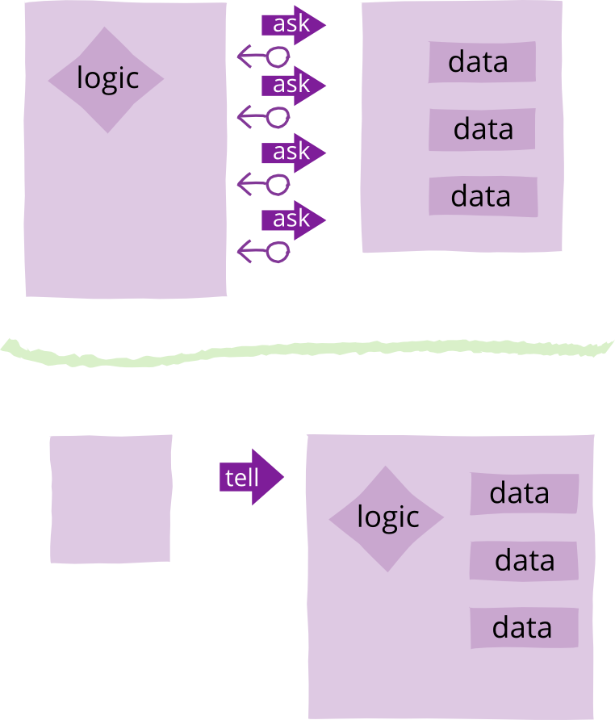

# Tell Don't Ask

| [Martin Fowler](https://martinfowler.com/)| |
|:---|:---|
|| |
|[原文](https://martinfowler.com/bliki/TellDontAsk.html)| 2013/9/5|

🔖 封装 🔖 API设计 🔖 对象协作设计

---

Tell-Don't-Ask 是一条原则，帮助人们记住面向对象是关于将数据与操作该数据的函数捆绑在一起。
它提醒我们，与其向一个对象询问数据并对该数据进行操作，不如告诉对象该做什么。
这鼓励我们将行为移入对象中，与数据放在一起。

<br/>

让我们通过一个例子来澄清。
假设我们需要监控某些值，当数值超过某个限制时触发警报。
如果我们以 “询问” 风格来编写，我们可能会有一个数据结构来表示这些……

```java
class AskMonitor...
  private int value;
  private int limit;
  private boolean isTooHigh;
  private String name;
  private Alarm alarm;

  public AskMonitor (String name, int limit, Alarm alarm) {
    this.name = name;
    this.limit = limit;
    this.alarm = alarm;
  }
```

……并将其与一些访问器结合起来以获取这些数据

```java
class AskMonitor...
  public int getValue() {return value;}
  public void setValue(int arg) {value = arg;}
  public int getLimit() {return limit;}
  public String getName()  {return name;}
  public Alarm getAlarm() {return alarm;}
```

然后我们会这样使用数据结构：

```java
AskMonitor am = new AskMonitor("Time Vortex Hocus", 2, alarm);
am.setValue(3);
if (am.getValue() > am.getLimit()) 
  am.getAlarm().warn(am.getName() + " too high");
```

**Tell Don't Ask** 提醒我们，取而代之的是将行为放入监控器对象本身（使用相同的字段）。

```java
class TellMonitor...
  public void setValue(int arg) {
    value = arg;
    if (value > limit) alarm.warn(name + " too high");
  }
```

这样使用：

```java
TellMonitor tm = new TellMonitor("Time Vortex Hocus", 2, alarm);
tm.setValue(3);
```

许多人发现 Tell-Don't-Ask 是一条有用的原则。
面向对象设计的基本原则之一是将数据和行为结合起来，以便我们系统的基本元素（对象）将两者结合在一起。
这通常是一件好事，因为这些数据和操作它们的行为是紧密耦合的：
一个的变化会引起另一个的变化，理解一个有助于你理解另一个。
紧密耦合的事物应该放在同一个组件中。
思考 Tell-Don't-Ask 是一种帮助程序员看到他们如何增加这种共置的方法。

但就个人而言，我并不使用 Tell-Don't-Ask。
我确实寻求将数据和行为共置，这通常会导致类似的结果。
我发现 Tell-Don't-Ask 令人困扰的一点是，我看到它鼓励人们成为 [GetterEradicators](https://martinfowler.com/bliki/GetterEradicator.html) ，试图消除所有查询方法。
但有时对象通过提供信息来有效协作。
一个很好的例子是那些接受输入信息并进行转换，以简化其客户端的对象，
例如使用 [EmbeddedDocument](https://martinfowler.com/bliki/EmbeddedDocument.html) 。
我看到代码陷入了只进行告知的复杂困境，而适度合理的查询方法本可以简化这些逻辑 ¹。
对我来说，Tell-Don't-Ask 是朝向将行为和数据共置的一块垫脚石，但我并不认为它是一个值得强调的点。

### 延伸阅读

这条原则最常与 Andy Hunt 和 “Prag” Dave Thomas（《The Pragmatic Programmers》作者）联系在一起。
他们在 [IEEE Software 专栏](http://media.pragprog.com/articles/jan_03_enbug.pdf) 和 [他们的网站文章] (http://pragprog.com/articles/tell-dont-ask) 中描述了它。

### 注释

¹：事实上，即使是共置 (co-locating) 数据和行为这一更基本的原则，有时也应该为了其他考虑（如分层）而放弃。
好的设计都是关于权衡的，而共置数据和行为只是需要考虑的一个因素。
