# 自动化测试：可测试性

2023-04-06 📂 测试 📂 架构和设计 [原文](https://www.kamilgrzybek.com/blog/posts/automated-tests-testability)

<br/>

## 引言

在关于自动化测试系列文章的 [第一篇](./the-why.md) 中，我阐述了在我们的软件工程过程中实施自动化测试的原因。

在深入探讨测试策略之前，讨论 **可测试性** 是很重要的，它是 [演进式架构（evolutionary architecture）](https://www.thoughtworks.com/insights/books/building-evolutionary-architectures) 以及一般可测试架构中较为重要的方面之一。

## 可测试性

引用 [维基百科的定义](https://en.wikipedia.org/wiki/Software_testability) ，可测试性是：

> “软件工件（即软件系统、软件模块、需求或设计文档）在给定的测试上下文中支持测试的程度。”

换句话说，在我们的系统上下文中考虑它，如果我们的系统具有高可测试性，就意味着它更容易测试。
另一方面，如果可测试性低，我们就更难测试它。

根据软件测试的一个定义：

> “软件测试是通过验证和确认来检查被测软件的工件和行为的行为。”

由此可知，如果可测试性低，我们将更难验证和确认我们的系统。
这意味着其质量将更低和/或其成本将显著增加。

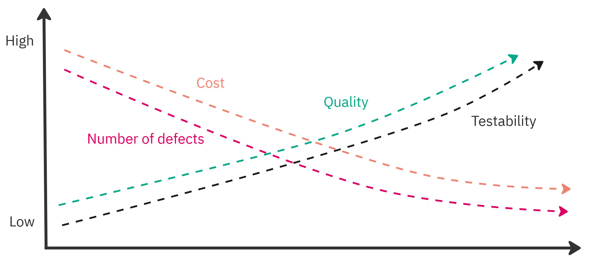<br/>
*可测试性 vs 其他因素*

正如你所看到的，可测试性是我们架构的一个重要属性，在某些情况下，它可以决定一个给定项目的成败。
如果我们希望以演进的方式、使用 [持续交付（Continuous Delivery）](https://continuousdelivery.com/) 方法快速交付我们的软件，它将变得更加重要。
引用一本关于现代软件工程实践的优秀书籍 [《Accelerate》](https://www.amazon.com/Accelerate-Software-Performing-Technology-Organizations/dp/1942788339) 中的话：

> “看来，这些架构决策的特征 ——我们称之为可测试性和可部署性—— 对于创造高性能至关重要。”

然而，可测试性是一个更大的概念，所以让我们尝试将其分解为更小的组成部分，以便更好地理解它。

### 可控性

影响可测试性的第一个因素是 *可控性（Controllability）* 。
可控性是我们对系统拥有多大控制权的一种度量。

控制系统意味着什么？
我们可以将一个系统想象为一组有限的状态以及它们之间的转换。

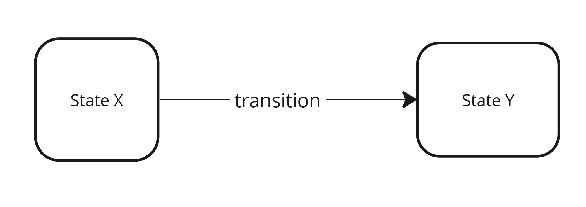<br/>
*系统——状态和转换*

可控性是从一个状态到另一个状态转换的容易程度，也就是调用转换的容易程度。
根据 [状态机](https://en.wikipedia.org/wiki/Finite-state_machine) 的概念，转换是在事件的影响下进行的，而事件的来源是意图（命令）。
也就是说，在状态 X 下成功调用命令会导致状态改变（事件）—— 即系统转换到状态 Y。

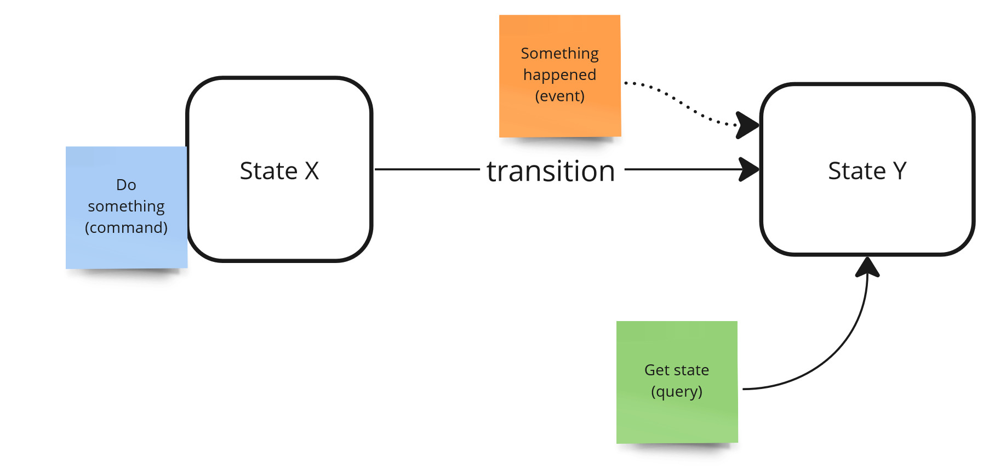<br/>
*系统状态——命令与事件*

我们必须问自己的一个重要问题是，给定动作的发起者是谁，以及他如何执行它。
可以是人，然后他将通过某种接口（如 GUI 或 CLI）触发该动作。
也可以是一种自动化机制，它将基于其他一些事件触发该动作。

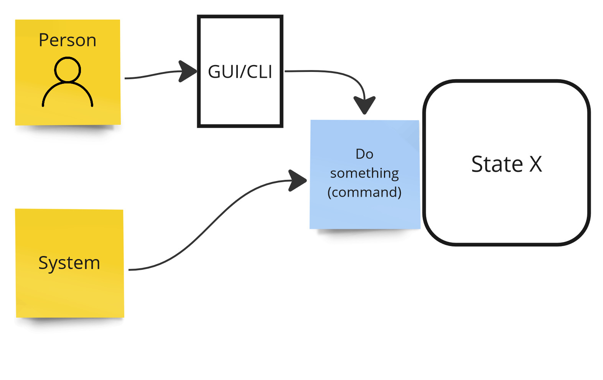<br/>
*可控性——参与者，转换的发起者*

让我们通过一个例子来看它。
假设我们有一个购物车，我们可以向其中添加产品。
我们的系统处于状态 0 ——没有先前的动作。
要向购物车添加产品，需要：

1. 创建产品定义
2. 创建购物车
3. 将产品添加到购物车

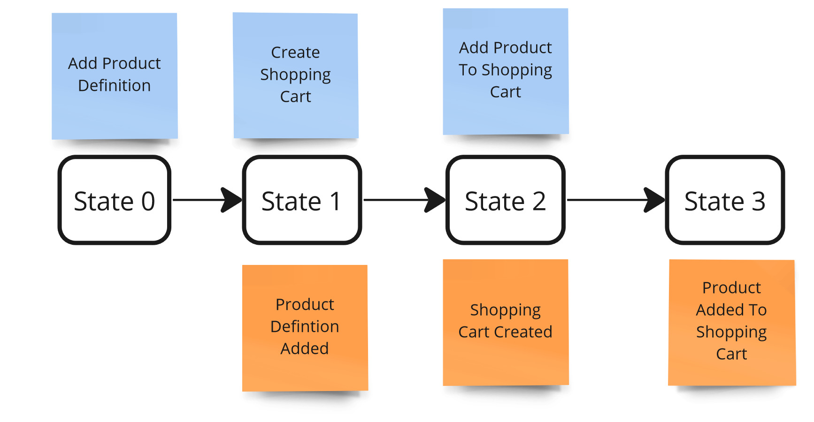<br/>
*可控性——示例*

<ins>根据上述内容，可控性是在我们的系统上执行命令的容易程度。
我们越容易做到，就越好</ins>。

假设在我们的系统中，添加产品定义是通过某个图形界面完成的。
在这一点上，我们可以说我们能够手动控制它。
此外，我们的图形界面为此使用了 REST 服务，因此我们也能够使用它并自动化这个过程的这一步。

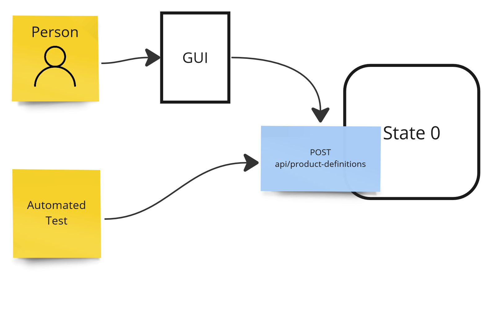<br/>
*可控性示例——高控制度*

然而，让我们考虑另一种情况。
这一次，定义产品发生在另一个我们无法控制的系统（例如，在产品目录服务中）。
我们的系统通过事件了解新产品并添加它们。
在这种情况下，你无法通过图形界面添加新产品，也无法使用任何服务进行自动化。
你无法控制你的系统状态。

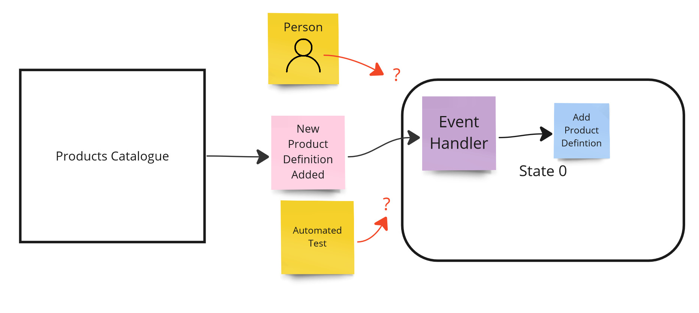<br/>
*可控性示例——低控制度*

我们可以从中得出两个结论。<ins>首先， *分解功能会降低我们在整个系统层面的可控性* 。
换句话说，如果我们分解某些东西，那么完整地测试它就变得更难了</ins>。
例如，要手动测试整个过程，你首先必须在目录中创建一个产品定义，然后等待我们的系统处理该事件。
这已经是一个系统测试了。

<ins>另一方面，理解较小的组件比理解较大的组件更容易。
因此，考虑到系统的单个部分（如服务或模块），理解的容易程度（稍后会详细说明）会增加，该特定部分的可测试性也会增加</ins>。

<ins>但是，如何控制我们系统的那一部分呢？
我们可以使用 [皮下测试（Subcutaneous Test）](./subcutaneous-test.md) 来提高控制力。
这种测试在比 HTTP 层更低的一层运行，即在应用层（用例）运行。
因此，我们总是可以访问我们 [模块](../mmonolith/primer.md) 的 API，因此我们可以自动控制我们系统的状态</ins>。

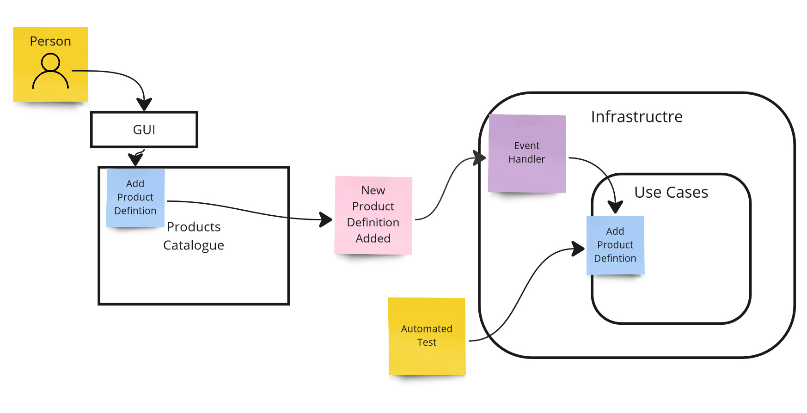<br/>
*可控性示例——通过用例层的自动化测试*

因此，我们的测试可能看起来像这样：

```csharp
public async Test()
{
    // Given
    var productId = await SalesModule.ExecuteCommand(new AddProductDefinitonCommand(...));
    
    var shoppingCartId = await SalesModule.ExecuteCommand(new CreateShoppingCartCommand(...));
    
    await SalesModule.ExecuteCommand(new AddProductToShoppingCartCommand(shoppingCartId, productId, ...));
}
```

### 可观测性

<ins>可测试性的第二个因素是 *可观测性（Observability）* 。
可观测性定义了我们 **观察系统变化** 的容易程度，换句话说，在进行了修改之后，我们检查系统状态的容易程度</ins>。

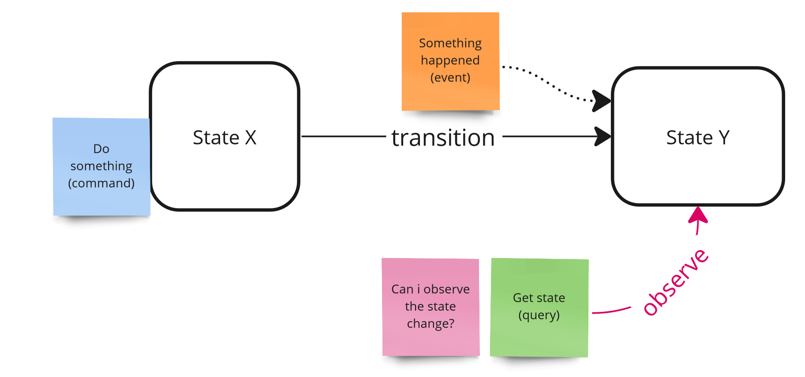<br/>
*可观测性*

我们如何检查系统的状态？
通过查询它，即通过执行查询。
继续这个例子，我们将想要查询我们购物车的状态。

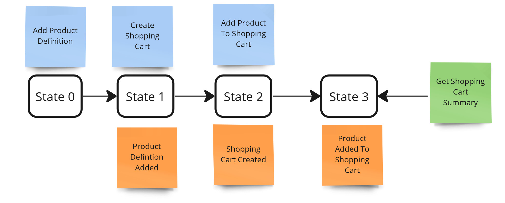<br/>
*可观测性——示例*

<ins>同样，我们必须问自己：谁是查询的发起者？
如果我们想手动测试它，我们需要有一个准备好的接口来向我们显示购物车摘要。
如果我们没有这样的接口（例如，它尚未被实现），那么我们就无法观察状态变化</ins>。
我们唯一能做的就是检查数据库中的数据，但那样的话，这些就是 [白盒测试](https://en.wikipedia.org/wiki/White-box_testing) ，并不能保证系统的正确运行。

<ins>另一方面，可能没有合适的用例来返回这些数据。
如果不存在，我们如何自动检查状态变化？
答案很简单 —— **我们需要仅仅为了测试目的实现这样一个用例** ，即使它目前不会在生产代码中使用</ins>。
许多人反对仅仅为了测试而编写功能，但让我们记住 —— **测试是生产代码** ，它是我们系统的一个客户端。
说实话，自动化测试应该是你系统的第一个客户端。
此外，这样的用例迟早可能会为了在界面上显示数据或某些内部处理的目的而被需要，因此我们将能够使用它。

这使得我们的自动化测试可以看起来像这样：

```csharp
public async Test()
{
    // Given
    var productId = await SalesModule.ExecuteCommand(new AddProductDefiniton(...));
    
    var shoppingCartId = await SalesModule.ExecuteCommand(new CreateShoppingCart(...));
    
    await SalesModule.ExecuteCommand(new AddProductToShoppingCart(shoppingCartId, productId, ...));
    
    // When
    var shoppingCartSummary = await SalesModule.ExecuteQuery(new GetShoppingCartSummary(shoppingCartId));
    
    // Then
    shoppingCartSummary.Should()...
}
```

<ins>不幸的是，当我们在处理过程中修改一个我们无法控制的状态时，事情就变得更加复杂了。
这里的一个经典例子是发送电子邮件或调用某个我们无法查询其状态的外部系统</ins>。

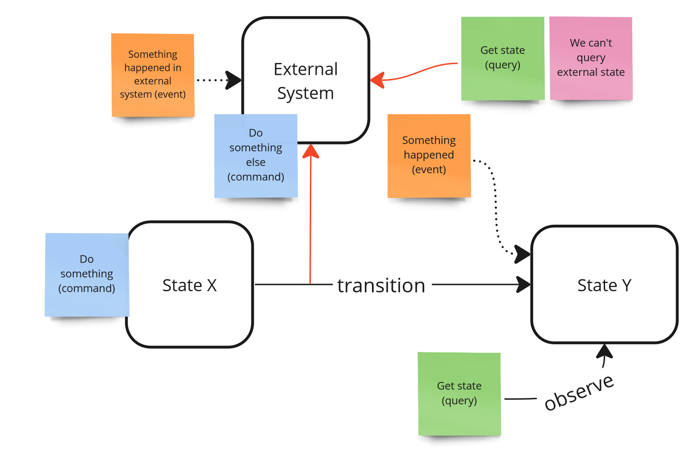<br/>
*可观测性——外部的、不可控制的系统*

为了手动测试这样的用例，我们必须能够访问外部系统接口（假设它存在并且这样的视图可用）。

<ins>如果我们想自动化它，外部系统必须提供某种返回这些数据的服务。
这个问题的解决方案是 **交互测试（interaction testing）** ，它不如基于状态的测试稳定，但通常是唯一正确的选择。
要进行这样的测试，你需要创建一个此类服务的模拟（mock），并验证给定的模拟是否已使用适当的参数被调用</ins>。

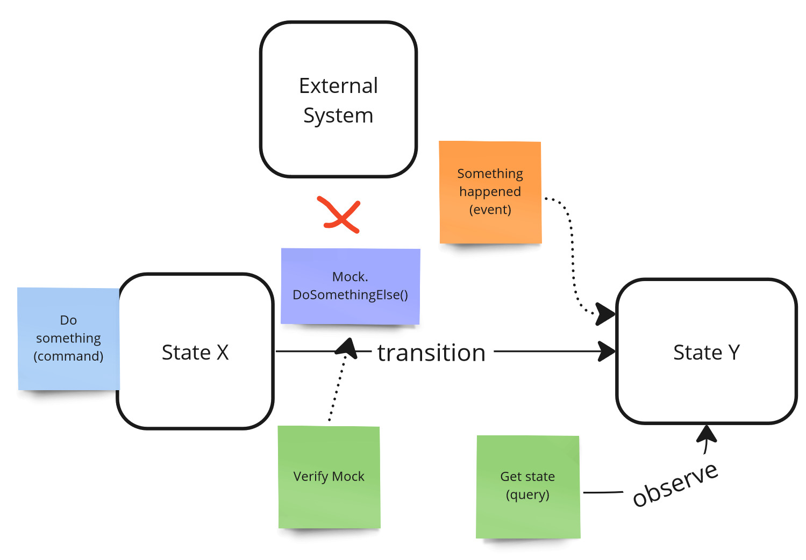<br/>
*可观测性——外部系统，模拟，交互测试*

这样，我们的模拟测试可能看起来像这样：

```csharp
public async Test()
{
    // Given
    var fakeSenderMock = new FakeSenderMock();
    SalesModule = new SalesModule(fakeSenderMock);
    var productId = await SalesModule.ExecuteCommand(new AddProductDefiniton(...));
    
    var shoppingCartId = await SalesModule.ExecuteCommand(new CreateShoppingCart(...));
    
    // When
    await SalesModule.ExecuteCommand(new AddProductToShoppingCart(shoppingCartId, productId, ...));
    
    // Then
    fakeSenderMock.WasExecutedWithArgs(...);
}
```

<ins>通过这种方式，我们将自己与外部系统隔离开来，这是影响可测试性的另一个因素</ins>。

### 隔离性

<ins>*隔离性 (Isolateability)* 指的是在测试过程中我们能够将自己与其他协作者隔离的程度</ins>。

无法将自己与外部协作者隔离可能导致两个问题。
<ins>首先，如果我们依赖外部系统为我们提供某些数据，我们收到的响应可能是非确定性的（non-deterministic）。
确定性是任何类型测试的一个关键方面。
没有它，测试可能被认为是不可靠的，甚至会降低我们对系统的信心</ins>。

<ins>其次，如果我们指示外部系统执行一个操作，存在该操作可能导致不可逆变化的风险（例如，在生产环境向客户发送电子邮件）</ins>。

在某些情况下，让外部系统在本地运行可能是具有挑战性的，甚至是不可能的，这本身就是一个独立的话题。

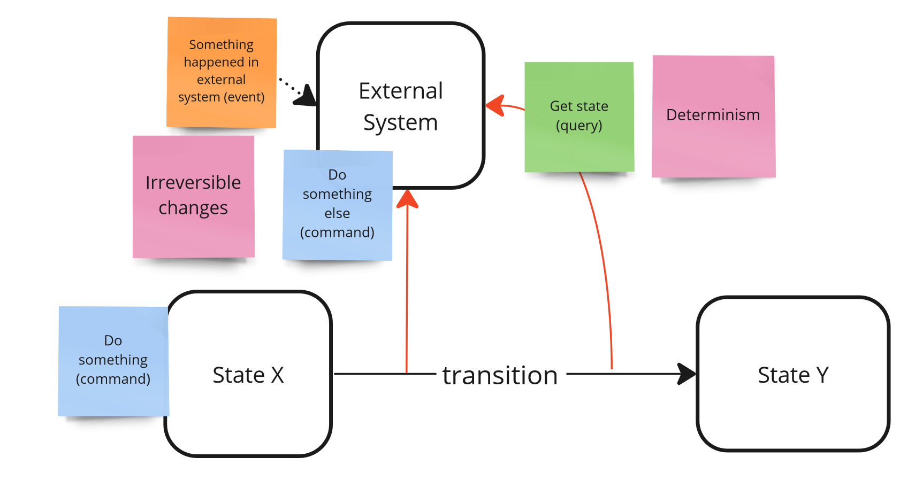<br/>
*隔离性问题。*

<ins>为了解决这个问题，最常使用的方式是 stubs（用于查询）和通过 mocks 进行交互测试（用于命令）—— 正如上文讨论可观测性时所示</ins>。

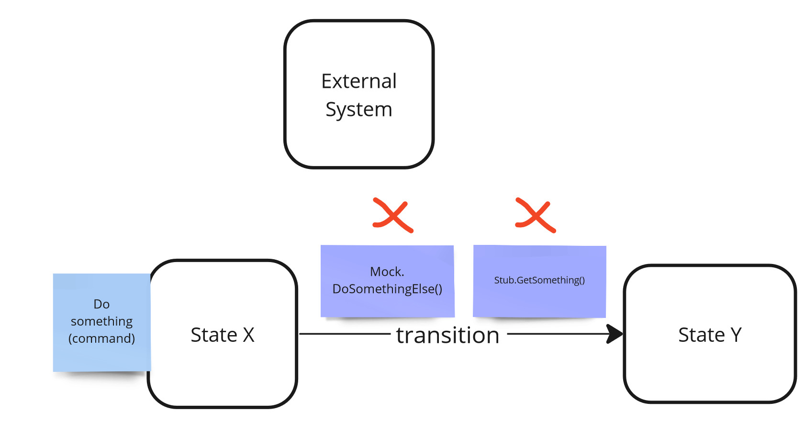<br/>
*隔离性——mocks 和 stubs*

### 可自动化性

影响可测试性的另一个重要因素是我们能够自动化测试的程度 —— *可自动化性 (automatability)* 。

<ins>如前所述，我们需要以自动化的方式 **控制** 系统的状态并 **观察** 其变化。
如果我们无法以自动化的方式完成 **所有** 步骤，我们就无法自动化这样的场景</ins>。

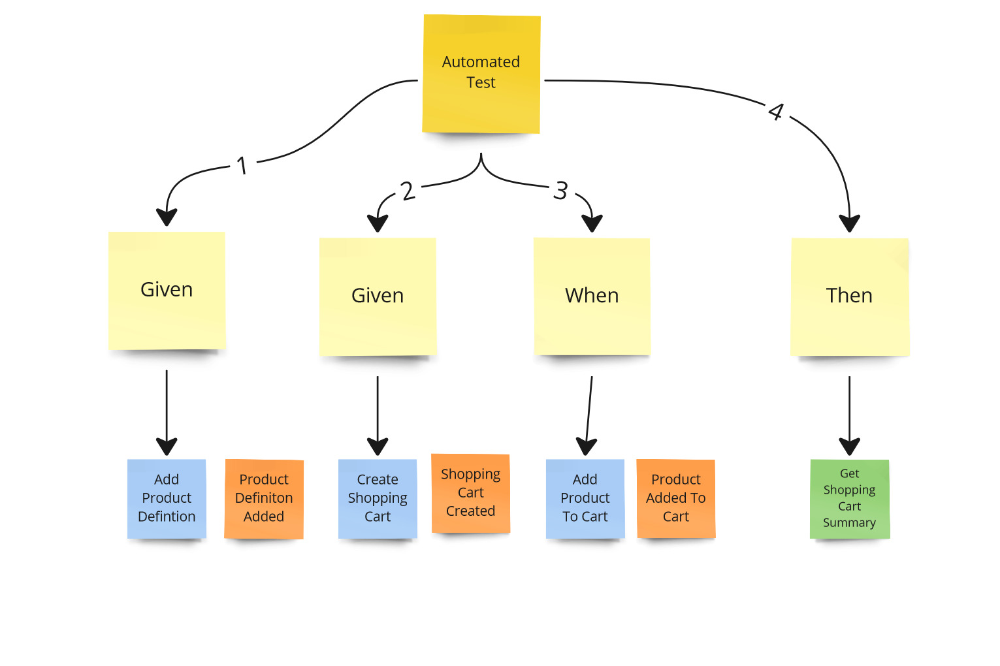<br/>
*可自动化性*

自动化能力是一回事，但 **自动化的方式和质量** 是其他可能影响可测试性的因素。
测试可以快速或缓慢，给予更多或更少的信心，以及易于或难以维护，所有这些方面都可能影响可测试性。
当我们将在下一篇文章中讨论测试策略时，我们会更详细地讨论这些因素。

### 可理解性

根据通用定义，测试涉及对与需求一致性的验证 (verification) 和确认 (validation)。
<ins>因此， **如果我们不理解业务和系统需求，测试就没有意义** 。
要正确执行给定的测试，我们需要理解测试场景的所有步骤，无论是手动执行还是编写自动化测试</ins>。

<ins>编写和执行测试有助于我们从一个与实现特定功能时不同的角度来理解需求。
通过这种方式，我们获得了双重验证。
此外，由于某些测试场景是由其他人（如 QA 工程师）编写的，我们获得了额外的检查，确保每个人都以相同的方式理解需求</ins>。

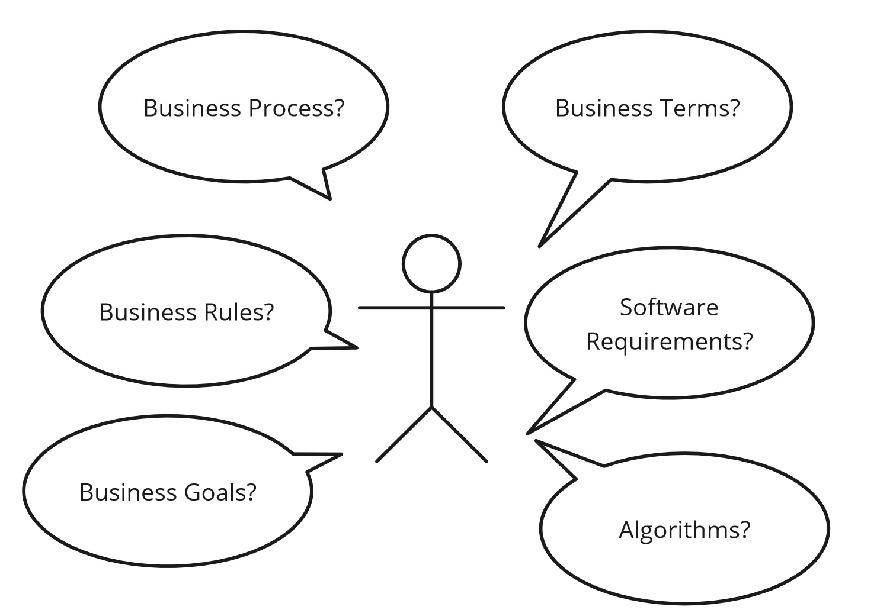<br/>
*可理解性——我理解它吗？*

<ins>执行和编写测试给了我们一个 **快速的反馈循环** —— 我们可以立即验证我们对需求的思维模型是否正确</ins>。
正因为如此，我们能够更快地学习领域，这是测试的另一个优势。

<ins>反过来也成立 —— 我们可以从测试中逆向工程出需求。
我们可以理解在给定过程中需要哪些步骤以及处理了哪些数据。
测试越好，理解就越好；测试就越容易编写</ins>。

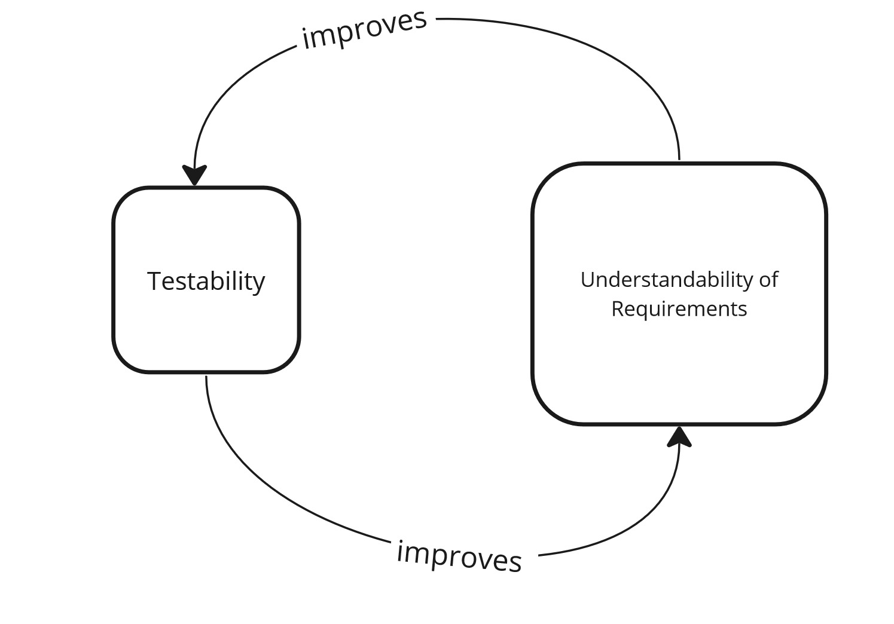<br/>
*可理解性——反馈循环*

## 总结

以下是关键要点：

- 可测试性 告诉我们测试系统的容易程度。

- 可测试的架构 是一种支持测试并优先考虑测试的架构。

- 可测试性的主要属性是：可控性、可观测性、隔离性、可自动化性 和 可理解性 。

- 可控性 是我们对系统拥有多少控制权的一种度量 —— 我们是否以及如何从一个状态转换到另一个状态。

- 可观测性 定义了我们观察系统变化的容易程度。

- 隔离性 是我们能够将自己与其他协作者隔离的程度。

- 可自动化性 是我们能够自动化测试的程度。

- 可理解性 是我们理解我们测试内容的程度。

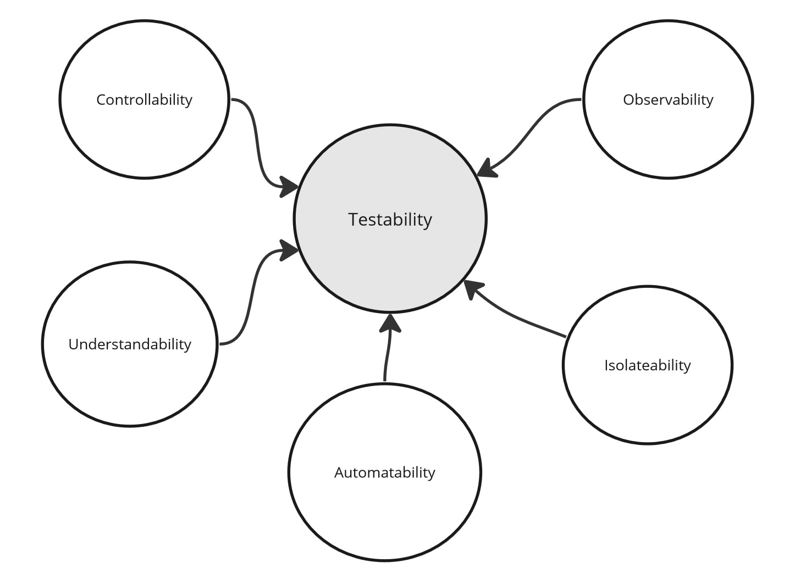<br/>
*可测试性——总结*

## 本系列更多内容

本文是 “自动化测试” 系列的一部分：

- [自动化测试：为什么](./the-why.md)
- [自动化测试：可测试性](./testability.md)（本文）
- [自动化测试：策略](./strategy.md)

