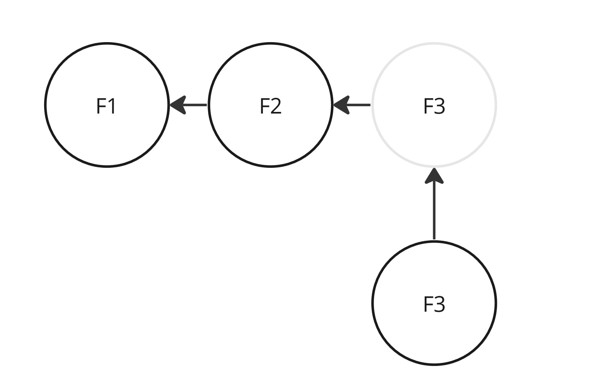
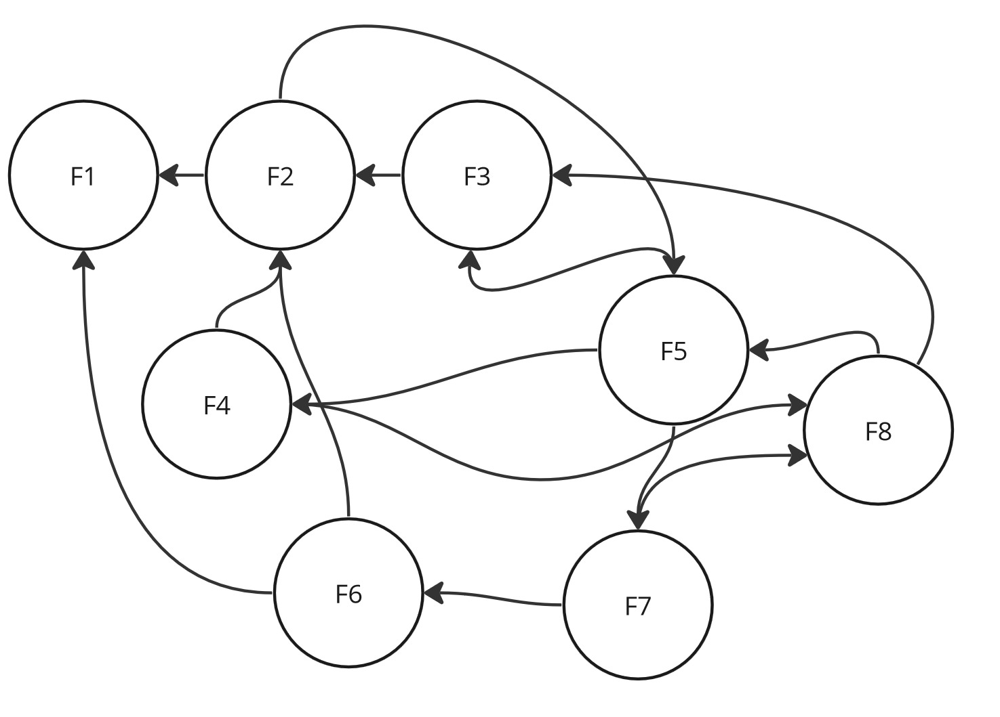
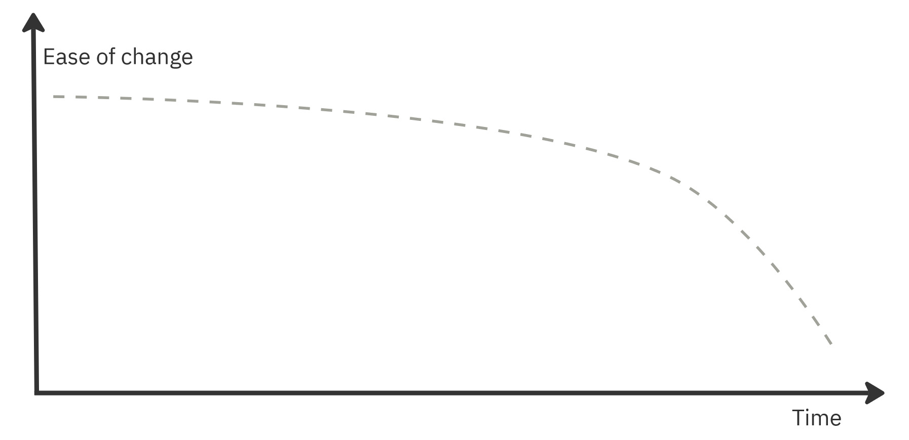
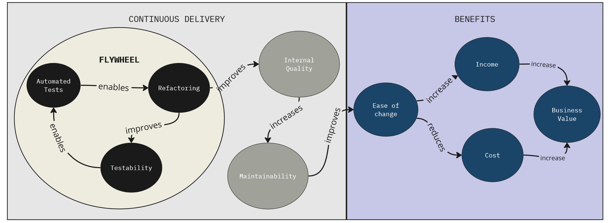
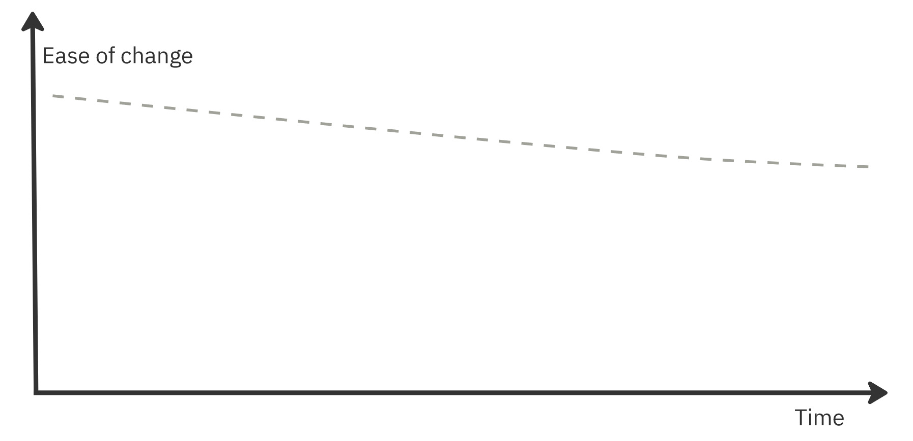
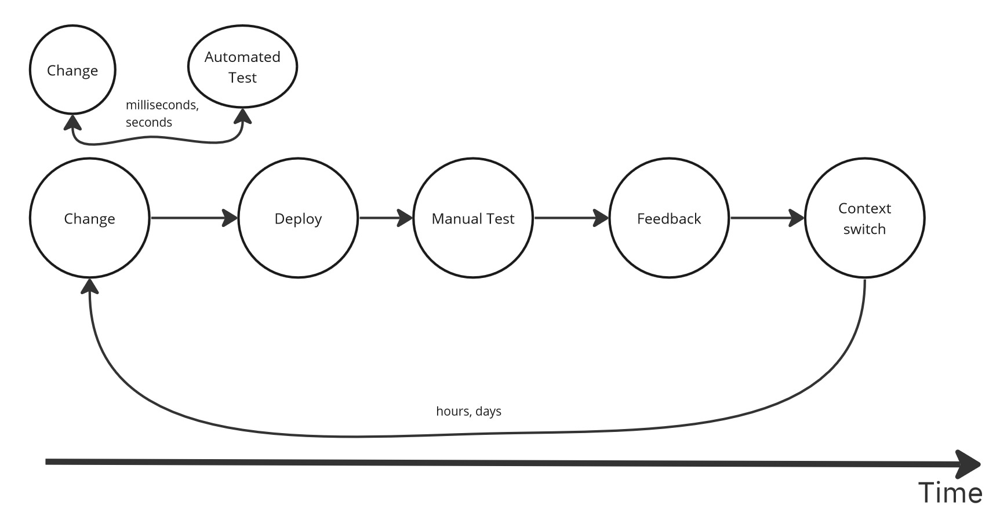
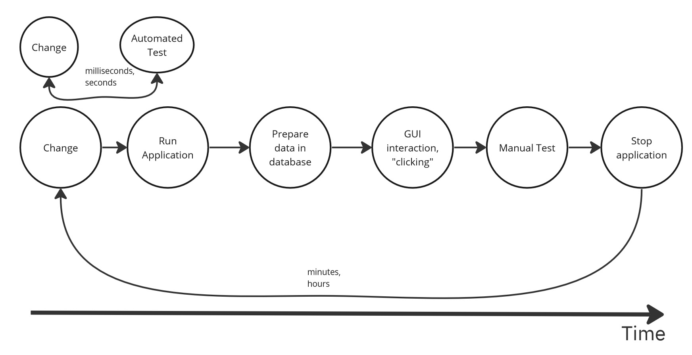
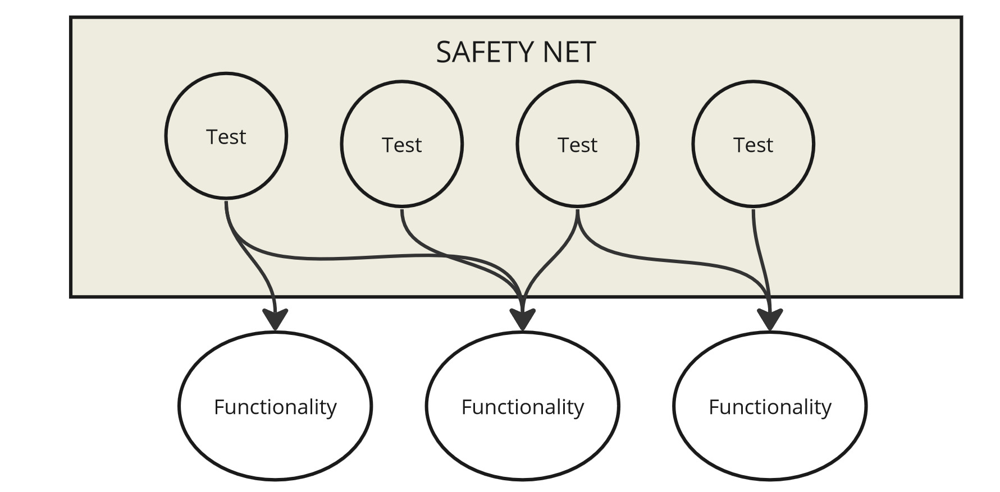

# 自动化测试：为什么？

2023-03-30 📂 测试 📂 架构和设计 [原文](https://www.kamilgrzybek.com/blog/posts/automated-tests-the-why)

 

## 引言

[测试](https://en.wikipedia.org/wiki/Software_testing) 是软件工程中必不可少的一部分，其重要性怎么强调都不为过。
多年来，测试系统的方法已经发展了很多。
目前，大量的重点被放在了自动化测试上。

尽管自动化测试是一个相当古老的概念（例如，[Test-Driven Development By Exmaple](https://www.amazon.pl/Test-Driven-Development-Beck-Kent/dp/0321146530) 一书可以追溯到 2002 年，即 20 多年前），我仍然相信，作为一个行业，我们并没有充分发挥自动化测试的潜力。

在我看来，造成这种情况的主要原因如下：

- 团队中缺乏自动化测试文化
- 缺乏测试自动化的适当技能、知识和经验
- 缺乏对自动化测试真正能带来什么的理解
- 强调快速增长、功能驱动的开发，而没有长远考虑
- 不将自动化测试视为一种投资
- 与自动化测试以及 TDD 和 BDD 等方法相关的迷思
- 对手动测试有更大的信心
- 次优的测试策略使情况变得更糟，最终完全放弃自动化测试
- 根本不关注测试过程

在本系列文章中，我旨在涵盖与自动化测试和一般测试相关的所有方面。
我将从其中一个最重要的方面开始 —— 它们的目的和它们解决的问题。

## “为什么”

让我们考虑一下为什么自动化测试在软件开发中是有益的。
假设我们正在创建将被长期使用的软件，我们可以确定一件事 —— **变化** 。

变化每天都伴随着我们，并且可能由许多因素引起，例如：

- 需要新功能的新业务需求
- 修复不正确行为所需的错误修复
- 需要遵守新的法律标准
- 需要性能改进
- 需要更新库（例如出于安全原因）

既然变化是不可避免的，那么确定 *在给定时间内进行变化的容易程度* 是有帮助的。
让我们看看这在典型项目中是什么样子。
假设我们一开始有 2 个相关的功能：

 
*简单、不复杂的系统，有 2 个现有功能*

问题在于，修改功能 1 或功能 2 是否容易？
或者可能添加新的功能 3？
可以假设这样的修改将很容易实现。
功能数量很少，因此一个人很容易理解。
此外，只有一个连接 (connection)，这降低了整个系统的复杂性。
系统越不复杂，就越容易理解。
理解系统的容易程度会影响实施和测试任何修改的容易程度。

但让我们考虑另一个例子：

 
*复杂的系统，许多功能相互依赖*

项目已经相当高级，包含许多相互关联的功能。
在这种情况下，进行修改仍然容易吗？
假设我们想要修改功能 #8。
这个功能依赖于前面的功能，因此理解它们是必要的。
这个功能的结果与其他也需要被理解的功能相关，而且重要的是，我们可能会意外地破坏它们。

<ins>因此，可以得出结论，在具有这种复杂性的系统中引入修改将更加困难</ins>。

让我们看看这在图上是如何表示的，其中横轴是时间，纵轴是修改的容易程度：

 
*修改容易程度 vs 时间*

随着项目的进展和更多功能的添加，连接的数量和整体复杂性增加，这可能导致生产力下降。

然而，这并不一定意味着每个长期开发的系统都会变得更慢。
这个挑战可以通过使用自动化测试来解决，自动化测试是 [演进式架构（Evolutionary Architecture）](https://www.thoughtworks.com/insights/books/building-evolutionary-architectures) 的重要组成部分。

### 演进式架构

正如演进式架构概念的作者自己所声称的那样：

> “演进式架构将受引导的、增量式的变化作为首要原则，贯穿多个维度。”

问题是，这种架构如何支持持续变化？
作者主要提到 [持续交付（Continuous Delivery）](https://continuousdelivery.com/) 结合 [软件可测试性（Software Testability）](https://en.wikipedia.org/wiki/Software_testability) 和 [模块化（Modularization）](../mmonolith/primer.md) 。
在测试的上下文中，我们将关注前两个，所以让我们看看它是如何工作的：

 
*演进式架构、持续交付和飞轮*

这一切都从允许我们 [重构](https://refactoring.com/) 系统的自动化测试开始。
得益于重构，系统变得更加 [可测试](https://en.wikipedia.org/wiki/Software_testability) ，这使我们更容易添加更多的自动化测试。
所有这三个元素形成一个反馈循环，驱动进一步的过程。

得益于重构，根据定义，我们系统的内部结构在不断改进。
这使得理解和修改它变得更加容易。
修改的容易程度意味着我们可以降低成本或增加收入，这最终提高了我们系统的业务价值。

通过这种方式，我们可以实现相对恒定的修改容易程度和可持续的增长：

 
*修改容易程度 vs 时间——演进式架构*

然而，我们将更仔细地研究为什么自动化测试在这个过程中如此重要 —— 它们究竟给我们带来了什么。

## 测试自动化的优点

### 快速的反馈循环

手动测试耗时太长。
如果你想进行修改，你不能依赖手动测试。
即使你有一个庞大的 QA 团队，他们也无法快速完整地测试一个复杂的系统。
使用自动化测试只需要几秒或几分钟。
手动测试则需要数小时、数天甚至数周。
如果我们必须等待那么长时间，系统就不能被认为是易于修改的。
而且，如果在手动测试过程中出现错误怎么办？

 
*快速反馈循环*

### 更快的开发

如果你有自动化测试，你可以快速搭建需要测试的系统（被测系统，System Under Test），而无需弄清楚在哪里点击、如何检索数据或如何从备份中恢复数据库。

自动化测试会为你准备好环境，允许你进行实验、测试不同的实现并快速迭代。
如果没有自动化测试，一旦你实现了系统的功能，你可能会不愿意对系统进行修改。

 
*更快的开发*

### 没有手动的人为错误

老实说 —— 人们不擅长反复执行相同的任务。
疲劳、单调和不可避免的错误都有可能出现。
你能在不遗漏某些内容或犯错的情况下，运行相同的测试用例场景多少次？
即使是最熟练的测试员，随着时间推移也容易出错。

另一方面，计算机被设计用来自动化那些枯燥和重复的任务。
如果编程得当，它们不会出现意外错误或变得不投入。
它们不会偏离分配的任务，它们的行为是完全可预测的。
考虑到这些好处，为什么不尽可能利用自动化呢？

### 安全网

如果你有非常快速的反馈，你就能迅速确定你的修改是否有效，以及系统的其余部分是否正常工作。
这创造了一个 *安全网* 。
你拥有的自动化越多，这个安全网就越大，引入进一步修改也就越容易（飞轮的一部分）。

如果没有自动化测试，任何修改都可能导致系统出错，而且如前所述，手动测试可能发现错误太晚，或者根本无法发现它们。

 
*安全网*

### 更好的设计

测试驱动设计。
如果你的系统是可测试的，那么它很可能也是设计良好的（尽管我们不能 100% 确定，因为有许多因素有助于良好的架构）。
测试可以导致：

- 你的架构更加模块化和 [松耦合](https://en.wikipedia.org/wiki/Loose_coupling)
- 你的模块和对象具有更高的 [内聚性](https://en.wikipedia.org/wiki/Cohesion_(computer_science))
- 你的实现细节被隐藏在可观察的行为背后

### 文档

测试说明了系统是如何工作的。
它们是 [可执行的示例，是一种规范](https://gojko.net/books/specification-by-example/)。
正因如此，它们始终保持最新。

它们说明了业务流程是什么样子，算法和业务逻辑如何工作，以及应用程序的逻辑和业务规则是什么。
它们展示了如何使用给定的类或整个用例。

它们作为文档足够吗？
可能不够，但它们肯定在理解系统和业务方面发挥了重要作用。

### 重构能力

以上所有要点都意味着我们可以持续地重构我们的系统。
没有它，我们会害怕破坏某些东西。
如果存在恐惧，我们就不会去做，这将导致系统质量下降，而这又意味着恐惧会进一步增加。
飞轮会运转，但这次对我们不利，导致一个越来越大的 “大泥球”。

## 测试自动化的缺点

自动化测试有什么缺点吗？

首先，与任何工具一样， **你必须学习如何使用它** 。
一个不充分的测试策略会使系统更难修改，因为代码会被测试所固化。
更改一个功能可能会导致更改比必要更多的测试。

另一件事是，测试代码是代码，它需要花费金钱，它是一种投资。
测试应该像生产代码一样被维护、开发和重构 —— **因为测试代码就是生产代码** 。

此外，测试编写是你的团队需要获取的一项 **技能** 。
我们不能一夜之间决定编写测试，然后一切就都会变得容易。
持续的培训、学习和实践在这里至关重要，需要决策者投入时间和信任。
我们不能通过一次网络研讨会或一个 YouTube 视频就学会它。

## 借口

最后，我想处理三个最常见的、为什么没有编写自动化测试的借口。

### 我没有时间

这不是真的。
正如我上面提到的，如果你的测试策略是正确的，并且你拥有测试技能，那么使用自动化测试会比不使用更快地开发。
除非你正在做一个包含 3 个实体和 2 个屏幕的 “待办事项列表” 应用 —— 但那样的话，你采用什么方法都无关紧要。

### 这是一个初创公司，没有测试会更便宜、更快

它不会更快或更便宜。
相反 —— 它会更慢、更昂贵。
如果你想快速发展，你需要从开始就投资于质量（再次参见飞轮）。
没有比自动化测试更好的投资质量的方式了 —— 它们很快就会得到回报。

### 自动化测试很困难

它和编写生产代码一样困难 —— 你只需要学习它。
这是另一项技能。
没有比实践更好的学习方式了。

在本系列的后续文章中，我将介绍更多关于如何使系统可测试的理论，包括适当的测试策略和高质量的自动化测试。
让我从系统架构的一个关键属性开始 —— 可测试性 。

## 总结

以下是关键结论：

- 作为一个行业，我们仍然没有充分发挥自动化测试的潜力。
- 变化是确定的，因此修改的容易程度（ease of change）指标在大多数项目中是关键。
- 演进式架构（Evolutionary Architecture）使用持续交付（Continuous Delivery）和自动化测试方法来支持持续变化。
- 快速反馈循环、更快的开发、可预测的过程、安全网、可执行的规范和重构能力是自动化测试的主要优点。
- 需要学习和实践自动化测试，以及开发和维护成本，是你的团队需要应对的缺点。
- 关于自动化测试存在一些迷思和流行的借口 —— 它们很困难，没有时间编写它们。如果你知道如何正确地进行，它们都不是真的。

## 本系列更多内容

本文是 “自动化测试” 系列的一部分：

- [自动化测试：为什么](./the-why.md)（本文）
- [自动化测试：可测试性](./testability.md)
- [自动化测试：策略](./strategy.md)
