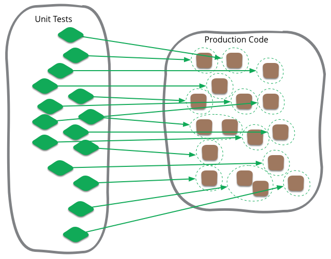
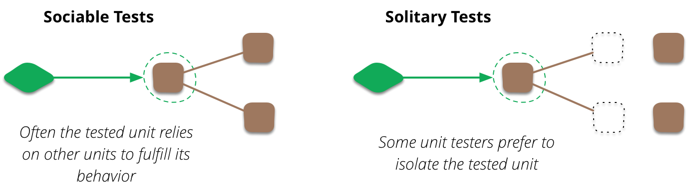

# 单元测试（Unit Test）

| [Martin Fowler](https://martinfowler.com/)| |
|:---|:---|
|| |
|[原文](https://martinfowler.com/bliki/UnitTest.html)| 2014/5/5|

🔖 测试类别 🔖 极限编程

---

单元测试在软件开发中经常被提及，也是我在整个编程生涯中一直熟悉的术语。
然而，与大多数软件开发术语一样，它的定义非常模糊，我发现当人们认为它的定义比实际更严格时，往往会产生混淆。¹

¹ 我在 [IntegrationTest](https://martinfowler.com/bliki/IntegrationTest.html) 条目中简要介绍了该名称的历史根源。

 

尽管我之前做过大量的单元测试，但决定性的接触是在我开始与 Kent Beck 合作并使用 [Xunit](https://martinfowler.com/bliki/Xunit.html) 系列单元测试工具时。
（事实上，我有时认为这种测试风格的一个好术语可能是 “xunit测试” 。）
单元测试也成为 [极限编程](https://martinfowler.com/bliki/ExtremeProgramming.html)（XP）的标志性活动，并迅速引向了 [测试驱动开发](https://martinfowler.com/bliki/TestDrivenDevelopment.html) 。

从早期开始，关于 XP 使用单元测试的定义问题就存在争议。
我清晰地记得一次 Usenet 讨论组上的讨论，我们这些 XP 实践者被一位测试专家批评误用了 “单元测试” 这个术语。
我们问他定义是什么，他回答说类似 “在我的培训课程第一个上午，我介绍了 24 种不同的单元测试定义”。

尽管存在差异，但仍有一些共同要素。
首先，单元测试是低层级的，关注软件系统的一小部分。
其次，如今单元测试通常由程序员自己使用常规工具编写 —— 唯一的区别是使用了某种单元测试框架。²
第三，单元测试预计比其他类型的测试快得多。

² 我说 “如今” 是因为这确实是 XP 带来的变化。
在世纪之交的争论中，XP 实践者因此受到强烈批评，因为当时的普遍观点是程序员永远不应测试自己的代码。
一些公司设有专门的单元测试人员，他们的全部工作就是为开发人员先前编写的代码编写单元测试。
原因包括：人们对自己代码的测试存在概念盲区、程序员不是好的测试者、以及开发人员和测试人员之间保持对立关系是有益的。
XP 的观点是，程序员可以学会成为有效的测试者，至少在单元级别上如此，而且如果引入一个独立的团队，测试提供的反馈循环将变得慢得令人绝望。
Xunit 在这里扮演了至关重要的角色，它被专门设计用于最小化程序员编写测试的阻力。

因此，存在一些共同要素，但也存在差异。
一个差异是人们认为什么是单元。
面向对象设计倾向于将类视为单元，过程式或函数式方法可能将单个函数视为单元。
但实际上，这取决于具体情况 —— 团队根据他们对系统及其测试的理解来决定什么作为单元是有意义的。
<ins>虽然我最初将单元视为类，但我经常将一组紧密相关的类作为一个单元来处理。
少数情况下，我可能将类中的部分方法作为一个单元</ins>。
然而，你如何定义它并不重要。

## 独立型还是社交型？

一个更重要的区别是，你所测试的单元应该是 *独立型（solitary）* 还是 *社交型（sociable）*。³
假设你在测试订单类的 price 方法，该 price 方法需要调用产品和客户类上的某些函数。
如果你喜欢独立型单元测试，你不想在这里使用真实的产品或客户类，因为客户类中的故障会导致订单类的测试失败。
相反，你会为这些协作者使用 [测试替身](./test-double.md) 。

³ Jay Fields [提出了 “solitary” 和 “sociable” 这两个术语](https://leanpub.com/wewut) 。

 

但并非所有单元测试者都使用独立型单元测试。
事实上，当 xunit 测试在 90 年代开始时，我们并未尝试使用独立型方式，除非与协作者通信很麻烦（例如远程信用卡验证系统）。
<ins>我们并未发现跟踪实际故障很困难，即使它导致相邻的测试失败。
因此，我们认为允许测试为社交型在实践中不会导致问题</ins>。

<ins>事实上，使用社交型单元测试是我们因使用 “单元测试” 一词而受到批评的原因之一</ins>。
我认为 “单元测试” 这个词是合适的，因为这些测试是单个单元行为的测试。
我们编写测试时，假设除该单元之外的一切都工作正常。

随着 xunit 测试在 2000 年代变得更加流行，独立型测试的概念又回来了，至少对某些人来说是这样。
我们见证了模拟对象 (Mock Objects) 和支持模拟 (mocking) 的框架的兴起。
xunit 测试发展出了两种流派，[我称之为经典派和模拟派](./mocks-arent-stubs.md) 。
<ins>两种风格之间的一个区别是，模拟派坚持独立型单元测试，而经典派则偏好社交型测试</ins>。
今天，我认识并尊重这两种风格的 xunit 测试者（就个人而言，我仍保持经典风格）。

即使像我自己这样的经典测试者，在遇到棘手的协作时也会使用测试替身。
它们对于消除 [与远程服务通信时的非确定性非常有价值](https://martinfowler.com/articles/nonDeterminism.html#RemoteServices) 。
<ins>事实上，一些经典派 xunit 测试者也认为，任何与外部资源（如数据库或文件系统）的协作都应使用替身</ins>。
这部分是由于非确定性风险，部分是由于速度原因。
虽然我认为这是一个有用的指导原则，但我并不将对外部资源使用替身视为绝对规则。
如果与该资源的通信稳定且速度足够快，那么没有理由不在单元测试中使用它。

## 速度

单元测试的共同特性 ——范围小、由程序员本人编写、速度快—— 意味着它们可以在编程时非常频繁地运行。
事实上，这是 [自测试代码](https://martinfowler.com/bliki/SelfTestingCode.html) 的关键特征之一。
在这种情况下，程序员在代码发生任何更改后都会运行单元测试。
我可能每分钟运行多次单元测试，只要我有值得编译的代码。
我这样做是因为，如果我不小心破坏了某些东西，我想立即知道。
如果缺陷是我最后一次更改引入的，那么发现错误会容易得多，因为我不需要大范围查找。

当你如此频繁地运行单元测试时，你可能不会运行所有单元测试。
通常，你只需要运行那些覆盖当前正在处理的代码部分的测试。
通常，你需要在测试深度和运行测试套件所需时间之间进行权衡。
我将这个套件称为 **编译套件 (compile suite)**，因为每当我考虑编译时（即使在像 Ruby 这样的解释型语言中），我都会运行它。

如果你在使用持续集成，你应该将测试套件作为其中的一部分来运行。
我称之为 **提交套件 (commit suite)**，通常包含所有单元测试，也可能包含一些 [宽堆栈测试](https://martinfowler.com/bliki/BroadStackTest.html) 。
作为程序员，你每天应该运行这个提交套件多次，当然在向版本控制进行任何共享提交之前要运行，但在其他有机会时（如休息时或必须去开会时）也应运行。
提交套件越快，你能运行它的频率就越高。⁴

⁴ 如果你有一些有用的测试，但运行时间超过你希望提交套件运行的时间，那么你应该构建一个部署流水线，并将较慢的测试放在流水线的后续阶段。

不同的人对单元测试和测试套件的速度有不同的标准。
[David Heinemeier Hansson](http://david.heinemeierhansson.com/2014/slow-database-test-fallacy.html) 对编译套件几秒钟、提交套件几分钟的速度感到满意。
[Gary Bernhardt](https://www.destroyallsoftware.com/blog/2014/tdd-straw-men-and-rhetoric) 认为这慢得无法忍受，坚持编译套件在 300 毫秒左右，而 [Dan Bodart](http://dan.bodar.com/2012/02/28/crazy-fast-build-times-or-when-10-seconds-starts-to-make-you-nervous/) 不希望他的提交套件超过十秒。

我认为这里没有绝对的答案。
就个人而言，我并未注意到亚秒级和几秒级编译套件之间的差异。
<ins>我喜欢 Kent Beck 的经验法则，即提交套件应在十分钟内运行完毕。
但真正的要点是，你的测试套件应该运行得足够快，以免让你不愿意足够频繁地运行它们。
而 “足够频繁” 是指，当它们检测到缺陷时，需要检查的工作量足够小，以便你能快速找到它</ins>。

### 修订记录

2014年10月24日更新：增加了对 Fields的 “社交型/独立型” 术语的提及。

2017年3月9日更新：将 “独立型/社交型” 作为描述这种区别的主要方式，并移除了 “协作者隔离” 这一术语的使用（以避免与测试夹具之间相互隔离的混淆）。
