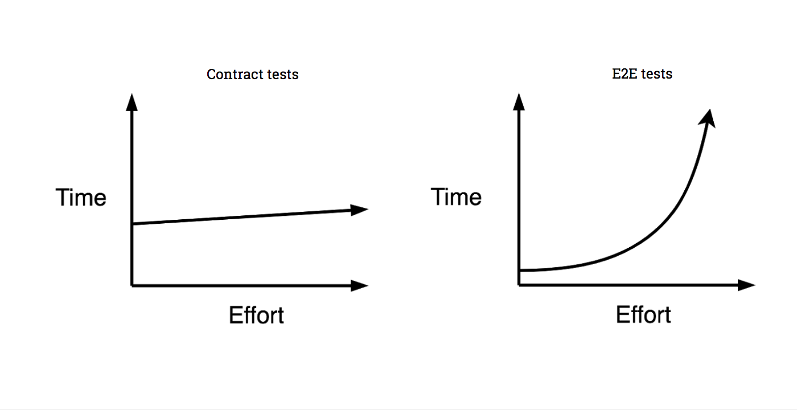
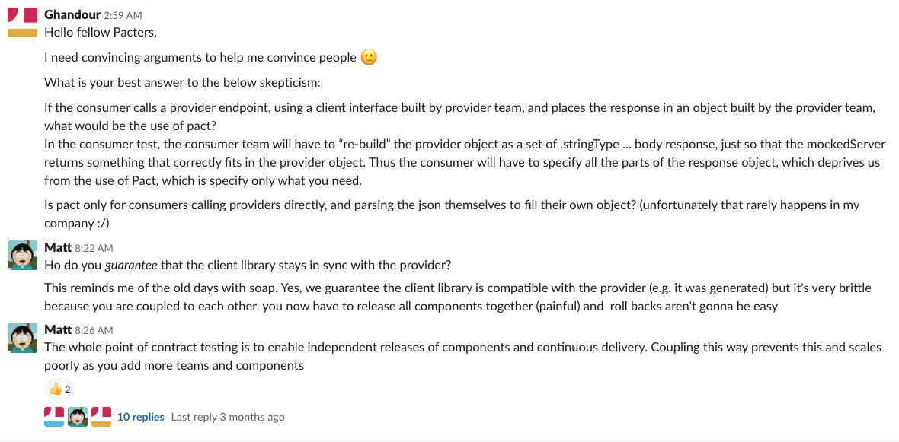
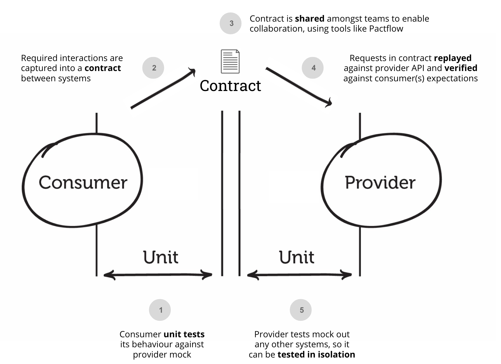
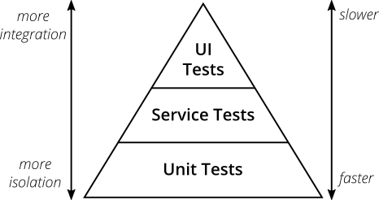
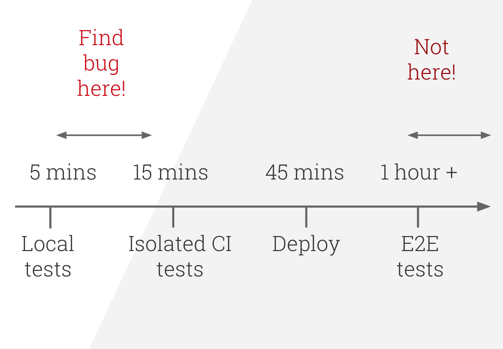

# 什么是契约测试，为什么我应该尝试它？

Matt Fellows

更新于 2023/9/2

 

每周，我们在 Slack 频道上都会被问到数百个问题，从 “我的测试失败了，请帮忙” 到 “我需要帮助说服我的团队”。
示例 A：

 

我们之前已经列举了一系列理由来说明契约测试是个好主意，但今天我想借此机会回答一个经常被问到的问题 —— 什么是契约测试，以及为什么你应该考虑将它加入你的微服务测试方法中？

在本文中，我们将涵盖：

- 集成测试以及端到端集成测试所面临的挑战
- 契约测试 —— 它是什么以及为什么它有帮助
- Pact —— Pact 如何工作
- 使用 Pact 进行契约测试的演示

你也可以观看录制的 [视频系列](https://www.youtube.com/playlist?list=PLwy9Bnco-IpfZ72VQ7hce8GicVZs7nm0i) 来了解这些内容。

## 集成测试

在我们讨论契约测试之前，我们应该先谈谈为什么契约测试会存在。
它的存在是为了帮助进行集成测试 —— 即建立对一个系统作为一个整体能够正常工作的信心的过程。

在分布式系统中，集成测试是一个帮助我们验证各种远程通信的移动部件 ——比如微服务、Web 应用和移动应用—— 是否能够协同工作的过程。

集成测试有多种类型，但最常见的方法被称为 “端到端集成测试”，即所有组件被一起部署在真实环境（与生产环境高度相似）中，并针对它运行一系列测试场景。

虽然契约测试的概念早于 Pact，但 Pact 之所以存在，是因为 [端到端集成测试是一个骗局](https://pactflow.io/blog/proving-e2e-tests-are-a-scam/) 。

## 端到端集成测试的问题
[介绍契约测试--Part1](https://www.youtube.com/watch?v=U05q0zJsKsU)

虽然测试金字塔顶端的测试更贴近客户的实际体验，但它们有几个令人痛苦的缺点。
它们：

- **速度慢。**
由于需要遍历多个系统，并且通常必须串行运行，每个测试可能需要几秒到几分钟，
特别是当需要执行前置设置（如数据准备）时。

- **难以维护。**
端到端测试要求在运行之前所有系统都处于正确的状态，包括正确的版本和数据。

- **不可靠或不稳定。**
由于编排测试环境的复杂性，它们经常失败，导致误报，并分散团队的注意力。
在许多情况下，失败是由于配置问题而非任何代码变更引起的。

- **难以修复。**
当端到端测试失败时，由于问题的分布式和远程特性，调试通常很困难。

- **扩展性差。**
随着更多团队的代码被测试，事情变得更加纠缠，测试套件以指数级速度变慢，发布流程在自动化流水线中堵塞。

- **在流程中过晚发现缺陷。**
由于运行这类测试套件的复杂性，在许多情况下，这些测试仅在代码提交后在 CI 上运行 —— 在许多情况下，是由独立的测试团队在几天后运行。
这种反馈延迟对现代敏捷交付团队来说代价极其高昂。

由于这些特性，建议将端到端集成测试的数量保持在最少，以确保关键的业务事务或功能得到覆盖。

有关更深入的探讨，请参阅 [证明端到端测试是一个骗局](https://pactflow.io/blog/proving-e2e-tests-are-a-scam/) 一文。

## 什么是契约测试？
[介绍契约测试--Part1](https://www.youtube.com/watch?v=U05q0zJsKsU)

契约测试是一种用于确保两个独立系统（例如两个微服务）之间兼容且能够相互通信的方法论。
它捕获每个服务之间交换的交互，并将其存储在契约中，然后可用于验证双方是否遵守该契约。
契约测试超越了模式测试，要求双方就允许的交互集达成共识，并允许随着时间的推移进行演进。

这种测试形式与旨在实现相同目标的其他方法的不同之处在于，每个系统可以独立于其他系统进行测试，
并且契约由代码本身生成，这意味着契约始终保持最新状态。

下图展示了契约测试的关键步骤：

 

从这一点出发，还有许多其他重要特性，我们将在后续进一步讨论。

### Pact 如何实现契约测试？

Pact 是一个代码优先的契约测试工具，需要能够访问集成点双方的代码。
要编写 Pact 测试，你需要能够在消费者端编写单元测试，并能够在提供者端操纵状态（通常是在单元测试的上下文中）。

### Pactflow 如何实现契约测试？

虽然 Pactflow 支持 Pact 作为其主要的契约测试工具，但它也使得更广泛的工具能够在契约测试过程中使用（例如 Postman、Dredd 或其他服务虚拟化和模拟工具），提供了一种将它们 “升级” 为通用契约测试能力的方法。
更多信息请参阅我们 [关于双向契约测试](https://pactflow.io/blog/bi-directional-contracts/) 的博客。

### 什么是消费者驱动的契约测试？

“消费者驱动的” 前缀只是陈述了一个额外的哲学立场，即通过将 API 的消费者置于设计过程的核心，来倡导更好的内部微服务设计。
提供者驱动的 API 往往偏向于所暴露的数据和暴露该数据的系统。

Pact 和 Spring Cloud Contracts 是默认采用这种实现方式的框架示例，但这并不是获得契约测试核心好处的必要条件，两者都可以用于实现契约测试的目标。

## 契约测试的好处是什么？
[介绍契约测试--Part4](https://www.youtube.com/watch?v=3T8J8Pwu3I4)

首先，考虑契约测试在更广泛的自动化测试方法中所处的位置是有帮助的。
在制定测试自动化策略时，关于如何分配工作，一个很好的经验法则是 Mike Cohn 在测试金字塔中倡导的方法：

遵循金字塔形状，以建立一个健康、快速且可维护的测试套件：编写大量小而快的单元测试。
编写一些较粗粒度的测试，以及极少量的从端到端测试应用程序的高层测试。³

³ 参考来源

 

契约测试位于服务测试层，因为它们执行速度快，并且不需要集成外部系统即可运行。
它们的作用是让你在发布之前，对你所集成的系统与你的代码是否兼容有信心。

注意：金字塔顶端的 UI 测试通常也与 “集成端到端（e2e）测试” 互换使用。

**契约测试的价值**

契约测试通常具有与集成端到端测试相反的特性。

- **运行速度快**，因为它们不需要与多个系统通信。
- **更易于维护**。你不需要了解整个生态系统来编写测试。
- **易于调试和修复**，因为问题只出在你所测试的组件中 —— 因此你通常可以得到一个失败的行号或特定的 API 端点。
- **可重复**。
- **可扩展**；由于每个组件都可以独立测试，构建流水线的时间不会呈线性/指数级增长。
- **在开发人员本地机器上即可发现缺陷**。契约测试可以而且应该在推送代码之前在开发人员机器上运行。

从业务角度来看，众所周知，在项目生命周期中发现缺陷越晚，修复成本就越高。

 
*[来自](https://www.slideshare.net/bethesque/microservices-test-smarter-not-harder-voxxed-days-2019?qid=e1be4882-f144-4897-9eca-9c89359574a4&v=&b=&from_search=1) Beth 关于该主题的精彩 [演讲](https://www.youtube.com/watch?v=79GKBYSqMIo&feature=youtu.be)*

通过将大部分自动化测试作为快速单元测试或本地集成测试运行，你可以将构建速度保持在最低限度，并防止团队中出现队列积压。

**其他好处**

事实证明，契约测试还有其他的次要但积极的副作用。

- 能够在 API 之前开发消费者（例如 React Web 应用）。
- 能够首先驱动出提供者的需求，这意味着你只在提供者中实现你恰好需要的内容。
- 你得到一组记录良好的用例（“Given ... a request for ... will return ...”），它们准确地展示了提供者是如何被使用的。
- 能够确切地看到每个消费者关注哪些字段，允许在不影响消费者的情况下，在提供者 API 中移除未使用的字段并添加新字段。
- 能够立即看到如果对提供者 API 进行更改，哪些消费者将会被破坏。

我希望这个对主题的简要介绍向你展示了如何使用契约测试来替换许多（或在某些情况下，全部）端到端集成测试，以加速你的 CI 流水线并提高团队的开发速度。

契约测试并非银弹，且没有两个团队是完全相同的，因此请思考你的测试策略，它如何适用于你，以及你需要从中获得什么。

## 使用 Pact 与 Pactflow 实现的契约测试示例
[介绍契约测试--Part3](https://www.youtube.com/watch?v=6Qd-kq1AzZI)
