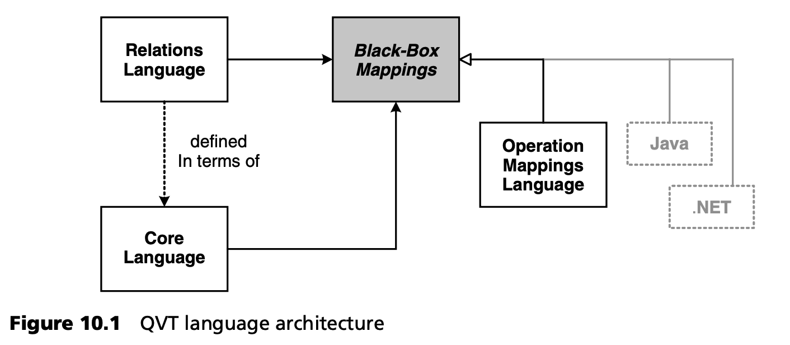

## 10.3 总体架构
QVT 规范由三种不同的模型到模型转换语言组成：其中两种语言（关系语言和核心语言）是声明性的，一种语言（操作映射语言）是命令性的。引入 QVT 的混合性质是为了适应具有不同需求、要求和习惯的不同类型用户。如果考虑到众多最初提交 RFP 的用户，他们对 QVT 的使用和功能有着不同的期望，那么这一策略可能并不令人惊讶：

- 关系语言是一种声明式的用户友好转换语言，主要围绕对象模式概念构建。用户不负责创建和删除对象，也不负责管理转换痕迹。该语言希望用户通过对象模式和 OCL 表达式来描述源元模型和目标元模型各部分之间的关系。它提供了一种识别目标模型元素的机制，这是支持变更传播所必需的。QVT 关系语言还定义了一种简单的图形语法。我们将在第 10.4.1 节中通过一个示例来讨论关系语言。
- 核心语言被定义为 EMOF[2](#2) 和 OCL 的绝对最小扩展。在这里，用户也不负责对象的创建和删除，但跟踪信息不会自动生成。用户需要将转换规则和跟踪信息定义为 MOF 元模型。核心语言不提供模式，也不提供用于识别目标模型元素的任何直接机制。
- 这种绝对简约的方法使核心语言简洁美观，但在实践中却几乎无法使用。造成这种情况的部分原因是缺乏自动跟踪管理，以及处理目标模型元素标识的困难。后者必须在规则和子规则中明确编码，这就要求为相对简单的转换问题制定复杂的转换规范。因此，我们不再进一步阐述核心语言。
- 操作映射语言是 QVT 的命令式基石。它为描述转换提供了一种特定领域的命令式语言。OCL 被用作其查询语言，但扩展了命令式功能以描述计算。操作映射语言有两种不同的使用方式。首先，可以纯粹使用操作映射语言来指定转换。我们将在第 10.4.2 节中举例说明这种可能性。
- 或者，也可以采用混合模式。用户必须在关系（或核心）语言中指定转换的某些方面，并在操作映射语言中以黑盒映射的形式实现单个规则。

尽管 QVT 标准规定了三种转换语言，但它们之间并非完全没有联系。图 10.1 说明了不同 QVT 语言之间的关系。

关系语言的语义是根据核心语言定义的。在具体说明中，这是通过从关系语言的 MOF 元模型到核心语言的 MOF 元模型的模型到模型转换来建模的。这种语义转换本身是在关系语言中指定的。对这种映射的讨论超出了本书的范围，但如果您有兴趣，可以在 QVT 规范文档中找到这种转换，该文档还对其进行了广泛的注释 [QVT](../ref.md#qvt) 。

关系语言和 Core 语言之间的这种显式转换表明，通过用上述转换来翻译关系转换，可以在 Core 语言引擎之上实现关系语言。虽然这在理论上是可行的，但似乎并不实用。为关系语言开发一个优化的 QVT 引擎显然比绕道 Core 语言更可行，它能更好地支持模型到模型转换的不同要求。

关于关系语言和核心语言之间的关系，QVT 文档对 JVM 和 Java 编程语言做了一个类比：核心语言更像 Java 字节代码，而关系语言则有点像 Java 语言本身。您必须自己判断这种类比的价值。

在实践中，由于用户只能用 OCL 来表达计算问题，因此不一定能用关系（或 Core）语言来指定转换的所有方面。例如，模型到模型的转换可能需要使用复杂或传统的库，而用纯 QVT 重新实现这些库并不经济。为了适应这种情况，QVT 规范明确允许黑盒映射。如图 10.1 所示，这些黑盒映射可以用操作映射语言编写，然后以混合模式使用。另外，也可以使用 Java 等外部编程语言。

在接下来的章节中，我们将研究一个具体的转换问题，并讨论其在关系映射语言和操作映射语言中的实现。不过，由于不可能讨论这两种 M2M 转换语言的所有功能和复杂性，我们建议感兴趣的读者在这些语言的原型可用后尽快使用它们（见第 10.5 节）。

---
#### 2
EMOF 是 MOF 2.0 的一个最小子集，类似于 Eclipse 中定义的元元模型 EMF，但并不完全相同。
