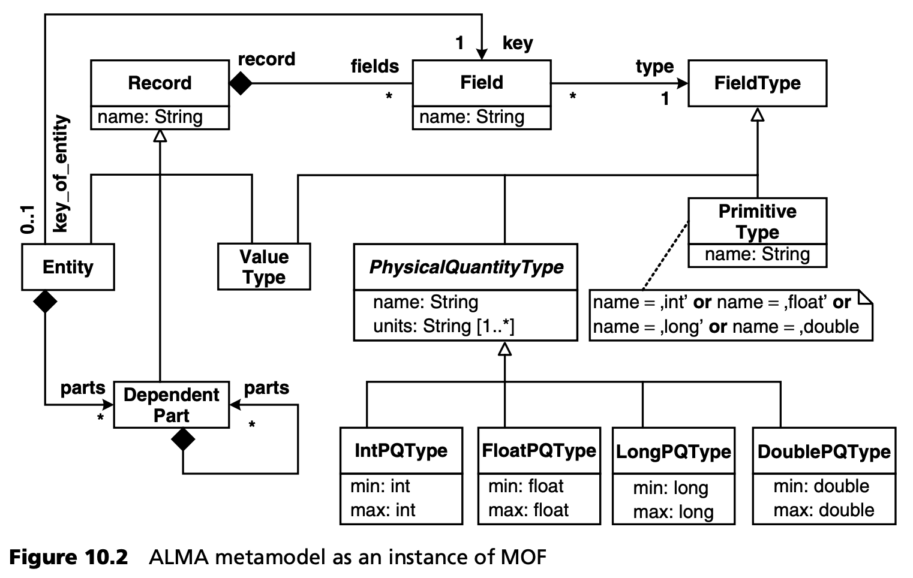
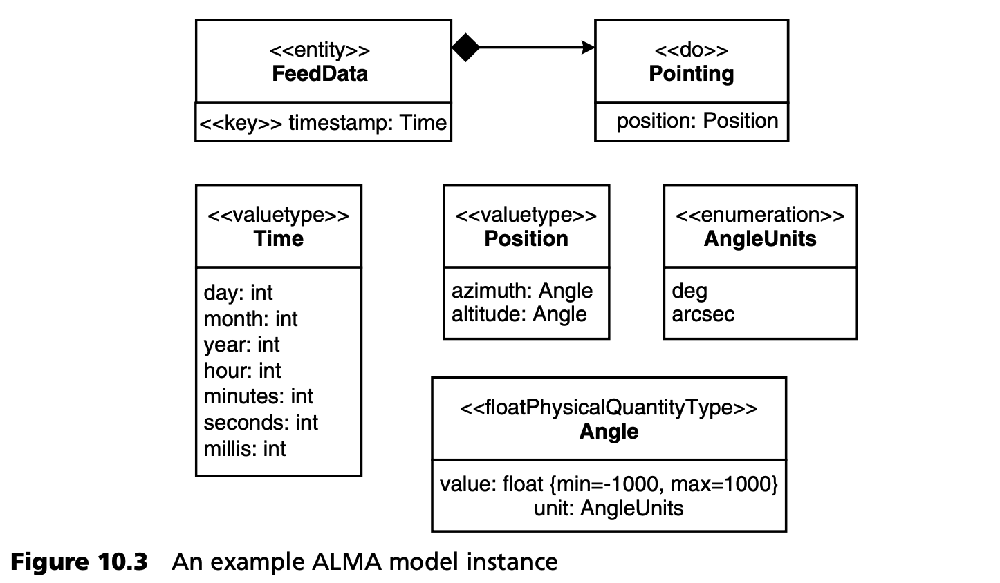
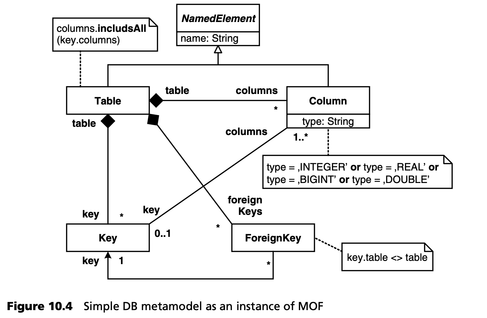
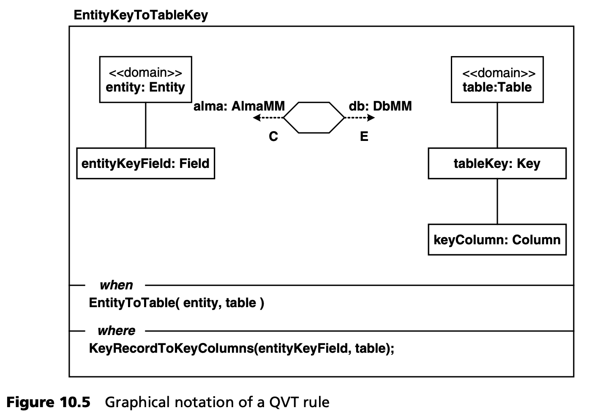

## 10.4 转换示例
在第 [6.11](../ch6/11.md) 节中，我们讨论了 ALMA 元模型示例，它可用于天文观测数据建模。它提供了一个与平台无关的抽象概念，涵盖了 ALMA 软件基础设施所需的所有可能工件。ALMA 数据的一种可能的特定于平台的实现形式可以是关系型数据库。在本节中，我们将讨论从 ALMA 元模型到简单关系数据库元模型（简称 DB）的转换。

在讨论实际转换之前，我们必须准确指定 QVT 转换的输入（或源）和输出（或目标）元模型。由于 QVT 假设其输入和输出都是基于 MOF 的元模型，因此我们展示了 ALMA 元模型的 MOF 版本。请注意，理论上可以直接在 UML 配置文件上指定 QVT 转换，此时源元模型必须是 UML 本身。然而，由于作为 MOF 实例的 UML 元模型极其庞大和复杂，这种转换通常难以理解，更不用说编写了。QVT 转换编写者需要理解作为 MOF 实例的 UML 元模型，这可能并不简单，更重要的是，可能会偏离元模型的特定领域意图。

UML 配置文件在许多方面都是一个具体的语法模型。根据实践经验，我们发现直接针对 UML 配置文件编写的结构良好、适应性强的转换<sup>[3](#3)</sup> 往往会在实现实际转换逻辑之前，先将配置文件转换为类似于隐式 MOF 的元模型。当转换是重用和改编的基础时，这一点尤为重要<sup>[4](#4)</sup> 。

图 10.2 显示了作为 MOF 实例的 ALMA 元模型。



与 UML 配置文件的主要区别在于，我们引入了抽象类 *Record* 和具体类 *Field*，而不是沿用 UML 的 *Class* 和 *Attributes* 元类。我们还为 *PhysicalQuantityType* 引入了特定的元类，并为每个基础类型引入了不同的 incarnations。这减少了在定义 UML 配置文件时对元模型的大量限制。

图 10.3 是图 6.28 的例子，稍作调整后显示了物理量类型的使用。请注意，这个例子并不完全是第 6.11 节中 UML 配置文件的实例，它说明了如何将元模型映射到配置文件上有一定的自由度。



我们的目标数据库元模型是关系数据库表的简单再现。图 10.4 显示了它的 MOF 实例。



数据库模型可以包含任意数量的表，每个表都有一个主键、任意数量的列和任意数量的外键。键指的是一个或多个列，其约束要求这些列必须属于键所属的表。每个特定表的外键都指向另一个表的主键，我们不允许外键指向自己的表。最后，表和列都有名称，每一列都有基础类型，我们只允许使用数字类型。

从 ALMA 元模型到 DB 元模型的示例转换可以非正式地描述如下：

- 记录的所有字段都会根据字段类型映射到一个或多个列：
  * 如果字段类型是基础类型，我们将构造一个基础类型列。
  * 如果类型是值类型，我们会为每个字段递归构造列，其中包含字段的名称会被传递 (propagated)，以消除嵌套字段的名称歧义。
  * 如果类型是物理量，我们会为每个单位构建一列，列名包含单位名称，其类型是具体物理量的类型。
- 每个 ALMA 实体都映射到一个数据库表：
  * 如前所述，其所有字段都指向列。
  * 其键指向表键 (table key)。
- 实体拥有的，每个 ALMA 依赖部分也会映射到一个 DB 表，其名称是实体名称和依赖部分名称的连接：
  * 如前所述，其所有字段都指向列。
  * 其键是人工构建的，类型为 INTEGER。
  * 实体的包含表会获得一个外键，指向这个人工键。
- 所有 ALMA 依赖部分（h 是其他依附部分的一部分）的所有列（每个字段）都会扩展到最顶层依赖部分的表中。这种情况也是递归的。<sup>[9](#9)</sup>

以图 10.3 中的简单示例为例，根据上述转换说明进行转换后，可以得到以下两张表<sup>[5](#5)</sup>：

- TableFeedData:
  * *key timestamp_day* : INTEGER
  * *key timestamp_month* : INTEGER
  * *key timestamp_year* : INTEGER
  * *key timestamp_hours* : INTEGER
  * *key timestamp_minutes* : INTEGER
  * *key timestamp_seconds* : INTEGER
  * *key timestamp_millis* : INTEGER
  * *fk key_FeedData_Pointing* : INTEGER
- TableFeedData_Pointing:
  * *key key_FeedData_Pointing* : INTEGER
  * *position_azimuth_as_Angle_in_deg* : REAL
  * *position_azimuth_as_Angle_in_arcsec* : REAL
  * *position_altitude_as_Angle_in_deg* : REAL
  * *position_altitude_as_Angle_in_arcsec* : REAL

### 10.4.1 QVT 关系语言中的示例
QVT 关系语言是 QVT 三重奏中的声明式语言。QVT 关系语言的用户必须将源元模型到目标元模型<sup>[6](#6)</sup> 的转换描述为一组 *关系 (relations)* 。转换执行意味着对这些关系进行验证，然后在必要时通过操作目标模型来执行。

在我们的例子中，我们描述了 ALMA 实例与 DB 实例之间的关系。转换声明如下
```c
transformation alma2db(alma : AlmaMM, db : DbMM) {
…
}
```
在定义转换时，执行方向并不固定，这意味着理论上 *alma* 和 *db* 可以是源模型和目标模型，也可以反过来。只有在调用转换时，用户才必须指定执行转换的方向。如下所述，这个方向会改变各个关系的解释。

下面是将实体映射到表的关系规则：
```c
top relation EntityToTable {
   prefix, eName : String;
 
   checkonly domain alma entity:Entity {
      name = eName
   };
   enforce domain db table:Table {
      name = eName
   };
   where {
      prefix = ’ ‘;
      RecordToColumns(entity, table, prefix);
   }
}
```
关系规则中的 *域声明 (domain declarations)* 数量总是与转换所涉及的模型数量一样多。一个域与一个模型（例如 *alma* ）绑定，并声明一个 *模式 (pattern)* ，该模式将与域所绑定的模型中的元素相匹配。这种模式由一个变量和一个类型声明组成，变量和类型声明本身可以指定该类型的某些属性，并递归地指定这些属性的类型。这种模式只是该关系规则中，对我们感兴趣的模型元素和属性进行限制。

例如，在 *EntityToTable* 关系中，绑定 *alma* 模型的域，将匹配 *alma* 模型中所有 *Entity* 类型的元素到变量 *entity* ，前提是它们至少定义了一个属性 *name* ，而这个属性名必须绑定到字符串变量 *eName* 上。同样，在 *db* 域中，模式会绑定 *Table* 类型的变量 *table*，而属性 *name* 则绑定到变量  *eName* 。请注意，这两个模式都引用了同一个变量 *eName*，这隐含了一个 *跨域 (cross-domain)* 约束。可以在关系规则的 *where* 子句中指定其他跨域约束。

在讨论 *where* 子句的内容之前，我们想提请大家注意域限定符 *checkonly* 和 *enforce*。这些限定符限制了在给定方向上执行关系的方式。例如，如果 *alma2db* 转换在 *db* 方向上执行，QVT 引擎将尝试匹配规则中不属于该方向的所有域模式（方便地称为源域，source domains）。对于每个源域匹配，引擎将在方向域（称为目标域，target domains）中搜索匹配。如果没有或只有部分匹配，且目标域限定为 *enforce*，那么引擎将修改或创建目标域的模型元素，以（重新）执行该关系。另一方面，如果目标域是用 *checkonly* 限定的，引擎将通知用户不一致的情况，但不会尝试修正目标域中的模型。

在我们的例子中，当 *alma2db* 朝 *db* 的方向执行时，*entityToTable* 规则将匹配 *alma* 中 *Entity* 类型的元素，并检查 *db* 中是否存在同名 *Table* 类型的对应元素。如果不存在，QVT 引擎将在 *db* 中修改或创建一个表。

QVT 关系引擎还会删除任何在 *alma* 模型中没有对应实体的表。反过来，每当我们在 *alma* 方向上执行 *alma2db* 时，*entityToTable* 规则将匹配 *db* 中 *Table* 类型的元素，并检查 *alma* 中是否存在 *Entity* 类型的对应元素。如果不存在，就会通知用户，但不会更改 *alma* 模型。

从理论上讲，用 *enforce* 限定关系的所有域是可能的，这相当于双向甚至多向转换规则。然而，正如我们在第 [10.2](2.md) 节中指出的，这在实践中效果并不好。此外，为了保证可执行性，QVT 关系语言对涉及 *enforced* 域的表达式格式进行了限制。当所有域都强制执行时，要表达所有所需的计算要困难得多。

成功匹配源域模式后，将检查目标域模式，并根据 *where* 子句的限制条件执行。在示例中，*entityToTable* 规则要求变量 *prefix* 绑定为空字符串，并要求关系 *RecordToColumns*（包含给定参数）存在或已构建。在某种程度上，谓词 *RecordToColumns(entity、table、prefix)* 可以解释为规则调用。

关系规则可以是顶层规则，也可以是非顶层规则。前者用关键字 *top* 限定，一旦源域模式出现匹配，就会自动执行。相反，非顶级关系规则只有在显式调用另一个关系的 *where* 子句时才会执行。上面的 *entityToTable* 规则就是一个顶级关系的例子，而从 *entityToTable* 的 *where* 子句调用的 *RecordToColumns* 则是非顶级关系规则：
```c
relation RecordToColumns {
   checkonly domain alma record:Record {
      fields = field:Field {}
   };
   enforce domain db table:Table {};
   primitive domain prefix:String;
   where {
      FieldToColumns(field, table);
   }
}
```
该关系规则匹配 *alma* 中的记录及其字段和 *db* 的表。它还定义了一个特殊的 *基础域 (primitive domain)* 。这种机制允许非顶层关系指定基础类型的参数。它们只能在非顶层关系中出现，因为基础域有无限多的实例。

您可能想知道 QVT 引擎是如何修复强制目标域中的破损元素的。一个简单的答案是，对于每一个失败的目标域模式匹配，引擎都会简单地删除整个匹配，并用一个正确计算的匹配替换它。虽然从语义上讲是正确的，但这种策略的效率非常低，更糟糕的是，它会破坏目标模型中的底层标识，这在实践中是很成问题的。

例如，请看 *alma2db* 示例中的以下关系规则：
```c
relation PhysicalQuantityTypeToColumn {
   pqName, pqUnit, fieldName : String;
 
   checkonly domain alma field:Field {
      name = fieldName,
      type = pq:PhysicalQuantityType {
         name = pqName,
         units = pqUnit
      }
   };
   enforce domain db table:Table {
      columns = column:Column {
         name = prefix + fieldName + ‘_as_’ +
            pqName + ‘_in_’ + pqUnit,
         type = AlmaPhysicalQuantityTypeToDbType(pq)
      }
   };
   primitive domain prefix:String;
}
```
在 *alma* 域中，这条规则匹配的是 *PhysicialQuantityType* 字段，其属性 *name* 和 *units* 分别与变量 *pqName* 和 *pqUnit* 绑定。因此，在 *db* 模型中，引擎需要匹配或修复表中的一列，该列的名称基于 *pqName*，类型由 *fieldType* 计算得出。

假设在 *alma* 中找到了匹配，在 *db* 中找到了相应的列，但名称不匹配：希望只重新计算 *Column* 的 *name* 属性，而不是整个 *Column* 对象。在 QVT 关系中，这是通过 key 定义实现的，转换编写者必须在转换开始时提供 key 定义。举个例子
```c
key Column {table, name};
```
这一 key 定义表明，列是由其名称和所属表唯一定义的。在上例中，如果在强制执行的目标域中，列的表和名称属性都发生了变化，那么就会创建一个新的列对象。

在源域模式匹配成功 *之前* ，顶层关系可能需要额外的跨域约束。下面的规则说明了这一点：
```c
top relation EntityKeyToTableKey {
 
checkonly domain alma entity:Entity {
      key = entityKeyField:Field {}
   };
   enforce domain db table:Table {
      key = tableKey:Key {}
   };
   when {
      EntityToTable(entity, table);
   }
   where {
      KeyRecordToKeyColumns(entityKeyField, table);
   }
}
```
这种顶层关系指定了一个 *when* 子句。它要求只有当存在以 *entity* 和 *table* 作为参数的 *EntityToTable* 实例时，*alma* 域中绑定到 *entity* 的模式才算成功。只有在这种情况下，我们才会在执行的目标域中匹配或构造一个 *Key* 对象，并将其链接到之前计算的 *Column* 对象，然后调用非顶层关系 *KeyRecordToKeyColumns*。

有时，编写进行简单计算的辅助函数也很有用。请看 *alma2db* 示例中的函数 *AlmaTypeToDbType*：
```c
function AlmaTypeToDbType(almaType : String) : String {
   if (almaType = ‘int’) then ‘INTEGER’
   else if (almaType = ‘float’) then ‘REAL’
   else if (almaType = ‘long’) then ‘BIGINT’
   else ‘DOUBLE’
}
```
它将为 *db* 中每个 *alma* 的基础类型计算正确字符串名称。这种类型的函数应被理解为宏：也就是说，它不参与转换跟踪，其行为与内嵌函数相同。

QVT 关系语言还提供了一种图形符号，它扩展了 UML 对象图。例如，图 10.5 显示了图形符号中的 *EntityKeyToTableKey* 关系规则。

该符号相对简单。每个规则都有自己的框架，名称位于左上角。这两个模式以对象图的形式绘制，其中域变量和类型被赋予了 «domain» 定型。域绑定及其限定条件用新符号画在中间，其中 *C* 表示只 *checkonly* ，*E* 表示 *Enforce*。*when* 和 *where* 子句都作为规则框架的分隔。然后其内容作为文本插入。

遗憾的是，目前采用的 QVT 规范在所有可能的 QVT 关系规则的图形符号方面并不完整。例如，它没有定义如何指定基础域 (primitive domains) 。更广泛地说，图形符号比文本表示法的优势有多大还不清楚。图形规则相对较大，需要大量工作才能指定。此外，与 UML 或 MOF 这些用于定义结构信息的语言不同，QVT 这种行为语言的规则在图形形式下的可读性有多高，目前还不清楚。

您可以在附录 [A.1](../a/1.md) 中找到 *alma2db* 示例的完整 QVT 关系文本形式。



### 10.4.2 QVT 操作映射语言中的示例
操作映射语言（Operational Mappings, OM）是 QVT 语言规范中的命令式语言。它可以以混合方式与 QVT 关系结合使用，也可以独立使用。在本例中，我们只考虑独立使用的方法。

操作映射转换以转换标头 (transformation header) 开始，标头指定了转换的输入和输出模型。OM 转换只能在静态声明的方向上执行，因为它一般不涉及多向转换。以 *alma2db* 为例，我们有
```c
transformation alma2db(in alma : AlmaMM, out db : DbMM);
```
OM 转换主要由 *映射操作 (mapping operations)* 组成，映射操作附加在源元模型类上。例如，下面是 *alma2db* 示例中的映射示例：
```c
mapping DependentPart::part2table(in prefix : String) : Table
inherits fieldColumns {
   var dpTableName := prefix + recordName;
   name := dpTableName;
   columns := mainColumns +
         object Column {
            name := ‘key_’ + dpTableName;
               type := ‘INTEGER’;
               inKey := true;
            }
   end { self.parts->map part2columns(result, dpTableName + ‘_’); }
}
```
映射 *part2table* 被附加到 *DependentPart* 元类。它有一个 *String* 类型的输入参数 *prefix* ，调用时会生成一个新的 *Table* 实例，或者，如果规则调用时已经绑定了表，则会更新该表。

映射的主体包含属性分配和临时变量（用关键字 *var* 限定）。此外，映射还可以声明 *init* 和 *end* 语句。这些语句分别包含元类实例化之前和之后必须执行的语句。

正文及其子句中的所有语句都是在 OCL 的命令式扩展中指定的。我们不对这种扩展进行详细讨论，因为它在很大程度上是不言自明的。在映射语句的表达式中，通常需要将包含对象，作为源元类的实例来引用。这个对象可以用 *self* 关键字来引用。

表达式还可以包含 *内联映射 (in-lined mappings)* ，这些内联映射可以用 *object* 关键字来限定。在示例中，*columns* 属性赋值就包含这样一个内联映射。它构造一个 *Column* 实例，而该实例又被分配了一些属性<sup>[7](#7)</sup>。

你可能想知道 *inKey* 属性从何而来。在 OM 变换中，可以用辅助属性来扩展元类。在本例中，只需添加以下语句即可：
```c
intermediate property Column::inKey : Boolean;
```
*part2table* 映射示例的 *end* 语句利用了两个值得解释的特征。*self* 对象的 *parts* 属性被输入到 *map* 操作中。该操作只需将其参数映射应用到分配给该属性的集合中的每个元素。此外，映射 *part2columns* 的结果是一个表格，除了一个普通 *String* 参数外，还传递了一个特殊变量 *result*。因此，*part2columns* 映射不会创建一个新表，而只是使用 *part2table* 映射的结果，并按照 *part2columns* 映射中的指定更新属性。特殊变量 *result* 隐式存储了映射的结果<sup>[8](#8)</sup>。

*part2table* 映射中的表达式引用了 *recordName* 和 *mainColumns* 变量，但这两个变量似乎没有在任何地方声明过。事实上，这些变量是从抽象映射 *fieldColumns* 继承而来的：
```c
abstract mapping Record::fieldColumns(in prefix : String) : Table {
   init {
      var mainColumns := self.fields->map(f)
                     field2Columns(prefix, self.key = f);
      var recordName := self.name;
   }
}
```
映射的继承语义意味着子映射会隐式 *calls* 上级映射，并传递自己的结果。调用发生在子映射的主体执行之前。在示例中，只计算了一些中间结果。*fieldColumns* 是抽象的，这只是意味着它不能被显式调用。

映射的结果并不总是隐式分配的，前面的示例映射就是这种情况。当映射的结果是一个集合时，通常会出现这种情况。请看下面来自 *alma2db* 的示例：
```c
mapping PhysicalQuantityType::pqType2Columns (in prefix : String, in iskey : Boolean)
: Sequence(Column) {
   init {
      result := self.units->map(u)
         object Column {
            name := prefix + ‘_as_’ + self.name + ‘_in_’ + u;
            type := self->convertPQType();
            inKey := iskey;
         };
   }
}
```
*pqType2Columns* 映射的结果是一系列 *Column* 对象，结果变量在 *init* 语句中明确分配。还要注意的是，*map* 操作可将每个集合元素绑定到一个参数。在示例中，*self.units* 中的每个单位 (unit) 都与参数 *u* 绑定。

OM 转换还有一种指定函数的方法，这些函数不会对转换的运行时间产生影响。请看下面的例子
```c
query PrimitiveType::convertPrimitiveType() : String =
   if self.name = “int” then ‘INTEGER’
   else if self.name = “float” then ‘FLOAT’
   else if self.name = “long” then ‘BIGINT’
   else ‘DOUBLE’
   endif endif endif;
```
操作映射查询与 QVT 关系中的函数类似。

最后，我们必须告诉转换在哪里以及如何开始转换。在 *alma2db* 中，*main* 声明如下：
```java
main() {
   alma.objectsOfType(Entity)->map entity2table(“);
}
```
操作 *objectsOfType(Entity)* 只是从 *alma* 输入模型中返回元类 *Entity* 的所有模型元素。*entity2table* 映射会在每个元素上调用，并将前缀绑定为空字符串。

以上阐述只涉及 OM 语言的一些基本方面，它们只是整个 OM 语言特征集合的一小部分（但很有用）。深入探讨 OM 各种可能性的细节超出了本书的范围。有些语言特点纯粹是为了方便或解决可扩展性问题（例如库的使用）。另一些则允许用户检查转换轨迹。

OM 语言更奇特的特性之一是支持与 QVT 关系引擎更紧密地集成。例如，可以在映射定义中包含 *when* 和 *where* 语句。在这种情况下，转换编写者必须意识到，当 *when* 语句求值为 *false* 时，映射调用可能会失败并返回空值。这种 *when* 和 *where* 语句分别起到前置条件和后置条件的作用。

整个 *alma2db* OM 语言示例见附录 [A.2](../a/2.md)。

---
#### 3
这些意见主要来自模型到文本的转换：然而，我们相信它们同样适用于 M2M 转换。

#### 4
细心的读者可能会问，我们如何将 UML 配置文件与 MOF 元模型联系起来？理论上，这也可以通过 M2M 转换来实现，但在实践中，这更可能是托管 MDA 工具的工作，因为为了实用，配置文件和元模型之间的连接必须是实时和双向的。更重要的是，工具可能希望对允许从元模型到配置文件的映射进行限制，因此可能需要提供自己的机制或语言来表达这种关系。

#### 5
我们可以把 UML 配置文件定义为 DB 模型的具体语法，但由于这与转换无关，我们不再讨论。

#### 6
所有 QVT 语言都允许多个输入和输出模型。

#### 7
事实上，直接分配属性的映射体只是内联映射的语法简化，与映射结果绑定。有关详情，建议查阅规范。

#### 8
这也是一种语法上的便利。只要映射定义了显式对象创建，对结果的赋值就可以是显式的。详情请查阅规范。

#### 9
译注：原文中这句话就有语法错误，且不能根据上下文进行修正，只能尽力而为了。
