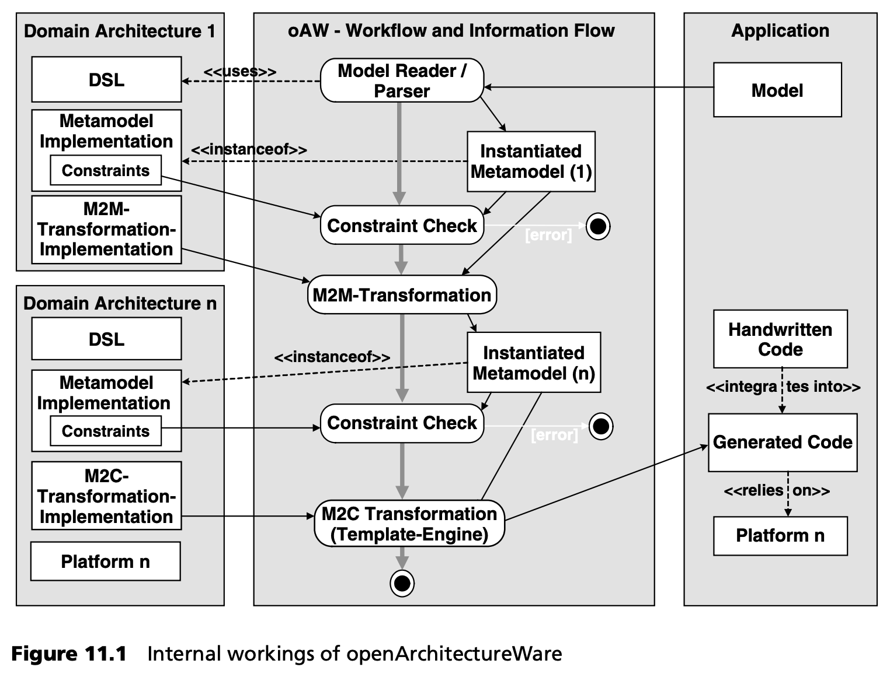

## 11.1 工具在开发过程中的作用
没有工具的支持，模型驱动软件开发就毫无意义。本节简要概述了在 MDSD 项目或领域架构中应使用的典型工具类别。

### 11.1.1 建模
建模工具是核心工具。根据 DSL 的不同，可以在这一类别中使用不同的具体工具。尽管如此，我们还是应该尽量为具体的 DSL 提供一个合适的编辑器 -- 一个 “了解” DSL 并在建模过程中有效支持它的编辑器。例如，可以使用通过语法高亮显示和代码自动补全来支持文本 DSL 的文本编辑器。基于表单的编辑器通常也很有用。对于图形化 DSL，图形化编辑器是首选工具，但创建图形化编辑器需要耗费大量精力。

如果使用 UML 配置文件创建模型，则需要一个合适的 UML 工具。原则上，您可以使用任何 UML 工具，但有一些建议您应该遵守。以下列表从优先级最高的参数开始，依次排列。

- *XMI export* 。首先，工具必须能以 XMI 格式导出模型。除其他格式外，大多数 MDA/MDSD 生成器都能接受 XMI 作为输入格式。XMI 仍然提供了许多自由度，因此具有一定程度的模糊性。不过，以 XMI 文件表示的模型是进一步处理模型的良好起点。
- *定型和标记值 (Stereotypes and tagged values)* 。在模型元素上标注定型在实践中对每个建模工具都是可行的，因此不能作为比较的基础。在处理标记值时，这一点不能想当然。好的 UML 工具会把定型视为模型元素，而不仅仅是 “类上的字符串”。您需要定义某个定型应该分配给哪些建模元素（即 UML 元模型的元素）。此外，还应确保特定的定型也要求或允许特定的标记值。工具应迫使开发人员在建模过程中提供一致的输入。
- *元建模/配置文件 (Metamodeling/profiles)* 。理想情况下，工具应支持真正的元建模和 UML 配置文件的创建。这包括元模型中各个元类型的定义以及约束的定义。理想情况下，新模型元素的图形渲染（即它们的具体语法）和工具的图形用户界面（GUI）也应具有适应性。例如，插入自定义模型元素类型的按钮应该是可配置的。这种工具目前还很少见，但确实存在 [GME](../ref.md#gme)、[MC04](../ref.md#mc04)。
- *OCL* 。如果工具不仅允许 M1 层的 OCL 表达式（见第 [6](../ch6/0.md) 章）作为注释，而且还能对模型的约束进行语法检查，那就非常有用了。因此，只有当约束构成当前模型的有效表达式时才会被允许。

### 11.1.2 模型验证和代码生成
目前可用的绝大多数 UML 工具都无法，用特定领域的元模型来检查模型的正确性。然而，代码生成只有在模型相对于元模型是正确的情况下才能运行。此外，如果模型没有使用 UML 建模（+ 配置文件），则必须在代码生成之前对模型进行检查。

在大多数情况下，对模型的检查是通过一个单独的工具 -- 生成器来进行的。重要的是，该工具的验证阶段应该与代码生成阶段分开。转换不应涉及模型的验证，而应假定模型在元模型方面的正确性，否则转换将变得不必要的复杂。此外，模型的验证与模型的生成问题（即转换问题）完全无关。验证完全是模型所构建的领域的问题。如果在同一模型上执行各种转换，就需要在每种转换中整合与问题领域相关的正确性约束，而这是不太可行的。

有几个方面对生成器的验证和转换阶段至关重要，在此按优先顺序排列：

- *从具体语法中抽象出来 (Abstraction from the concrete syntax)* 。对模型的验证应始终独立于模型表示的具体语法。这种方法允许在无需调整验证规则的情况下更改具体语法。我们必须提供一个新的解析器来读取改变后的具体语法。我们将在后面详细解释这一点。对 DSL 具体语法的抽象最好是通过元模型的显式表示来实现。
- *元模型的显式表示 (Explicit representation of the metamodel)* 。对于模型的验证和转换来说，当前处理的模型所基于的元模型在生成器中必须有显式的表示。这一要求意味着开发人员可以调整生成器使用的元模型。解决此问题的经过验证且可靠的方法之一是，将元模型元素表示为编程语言中的类。这样，模型就由对象组成，即各元模型元素的实例（见第 [9.3.2](../ch9/3.md#932-模板和元模型) 节）。我们稍后也会讨论这一点。
- *声明性约束 (Declarative constraints)* 。验证模型正确性的元模型约束最好能以声明的方式定义。OCL 就是这种声明式约束语言的一个例子，但目前大多数工具还不完全支持这种语言。即使这一理想无法实现，我们也应尽量以声明的方式制定 (formulate) 约束。我们将在第 [16](../ch16/0.md) 章本书的第二个综合案例研究中详细解释这种实用方法。
- *工作流程控制 (Workflow control)* 。开发人员应该能够控制步骤的先后顺序 --实例化、验证、转换、代码生成-- 以构建复杂场景。

基于开源生成器 openArchitectureWare [OAW](../ref.md#oaw)，可以研究所有这些特性。图 11.1 显示了一个工作流程的复杂示例，其中包括两个级联领域架构。首先，加载应用模型。它是基于第一个领域架构的 DSL 构建的。解析器建立 AST 表示法，即实例化元模型，它是表示第一个领域架构元模型的元类的实例。接下来，将检查该元模型的约束条件。如果检测到违规（约束失败），则工作流到此结束并报告错误。如果一切正常，则执行第一个领域架构中的模型到模型转换，创建第二个领域架构元模型的实例。再次检查约束条件。如果检查成功，则执行第二个领域架构的模型到代码转换，生成的代码现在必须与手工编写的代码片段集成。

### 11.1.3 构建工具
在许多情况下，生成器会创建大量不同的工件。下一步，必须对这些工件进行适当的编译、打包和处理。为此需要一个合适的构建工具 (build tool) 。原则上，任何脚本语言都可以实现这一目的：Ant 已在 Java 世界广为接受。

在许多情况下，人们会将生成脚本作为生成器运行的一部分，然后直接执行它。

### 11.1.4 配方框架
如果您要求开发人员手动编写系统的特定方面，并且在编写时必须遵守特定规则（例如 “必须从生成的基类扩展并实现抽象方法” ），那么指导开发人员是非常有用的。生成器其实帮不上什么忙，因为它只会生成基类，然后终止，希望开发者 “做正确的事” 并编写子类。

代码生成器运行完成后，*配方框架 (Recipe frameworks)* 会管理开发人员的实现任务。通常情况下，代码生成器除了生成代码外，还会实例化 (instantiates) 一系列检查，随后由 IDE 针对生成的代码进行检查，以验证手写代码的完整性和正确性。这种工具可以大大简化使用生成器的开发工作。有关这种方法的示例，请参见第 [17.4.3](../ch17/4.md#1743-基于-dsl-的编程模型) 节。

### 11.1.5 集成开发环境工具包
"IDE 工具包 (IDE toolkit)" 并不是强制性的，但如果有的话会非常有用。该理念的核心在于，模型、不同的处理步骤以及生成的工件均可由应用开发人员在单一 IDE 中进行操作和管理。配置文件的适配编辑器 (Adapted editors for configuration files)、对模型的访问以及对生成工件的访问都应该可用。特别是，特定领域 IDE 应只显示与开发人员相关的工件或方面。只有在需要时，才会显示无关的中间结果。

*Eclipse* 平台就是这样一个 IDE 工具包。它允许以可接受的工作量，创建项目或特定领域的 IDE -- 参见 [RV05](../ref.md#rv05)。
