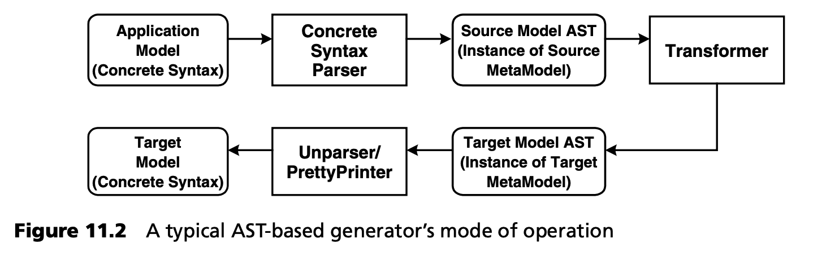
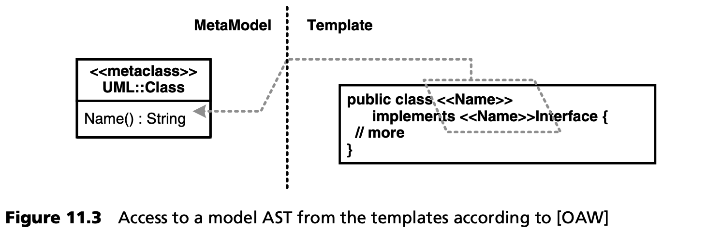

## 11.2 工具架构和选择标准

### 11.2.1 实现元模型
正式定义的领域元模型是一个良好的起点，但要真正发挥作用，必须在应用程序开发过程中加以实际使用。只要元模型只是记录在纸上或建模工具中，而没有其他工具使用它，它就没有生产价值。

手动检查模型与底层元模型是否一致既费时又容易出错。标准建模工具（如当前的 UML 工具）在此通常没有用武之地，因为它们并不 “理解” 特定领域元模型的规则，因此无法用它们来检查模型。典型的 UML 工具应用的唯一规则是检查一般 UML 模型的良好格式的规则，也就是针对 UML 元模型的检查。在这方面，我们只能希望 UML 工具能在不久的将来提供更好的配置文件支持。

因此，您应该在一个可以读取模型并根据元模型检查其正确性的工具中实现元模型。正确性检查必须涵盖元模型规定的所有规则和约束，这是确保后续模型转换和代码生成合理的唯一方法。

检查生成器的输入数据是元模型的一个实际应用。这一附加值是 MDSD 流程和领域架构的重要组成部分。当然，元模型本身的实现可以使用模型驱动技术来实现，例如使用相应的元领域架构。

### 11.2.2 忽略具体语法
每个模型都不可避免地要用具体语法来呈现，例如基于 MOF 模型的 UML XMI 和文本模型的 XML。然而，基于具体语法定义的转换是相当不坚定的，因为它们必须考虑具体语法，而元模型元素实例的转换应该是它们的优先事项。这使得转换变得不必要的复杂。此外，如果模型的具体语法发生变化，转换就无法继续使用--这在项目过程中确实时有发生。如何确保转换和模型验证不依赖于具体语法呢？

根据具体语法定义转换通常容易出错，而且效率低下。例如，XMI 的语法就非常复杂。在此基础上通过 XSLT 定义转换只适用于微不足道的情况。在很多情况下，为同一个元模型提供多种具体语法也是非常有用的，例如，如果使用不同的 DSL 来描述不同的技术子域，或者具体语法在项目过程中发生了变化。基于具体语法的转换和模型验证定义不必要地将转换绑定到特定的具体语法上。

因此，转换定义应基于源元模型（以及模型到模型转换的目标元模型）。为此，应在转换工具中采用三步法：
- 首先，对源模型进行解析，并在生成器中创建模型的抽象表示，通常采用对象结构的形式，例如通过元模型类的实例化。
- 然后将该模型转换为目标模型，只对抽象对象图表示进行处理。
- 最后，将目标模型渲染为目标 DSL 的具体语法。

这种方法大大提高了指定转换的效率和成果。它还使转换器变得更加灵活，因为它现在可以使用任何具体语法。这对基于 XMI 的具体语法尤其重要，因为不同的 UML 工具会输出不同的 XMI 方言。您应避免将转换绑定到特定的工具，甚至是特定的工具版本。

本节介绍的方法在编译器构造中已经应用了一段时间。编译器总是分几个阶段工作，而这些阶段的实现通常是可以交换的。因此，编译器可以比较容易地适应不同的目标平台，或 “理解” 不同的源语言。图 11.2 解释了代码生成器的原理。

MDSD 代码生成器通常不使用完整的三步法，而是直接根据原始模型实例生成文本输出。在这种情况下，创建目标模型的抽象语法树（也就是目标语言的抽象语法）将过于复杂。取而代之的是使用模板语言来浏览(navigate)源模型。不过，源模型应表示为对象图，即实例化的元模型。

这种方法非常适合元模型的实现。理想情况下，两种用途都使用相同的实现方式。如图 11.3 所示，模板可以直接与元对象一起工作，而元对象的属性可以用来为模板评估(evaluation)提供信息（参见第 3 章和第 16 章）。

### 11.2.3 模块化转换
我们已经从领域架构的角度描述了模块化转换的作用。从 MDSD 工具的角度来看，对这一概念的支持构成了一种构造特征或选择标准。

### 11.2.4 模型转换是 "头等公民"
正如我们所看到的，模型转换不是领域架构中的小事，而是完全成熟的重要工件，就像模型和手工创建的源代码一样。这不仅会影响开发人员处理转换的方式，也会影响工具的工作方式：

- 开发人员应合理安排结构、模块化并经常重构。
- 转换语言必须为转换的结构化提供足够的手段，例如使用模块化、委托、继承和多态性以及面向切面。
- 工具必须以这样一种方式存储转换：如果适用于分布式团队，它们可以与项目中用于这些目的的工具一起进行版本控制和管理。

与模型和传统源代码相比，当今的一些工具仍将转换视为 “次要” 。幸运的是，基于模板的生成器通常将代码生成模板存储为单独的（文本）文件，这些文件可以很容易地进行版本控制，例如使用 CVS，必要时还可以进行合并。不过，需要指出的是，在表示和处理转换方面，目前还没有成熟的、普遍接受的范式或语法。
