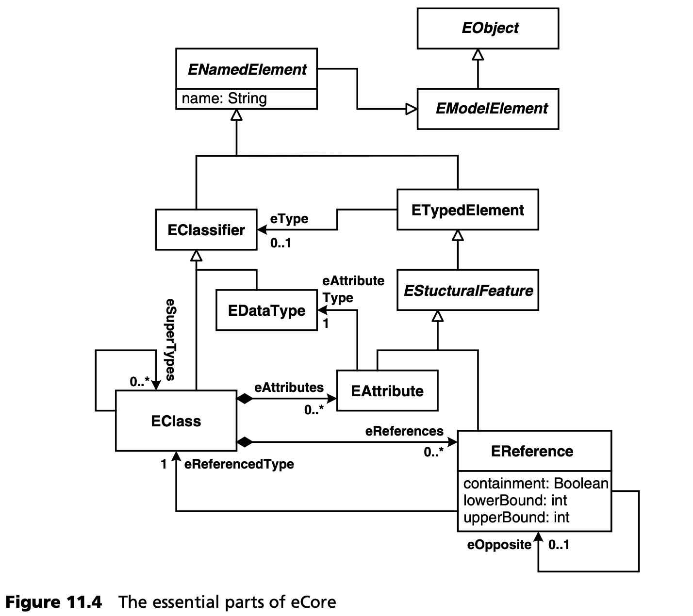
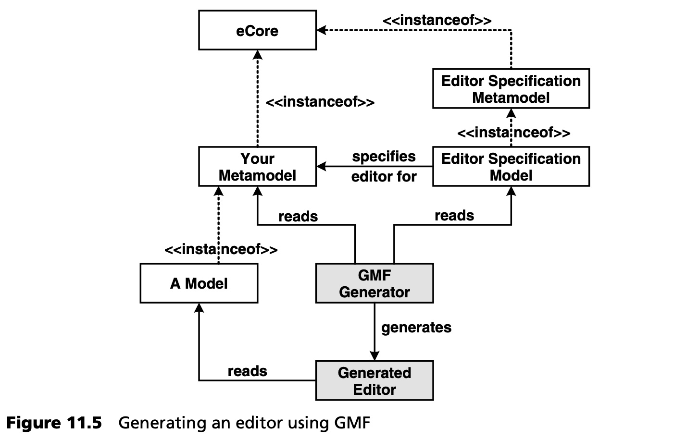
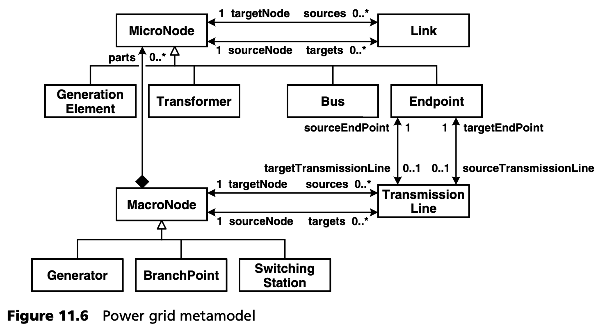
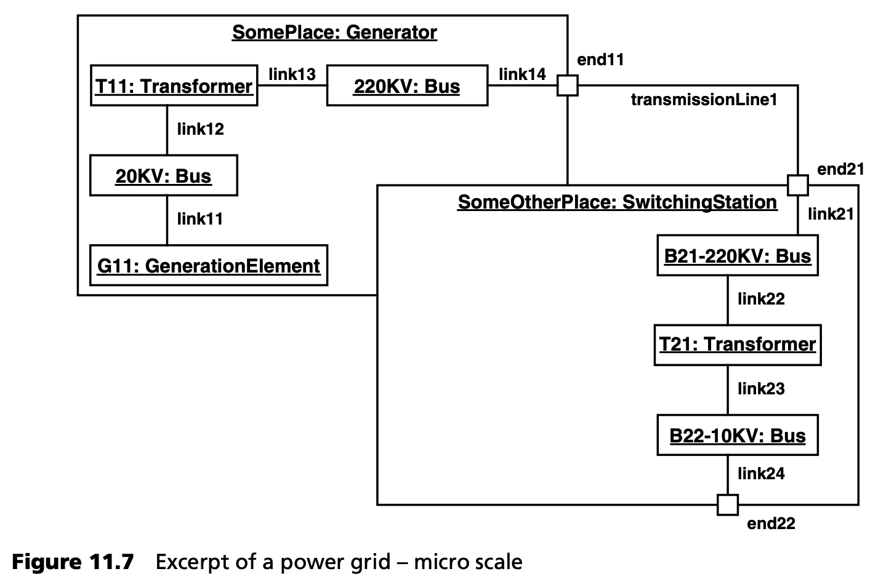
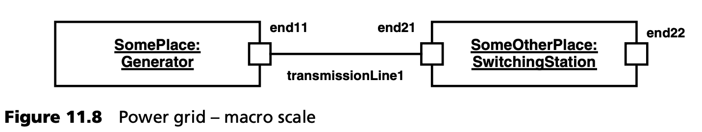
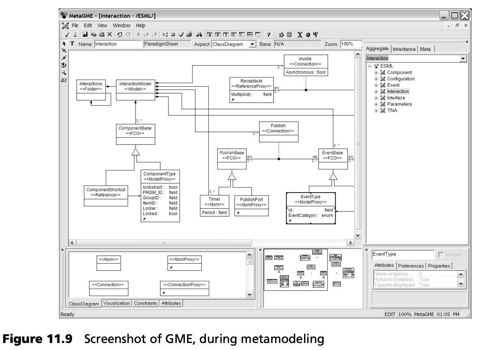
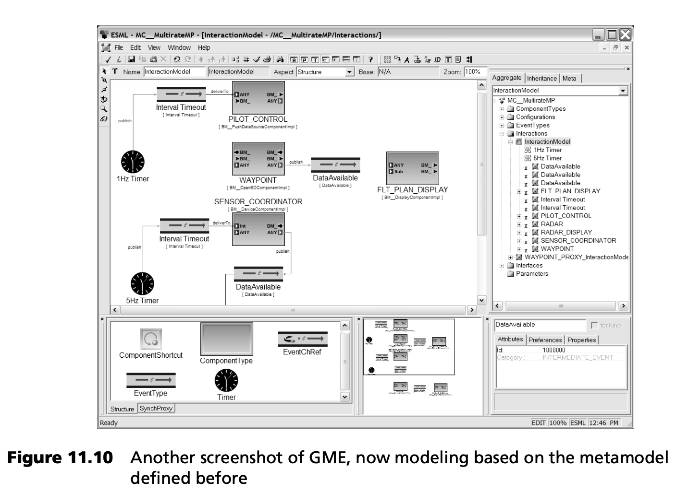
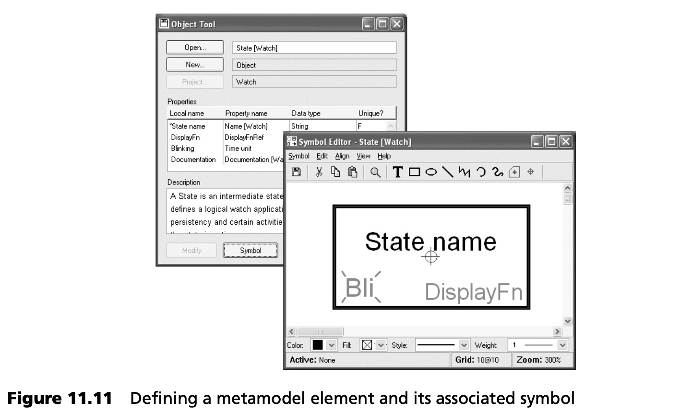
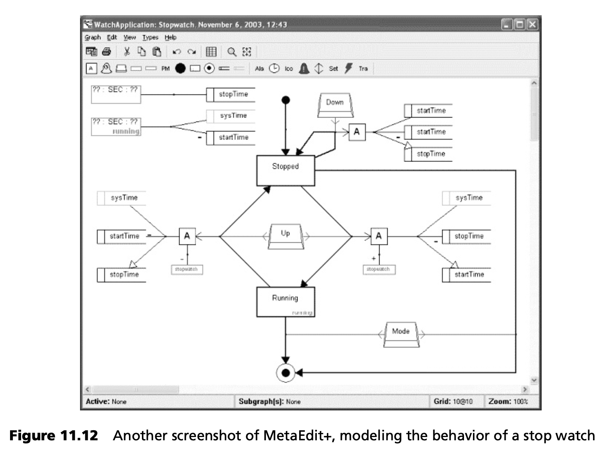

## 11.3 提示
在本节中，我们将介绍一些有趣的工具和框架，其中大部分都是开源的。其中一些工具目前已经可用，另一些则将在不久的将来推出。

### 11.3.1 Eclipse 世界
许多有趣的 MDSD 相关技术正在 Eclipse 平台上出现。本节将指出其中一些最重要的技术。

***Eclipse 建模框架 (EMF)***

<ins>EMF 是基于 Eclipse 的 MDSD 框架，是大量有趣工具的基础。 其核心组件是eCore，这是一个与eMOF（*essential MOF* ，见第 [12.2.2](../ch12/2.md#1222-mof--元对象设施) 节）紧密结合 (aligned closely) 的元元模型实现。EMF 允许使用树形编辑器、编程等各种技术定义元模型</ins>。然后，您可以从这些元模型中生成实现类，为构建元模型实例提供具体的 API。这些生成的类还可在运行时访问无法直接用 Java 类表示的元数据。

EMF 还附带了一些额外的生成器，可生成用于编辑模型的编辑器和通用编辑框架。

EMF 的重要性在于，它正在迅速发展成为事实上的行业标准，而 MDSD 工具正是建立在这一标准之上。围绕着它，一个丰富而充满活力的实验工具社区已经发展起来。

eCore 元元模型最重要的部分如图 11.4 所示。除了图中显示的内容外，eCore 还包含以下元素：
- 一些附加（派生）关联
- 操作和异常
- 枚举
- 常用的基础数据类型
- Packages 和工厂（用于实例化模型元素）



***图形建模框架（GMF）***

<ins>GMF 是基于 EMF 的框架之一。它支持为 EMF 元模型自动生成图形编辑器</ins>。要为您的建模语言获取图形编辑器，您需要
- 使用 EMF 定义元模型。
- 定义一个附加模型，向 GMF 生成器描述：您希望生成的编辑器的外观和行为。
- 生成编辑器。
- 也可使用人工编码添加一些特定的行为或图形。

整个过程如图 11.5 所示。生成的编辑器基于 GEF（Eclipse Graphical Editing Framework）。因此，生成的编辑器能与 Eclipse 平台很好地集成。



这种生成编辑器的方法并不新颖 -- 以前就有人使用过，尽管使用的是其他特定技术，例如 [RV05](../ref.md#rv05)。同样，GMF 之所以重要，是因为它基于 EMF，而 EMF 本身又有一大批追随者，而且得到了业界的大力支持。

***生成模型转换器（GMT）***

GMT 子项目是若干子项目的容器，这些子项目各自探索 MDSD 的不同方面。这些项目的成熟度各不相同：

- ATL 是一种模型到模型的转换引擎，在过去几年中已经发展成熟并得到广泛应用。ATL 与 Eclipse 紧密集成：例如，语法高亮编辑器可用。虽然它提供了自己的元元模型（KM3），但也与 EMF 集成。下面是从 ATL 文档中摘录的一个简单转换，让您对 ATL 有一个初步的了解：
```
module Author2Person;
create OUT: Person from IN: Author; – Person and Author are metamodels
rule Author {
  from
    a: Author!Author
  to
    p: Person!Person( name <- a.name, surname <- a.surname )
}
```
- AMW 是一种表示多个模型之间对应关系 (correspondence) 的工具。这些对应关系存储在一个单独的模型，即 *编织模型 (weaving model)* 中。
- AM3 旨在支持大型建模（“megamodeling”）。这涉及元模型和元元模型之间的独立跨模型引用。

***模型驱动开发集成（MDDi）***

MDDi 项目旨在提供所谓的 “模型总线”，即工具间模型交换设施。与 XMI 等提供的基于文件的交换不同，MDDi 的主要目标是提供实时模型同步。该项目得到了欧盟 ModelWare 项目的支持。截至 2005 年 12 月，公共 CVS 仍然是空的，项目似乎并不活跃。

### 11.3.2 UML 工具的发展趋势
UML 工具历来被用作许多 MDSD 项目的 “入门级” 绘图工具。基本上所有东西都使用类图，然后使用定型和标记值来添加语义。或多或少符合标准的 XMI 导出可作为生成器的导入格式。不过，在这一领域也出现了一些有趣的改进。

例如，EMF 被用作基于 Eclipse 的 UML 工具（如 IBM 的 Rational Software Modeller 或 Omondo 的 EclipseUML）的基础。如果您的生成器工具也是基于 EMF 的，您就可以直接使用实时 (live) 模型，而无需使用基于文件的方式将模型移动到生成器中。这是一个很大的改进，原因有二：首先，恼人的 XMI 不兼容问题得到了解决；其次，由于不再需要对模型进行序列化和反序列化（实例化），性能得到了提高。使用 EMF 作为 UML 工具的基础（UML 元模型在 eCore 中作为实例实现），还可以用自己的元类扩展 UML 元模型，而不只是使用相当笨拙的配置文件机制。不过，我们还没有遇到真正支持这种方法的工具。

另一个有趣的发展是，越来越多的 UML 工具拥有功能越来越强大的开放式 API。这使得特定领域的工作流程可以实现自动化和定制化。例如，在 MagicDraw 中，您甚至可以定义自己的自定义图表类型。

### 11.3.3 UML 2 复合结构图
<ins>值得指出的是 UML 2 的一个新特性，大多数 UML 工具都采用了这个特性：复合结构图 (composite structure diagrams) 。在 UML 1.x 中，不可能按层次将结构分解成更小的结构 -- 也就是说，不可能有 “盒中盒”。这是一个很大的缺陷：考虑到 UML 类图一直被（错误地）用作通用图形绘制工具 --类是节点，关联和依赖关系是边-- “放大” 节点的能力一直缺失。这一情况在 UML 2 中发生了变化</ins>。正如下面的示例所示，将复合结构与端口 (ports) 和连接器 (connectors) 结合使用会非常强大，如下例所示。

该示例将一个功能领域（电网）的概念映射到 UML 2 模型中，以计算从发电厂到能源分配公司的电力运输成本。工程师使用 DSL 对电网进行建模。图 11.6 显示了电网模型所基于的核心元模型。



由此产生的 DSL 非常适合映射到 UML 复合结构图：
- *MacroNode* 的所有子类都被映射为实例。
- *EndPoints* 被映射为端口。
- *MicroNode* 的所有其他子类都被映射为实例的部分（部件）。
- *Links* 和 *TransmissionLines* 被映射为连接器。

使用这种符号，可使用标准 UML 2 工具对电网进行图形建模。图 11.7 和 11.8 展示了一些示例。

要理解为什么需要端口，我们不妨从更宏观的视角来看待这个问题，即在抽象层面上，*MacroNodes* 的内容并不重要。

如果没有端口，图 11.8 中的图将是不精确的，也无法清晰地抽象出图 11.7 中的示意。端口提供了通过自顶向下的过程对复杂（组件）系统进行建模，并在后续阶段对其进行优化的选项。正如我们的示例所示，这不仅适用于软件建模，也适用于其他领域。





### 11.3.4 其他类型的编辑器
有些工具可以用作建模前端，但人们不会马上想到它们。微软 Visio 就是一个很好的例子。Visio 可以说是一种 “面向对象” 的绘图工具。如果使用 Shapes 创建图形，图形的元素就会引用 “shape type”，这可以被视为一种 *instanceof* 关系。因此，Visio 图形并不仅仅是图形元素的集合，而是 *类型化 (typed)* 图形元素及其类型化连接的集合。Visio 还提供了一个编辑工具来创建自己的形状类型，从而有效地定义了元模型和具体语法。由于 Visio 从 2002 版开始就能以 XML 格式存储图纸，因此访问图纸和实例化形状都很简单。因此，很容易为 openArchitectureWare 建立实例化前端，例如，读取 Visio 模型并进一步处理它们。

<ins>特征建模工具是系统建模的另一个有趣选择，尤其是所建模的系统是软件系统族中的一个产品（变体）时。滑铁卢大学 Krzysztof Czarnecki 团队开发的特征建模插件 [FMP](../ref.md#fmp) 或 pure-systems 的商用 pure::variants [PV](../ref.md#pv) 产品均可用于此目的。</ins>

### 11.3.5 集成元建模 IDE
<ins>集成元建模 (Integrated Metamodeling) IDE 是支持两种不同任务的工具：</ins>
- <ins>它们支持：为用户定义的 DSL 定义元模型、约束、具体语法和编辑器。</ins>
- <ins>在第二阶段，它们在工具中提供新定义的 DSL，以便应用开发人员使用用户定义的 DSL</ins> <sup>[2](#2)</sup>。

我们想简单介绍一下这一系列工具中使用最广泛的两个成员。第一个是 [GME](../ref.md#gme) ，即 Generic Modeling Environment。这是由 Vanderbilt University 软件集成系统研究所（ISIS）开发的开源工具。该工具主要用于工业和国防领域的模型集成计算（Model-Integrated Computing, MIC）项目。它通过 COM 和 Java 接口提供对模型的访问。图 11.9 显示了 GME 的元模型设施，而图 11.10 则显示了基于先前定义的元模型的编辑器。





另一个例子是 MetaCase 开发的商业工具 MetaEdit+ [MC04](../ref.md#mc04) 。它使用以下五个概念作为元元模型：图形、对象、关系、角色和属性。它提供图形编辑器和基于表格的编辑器。MetaEdit+ 还具有代码生成功能。从 MetaCase 的手册页面可以看出，该工具的使用范围相对较广。图 11.11 显示了如何定义元模型元素及其图形表示。图 11.12 显示了基于状态机的秒表行为定义。





---
#### 2
从技术上讲，这些工具通常将元建模和编辑器构造部分视为 “另一个 DSL” -- 这些工具通常是自引导的。
