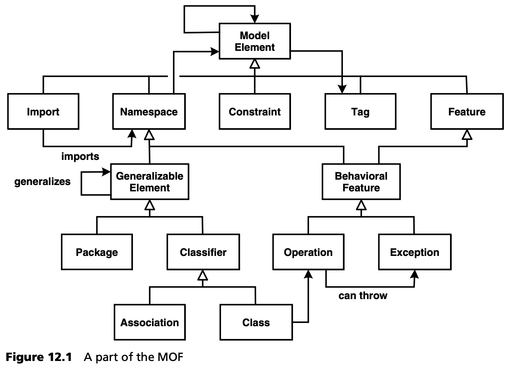

## 12.2 核心概念
本节探讨 MDA 的核心构件。它们是 UML 2.0、元对象设施（Meta Object Facility）、XML 元数据交换（XML Metadata Interchange）、三种模型（PIM/PSM/PDM）、多阶段转换（Multi-Stage Transformations）、动作语言（Action Languages）、各种核心模型、模型标记 (marking) 和可执行的 UML。

### 12.2.1 UML 2.0
从 MDA 的角度看，UML 是核心，因为许多工具都是或将是基于 UML 和配置文件的。为了确保这一点能真正发挥作用，OMG 最近在 UML 2.0 的背景下做了一些调整，我们在这里简单介绍一下<sup>[1](#1)</sup>。

- *基础设施 (Infrastructure)* 。在内部，UML 不再是松散地基于 MOF：完整的 UML 标准文档包含使用 MOF 模型对 UML 语言构造（即元模型）的定义。UML 的定义是正式的。现在应该清楚了，这是 MDSD 的先决条件，特别是在模型转换和代码生成方面。OCL 现在也使用 MOF 作为其元元模型：为此，有必要扩展 MOF。UML 和 OCL 现在基于相同的元元模型。这使得它们在核心概念上是兼容的。
- *扩展、配置文件、定型 (Extension, profiles, stereotypes)* 。profiles 和 stereotypes（即 UML 的原生扩展机制）的定义和部分符号都已重新制定。我们不在这里讨论这个问题，因为第 [6](../ch6/0.md) 章已经解释过了。

尽管从形式上讲，所有基于 MOF 的模型都可以用于 MDA，但如下文提到的 *核心模型 (core models)* 所示，用于 MDA 领域建模的 UML 和相应的配置文件将占主导地位。在 [Fra02](../ref.md#fra02) 中，David Frankel 讨论了 UML 在这方面的优缺点。我们先来看看它的优点：
- 具体语法和抽象语法的分离 
- 可扩展（通过配置文件）
- 与平台无关
- 标准化
- 通过 OCL 可以实现前条件、后条件和不变式（按契约设计<sup>[2](#2)</sup>）

另一方面，UML 1.x 的许多缺点依然存在。随着 UML 2 的推出，很多方面都得到了改进：

- UML 很庞大，分区不佳 (badly partitioned)
- 没有视角 (viewpoints) 的概念支持
- 组件和模式 (patterns) 只得到很少的支持（在 UML 2 中得到改进）
- 关系模型含糊不清
- 配置文件的表达能力有限，或者说元模型的适应手段普遍有限
- UML 和 MOF 没有（尚未）正确地相互协调适配（在 UML 2 中得到改进）
- 图互操作性缺失（在 UML 2 中得到改进）
- OCL 没有抽象语法（在 UML 2 中得到改进）

### 12.2.2 MOF--元对象设施
元对象设施（MOF，见第 [6](../ch6/0.md) 章）是 MDA 的核心。它描述了符合 MDA 的工具所基于或应该基于的元元模型。自定义 DSL 或元模型的定义应使用 MOF 的机制，或通过配置文件扩展 UML，这实际上是一种 “轻量级” 元模型扩展。正如我们已经指出的，UML 是通过 MOF 定义的。MOF 本身使用 UML 的具体语法，这可能会引起混淆<sup>[3](#3)</sup>。我们在本书中多次隐含地使用了 MOF 的机制。每当我们扩展 UML 元模型时，都会自动使用 MOF。

MOF 不仅作为元模型的形式基础非常重要，它对于构建 MDA 工具（如资源库、建模工具、代码生成器等）也有具体的意义。通用工具需要一个坚实的基础：这只能是元元模型。同样，为了保证工具中使用的数据的可移植性，我们必须就元元模型达成一致。因此，对于 OMG 的标准化工作和工具市场来说，完整、正式和内在正确地定义元元模型至关重要。

图 12.1 显示了 MOF 的一部分。



MOF也有一些缺点。我们可以争论以下方面是否应该成为 MOF 的一部分。例如，MOF 在定义 DSL 的具体语法或版本问题上没有提供任何帮助，也没有解决由部分元模型组成元模型的问题。

***基本 MOF 和完整 MOF***

目前已创建了多个 MOF 实现。不过，它们都只实现了 MOF 的相关实用子集。最有影响力的实现可能是 EMF，即 Eclipse Modelling Framework [EMF](../ref.md#emf) 及其 eCore 元元模型。EMF 的实现反过来又对 MOF 2.0 的标准化产生了影响。受此影响，OMG 在 2003 年 MOF 2.0 标准化过程中确定了 MOF 的一个子集，称为基本 (essential) MOF（eMOF），足以满足大多数元元模型实现的需要。因此，EMF 的 eCore 现在是符合 OMG EMOF 标准。您可以在工具一章（第 [11.3.1](../ch11/3.md#1131-eclipse-世界) 节）中找到有关 eCore（以及 EMOF）的更详尽讨论。

因此，与 eMOF 相对应的是 CMOF。它用于更复杂的元模型，如 UML。例如，它结合了通过导入、合并或组合来扩展包的机制。它还结合了更强大的反射功能。

### 12.2.3 XMI
XMI 是 XML Metadata Interchange（XML 元数据交换）的缩写，是 MOF 的 XML 映射，而不只是 UML 的 DTD/schema，通常这是一种错误的说法<sup>[4](#4)</sup>。目前，XMI 是不同 MDA 工具之间实现互操作性的基础，因为（真正的、基于数据库的）MOF 资源库尚未广泛使用。自 2.0 版发布以来，XMI 还允许对图表布局信息进行序列化，这对于建模工具之间进行实用和有用的模型交换（不仅是代码生成）来说是必须的，如果你不想依赖现有工具的自动布局机制的话，通常这种布局机制都很差。

目前，不同工具的 XMI 格式之间仍有许多不兼容之处，这使得建模工具之间的图表交换变得更加复杂。不过，将 XMI 用作代码生成器的基础在实践中并不是一个严重的问题，因为所有流行的生成器都支持各种 XMI 方言的解析器。

XMI 有两种类型。第一种是完全通用的，可以通过通用 DTD 存储所有基于 MOF 的模型。文档结构是在 MOF 层定义的，这导致 XMI 文档变得相当冗长。一个正面的事实是，它可以通用于所有基于 MOF 的模型。不过，它的人工读取能力或对基于 XSLT 的转换的适用性相当有限。

不过，XMI 标准提供了一个选项，即在 MOF 的基础上为特定元模型生成一个 DTD 或 schema。因此，文档只能存储该特定元模型的实例，但生成的文件更加紧凑和具体，因为结构是在元模型级别而不是元元模型级别映射的。由于显而易见的原因，大多数工具都使用第一种方法进行交换。

请注意，作为 MOF 2.0 EMOF 定义的一部分，已经定义了简化的 XMI 映射（XMI 2.1）。这将在未来提供更好的工具间互操作性。

### 12.2.4 PIM/PSM/PDM
OMG 对 MDA 能够表示的有一个具体的概念。OMG 关注的不是软件系统族、领域专家的参与或软件开发的敏捷性，而主要是应用逻辑的平台独立性。由于技术解决方案和业务逻辑会不断快速发展，但又相互独立，因此，能够独立于实现平台来指定应用逻辑（换句话说，能够指定其本质），对于应用逻辑的持久性至关重要。为此，OMG 认为基于 MOF 或 UML 的建模是最佳解决方案，因为它允许通过转换器为不同平台全自动生成实现。平台独立的模型（platform-independent model, PIM）在描述业务逻辑时发挥着核心作用，不会受到技术问题的影响。

可通过模型转换，从 PIM 创建特定平台模型（platform-specific model, PSM）。正如其名称所示，PSM 是针对 J2EE、.NET 或其他实现平台的特定平台模型。进一步的转换可以创建越来越具体的模型，直到最终生成平台的源代码，并通过编译和打包将其转化为可执行工件。

本讨论强调，PIM 和 PSM 都是相对概念。PSM 可能针对 J2EE，但仍然独立于特定的应用服务器。因此，就具体的应用服务器平台而言，它构成了 PIM。

图 12.2 显示了在 MDA 中起核心作用的模型分类法。(参见 [Fra02](../ref.md#fra02) ）。


MDA 中还有一种重要的模型，即平台描述模型（platform description model, PDM）。这是目标平台的元模型。由于模型转换总是被定义为元模型之间的转换规则，因此也必须通过元模型来定义目标平台。源模型无论如何都要使用特定领域的元模型 -- 可能是标准化的核心模型（见下文）。在以架构为中心的 MDSD 中，建模直接建立在目标平台的架构元模型 PDM 上。

### 12.2.5 多阶段转换
在本书描述的示例和最佳实践中，我们在大多数情况下都是通过（PIM）模型生成某个平台的源代码。我们这样做主要是出于实用的原因：目前还不存在以适合日常使用的方式支持大型系统多阶段转换的模型转换工具。

MDA 所追求的目标是通过随后的几次模型到模型转换来获取源代码。如果有合适的工具，这显然是有优势的。第 [11.2.3](../ch11/2.md#1123-模块化转换) 节中的例子说明了这一点，同时也阐明了为什么在 MDA 中要尽可能多地在模型层面上进行工作，并尽可能长时间地将信息以模型的形式保留。转换引擎是基于 MOF 定义的。只要我们处理的是基于 MOF 的元模型，就可以使用这些工具，但一旦我们进入编程的 “低洼地带” ，这些工具就派不上用场了。我们必须通过 MOF 来定义经典编程语言，结果是，与简单模板相比，转换将变得非常复杂。

在某些情况下，有必要手动配置中间产品，以控制其进一步的转换阶段。OMG 将这种配置称为 *模型标记 (model markings)* 。模型标记不能直接在 PIM 中注释，因为这样会有失去平台独立性的风险。出于一致性考虑，不要修改中间模型也是至关重要的。我们建议使用外部模型标记，详见第 [8.3.5](../ch8/3.md#835-外部模型标记) 节。

### 12.2.6 动作语言
在阅读本书的过程中，可能有人会提出这样的反对意见：如今，你无法通过 UML（或其他基于 MOF 的语言）为一个 *完整* 的软件系统建模。这是部分正确的。然而，我们已经证明，只要对领域进行充分的限制，对其概念进行严格的标准化，并定义合适的 DSL，就可以在很大程度上对领域进行建模。当然，许多方面仍未解决或不可行：具体来说，仍缺少一种指定算法行为的方法。

为了解决这个问题，OMG 在 UML 2.0 中定义了动作语义，该语义也可用于其他基于 MOF 的语言。动作语义允许对过程行为进行建模。请注意，OMG 只定义了抽象语法，而不是具体语法。语义是口头描述的。因此，应由工具制造商为标准化语义定义他们自己的文本或图形符号。因此，用文本和图形表示相同的行为是可能的。

动作语义包括以下要素：
- 变量（ *实例句柄, instance handles* ）：分配、读取，也适用于变量集（sets, bags, sequences）
- 常见的算术和逻辑运算
- 顺序编程语言的典型特征，如 *switch、if、for* 、语句、块概念等
- 实例的创建和销毁
- 可通过类似 SQL 的查询来提示类的 *扩展 (extents)*
- 跨关联导航
- 创建链接（关联实例化）和删除链接
- 信号生成，包括参数
- 定义带有输入和输出参数的函数，以及调用这些函数的方法
- 计时器

动作语义不包含类、属性和关系等结构构造。这些已经在模型的结构部分中定义了。动作语义只是定义了 “行为构件”，这些构件只有在与其他（部分）模型连接时才有意义。因此，动作语义段总是与常规 UML 模型的元素相关联，例如，与类的操作或状态机中的 *onEntry* 动作相关联。

下面是一个使用动作语言的简单例子。图 12.3 是类图，它是这个例子的基础。我们使用肯尼迪-卡特（Kennedy Carter）的工具 [iUML](../ref.md#iuml) 中的语法作为动作语义的具体语法。


首先，我们执行一个 “主程序”，它可以处理图 12.3 中的类实例，并创建一个 *Vehicle* 类实例。然后为 *make* 和 *vlaue* 赋值。
```c
myVWBus = create Vehicle with plate = "HDH-GS 142"
myVWBus.make = "Volkswagen"
myVWBus.model = "Transporter T4 TDI"
```
*with* 子句会在对象创建过程中尽早为标识属性赋值（参见 *«id»* 定型），这与 OO 语言中传递参数给构造函数类似。然后，我们可以定义一个 *Person* 的实例，它随后将成为司机。

现在我们可以调用 *drive()* 操作，让司机驾驶车辆。
```c
[actualDriver] = drive[aVehicle] on john
```
当然，还缺少的是 *drive()* 操作的实现。它至少必须实例化关联 *R1*，即在两个相关对象之间创建一个链接。
```c
link this R1 aVehicle
```
这样就在 *Vehicle* 和驾驶员之间建立了双向关联。现在你可以询问汽车当前由谁驾驶了。这与类 *Vehicle* 的 *drive()* 操作的实现相对应。
```c
theCurrentDriver = this.R1."driver"
```
现在我们简要介绍一下查询操作。假设我们要查找系统中的所有个人：
```c
{allPersons} = find-all Person
```
大括号表示 *allPersons* 是一组对象，而不仅仅是一个。也可以限制这种搜索。例如，可以搜索 *Audi* 品牌的所有车辆。
```c
{audis} = find Vehicle where make = "Audi"
```
有人可能会批评说，动作语义只是另一种编程语言。原则上，这种说法是正确的，但它忽略了一点：

- 我们不必处理诸如内存管理、两个 *EntityBean* 实例之间链接的定义或关系键的使用等平台细节。
- 我们在这里处理的是 “语义构件” 。具体的语法可能会有所不同。原则上，传统语言也可以做到这一点，但这并不常见。
- 动作语义完全集成在模型中：最后的例子可以说明这一点。

假设我们处理的是图 12.4 中的简单模型。在右边我们可以看到几行动作语言。


在映射到编程语言的过程中，即在生成执行代码的过程中，会生成以下近似代码：

|行|描述|
|---|---|
| 1 | 创建 *A* 的新实例，创建变量 *a*。 |
| 2 | 创建 *B* 的新实例，创建变量 *b*。 |
| 3 | 现在事情变得更有趣了：属性 *theB* 被赋值 *a* 指向 *b* 的指针。由于关联是双向的，*b.theA* 也会自动指向 *a*。程序员不需要显式编程，生成器可以利用类图中的信息自动实现这一点。 |
| 4  | 由于 *B* 与 *A* 是构成关联的，生成器可以创建代码，在删除 *a* 时删除实例 *b*。 |

生成代码的信息也来自结构图。开发人员只需在 ASL 中编写 *link...* 语句：而可能更为复杂的实现代码则会自动生成。

让我们再次讨论一下动作语义的抽象效果。当然，这种文字表式对其实现没有任何意义。例如，如果相应的系统是用 EJB 实现的，那么生成的代码，与为嵌入式系统生成的代码不同。

### 12.2.7 核心模型
为了尽可能从 MDA 中获益，必须对尽可能多的方面进行标准化。这包括平台（至少在技术层面上已经通过 J2EE、.NET、CORBA 或 Web Services 实现）和转换语言（QVT 的相关内容中已出现）（见第 [10](../ch10/0.md) 章）。为了让用户能够独立于平台对应用逻辑进行建模，还需要对特定领域的元模型进行标准化。这样，不仅可以实现转换语言的标准化，还可以在 *转换库 (transformation libraries)* 中获取可重复使用的转换规则。开发人员通过标准化的 UML 配置文件或相应领域的元模型对其应用进行建模，商业或开源转换模块则从中生成特定于平台的代码。

这些标准化的元模型在 MDA 中被 OMG 称为 *核心模型 (core models)* 。目前正在开发的各种核心模型<sup>[5](#5)</sup> 都被定义为 UML 配置文件。其中包括:

- *UML profile for CORBA* ，定义了 PIM 到 CORBA 的映射。
- *UML profile for CCM* ，定义了与 CCM (CORBA 组件模型)  的映射。
- *UML profile for EDOC* ，定义了分布式企业系统 PIM 的元模型。
- *UML profile for EAI* ，定义了 EAI 应用和其他松散耦合系统的 PIM 元模型。
- *UML profile for Quality of Service (QoS) and Fault Tolerance* ，用于实时和安全关键型系统。
- *UML profile for Schedulability, Performance and Time* ，为可定量分析其实时属性的 PIM 定义了元模型。
- *UML Testing Profile* ，支持基于 MDA 系统的自动测试。

各种配置文件的现状可查阅 [OMGP](../ref.md#omgp) 。

### 12.2.8 控制 PIM 到 PSM 的转换
在某些情况下，转换器无法转换一个模型，因为源模型中的信息不够具体。例如，目标元模型可以提供实现源元模型构造的不同方法。在 [Fra02](../ref.md#fra02) 一文中，David Frankel 描述了在这种情况下的四种替代方法：

- 您可以在转换中硬编码，即总是使用特定的替代方案。
- 开发人员可以手动定义使用哪种替代方案。
- 开发人员可以直接在 PIM 中说明哪些替代方案应作为 *模型标记 (model markings)* 在 PSM 中使用（见下文）。
- 转换器决定使用哪种替代方案的决策标准可以抽象到 PIM 中（稍后详述）。

***模型标记***

MDA 提出了 *模型标记(model markings)* 的概念。模型标记是转换的源模型中控制转换的附加信息。这些注释通常取决于目标元模型。图 12.5 展示了这一原理。


这里，J2EE 再次作为一个例子。在 PIM 中，我们定义了一个名为 *Account* 的 *BusinessEntity* 。在 J2EE 中，*BusinessEntity*  可以用两种不同的方式表示：一种是作为 *EntityBean*，另一种是作为处理数据传输对象的 *Stateless Session Bean* 。我们可以如图 12.6 所示标记源模型。


重要的是要确保源模型本身不被改变：相反，要定义一个包含附加信息的 “reference copy”。图 12.7 举例说明了这一想法。


标记的 PIM 只包含原始 PIM 中应标记的模型元素，或者说，只包含附加标记本身。这意味着，如果 PIM 发生变化，则无需手动调整已标记的 PIM<sup>[6](#6)</sup> 。

***PIM 中的判定标准***

如果您愿意接受其他后果，还有一种方法可以让您在大部分情况下不使用标记。这种机制需要对源元模型进行扩展，以便在模型中提供足够的信息，让生成器在不同的备选方案中做出选择。图 12.8 展示了这种情况：


现在，在 J2EE 中的哪种情况下使用哪种实现方案的决定权可以交给 J2EE 转换。当然，元模型必须扩展，而这并非总是可行的。不过，元模型的扩展并不是使用目标元模型的概念，而是使用可被转换器使用的一般信息。这是对源元模型的丰富，而不是用目标元模型的特定构造对源元模型进行 “污染”。

### 12.2.9 可执行的 UML
*可执行 UML* 这个术语在 MDA 中经常听到。这不是一个正式的标准，而是各种努力的总称，这些努力的目标都是把 UML 确立为完全成熟的编程语言。为此，UML 必须清除所有冗余和含糊之处，从而实现 UML 图表的可执行性：建模语言（这里是指 UML）的元模型越小，就越容易为其实现编译器或解释器。可执行 UML 的另一个必要成分是动作语言（见第 [12.2.6](#1226-动作语言) 节），它是定义软件系统的完整实现所必需的。

重要的是要明白，与 MDSD 方法相反，可执行 UML 并 *不是 UML 的特定领域配置文件* <sup>[7](#7)</sup> 。其目的是定义一种通用的、基于 UML 的编程语言。

有关可执行 UML 的更多信息，请参阅 Steve Mellor 的书 [Mel02](../ref.md#mel02) 或 Kennedy Carter 的 [iUML](../ref.md#iuml) 的文档部分。

--- 
#### 1
实际增加的内容比我们在这里描述的要多得多。这里我们只关注与 MDA 直接相关的方面。

#### 2
契约设计（Design by contract） 是计算机科学中的一个著名术语，它描述了这样一种思想：操作定义了它们在调用时期望为真的内容，并定义了它们在执行后保证为真的内容。

#### 3
更确切地说，自 UML 2.0 引入以来，UML 的核心（即分类器包）可应用于所有元级别。因此，它也构成了 MOF 的核心。

#### 4
通常，XMI 专门用于 UML 模型的序列化。

#### 5
如果你觉得这看起来很熟悉，那可能是因为在 MDA 引入之前，已经有人尝试过将某些领域的 profiles 标准化。

#### 6
这说明建模工具提供相应的强大资源库和功能对 MDA 有多么重要。当今的大多数建模工具还没有达到这个水平。

#### 7
除非您将图灵可计算函数视为一个领域。
