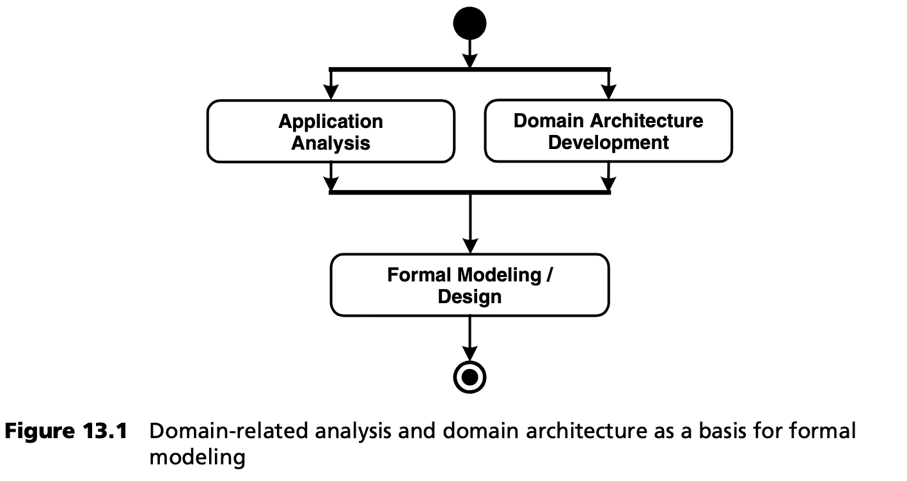
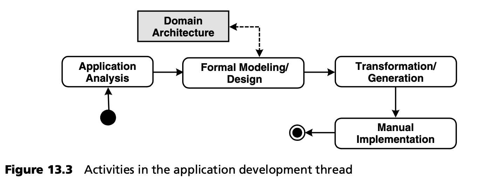

## 13.2 应用程序和领域架构开发的分离

### 13.2.1 基本原理
在第 [3](../ch3/0.md) 章的案例研究中，我们看到了与领域相关的应用程序开发，与技术基础架构分离所带来的优势。我们可以将软件架构形式化，并提供完全独立于具体应用的生成支持。在我们的例子中，我们显然处理的是以架构为中心的情况：领域是电子商务应用的软件基础架构。我们开发了一个领域架构，该架构具有相应的以架构为中心的 DSL（UML 配置文件）、相应的平台（J2EE 和 Struts）以及合适的生成器模板。如果我们现在对这一原则进行概括，就会得到图 13.1。

MDSD 背后的一个最重要基本理念是认识到，形式化建模步骤蕴含着两个相互关联的先决条件，但这些条件在很大程度上可以并行开发：

- 必须知道具体应用迭代或增量的功能/专业要求。
- 必须定义用于建模的正式语言（DSL）。此外，为了实现进一步自动处理，语言必须以转换规则的形式与具体的MDSD平台绑定。这就是 *领域架构 (domain architecture)* 一词的含义（第 [4](../ch4/0.md) 章）。

正如其名称所示，领域架构规范化并支持一个领域。原则上，该领域独立于单个应用程序（独特的产品），或者换句话说，它涵盖了一个软件系统族。

图 13.1 中的活动图不应被误解为瀑布式流程。它主要展示了每次迭代所基于的基本原则，与迭代的权重无关。

形式建模的作用是将具体应用的概念与领域架构提供的概念联系起来，更确切地说，是用领域架构提供的语言（DSL）来表达功能。然后，在生成器的支持下转换形式模型，并将其映射到平台上。我们已经了解了以架构为中心的情况，第 [16](../ch16/0.md) 章给出了嵌入式系统领域的一个例子。在保险领域，DSL 可以包含与保险领域相关的构造，例如支持保险产品的有效建模。因此，平台将由预制的特定领域组件组成，如 *关税计算器 (tariff calculator)* 或 *合同数据录入 (contract data entry)* ，转换将从保险产品模型中生成特定领域组件的配置，然后在运行时对其进行评估 (evaluated)。这样，一个保险应用就可以 100% 自动地从模型中创建出来。与以架构为中心的情况不同，这种使用情况不需要任何手动编码。

根据上文介绍的基本原则，我们还应在流程和组织层面，将应用程序和领域架构开发分离开来，以最大限度地发挥积极作用。因此，我们建议将（领域）架构开发主线与应用开发主线分开。

### 13.2.2 领域架构开发主线
有几种产出物和活动对于创建领域架构是必需的或有帮助的。MDSD 架构开发主线旨在实现可重用性以及提高质量和效率。从过程的角度来看，它是 MDSD 的核心环节。因此，如上一节所述，图 13.2 首先放大了 *创建领域架构* 的活动。

图中显示的分区将活动分为 *领域*、*转换* 和 *平台* 三类。在每个类别中，都会产生领域架构的产出物（浅灰色显示）。这里只显示了具有最重要依赖关系的正常情况，因为根据我们的经验，将其他所有情况都包括在内会掩盖基本问题。这里尤其没有显示迭代周期。

在项目开始时，图 13.2 所示阶段的完整迭代可能需要数周时间，根据扩展或修改的范围，在项目过程中可能只需要几个小时甚至几分钟。在项目启动时，可能已经存在部分领域架构，也可能会创建现有领域架构的衍生架构。

在项目开始阶段，我们建议设置一个 *详细设计阶段 (elaboration phase)* ，在该阶段中，架构开发主线将首先完整运行，作为项目的一种引导活动。如果项目是在熟悉的领域进行，例如，如果项目是现有软件系统族的一部分，则可以省略这一阶段。

下文将详细列出最重要的步骤（操作/活动）和结果类型。

***原型 (Prototyping)***

在项目开始时，通常已经存在一个应该使用的平台，如 J2EE 或特定框架。MDSD 架构开发主线的目标之一就是将这些产出物与语义丰富、特定领域的 MDSD 平台合并（第 [7.6](../ch7/6.md) 节）。为此，首先通过原型进行 *概念验证 (proof of concept)* 以积累经验始终是明智之举。此外，该原型也可被视为迈向 MDSD 平台的第一步。

***开发平台 (Developing the Platform)***

我们在第 [4](../ch4/0.md) 章中定义了 *MDSD 平台* 一词，并在第 [7](../ch7/0.md) 章中解释了其构造方面。*运行时系统 (runtime system)* 一词是其同义词。运行时系统组件是重复使用的理想候选组件，甚至可以跨越软件系统族的界限。

正如我们所看到的，平台是生成代码和非生成代码的基础，也是保持转换简单的基础。领域架构的生成部分依赖于所使用的运行时系统组件（平台），但反之则不然。

平台的开发也应迭代进行。在这种情况下，重构技术（见 [Fow99](../ref.md#fow99) ）可以得到有效应用。

还应注意的是，平台与生成代码之间的边界，可能会在领域架构的演化过程中发生变化，无论是哪个方向。第 [7](../ch7/0.md) 章阐述了这方面的标准。

***创建参考实现 (Creating a Reference Implementation)***

*参考实现* 只是 MDSD 架构开发主线的一个中间结果，但在创建领域架构时却非常重要。

参考实现不应被误解为一个简单、孤立的示例，必要时人们可以从中获得实现建议。它可以根据原型创建，但有一个更重要的目的：它与参考模型/设计一起，展示了属于该领域的 DSL 的应用和实现。这个由两部分组成的参考模型展示了在相应平台上从模型到实现的过渡。对于一个新的软件系统族，首先要手动创建参考实现。之后，再从中导出转换。然后，参考模型的生成实现，可能加上手动编程的领域逻辑，必须形成一个完整的、可执行的参考实现。

参考实现的全部附加值只能从参考实现与参考模型（也就是 DSL，见下文）之间的相互作用中获得。参考实现 *本身 (per se)* 的具体功能内容并不重要，重要的是领域。然而，通常情况下，一个或多或少合理的用例都会得到实现，哪怕只是以一种极简主义的形式。DSL 结构及其组合的充分覆盖更为重要。与此同时，参考实现还展示了 MDSD 平台及其 API 的使用。

对于一个新的软件系统族，参考实现首先是完全手工创建的，但一旦有了自动转换，参考实现就会简化为手工编程的领域逻辑（如果存在的话）。应用程序的剩余部分可以从参考模型中生成出来。

如果您已经在某个特定领域拥有大量应用程序，并希望转而采用模型驱动开发流程，那么只要实现结构良好，也可以从现有应用程序中提取领域架构。然而，典型的遗留应用程序往往不是这种情况。

还需要注意的是，领域架构的演变，尤其是引导的早期阶段（如 DSL 定义和稳定），通常会对参考实现产生影响，也许还会对平台产生影响。这在迭代增量式软件开发中是完全正常的：严格的瀑布模型很可能会适得其反。

***领域分析/设计 (Domain Analysis/Design)***

这项活动的主要目的是找到领域的元模型和合适、具体的 DSL。这里我们只列出构建 DSL 的最佳实践。

以 *架构为中心* 的 DSL 也称为 *设计语言*。使用 UML 作为基础是这种设计语言的典型特征（但不是强制性的），第 [3](../ch3/0.md) 章中的案例研究深入地说明了这一点。不过，UML 在某些方面是完全不可用的，例如图形用户界面布局的建模，因此可能需要使用另一种符号。最终，具体语法的重要性总是低于抽象语法（见第 [4](../ch4/0.md) 章和第 [11.2.2](../ch11/2.md#1122-忽略具体语法) 节）。

在设计任何 DSL 时都应遵守以下规则：
- DSL 应尽可能抽象，不包含任何构成 MDSD 平台实现细节的技术术语。例如，使用 *EntityObject* 而非 *EntityBean* 作为定型。这一措施可使模型的技术实现只在平台绑定的情况下才能被识别。这就简化了后续迁移或其他架构变更。这样的 DSL 也可以在各种软件系统族中重复使用。我们有时直观地将这种模型称为平台无关模型（PIM），但这种表述是相对的（见第 [4](../ch4/0.md) 章）：通常，模型与 J2EE 等行业标准平台 *无关* ，但 *依赖* 于领域架构的 MDSD 平台概念，因为 DSL 的作用正是在模型层面使用这些概念。
- 如果可能，DSL 应该用语言元素涵盖领域的所有相关概念。理想情况下，参考实现的所有可实现的代码片段都应被 DSL 的构造所覆盖。我们的案例研究就是一个很好的例子：«Entity», «ProcessObject», «Presentation», «SystemUseCase», «Activity
Controller», «ControllerState» 等定型精确地命名并涵盖了我们示例领域架构的架构概念。
- DSL 应尽可能紧凑，没有任何冗余。它还可以拥有动态结构，例如以活动图或状态图的形式呈现业务流程和控制器逻辑。
- DSL 必须使模型的良好格式可验证。必须保证排除基础语言提供的所有建模符号，以防这些符号对 DSL 不合法，特别是如果 DSL 是一种更通用语言的专用语言，如作为 UML 专用语言的 UML 配置文件。

在构思 DSL 时，架构师不可避免地要划定生成代码和领域逻辑之间的分界线，从而确定开发人员的自由度。一种极端的做法是，试图将 DSL 扩展到不再需要手工编程的程度（见第 [4](../ch4/0.md) 章和第 [7](../ch7/0.md) 章）。如今，在以架构为中心的开发背景下，对于典型的业务应用来说，这种方法（如果极端应用）既不实用，也没有用处。

这里的关键问题是，以架构为中心的 DSL 应该涵盖哪些实现方面，哪些不应该。以下问题可以作为指南：
- 参考实现是否具有尚未生成的具有复制粘贴特性的代码片段？
- 这些方面的建模是否简单、紧凑，或者是否需要比手工编码更多的努力和更全面的建模？

这项重要评估需要一定的经验和对相关主题的敏锐洞察力。

DSL 必须记录在案才能使用。这包括以下几个方面：
- 具体语法，例如 UML 配置文件或 XML schema。
- 抽象语法，例如 MOF 图（见第 [6](../ch6/0.md) 章）。
- 静态语义，即约束或建模规则：哪些构造是不允许的，哪些是必须的。如果是基于 UML 的建模语言，这是配置文件的一部分（见第 [3](../ch3/0.md) 章）。
- 语义 -- 语言构造的文本意义。语义由参考实现和转换规则正式定义，因此其定义是针对具体平台的。为避免出现这种情况，并提高其可重用性，语义应尽可能以一般形式描述，使用架构概念而不是平台本身。
- 模型示例，例如参考设计（见下一节）

定义适当的建模语言无疑是 MDSD 面临的最大挑战之一。第 [13.5](../ch13/5.md) 节提供了一些具体的提示。需要一些实践经验，或现有的基础，如本书第一个案例研究中的 UML 简介。从这一点出发，建模语言可以不断发展。例如，通常需要一段时间才能注意到某个建模构造的原始设计不够抽象，需要加以泛化。因此，重构（Refactoring）在这个元层次上是一个强有力的盟友。诚然，抽象语法（实际语言结构）和语义的 *根本性 (fundamental)* 变化，会对现有的转换规则带来巨大的改变。相比之下，语言 *扩展 (extensions)* 则是非关键的。在详细设计阶段，应充分重视 DSL，只有当参考实现和参考设计协调一致时，才能导出转换规则。

通常，建模语言不是在真空中产生的。要想了解所选结构是否适当和符合人体工程学，就必须在实践中使用这种语言。参考设计就可以达到这一目的。

***创建参考模型/设计 (Creating the Reference Model/Design)***

*参考模型* 是 DSL 的一个实例，它通过 DSL 表达了一个领域示例。

参考模型与参考实现之间的相互作用非常重要：参考模型和参考实现共同体现了 DSL 的语法和语义，从而使领域架构的概念具体化、细节化。

***记录编程模型 (Documenting the Programming Model)***

只有当领域架构包含 “语义间隙 (semantic gaps)” 时，编程模型的定义才有意义，这意味着通过模型转换产生了代码框架，应用开发人员必须用编程语言对其进行补充，才能创建可运行的应用程序。

我们在第 [7](../ch7/0.md) 章中确定了 *编程模型* 这一术语。例如，CORBA 定义了一种抽象接口定义语言 (IDL)，并与 C++ 和 Java 等各种编程语言进行了映射。相应语言映射的编程模型定义了 IDL 结构映射到语言结构（如类、属性和方法）的命名约定。IDL 编译器（生成器）遵守这些约定，生成相应的签名和骨架。根据 IDL 定义创建的 API ，允许应用开发人员对应用逻辑进行编程。编程模型定义了特定的习语 (idioms) 和模式，这些习语和模式描述了如何正确处理各自的架构 -- 编译器或运行时系统无法自动检查所有规则。

在 MDSD 中，编程模型描述了应用开发人员对领域架构的看法。，或者更准确地说，描述了转换或生成的代码和平台，以及如何正确处理它们的规则。目标之一是让开发人员清楚地了解，哪些与编程语言相关的构件是从与他们相关的 DSL 构造中生成的。例如，模型中的关联可能意味着一组访问操作，如实现层面上的 *getElementAt()、addElement()、removeElement()* 等。
从开发人员的角度来看，实现方式并不重要：他们只需要签名。这些签名将构成 DSL 关联结构的编程模型。

编程模型很容易以表格的形式记录下来。表格中除了 DSL 的相应结构外，还包含参考模型和参考实现的适当摘录。对于编程模型是否需要显式文档的看法各不相同，但以MDSD转换和平台 API 形式进行的明确定义是必要的。参考实现构成 *隐式 (implicit)* 文档。但是，如果编程模型中的 “要做” 和 “不要做” 无法通过工具来执行或控制，那么显式文档就是必须的。

事实证明，以演练的形式向开发人员解释如何使用 DSL 开发具体应用的教程是最合适的。这种教程应涵盖 DSL 以及编程模型的其他方面，包括需要手动编写的代码，或如何操作/集成生成工具。

初始编程模型及其文档通常是在详细设计阶段 (elaboration phase) 构建的。当然，编程模型也会不断迭代改进。

***衍生转换 (Deriving Transformations)***

这项工作将 DSL 与平台和编程模型的映射形式化，以便自动转换可以将给定的应用模型转换为实现或骨架。

在我们的案例研究中，这一步创建了一组生成器模板。这些模板是在参考模型的帮助下从参考实现中衍生出来的。第 [3](../ch3/0.md) 章案例研究中使用的生成器框架，将部分元编程转移到了 DSL 元模型（用 Java 实现的）的创建上。从流程的角度来看，这种分离只是一种实现细节，因此无关紧要。

如果应用的领域逻辑不能完全由 DSL 来表达，那么就需要将生成的代码和非生成的代码整合在一起的技术（见第 [7](../ch7/0.md) 章）。

***创建 DSL 编辑器 (Creating a DSL Editor)***

并不是所有的 DSL 都是 UML 配置文件，因此可以使用标准工具，但效果各不相同。在高度专业化的领域中，通常的做法是创建一个特定的工具来定义符合 DSL 的模型，例如进一步提高 MDSD 方法的人机工程学和效率。这就涉及到成本价值比的问题，只能根据具体情况来回答。这个问题将在第 [13.5](../ch13/5.md) 节中进一步讨论。

### 13.2.3 应用程序开发主线
本节将从应用开发人员的角度来讨论如何使用给定的领域架构（见图 13.3）。(我们将其视为一种角色）。

这里显示的也是没有迭代循环的简单、正常情况。一个迭代周期可能需要几天，也可能只需要几分钟，这取决于单个步骤的强度。

***形式建模/设计 (Formal Modeling/Design)***

在这一步骤中，分析和架构两条主线交汇：功能需求现在用领域架构语言（DSL）来表达。在这种情况下，参考模型起着方向指南 (orientation guide) 的作用。这一步是信息和洞察力的真正收获，因此无法实现自动化。

在此应建立一个与架构开发主线的反馈循环，因为在领域架构的早期阶段，DSL 中的缺陷或错误经常被发现。同样典型的情况是，在应用程序开发过程中发现了进一步自动化的潜力，这将导致 DSL 的扩展甚至通用化。

***生成 (Generation)***

这一步可以纯粹机械地执行。与正式模型相比，不会产生任何信息增益：通过领域架构的转换，正式模型会自动转换成适合 MDSD 平台的形式。在此过程中，手动编写的领域逻辑的集成点，可能会出现在定义的位置。这可以是受保护区域，其内容在迭代再生过程中保持不变，也可以是实现框架委托 (framework delegates) 的实现类（第 [8.2.6](../ch8/2.md#826-生成代码与非生成代码的分离) 节）。

***手动实现 (Manual Implementation)***

DSL 中 *无法* 表达的领域逻辑必须在生成后手动添加。在我们的案例研究中，这些正是实现骨架中受保护区域的内容。

领域架构的影响甚至可能在实现过程中发生。项目组织必须允许必要的反馈循环。

***组织方面 (Organizational Aspects)***

理想情况下，应用开发和领域架构开发之间的分离，不仅需要合适的过程结构，还需要调整团队、项目或公司的组织结构。第 [19](../ch19/0.md) 章和第 [15](../ch15/0.md) 章将讨论这些问题。
