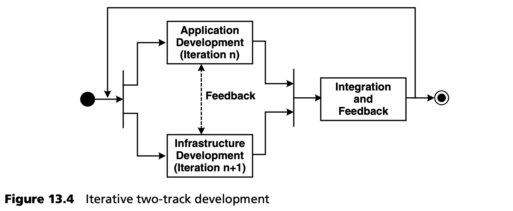

## 13.3 双轨迭代开发
我们已经讨论了应用程序开发和领域架构开发之间的角色和产出物分离。本节将讨论两个主线的同步问题。显然，应用程序开发与领域架构开发之间存在着依赖关系--就像你可能会依赖于你所使用的框架的开发一样。从需求管理的角度来看，这意味着应用程序开发团队在领域架构开发中扮演着客户的角色。

在开发领域架构时，应同时根据该领域架构开发至少一个应用程序，就像开发一个单独的项目一样。在实践中，这意味着在一次迭代中，应用程序开发人员始终使用上次迭代中开发的领域架构，这样他们就始终比应用程序开发人员领先一次迭代。确保应用程序开发人员始终向领域架构开发人员提供反馈意见

新版本的领域架构总是在迭代开始时进行整合。为了在开发过程中达到足够的敏捷性，迭代时间最长不应超过 4 到 6 周。理想情况下，为了简化问题，我们建议为所有迭代设定一个固定的时间框架（时间盒）。这样，团队就会习惯有规律的开发节奏。

请注意，基于同步时间框的增量迭代流程并不排除在进入迭代周期之前进行领域分析。恰恰相反，在进入迭代循环之前，需要充分了解领域的基本概念。一旦应用程序开发开始，进一步的领域分析就会迭代进行--作为架构开发主线的一部分，而架构开发主线现在已被委派到自己的项目中。

基础架构团队（领域架构开发人员）有时会倾向于采用有趣的技术来打动世界--当然是出于好意--采用一些新的 “灵丹妙药”。成立一个由应用程序开发团队代表组成的架构小组（见第 19 章），可以最有效地降低这种风险。这样的小组有权通过迭代之间的范围交易(scope trading) 来决定基础架构开发的功能和特性，并通过（领域架构）迭代的验证来决定基础架构功能的验收。这就保证了所开发的领域架构能为应用程序开发带来真正的附加值，并为应用程序开发人员的日常工作提供实际支持。

固定预算的时间框、范围交易和迭代验证是支持迭代需求管理的敏捷技术，与双轨迭代开发相结合，对 MDSD 特别有帮助。在这里，我们只想用几句话总结一下基本思想，因为这些主题原则上与 MDSD 无关。

每个时间段都有固定的预算。每次迭代开始时，都会在范围交易研讨会上与利益相关者（如客户和最终用户）协商迭代的功能和优先事项。出于风险最小化的考虑，还必须考虑架构方面的问题。时间框预算不得超支。在时限内，功能集保持不变，这样开发人员就能实现交付软件的目标，并在时限结束时进行验证。利益相关者在迭代结束时进行的验证将决定哪些功能符合要求，哪些功能必须重新设计。在此期间确认的新需求将与未满足的需求一样被重新排序。

有关这些主题的更多资料，请访问网站 http://www.mdsd.info。

在 MDSD 的背景下，这些实践尤其有助于在应用开发和领域架构开发之间建立一个有效的反馈环路。在这种情况下，应用程序开发人员可以作为领域架构开发中范围交易利益相关者的代表团队。
