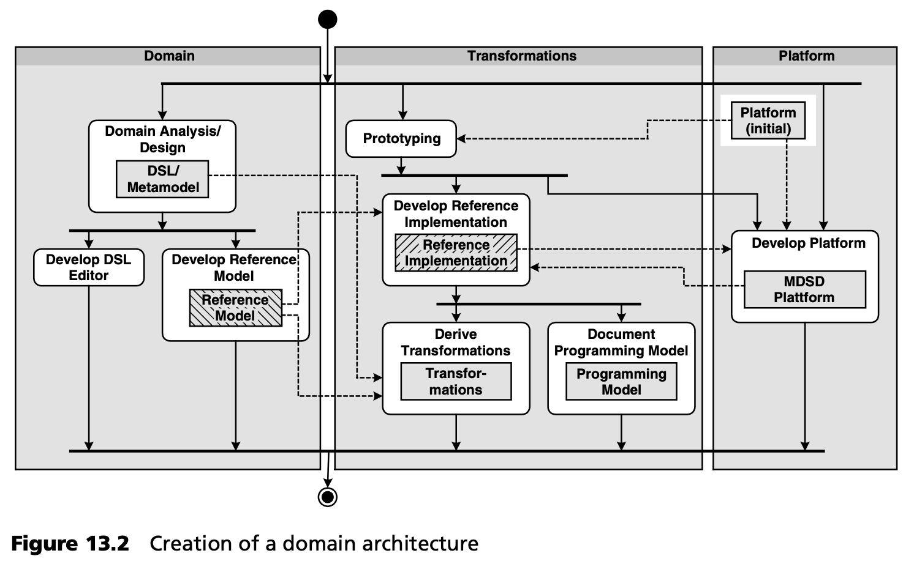
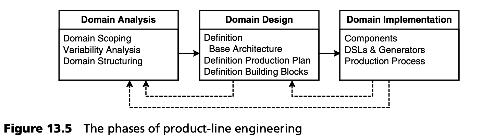
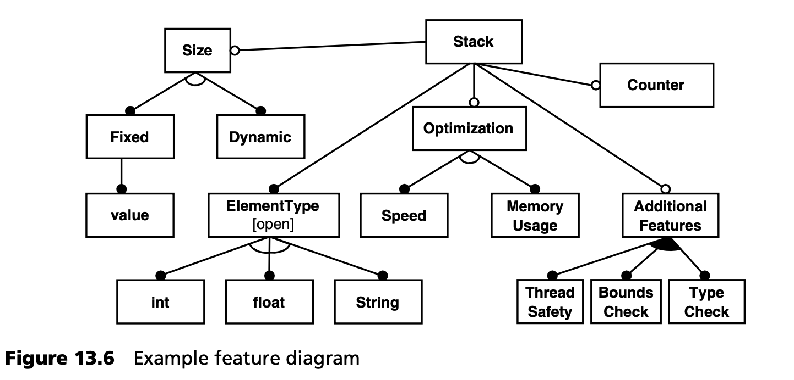

## 13.5 产品线工程
产品线工程 (Product-line engineering, PLE) 涉及对领域进行系统分析，并涵盖软件产品线的设计。其目标是在软件系统开发过程中充分利用自动化和可重用性的潜力。因此，作为一种分析方法，产品线工程与 MDSD 无缝结合。

换句话说，它为图 13.2 中介绍的领域架构开发主线中，*domain* 部分的所有活动提供了坚实的背景。

对 PLE 的全面讨论将超出本书的范围，因此我们仅介绍其基本原理，并解释它们如何与 MDSD 相结合。本章末尾提供了一份全面的进一步阅读清单。我们将在本书 [第四部分](../part4.md) 讨论产品线工程的经济和组织方面。

### 13.5.1 软件系统族和产品线
第 [4](../ch4/0.md) 章简要定义了 *软件系统族 (software system family)* 和 *产品线 (product line)* 这两个关键术语。

软件系统族的原始定义如下：

*我们认为，研究某个程序集时，首先研究该集合的共同属性，然后确定各成员的特殊属性，当这种研究对程序集是有意义的，此时该集合中的程序可构成一个程序族。Par76](../ref.md#par76)*

每当开发出一系列具有相关共同属性的系统 --在这里通常称为 *产品 (products)* -- 时，我们就面临软件系统族了。在 MDSD 的背景下，这些属性被整合到领域架构中。这意味着这些共性可以是基础结构性的，也可以是架构性的，还可以是功能性/专业性的，具体取决于领域的性质。

另一方面，产品线由一组功能相关且针对共同目标市场的产品组成：其组织结构是针对特定客户群体的。理想情况下，产品线是通过软件系统族来实现的。

### 13.5.2 融入 MDSD 流程
让我们来看看上述描述的开发过程。分析活动在各个环节中出现，我们已对其进行了系统化整理。这些环节包括：

- 所开发软件的领域定义和边界。
- 定义该领域最重要的核心概念。
- 分析领域软件系统之间的共性和差异，从而...
- 应用架构与领域架构的分离。
- 定义 MDSD 平台最重要的基本组件（其解决方案空间）。
- 定义软件系统族的生产流程。

产品线工程为软件系统族的系统重用提供了方法论基础。

MDSD 可以被视为产品线工程的一种实现技术。同样，产品线工程也可以看作是 MDSD 的一种分析方法。产品线工程实践可以而且应该以迭代和增量的方式使用： 产品线工程不应被视为 MDSD 的一个单独的前期阶段，而应被视为一种辅助方法，尽管它在 MDSD 项目的早期阶段肯定会非常突出。

### 13.5.3 方法论
产品线工程流程包括三个阶段 -- 见图 13.5。我们将在下文中加以说明。

***领域分析***

领域分析的第一步是领域范围界定。这里要确定领域的边界。例如，如果我们考虑的是汽车发动机控制器领域，那么就必须确定该领域是否只包括汽油发动机，还是也适用于柴油发动机；是否只用于个人车辆，还是也适用于卡车。这一点很重要，原因有二：

- 必须排除那些差异过大、无法合理映射到一个系列中的事物，以便实现一致性。这是一种风险最小化策略。
- 需求不明确会导致在项目过程中不断进行讨论。这并不意味着禁止迭代需求管理，而只是说在任何时候都应明确定义需求（这里指的是范围）。

这也解释了为什么这种方法主要适用于成熟领域：如果还不了解领域产品之间的差异，就无法做出必要的决策[2](#2)。

让我们回到第 [3](../ch3/0.md) 章的第一个案例研究。当时的领域是 “电子商务软件的应用架构” 。汽车共享应用就是该领域的产物。如果您现在开始通过参考实现进行架构引导，毫无疑问，只有架构师已经掌握了分层、典型 J2EE 模式、MVC 结构、声明式流程控制等方面的知识，您才能成功。由于这些知识在开发人员中相当普遍，因此可以说这是一个 “成熟” 的领域。不过，在项目开始时，没有必要了解架构模式的具体实现。设计语言（UML 配置文件）在一定程度上可以在项目过程中进一步发展（见第 [3](../ch3/0.md) 章）。最值得注意的是，它可以很容易地扩展。

有多种方法可以了解家族中离散产品之间的差异，并系统地记录这些差异。其中一种强大的方法源自 FODA 方法 [FODA](../ref.md#foda) ，其名称为 *特征建模 (feature modeling)* [EC00](../ref.md#ec00) 。

特征模型用特征图来表示，显示软件系统族的组成产品可以或必须具备的特征。特征模型是一种分层结构，其中每个特征都可以包含子特征。这些子特性可以是特定产品的必备特性、可选特性、替代特性或 *n-of-m* 特性。图 13.6 阐明了这些术语，显示了系统族 *stack* 的特征图（非常简化）。

图中描述了每个 stack 都必须有一个元素类型：“必须” 由填满的圆圈表示，它是一个强制性特征。它可以是 *int、float* 或 *string* 类型。*ElementType-int*, *ElementType-float* 和 *ElementType-string* 关系之间的开放弧线可以识别这种 *1-of-n* 关系，也称为 *替代关系 (alternative)* 。stack 的 *size* 可以是固定的（这意味着你必须指定一个大小），也可以是动态适应的。stack 可以有一个静态 *counter* ，用一个空圈表示。如果没有，每次调用 *size()* 时都会重新计算堆栈大小。其他特性包括线程安全、边界检查和类型安全。这些特性中的一个或多个可以包含在一个产品中（*n-of-m* 关系，如填充弧所示）。此外，（应用的）实现既可以针对速度进行优化，也可以针对内存消耗进行优化。

因此，图 13.6 描述了系统族 *stack* 成员的 “配置空间”。离散成员必须由这些特征的有效组合构建而成，例如
- 动态大小，*ElementType*: int、计数器、线程安全
- 静态大小，值为 20，*ElementType*：string
- 动态大小，速度优化，边界检查

除了从图形符号中可见的规范外，特征模型还可以包含更多信息，如特征的特定组合（宏）名称、子特征的多重性、特征在实现中的优先级、受特征影响的利益相关者等。此外，还可以定义仅用视觉符号无法表达的其他约束条件。实践证明，可以在很大程度上指定以下附加约束条件：
- *Requires* 。一个特定的特征必然需要另一个功能。
- *Excludes* 。一个特征的存在禁止另一个特征的同时存在。
- *Recommends* 。*requires* 的温和变体。一个特定的特征使得使用另一个特征成为明智之举。
- *Discourages* 。*excludes* 的温和变体。不应同时使用两个特征。

下面以两种优化特征为例进行说明：
- 速度优化：*requires* 计数器，*requires* 固定大小，*discourages* 线程安全，*discourages* 边界检查。
- 内存使用优化：*requires* 动态大小，*discourages* 使用计数器。

这种方法和符号的有趣之处在于，它们对特征的后续实现只字未提。如果在这一阶段已经使用 UML 对系统族进行了建模，那么在开发初期就必须对继承、泛化类型、关联等做出决定。然而，这在领域分析中既没有必要，也没有帮助。此时，我们感兴趣的只是分析软件系统族产品在概念上的共性和差异。至于以后如何实现这些差异，则要在设计阶段确定。

图 13.6 所示的特征甚至可能属于两个根本不同的类别，而特征模型并不能将其区分开来：

- 经典的组件功能定义了功能模块的存在与否，即产品是否拥有某个子系统/模块。
- 与此相反，方面特征是指那些无法以组件形式实现的特征，例如 “性能优化” 或 “代码大小优化” 特征。这些特征日后可能会影响系统中的不同点，并导致不同的组件以另一种方式实现。

特征图可以同时包含两种类型的特征，而方面特征则很难用 UML 表达。

在这一阶段，定义特征之间的依赖关系非常重要。一个产品可能只有在同时具有某些其他特征时才具有某些特征。当然，也有可能出现相反的情况 -- 某些特征相互排斥。这就形成了在构建产品时需要做出决策的有序序列。这是定义下一步生产过程的关键。在没有明确指定某些特征的情况下，定义有意义的默认值也同样重要。

您可以在第 [16](../ch16/0.md) 章的第二个案例研究中找到更多特征模型的例子。

***领域设计与实现***

软件结构的定义是领域设计的一个方面。首先要以平台的形式实现领域产品的共同特征。由于这些共同特征对于所有产品都是相同的，因此没有必要以任何方式来实现它们：它们构成了共同目标架构的基础。

对于可变特征 --即不同产品之间存在差异的特征-- 我们必须决定何时必须对某特性进行 *绑定 (bound)* ，也就是决定支持或反对产品的某些特性的时间点。有多种选择：

- *在源代码层面* 。在这里，支持或反对某个特征的决定是在编程过程中做出的，也就是说，它是硬连接到源代码中的。
- *在编译时* 。有些决定可以留给编译器来做，如重载函数、预处理器、代码/切面编织器 (code/aspect weaver)。
- *在链接时* 。链接器可通过绑定一个或另一个库来配置产品，例如 makefile 是否静态绑定特定库。
- *在安装时* 。对于包含显式部署步骤的产品，通常仍可进行一些配置。例如，J2EE 提供了在安装过程中通过部署描述符调整配置的选项。
- *在加载时* 。您也可以在应用加载时进行干预。动态链接库就是一个例子，例如，可以选择加载以不同方式实现相同功能的不同动态链接库。
- *在运行时* 。最后，您还可以在运行时做出决定，例如多态性、Java 中的动态类加载、解释的配置参数。

所有这些选项各有利弊：
- *性能* 。通常情况下，直接在代码中实现的特征的性能要明显优于运行时动态做出的决定。编译时做出的决定通常具有相同的性能水平：由链接器或加载器做出的决定在大多数情况下也不会慢很多。
- *代码大小* 。如果必须在加载或运行时改变行为，那么程序映像中就必须包含所有备选方案的代码。因此，映像的大小就会增加。在这种情况下，我们必须区分映像的代码大小和运行程序的代码大小。编译器做出的决定通常非常接近最佳值。不过，我们必须确保编译器不会因为扩展而产生开销（例如，在使用 C++ 模板时就有潜在风险）。
- *灵活性* 。硬编码的特征除非重新编程，否则无法更改。一般来说，越晚做出支持或反对特征的决定，灵活性就越高，也就是越晚受到约束。
- *复杂性* 。某些特征可以非常容易地在系统后期被移除或重新集成。例如组件的动态加载。而类似切面 (Aspect-like) 的 特征则问题较多，因为它们涉及整个系统或系统的大部分。定义得越早，实现起来就越容易。

现在，生产流程描述了如何根据产品规格（模型）创建可执行产品。MDSD 为高效、一致地实现上述替代方案提供了一种选择。

生成器是实现这一目的的理想工具。在源代码层面，这一点是显而易见的：源代码的生成是其最初的任务。也可以实现切面特征 -- 参见第 [9](../ch9/0.md) 章和 [Voe04](../ref.md#voe04) 。在链接时决定的特可通过生成器或 makefile 实现。部署可由生成器通过生成部署脚本执行。加载过程也可以通过生成器来影响。最后但并非最不重要的一点是，生成器可以创建在运行时解释的（默认）配置文件。因此，生成器可以成为软件系统族的集成工具。

生成器通过领域架构（包括 DSL）进行配置。后者可以分为子域或分区，如第 [8.3.3](../ch8/3.md#833-技术子域) 节和第 [15.5](../ch15/5.md) 节所示。生成器必须能够读取系统的部分模型，这些模型用各种 DSL 建模，并从中生成一个同质的、一致的系统。第 [16](../ch16/0.md) 章中的案例研究提供了这方面的一个例子。

### 13.5.4 领域建模
领域由特定领域的抽象、概念和规则组成。如何确保定义的 DSL 以及建模的应用构成领域的正确子集？

解决这个问题的关键是元模型，如第 [6](../ch6/0.md) 章所述。DSL 的元模型必须具有限制性，并尽可能贴近领域。在这方面，特征模型可以提供很大的帮助。如果可以的话，元模型必须忽略基本元模型中不需要或不必要的属性 -- 例如 UML 元模型。在这种情况下，约束提供了一种强大的机制。

词汇表或领域本体 (ontology) 可以作为建立合适元模型的第一步，然后在迭代开发过程中加以完善（见第 [13.3](../ch13/3.md) 节）。

### 13.5.5 延伸阅读
在本章中，我们无法充分深入地讨论产品线工程，因此我们建议读者进一步阅读更全面的内容。
- P. Clements, L. Northrop, *Software Product Lines - Practices and Patterns* [CN01](../ref.md#cn01) 。本书由卡内基梅隆大学软件工程研究所出版，是产品线工程术语的良好参考书。该书还概述了经典的、不一定是模型驱动的产品线工程流程。
- D. M. Weiss, C. T. R. Lai, *Software Product-line Engineering - A Family-based Software Development Process* [WL99](../ref.md#wl99) 。本书系统地概述了 FAST（面向家族的抽象、规范和转换），这是一种久经考验的产品线工程方法，至今已使用多年。
- J. Bosch，*Design & Use of Software Architecture – Adopting a Product-line Approach* [Bos00](../ref.md#bos00) 。本书提供了有趣的案例研究，并介绍了产品线架构开发的方法。该书的优势在于对产品线工程所考虑的多种组织形式进行了比较和评估。
- C. Atkinson 等人，*Component-based Product-line Engineering with UML* [ABB+01](../ref.md#abb01) 。该书介绍了弗劳恩霍夫实验软件工程研究所 (IESE) 定义的产品线工程 KobrA 方法。该书侧重于基于组件的开发的实用标准。
- K. Czarnecki, U. Eisenecke, *Generative Programming* [EC00](../ref.md#ec00) 。除其他主题外，本书还很好地介绍了产品线工程主题，并提供了相当全面的特征建模信息。
- J. Greenfield 等人，*Software Factories* [GS04](../ref.md#gs04) 。软件工厂（另见第 [4.5](../ch4/5.md) 节）是微软的产品线工程方法。本书对这种方法进行了大量描述。本书很好地介绍了这些思想和概念，其中也包括 DSL。

---
#### 2
这听起来像是 “前期大设计”，但我们并不是这个意思：我们并不是说要事先分析一个未知领域，而是说要根据经验了解该领域及其特殊性。这就好比工业化大生产：没有人会为还不为人所知的产品建造生产线。
