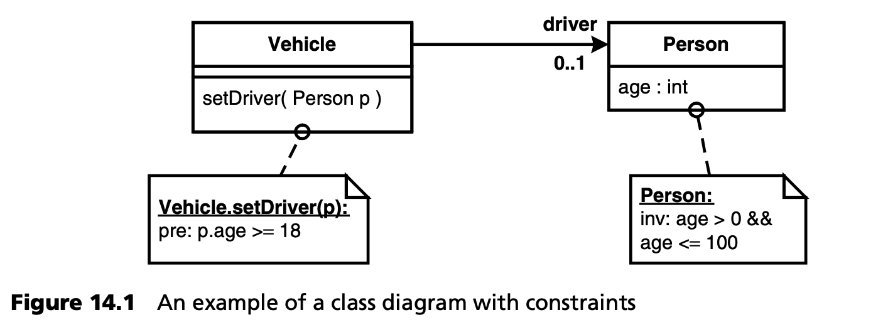
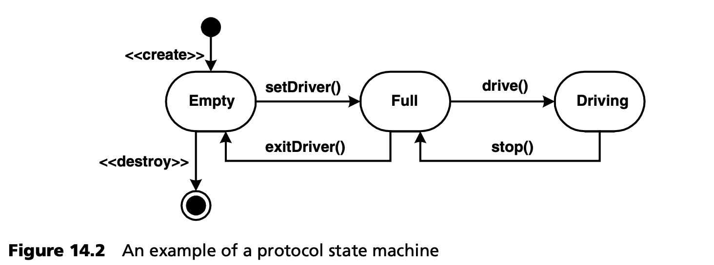
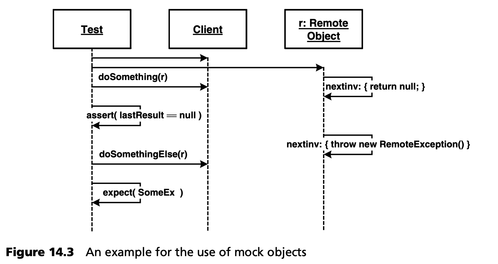
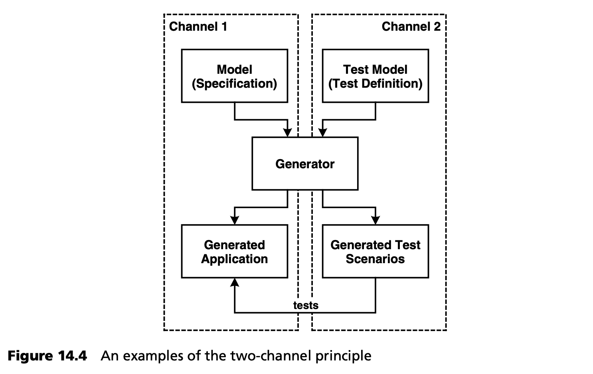
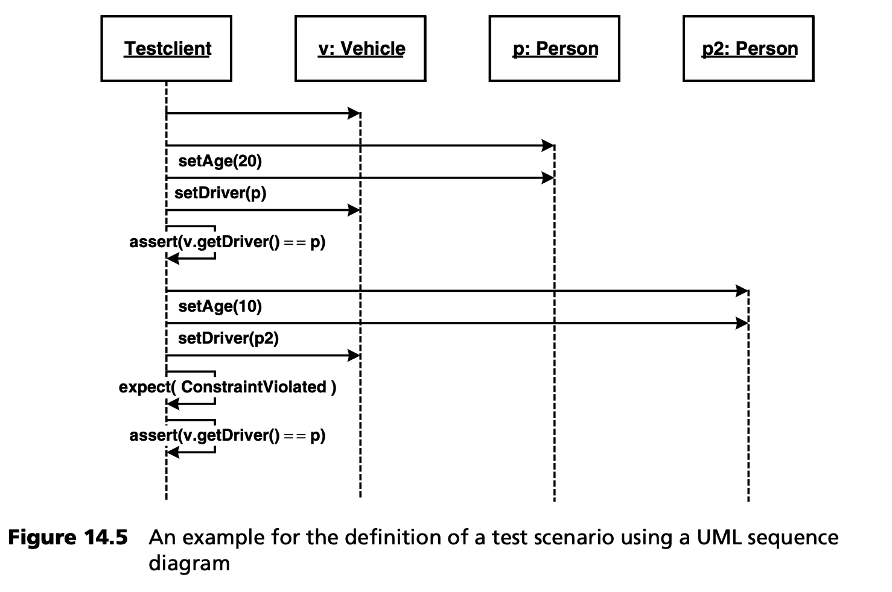
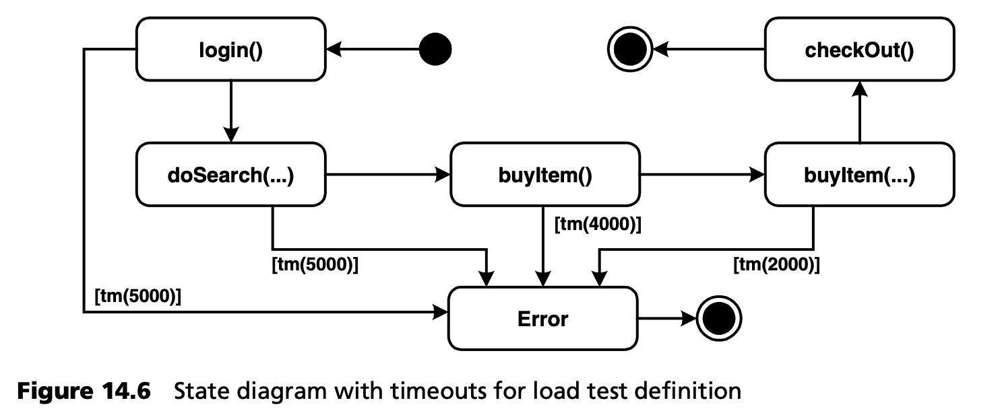
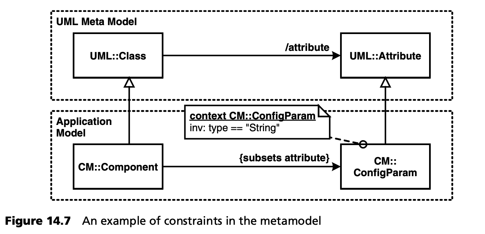

## 14.2 模型驱动应用开发中的测试
在应用开发主线中，测试类型与非模型驱动流程中的测试类型相同。模型是代码的一部分，因为它们是形式化的，并通过转换自动转化为 3GL 代码。从这个角度看，DSL 是一种编程语言（与领域有亲和力），但可能存在语义空白 (semantic gap)。生成后，您将得到与不使用 MDSD 时完全相同的代码，因此可以以相同的方式对代码进行测试。即使是测试优先 (test-first) 的方法在这里也不构成矛盾：如果开发人员认为在建模 *之前* 编写测试代码是明智之举，那么没有人会阻止开发人员这样做。

模型驱动方法具有很大的潜力，可以简化测试代码的创建。黑盒测试始终是在 “是” 状态和 “期望” 状态之间进行比较：我们不区分方法的返回值和副作用（如数据库变化）。因此，测试确保的是语法定义的接口<sup>[2](#2)</sup> 背后的语义。换句话说，测试 “知道” 要测试的系统的签名和语义 -- 这可以名正言顺地称为 *design* 。实际上，编写测试代码的开发人员在编写测试代码的过程中指定了设计信息。同样，任何开发人员在编写测试代码时，都必须至少对要测试的系统的设计有一个粗略的了解。

就 MDSD 而言，我们现在拥有了比 3GL 语言更有价值的表达设计的手段：DSL。根据 DSL 的语义深度，首先在模型中指定设计信息，而不是立即以 3GL 测试代码的形式指定设计信息，以便准确地生成代码或其中的一部分，这样做可能会更有效。这种方法的优势在于测试代码的抽象性和易更改性：测试代码的一部分被转移到领域架构中，现在可以集中维护和修改。这样，领域架构就扩展到包括 *测试软件 (testware)* 的生成。这一过程是否有效（如果有效，在多大程度上有效）在很大程度上取决于预期可复用性的程度。

### 14.2.1 单元测试
在传统的软件开发中，有一些小而有用的框架，如 *JUnit*（或 *C#Unit*、*CppUnit* 等）。我们希望在模型驱动开发中继续使用这些工具，并利用 MDSD 技术尽可能高效地支持测试的创建。

***测试用例与测试数据的分离***

<ins>遗憾的是，单元测试在大多数情况下都是以测试用例和测试数据混合在代码中的方式进行编程的。乍一看，这似乎简化了问题，但实际上它对项目下一步推进存在严重弊端：</ins>

- 测试用例不能用于不同的测试数据。
- 测试用例和测试数据失去了可维护性。
- 测试数据只能由开发人员修改或提供。
- 测试用例的实际结构模糊不清，影响可读性。

<ins>因此，在实施组件测试时，最好将测试用例和测试数据分开</ins>。例如，可以用 XML 文档或 Excel 文件的形式呈现测试数据，实际测试用例（如 JUnit 测试方法）可在运行时读取这些数据。这不仅适用于测试输入（测试刺激 test stimuli），也适用于参考输入 (reference input)。

就 MDSD 而言，这种分离还允许单独处理测试用例的生成。例如，您可以只支持测试用例的生成，并使用合适的框架解决测试数据的集成问题。

测试数据的外部格式成为 DSL 测试分区的一部分 -- 换句话说，测试数据可以是 MDSD 模型，无论它们是经过转换还是直接由（测试）平台解释。

***测试基础架构的生成***

<ins>MDSD 为组件测试提供的最简单、最明显的支持，就是从模型中生成测试基础结构 (infrastructure)。例如，这可以包括应用所有业务操作的（空）测试方法，以及测试套件的组合。我们还可以在测试方法中生成导致测试失败的默认实现，从而强制开发人员进行真正的实现。</ins>

***约束检查***

<ins>根据模型中的约束条件生成测试用例是一种非常强大的技术<sup>[3](#3)</sup>  。这些约束声明性地指定了系统的属性，但并不提供 *如何* 实现这些属性的任何信息。通常情况下，对于此类约束，我们可以将其分为前置条件（用于描述调用操作的前提条件）、后置条件（用于描述操作执行后的系统状态）和不变式（用于描述在系统执行过程中必须始终保持的此类约束）。如果有了合适的模型，就可以生成单元测试，创建所需的测试设置 (test setup)，提供有效的测试数据（前置条件），调用要测试的操作，然后检查后置条件。在这种情况下，会出现以下问题：</ins>

- 设置 (setup) 如何创建？
- 测试数据应如何构成？
- 必须具备什么样的环境才能通过测试？

<ins>由于定义和实现这些并不总是那么容易，所以通常情况下，不使用专门的单元测试来检查约束，而是直接在系统中生成约束检查，并在集成测试中检查约束</ins>。图 14.1 显示了一个例子：



实际上，可以根据这些约束条件生成代码：
```Java
class Vehicle {
  …
  public void setDriver( Person p ) {
    if (p.getAge() < 18 )
      throw new ConstraintViolated();
    // … implementation code …
  }
}
```
有两点需要说明。首先是如何从 OCL 约束生成代码的问题：可以使用合适的工具，例如 [EMPO](../ref.md#empo)、[DRES](../ref.md#dres)。然后是在哪里以及如何将约束整合到模型中，以及它们是否可供后续工具使用（例如在 XMI 导出中）。一个适用于所有 UML 工具的窍门是滥用 (abuse) 模型元素文档：例如，您可以在这里为 *setDriver()* 操作插入以下文本：
```xml
The purpose of this operation is to assign a driver to a vehicle. Drivers are always Persons aged 18 or older.
<Constraints>
  <pre id="driverAge">
    <expr>p.getAge() >= 18</expr>
    <error>Driver must be 18 or older.<error>
  </pre>
</Constraints>
```
在 MDSD 转换中，只需在文档文本中搜索 *\<Constraints\>* 标记即可。可以对 XML 进行解析，从而为进一步处理约束做好准备。为了简化操作，我们假设 *\<expr\>...\</expr\>*  中的文本是 *目标语言中* 有效的布尔表达式。这限制了可移植性，但如果需要实用的方法，这也是可行的。

另一个有趣的问题是，如果实际 method 的实现是手工完成的，如何使用这种方法？如何确保 *始终* 检查约束？在这里，使用模板方法 (Template Method) 模式是可取的 [GHJ+94](../ref.md#ghj94)。我们生成了一个抽象类 *VehicleBase* ，该类实现了 *setDriver()* 操作，如下所示：
```Java
abstract class VehicleBase {
  …
  public void setDriver( Person p ) {
    // generated from precondition constraint
    if (driver.getAge() > 18 )
      throw new ConstraintViolated();
    setDriverImpl( p );
    // generated from postcondition constraint
    if (driver == null) throw new ConstraintViolated();
  }
  protected abstract void setDriverImpl( Person p );
}
```
该操作会调用抽象操作 *setDriverImpl()* 。开发人员现在可以手工编写 *Vehicle* 类，并只实现超类定义的抽象操作：
```Java
class Vehicle extends VehicleBase{

  protected abstract void setDriverImpl( Person p ) {
    driver = p;
  }
}
```
我们可以根据所需的复杂程度来定义约束条件，例如通过一个可以赋值给接口 (assigned to an interface) 的协议状态机。可以从中生成代码，检查协议状态机所表达的约束条件。



例如，图 14.2 中的状态机规定，只有当驾驶员坐在车里时，才能开始驾驶 -- *drive()* 。生成的代码可以自动跟踪这些状态。如果在车辆为空的情况下调用 *drive()* 操作，就会产生一个 *ConstraintViolation* 异常。

***生成极值测试***

<ins>如果一个操作没有给出任何限制条件，当然就无法自动生成有用的测试：这些测试必须手工完成。不过，您也可以换一种方式来看待这种情况：如果没有说明限制条件，这就意味着任何输入参数（组合）对操作都是有效的。这意味着您可以生成使用任意测试数据的测试用例。你无法验证操作的结果（因为你不知道它在做什么），但你可以检查它没有致命的失败，例如空指针异常。这是一种切实可行的方法，特别是对于使用类基础型的操作。例如，int 参数的常用值为 0, -1, 87684335 ：对于对象参数，建议使用 null 值。需要注意的是，这种方法不能取代检查操作是否正确执行任务的实际测试，但这种方法可以提示典型的编程错误，如不检查 *null* 值或负数。</ins>

***模拟对象 (Mock Objects)***

<ins>模拟对象是软件测试的有用工具。它们的作用是从测试的角度将测试代码与相关的应用基础结构分离开来。为此，相应的接口由模拟对象实现，即使没有复杂的基础架构，模拟对象也能按照测试场景的要求运行</ins>。假设我们要检查客户端是否正确处理远程对象抛出的异常：
```Java
public Object doSomething( RemoteObject o ) throws SomeEx {
  try {
    return o.anOperation();
  } catch ( RemoteException ex ) {
    log( ex );
    throw new SomeEx();
  }
}
```
现在，我们如何确保 *RemoteObject* 在客户端调用 *anOperation()* 操作时真的会抛出异常以进行测试呢？当然，我们可以手动实现 *RemoteObject* 接口并抛出相应的异常 -- 但对于其他测试场景，我们不得不反复实现相同的功能。

除了 EasyMock [EASY](../ref.md#easy) 等通用方法外，代码生成也能在这方面提供帮助。首先，您可以使用它非常容易地生成演示特定行为的实现类。作为一种规范，您可以使用以下 XML 代码：
```xml
<MockConfig type="examplepackage.RemoteObject” name="RemoteObjectTestImpl">
    <operation names="anotherOperation, thirdOperation">
      <return value="null” occurrence="1"/>
    </operation>
    <operation names="anOperation">
      <throw type="RemoteException” occurrence="all"/>
    </operation>
</MockConfig>
```
这将指定生成一个实现 *examplepackage.RemoteObject* 接口的 *RemoteObjectTestImpl* 类。操作 *anotherOperation* 和 *thirdOperation* 的实现方式是返回 *null* 值。对于 *anOperation*，定义为抛出 *RemoteException*。现在可以在测试中使用该类。

您也可以隐式定义此类模拟对象，这样做所需的工作量会更少（见图 14.3）：



这里创建了一个 *RemoteObject* 。我们指定在下一次方法调用时返回 *null*（方法的实现代码只需放在大括号中）。我们检查 *doSomething()* 方法是否正确返回空值，然后在 *RemoteObject* 上定义下次调用时抛出异常。接下来，我们在客户端调用 *doSomethingElse()* ，并希望它抛出一个 *SomeEx* 异常。

要实现这一方案，代码生成器只需生成一个与 *RemoteObject* 接口相匹配的实现，其行为如图所示。

### 14.2.2 验收测试
这些测试的定义 *必须* 独立于应用模型。从生成应用的同一模型中生成验收测试是没有用的，因为在这种情况下，只要领域架构正确，应用就 *不会* 失败。这就引出了双通道原则 (two-channel principle)：我们需要第二个独立的 “通道” 来指定独立于原始规范的测试。不过，MDSD 也可以支持第二个通道 -- 见图 14.4。



正如您所看到的，可以用与应用本身相同的方式，但在单独的验收测试模型中对测试方案进行建模。对测试脚本操作的限制提供了测试中所需的验证规则。

如果使用合适的 DSL，领域专家就能 *更好* 地理解测试用例，与集成测试编程相比，定义测试用例的工作也更有成效。图 14.5 是一个使用序列图的例子。首先，测试客户端创建一辆新 *Vehicle* 和一个新 *Person*。然后，将该人的年龄设为 20 岁，并将该人定义为汽车司机。随后创建一个 *Assertion* ，确保汽车驾驶员正是刚才设置的那个人。然后再创建一个 10 岁的新人。如果将这个新人设置为司机，则必须抛出一个 *ConstraintViolated* 异常，并用 *expect()* 进行评估。这样就能保证执行代码确实检查了相应的约束。最后，我们将验证司机是否仍是原来的司机。

当然，如上所述，我们会将测试数据与测试代码分开。为了保持示例的简洁性，我们在此省略了这一点。



### 14.2.3 压力测试
压力测试原则上遵循以下模式：模拟一组通常在多台计算机上运行的客户端。这些客户端运行测试脚本。客户机的定时行为将根据压力（即客户机数量及其调用频率）进行测量。服务器的资源消耗也会被记录下来。

环境设置（如服务器、网络、数据库）必须手动创建。必须定义以下方面：

- 测试脚本
- 客户端数量
- 客户端的内部并行性，即进程和线程的数量

<ins>在大多数情况下，后两个方面由同时测量定时行为和监控应用的工具来处理。测试脚本非常适合生成。如图 14.6 所示，序列图或状态图就是很好的基础。</ins>



### 14.2.4 非功能测试
可靠性、事务一致性或无死锁等非功能性要求的测试无法在 JUnit 等简单环境中完成。这里需要真实的场景。网络或数据库的故障必须模拟或强制实际发生。同样，安全测试也只能手动进行。在这方面，模型驱动开发无法提供任何具体帮助。

### 14.2.5 模型验证
模型验证是一种只有在使用 MDSD 时才可能进行的测试。它为测试提供了全新的选择。我们必须区分三种不同的子类型：

- *模型层面的验收测试 (Acceptance tests on the model level)* 以验证模型语义
- *完备性测试 (Well-formedness tests)* 以检查是否遵守建模规则（DSL 约束）
- *模型仿真 (Simulation of models)*

***模型层面的验收测试***

MDSD 模型有可能在与客户或专家的直接交流中得到验证（除非他们自己创建测试），特别是如果 MDSD 领域及其 DSL 是面向业务的。这种方法可以提供额外的确定性，尤其是在根据模型创建代码或配置文件时。因此，这些代码或配置的含义可以事先在更抽象的层次上进行检查。

***完备性测试***

我们已经从第 [3](../ch3/0.md) 章第一个案例研究中，研究了建模规则在 MDSD 中的重要性。我们还看到了这些规则在 DSL 静态语义中的作用（第 [4](../ch4/0.md) 章），并展示了它们是如何在元建模环境中被定义的（第 [6](../ch6/0.md) 章）。

从测试的角度来看，这种建模规则是对 DSL 的所有实例（即所有模型）都有效的不变式。在进行实际的 MDSD 转换之前，*必须* 对这些规则进行检查，否则转换结果将是未定义的。完备性测试 (well-formedness test) 可以由建模工具（如果它能够）或后续的 MDSD 工具来执行 -- 见第 [3.2](../ch3/2.md) 节和第 [11.1.2](../ch11/1.md#1112-模型验证和代码生成) 节。<ins>从技术角度看，这些测试不过是由相应的编译器对经典编程语言的静态语义进行检查而已。然而，从开发人员的角度来看，它们要有效 *得多* ：经典编程语言的编译器对领域一无所知，因此它只能发出关于解决方案空间（编程语言）的错误信息。相比之下，建模规则是专门为领域创建的，因此可以使用问题空间的术语报告错误信息。</ins>

在传统开发过程中，编译器通常检测不到，只有在运行时才会出现的一类特殊错误，可以通过 MDSD 方法在建模期间或代码生成之前及早检测到。下面是一个简单的例子：图 14.7 中的元模型定义了配置参数（一种特殊的属性类型）必须始终具有 *String* 类型。



对于使用此 DSL 指定的所有模型，给定的约束必须成立。如果配置参数不是 *String* 类型，就会发出相应的、有意义的错误信息，如 *“ConfigParam must be of type String”* ，而不是在运行时出现异常，因为有人试图将 *Integer* 赋值给 *String*。

***模型仿真***

如果在模型中对系统的动态方面进行了详尽描述，就可以通过模型仿真（即在测试平台中执行模型）来验证。这种方法在嵌入式系统中非常流行，但只适用于比较特殊的行为定义类型，特别是有限状态自动机。UML 2.0 和动作语义也是朝这个方向迈出的一步 -- 见第 [12](../ch12/0.md) 章。在一般实践中，模型仿真方法要么不经济，要么不可能，因为动态系统行为没有在模型中指定。

---
#### 2
根据测试类型的不同，可以是 Java 接口，也可以是 GUI。

#### 3
这些问题不应被误认为是元层的建模约束（见第 [6](../ch6/0.md) 章），元层的建模约束定义了 DSL 的有效模型。
