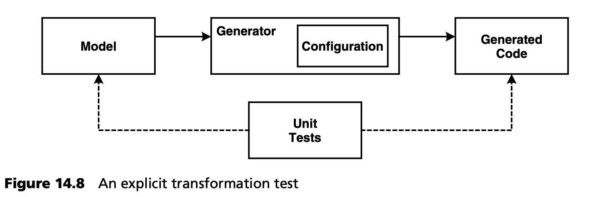

## 14.3 测试领域架构
领域架构也是软件，因此必须进行充分的测试。幸运的是，我们可以将这一问题分解为几个方面，并为其提供众所周知的测试解决方案。

### 14.3.1 测试参考实现和 MDSD 平台
至少在领域架构的引导阶段，参考实现起着核心作用。由于通常需要一个小型专家团队来完成这项工作，因此敏捷、测试驱动的方法在这里非常有用。MDSD 平台也是如此。

第 [14.1](../ch14/1.md) 节中介绍的所有测试类型都可以在这里使用 -- 当然，此时没有模型驱动的生成支持。不过，参考实现可以包含一个原型测试软件 (prototype testware) 分区，以发掘其生成潜力。

### 14.3.2 DSL 的验收测试
建模语言（DSL）的验证也非常重要。这可以通过在参考模型中使用 DSL 来实现（见第 [13.2.2](../ch13/2.md#1322-领域架构开发主线) 节）。后者主要是从可管理性和人机工程学角度对 DSL 进行（验收）测试。由于参考实现和参考模型试图尽可能简约地涵盖 DSL 的所有构造 --这是对每个功能完全测试一次的最低限度的测试-- 参考模型应被视为一个相当重要的测试。在引导之后，开发主线中的应用模型是下一个 DSL 测试 -- 您可以使用 “真实” 应用模型作为 DSL 适用性的测试用例。

### 14.3.3 MDSD 转换测试
在架构开发线程中，参考实现的各个方面的形式化及其转化为计算机可处理的形式 --主要是生成器模板或类似的转换规则，这些规则与 DSL 的元模型绑定-- 得以实现。通常，这些转换规则基于一个通用 MDSD 工具，为了我们的目的，我们假定该工具是正确的[4](#4) 。这使得我们只需验证领域和平台特定的转换规则。如何以合理的方式进行此类验证？

一个相当明显的测试方法是引导领域架构的副产品：由于转换规则同时来自参考实现和参考模型，因此它们应该能够准确地重现 DSL 所涵盖的那部分参考实现。换句话说，如果将新创建的转换应用于参考模型，那么根据架构的范围，您将得到完整的参考实现或其实现骨架。如果用原始参考实现中的代码片段来补充这个骨架，就会得到一个完整的可测试应用。在构建参考实现过程中创建的所有测试应该仍能成功运行！这样做的一个副作用是，我们得到了一个生成的参考实现，并完成了对领域架构的引导。

在项目的后续进程中，对领域架构的初始测试将扩展到对实际应用的测试。这样，架构就通过所创建的应用 --即通过其测试-- 得到了隐式验证。这在实践中非常有效，而且完全足够。

转换规则的显式测试会是怎样的呢？毕竟，生成器是一个元程序 -- 一个从模型生成程序的程序。它的输入是模型，输出是程序或部分程序（源代码片段）。因此，对单个转换规则的显式测试将使用模型的相关部分作为测试设置，对其应用规则，最后将结果与规范进行比较：即与相应的所需生成代码或源代码片段进行比较。图 14.8 解释了这一原则。

当生成器由模块构建时，完全可以采用这种方法并构建相应的测试套件。让我们考虑一下后果。

(黑盒）测试为被测系统提供特定的刺激（设置和参数），并将执行系统的输出或副作用与规范进行比较。抽象是从待测系统的实现过程中抽取出来的。在本节所述的显式转换测试中，抽象是如何工作的？将生成的代码固定为一个具体且文本固定的版本是否有帮助，还是说生成的代码的语义更为重要？试想一下，在实践中为一个领域架构提供显式转换测试的测试套件：如果架构师意识到另一种实现比现有实现更适合生成式软件架构，会发生什么情况？测试套件将不允许这种改变 -- 尽管从客户端应用的角度来看，这种改变可能是完全透明的！同样，这也意味着显式的转换测试构成了适得其反的过度规范。转换测试 *不应* 在元层面（生成器的测试）进行，而应在具体层面（生成代码的测试）进行。

如何实现转换测试的模块化？参考实现（包括其具体的测试套件）和参考模型为生成式软件架构提供了一个相当强大的测试用例，而每个客户端应用则提供了另一个测试用例。根据建模构造的组合情况，从领域架构的许多较小测试用例中生成一个测试套件是有意义的。具体做法如下：转换测试用例侧重于 DSL 的特定结构（例如，持久实体之间的关联） -- 也就是说，设置包括一个在这方面最小化的模型，必要时还包含预先实现的领域逻辑。测试运行包括运行转换，结果是从模型生成的代码，其中包含现有的领域逻辑（如果可用）。然后通过测试用例对可运行的生成代码进行具体验证。这种转换测试的测试套件涵盖了 DSL，验证了领域架构的生成部分。

----
#### 4
如果生成器需要经过认证，例如用于安全关键型系统，我们的方案就会有所不同。不过，我们并不考虑这种情况。
