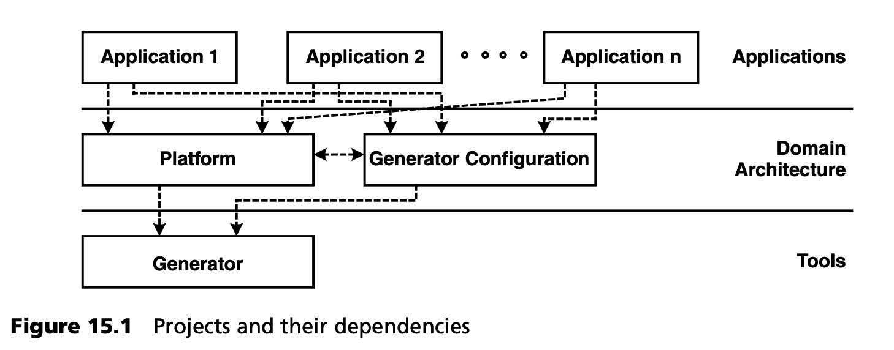

## 15.2 项目和依赖关系
图 15.1 是一个久经考验的项目结构概览。虚线箭头表示依赖关系。主要目标是领域架构必须与特定于应用的工件保持清晰。

图 15.1 所示的所有项目都在版本管理系统中进行管理。工具和领域架构已被完全签入，但应用尚未签入：运行生成器生成的代码不应签入。

管理各个项目的依赖关系（包括其版本）非常重要。对于应用项目来说，指定该项目依赖于 *哪个版本的* 领域架构至关重要。如果底层平台发生了变化，您可能需要对领域架构，甚至是应用项目进行共同演进。一个框架比喻可以说明这一点：将领域架构想象成一个框架。如果框架发生演变，就必须调整其客户端应用。这些都是相同的依赖关系，因此在领域架构的演进过程中也会采用相同的方法。

值得一提的是，这种观点也可以层层递进。例如，将领域架构中的 MDSD 平台和生成器配置分开进行版本控制是有意义的，尤其是当该平台在其他领域架构中重复使用时。除此之外，人们还希望对可重复使用的转换模块 (cartridges) 进行单独版本控制，而一个功能强大的平台可能会分解为若干个解耦的框架。在更高级的情况下，可能会借助以架构为中心的领域架构来创建功能性/专业性 MDSD 平台。这些依赖关系必须在版本管理和架构依赖关系管理中加以识别和考虑。
