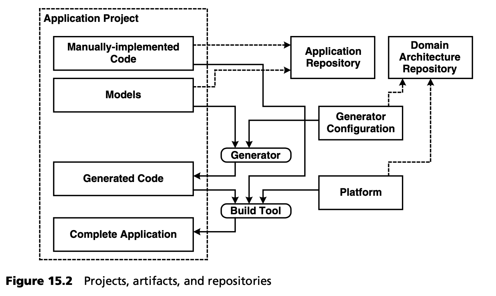

## 15.3 应用项目的结构
图 15.2 显示了应用项目的顶级结构，以及生成器和编译器的如何在其上工作。

应用的模型以及手工创建的代码位于应用资源库 (application repository) 中。生成器在生成器配置的支持下创建生成代码，包括配置文件等。后者位于领域架构资源库 (domain architecture repository) 中。接下来，应用将在构建脚本（大多数情况下脚本也会生成） 的帮助下生成。该步骤使用应用的手工创建代码和平台，后者来自于领域架构资源库 (domain architecture repository)。

