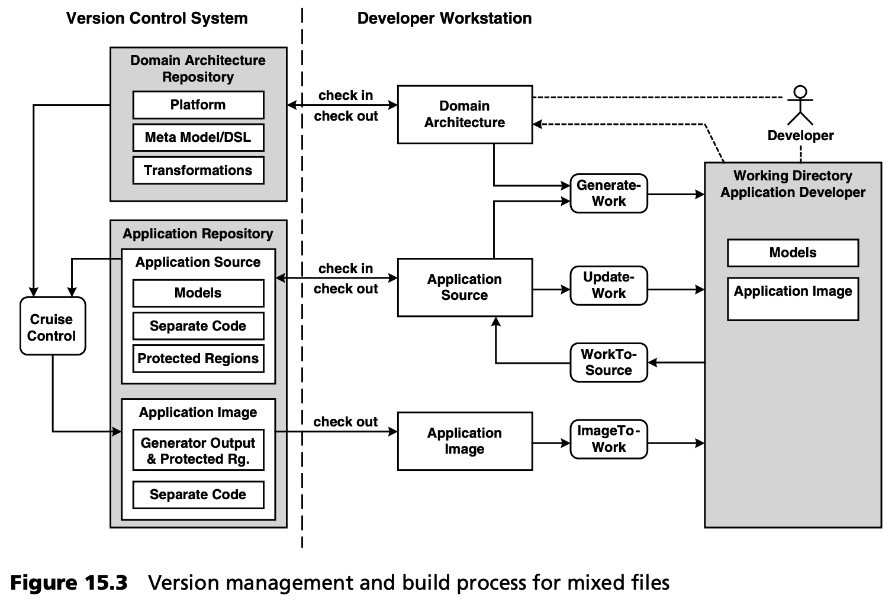

## 15.4 混合文件的版本管理和构建过程
将生成的代码与非生成的代码完全分开并非总是可行或合理的。这方面的例子有
- J2EE 部署描述符中的自定义代码。
- JSP 文件中的自定义代码。
- 属性文件或其他配置文件中的自定义代码。

 总的来说，在这些位置目标语言没有提供足够的委托机制。

在这种情况下，通常会使用第 [3](../ch3/0.md) 章案例研究中概述的机制：在生成器模板中定义的保护区 (protected regions) 。因此，生成器会在生成的代码中创建标记，并在迭代再生过程中使用这些标记，来查找和保留其中包含的手工创建的代码。通过将这些标记标记为注释，可以从语法上对目标语言的编译器或解释器隐藏这些标记。

显然，使用这种保护区会导致生成代码和非生成代码混合的文件。问题在于，这些文件通常只能作为一个整体进行版本控制。这将导致多余的代码被签入，因为生成的代码（不包含保护区的内容）毕竟不是源代码 -- 源代码将是生成代码的（部分）模型。

这些冗余会导致团队在开发过程中的不一致。例如，假设开发人员 A 更改了模型或架构中的某些内容，而开发人员 B 正在对文件中包含的领域逻辑进行编程，该文件的生成部分受到了 A 更改的影响。这种情况会在签入 A 或 B 时造成问题或冲突，因为数据不再是最新的。造成这种情况的原因是资源库中存在冗余。目标必须是避免这种冗余，如隔离管理保护区的内容：生成器必须允许这样做。另一方面，隔离的保护区通常对应用开发人员帮助不大，因为他们需要生成代码的上下文作为指导，并执行编译-运行循环。

在这种情况下，我们需要一种过程来避免资源库中的冗余，*同时* 为开发人员提供他们熟悉的、面向文件的视图。图 15.3 展示了这种方法。

真正的（即非生成的）应用源（代码）在应用资源库 (application repository) 中进行管理。手工创建的、特定于应用的源代码 *不在* 保护区内管理的，在这里被标记为 *独立 (separate code)* 代码。此外，我们还可以通过 CruiseControl [CRUI](../ref.md#crui) 等方式，自动地 --高频地-- 创建 *应用映像 (application image)*[note](#note) ，其中包含生成的代码和手工创建的代码。这样就可以在服务器上启动自动测试。

现在，开发人员可以使用众所周知的版本管理的 *签入* 和 *签出* 流程，以实现与资源库 (repositories) 或模块的同步。实际的应用开发是在一个单独的 *工作目录 (work directory)* 中进行的。该工作目录与在版本管理过程中同样受控的（本地）目录之间的同步，可通过以下脚本或 Ant 任务实现：

- *GenerateWork* 。 该脚本将领域架构应用于应用模型，并集成签出的手工代码（从独立文件和保护区）与生成的代码。换句话说，它会在开发人员的工作目录中从零开始生成应用的完整源代码映像 (code image)。
- *UpdateWork* 。与 *GenerateWork* 不同，这里不进行任何生成。只更新手写代码
- *WorkToSource* 。对工作目录的改动会被简化为对真实源代码的改动（生成的代码不是源代码），并提供给版本管理系统，以便签入以与版本控制系统结构兼容的方式进行。
- *ImageToWork* 。该脚本的结果与 *GenerateWork* 并无太大区别。它从版本控制系统中刷新工作目录中的完整源代码映像，该映像之前由 CruiseControl 等持续集成服务器构建。这样可以将完整的构建工作委托给服务器端，从而节省本地处理能力。与 *GenerateWork* 相比，这里显然只涉及签入的内容。

开发人员之间的合并冲突只能通过资源库中的应用 *sources* 来检测。

需要再次强调的是，我们认为最好将生成代码与非生成代码分开，而且在任何情况下都应尝试这样做。

----
#### note
译注：要想看明白这里介绍的方法，得对 CruiseControl 能做的事情有一个大致的了解。重点是图中左侧部分，生成的 Application Image。
