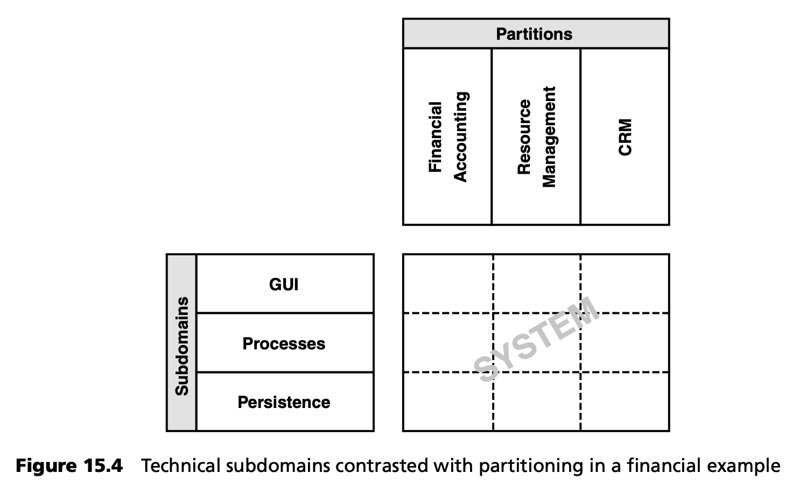
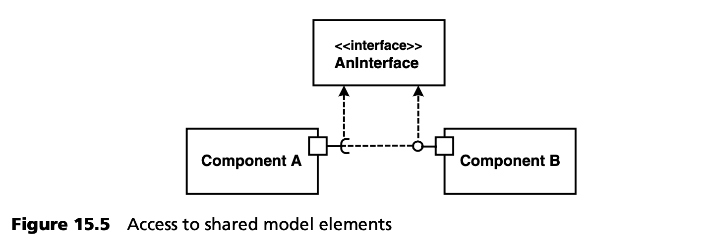
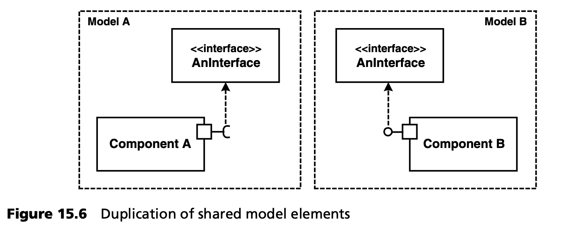
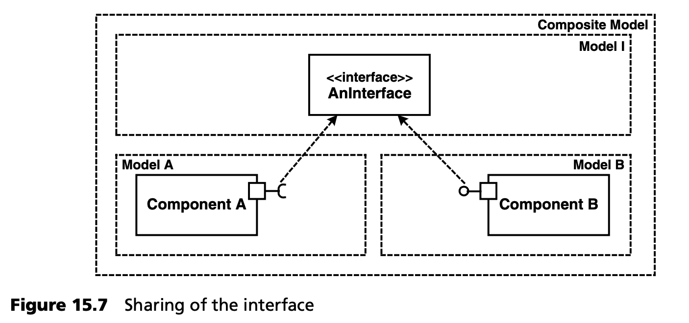
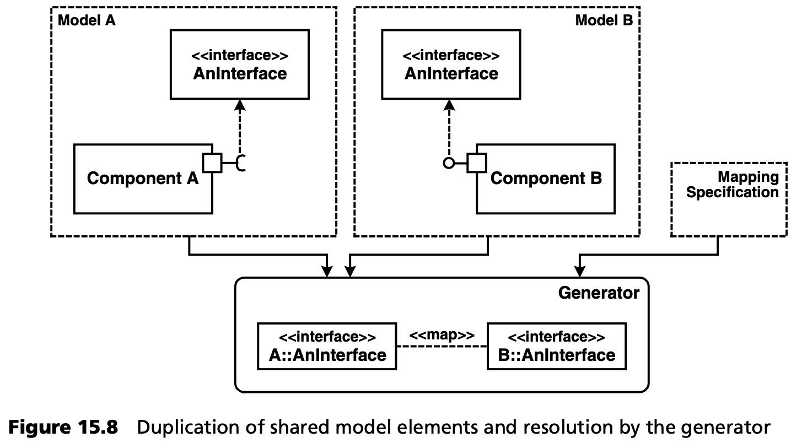
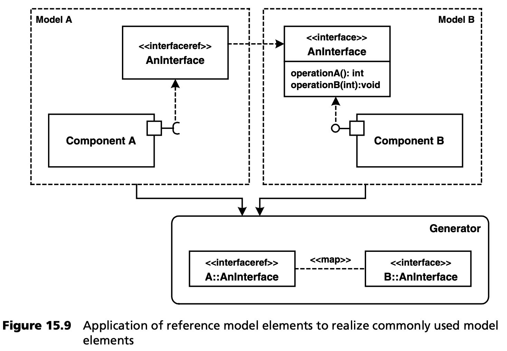

## 15.5 在团队中建模和部分模型的版本化
大型系统必须分区。它们的组成部分或子系统或多或少都是独立开发的。接口定义了系统的交互方式。定期的集成步骤将各部分整合在一起。如果各部分在不同的地点或由不同的团队开发，这种方法尤其有用。当然，这主要会影响开发过程和团队中的交流，也可能会影响系统架构。本节以版本控制为背景，介绍了这一过程的各个方面。

### 15.5.1 分区与子域
首先要指出分区与（使用）子域之间的区别（见图 15.4）：

- <ins>（技术）子域 (subdomains) 隔离了整个系统的各个方面。每个子域都有自己的元模型和 DSL。不同的元模型通过网关元类 (gateway metaclasses) 在概念上统一起来。例如，在企业系统中，这些子域可以是 *业务流程 (business processes)* 、*持久性 (persistence)* 和 *GUI* 。</ins>
- <ins>与此相反，分区 (partitions) 描述了部分系统的定义。出于项目组织效率或复杂性的考虑，大量技术上相似的需求被分解成独立部分，这些独立部分可通过接口集成。</ins>



### 15.5.2 各种生成式软件架构
如果在项目的不同分区 (partitions) 中使用了不同（版本）的生成式架构，就会出现生成的工件是否能协同工作的问题。一般来说，这意味着应在生成代码的层面上进行集成。举个例子，假设我们使用不同版本的生成基础架构，这些生成基础架构都会创建一个完整 J2EE 应用的各个部分。由于在这种情况下，所有生成的工件都必须符合 J2EE 标准，因此可以在完成的应用层面进行集成：并不强制要求所有部分都使用相同的领域架构。当然，这种方法并不理想，因为不可能进行全系统范围的约束检查。

### 15.5.3 DSL的演变
DSL 通常在一个（或多个）项目过程中不断发展。对领域的认识和理解会不断加深，因此 DSL 也会随之扩展。为了简化工作，我们必须确保 DSL 在演进过程中保持向后兼容 (backwards-compatible)。

第 [15.5.2](#1552-各种生成式软件架构) 节中的版本控制方法就是实现这一点的一种方法。另一种方法是修改生成器配置，使其支持不同版本的 DSL 和元模型。如果您并行处理不同版本的 DSL ，例如当应用开发人员在迭代结束时切换到新版本的领域架构时，尤其应该考虑这种方法。现在，领域架构提供了一个更新的版本（在大多数情况下功能更强大），而应用模型仍在使用以前的版本。在这种情况下，您必须提供一种迁移路径，从应用开发人员的角度来看，这种路径要求对模型的改动尽可能小。DSL 的新功能应该提供给开发人员，而不是强加给他们。旧的功能也可能被淘汰：生成器可以在使用这些功能时发出警告。

<ins>实际上，使用生成器配置支持领域架构版本并不像乍听起来那么复杂。毕竟，生成器配置是由领域架构的开发人员实现的。他们定义元模型和具体语法，以及要生成的代码</ins>。例如，他们可以在模型中设置一个版本号<sup>[1](#1)</sup>  ，以决定生成器如何解释模型或生成什么样的代码。您还可以实施隐式规则：如果模型中的某个属性不存在，则使用特定的默认值。另一个例子是实体属性的验证。假设你有一个包含实体概念的元模型。实体拥有许多属性。下面的列表显示了一个用 XML 呈现的模型示例：
```XML
<Entity name="Person">
   <Attribute name="name" type="String" label="Name"/>
   <Attribute name="firstname" type="String" label="Firstname"/>
</Entity>
```
通常情况下，您需要检查属性的正确性。为此，您可以声明各种约束。最初，您可以通过简单地注释一个命名的约束来实现这一目的：
```XML
<Attribute name="name" type="String" label="Name" constraint="notNull"/>
```
这表明属性不能为空。在项目实施过程中，您会发现需要多个约束条件，而 XML 属性无法充分表达这些约束条件。与其改变一切，您现在可以将额外的约束条件作为额外的 XML 元素来使用 - 旧的属性变量可以保留：
```XML
<Attribute name="name” type="String” label="Name” constraint="notNull">
   <Constraint name="startsWithLetter"/>
</Attribute>
```
现在，您可能会发现需要一个可选的布尔表达式。例如，可以使用目标语言来表达：
```XML
<Attribute name=“age” type=“int” label=“Age” constraint=“notNull">
  <Constraint>
    1 <= age <= 110
  </Constraint>
</Attribute>
```
如果这种灵活性还不够，还可以在目标语言中说明类名，同时让相应的类实现平台定义的验证器接口：
```XML
<Attribute name=“age” type=“int” label=“Age”
        constraintChecker=“person.AgeChecker”/>
```
<ins>如果您在继续开发 DSL 的过程中保留旧功能并添加新功能，那么 DSL 的演进就可以在日常项目工作中轻松完成。这样的机制可以覆盖大量的情况。当然，这种方法会增加生成器配置的复杂性。您还应确保随着时间的推移删除过时的功能。 对 *已废弃 (deprecated)* 功能的受控使用，可让您在项目进展过程中逐步清理旧功能。生成器可轻松生成一个日志文件，记录哪些功能仍在使用。这将帮助您从生成器配置中移除不再使用的功能 -- 这相当于垃圾回收。</ins>

### 15.5.4 分区和集成
假设不同的团队需要相同的接口，这可能是因为一个团队实现的组件使用了另一个团队的代码。图 15.5 举例说明了这一点：



如图 15.6 所示，当您的工作是模型驱动时，必须至少在两个模型中都提供接口的模型。然而，这种方法并不理想，因为两个模型中的信息是重复的，会导致一致性问题。根据工具的不同，还有其他选择。



***模型中的集成***

如果建模工具支持集成，则应确保接口只存在于一个地方，并同时被两个模型引用。从生成器的角度看，这将产生一个一致的模型 -- 见图 15.7：



这种方法能否实现取决于建模工具。在 UML 工具中，支持分布式建模的基于资源库 (repository-based) 的工具是最理想的。

***通过模型同步在生成器中进行集成***

如果建模工具没有提供足够的集成选项，也可以在生成器级别进行集成。生成器会读取多个输入模型，每个模型都包含特定的模型元素，如图 15.8 所示。



在这种情况下，生成器的任务就是解决可能出现的一致性问题：
- 映射可以通过映射规范显式地进行，也可以简单地根据相同的名称进行。
- 如果两个模型元素 --被映射定义为 *相同 (identical)*-- 在内容上存在差异，则可以报告错误或进行调整。同样，这也可以在一定程度上实现自动化。

***通过引用（代理元素）在生成器中集成***

如第 [8.3.4](../ch8/3.md#834-代理元素) 节所述，另一种集成方法是使用引用。图 15.9 再次说明了这一原则：接口 *AnInterface* 只存在于一个模型中。其他模型只包含对该接口的接口 *引用 (references)* 。取消引用可以通过名称进行，并由生成器自动完成。



---
#### 1
在 UML 模型中放置版本信息是一个可移植的、独立于工具的选项，它允许用相应的标记值来丰富模型元素。
