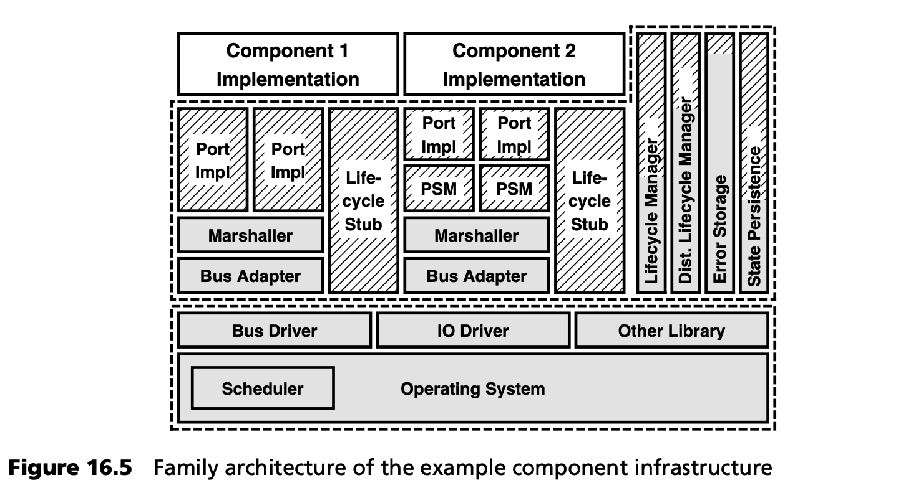
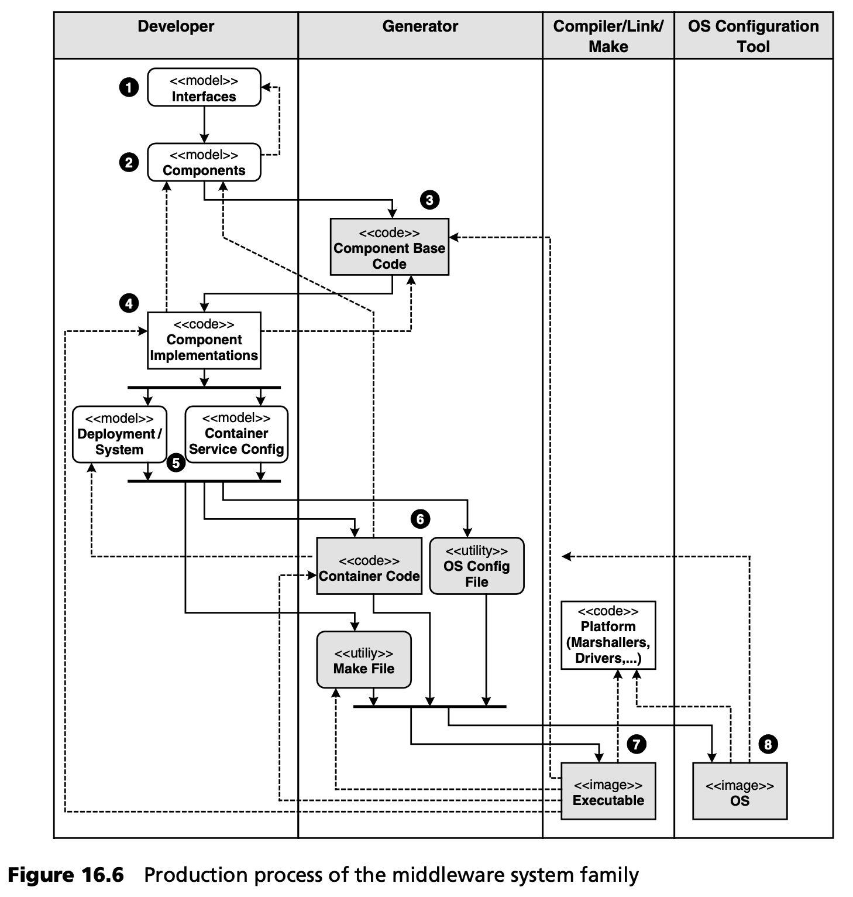

## 16.2 产品线工程
在实际展示如何构建各种工件之前，我们想通过本案例研究来说明第 [13](../ch13/0.md) 章所述的产品线工程的基本原理。

容器代表一个软件系统族。各种系统使用的容器有一些共同点，但在具体方面也有差异。例如，只有当相应的 ECU 实际连接到特定总线时，容器才会包含通过该总线进行通信的代码。通信范式也是如此。如果通信仅通过异步事件进行，容器无需包含通过总线在不同组件实例之间传递 (brokers) 同步操作调用的代码。

从产品线工程的角度来看待这个问题是有道理的。道理很简单。如果我们只有一个可以在所有场景和系统中使用的容器，那么它就构成了一个框架。正如第 [16.1.4](../ch16/1.md#1614-基本方法) 节所述，出于性能和代码大小的考虑，这种方法并不可行。

如果每个容器都是一个完整、独特的实体，那么容器的概念就会变得荒谬。出于经济上的考虑，不同系统的容器在某些方面必须是相似的。

### 16.2.1 领域界定
首先，我们必须确定容器适用于哪些场景。为了系统地解决这个问题，我们可以使用嵌入式系统整个领域的特征建模来确定我们希望解决整个领域中的哪一部分。

在这一阶段，这一过程往往会耗费太多精力，因此我们在此采用了更为务实的 (pragmatic) 方法。我们可以考虑从以下几个方面来帮助确定领域的范围：
- *操作系统 (Operating system)* 。在嵌入式系统领域，直接对硬件编程而不使用操作系统的情况并不少见。操作系统为嵌入式系统提供的功能（以及性能）因操作系统而异。在我们的容器中，我们假设操作系统至少可以处理调度。我们认为内存保护以及其他更复杂的功能是可选的。
- *实时能力 (Real-time capability)* 。系统能否实时运行[3](#3) 取决于多种因素：在分布式系统中，主要取决于底层总线（例如，FlexRay 具有实时能力）、操作系统的调度程序和应用的功能。我们仅限于讨论那些无需满足任何硬实时要求的系统。
- *安全问题 (Safety concerns)* 。对于安全关键型环境中的许多应用领域来说，需要进行大量的认证。除了软件本身需要认证外，构建软件的工具和开发过程本身通常也需要认证。我们也将此类系统排除在外。
- *动态与静态配置 (Dynamic vs. static configuration)* 。组件实例、它们之间的通信关系以及整个系统的其他各个方面既可以在运行时动态定义，也可以在配置时静态定义。出于性能考虑，我们在此只讨论静态情况，而只有生命周期状态是动态管理的。

因此，我们有意将某些场景排除在我们的领域之外。这有助于我们在开发系统族的过程中保持专注。我们将软件系统族的重点放在具有以下特征的组件容器上：
- 无（硬）实时能力
- 非安全关键型
- 静态配置
- 在至少能处理调度的操作系统上工作

### 16.2.2 可变性分析和领域结构化
既然我们现在已经熟悉了领域的边界，我们就必须分析这些系统的特征，以确定哪些特征是系统家族所有成员共有的，哪些特征是可变的。第一步是按照第 [13.5](../ch13/5.md) 节所述，将领域划分为若干子领域：

- 通过不同总线系统进行通信及其高性能实现，以及如何将其映射到组件模型定义的抽象和机制。
- 容器服务 -- 容器可在运行时为组件提供的附加服务。
- 部署和一致性检查 -- 在系统节点上实现组件的最佳和一致分布。
- 与操作系统调度的集成。

对于每一个子领域，我们都应该进行可变性分析。在此，我们将以两个子领域为例：容器的通信机制和跨领域 (cross-cutting) [note](#note) 服务。

***通信范式***

连接器用于描述两个组件端口之间的通信关系，如图 16.1 所示。

通信范式（操作调用、面向消息）由两个端口的接口，特别是连接器来定义。图 16.2 中的特征模型（见第 [13.5.3](..//ch13/5.md#1353-方法论) 节）显示了现有的通信选项。从中可以看出，首先必须确定两个特征：技术和范式。

当然，技术取决于限制条件：只能通过与相应硬件节点相连的总线系统进行通信。此外，只有当两个实例位于同一个容器（容器定义了一个地址空间）中时，才能进行本地通信。

范式则要困难一些。原则上，人们可以使用客户机/服务器或基于消息的方法进行通信。在客户端/服务器通信的情况下，必须决定是同步通信还是异步通信。如果是异步通信，则必须决定如何获知调用结果。

在进行基于消息的通信时，还必须做出上述决定和其他决定。

确定开发人员何时定义每个特征非常重要。例如，可以使用特征图的注释来实现这一点，如图 16.3 所示。

必须静态定义一些特性的原因包括代码大小、内存消耗、时序确定性特性和性能。

在某些操作系统（如 Osek）上，轮询 (polling) 应该是阻塞式还是非阻塞式的问题，必须通过静态方式来决定，以配置操作系统，使阻塞式轮询成为可能[4](#4)。

***容器服务***

容器提供的服务是软件系统族组件容器的另一个重要方面 -- 见图 16.4。

首先，容器总是提供通信服务。容器还可以通过控制组件实例的激活和停用 (deactivation) 来管理其生命周期。我们将其分为三种模式：

- *简单 (Simple)* 只知道 *Start* 和 *Stop* 事件。
- *Init* 还知道初始化阶段，即 *Start, Init, Deinit, Stop* 。
- *Pause* 还知道 *pause* 模式，例如用于节能。

容器可以监控协议状态机 (protocol state machines) 。在这种情况下，必须确定两个方面：第一，是否也要监控时序约束；第二，如何应对错误？

- *StopInst* 停止相应实例（为此需要生命周期管理）。
- *StopSys* 停止整个容器。
- *Report* 只是向中央错误存储库报告错误。

对于后者，容器必须具备 *错误存储 (error storage)* 特征。

容器还可以管理组件实例的状态。如果激活了该特征，容器就可以自动或在开发者调用特定 API 操作后，持久化组件的状态。为此必须激活生命周期管理。

最后，容器可以参与分布式 --全系统范围-- 生命周期管理。这需要在容器中进行生命周期管理。

通常情况下，相关特性是静态绑定的，但细节上存在差异：

- 生命周期模式必须在开发组件实现时就知道，因为我们可能希望在实现代码中对生命周期事件做出反应。
- 至于是否应在运行时监控协议状态机的问题，可以在容器生成时决定。

我们将在讨论生产计划 (production plan) 的定义时，再次讨论这个问题。

### 16.2.3 领域设计
在领域设计过程中，要确定目标架构，即确定不同软件系统族成员的共同基本架构， 以及可选功能的集成方式。此外，还要定义生产流程 (production process)：规定从模型到最终产品的路线。

***目标架构***

我们无法在此详述目标架构的所有细节，因为这超出了我们的案例研究范围。不过，图 16.5 提供了一个概览。阴影部分构成 MDSD 平台。灰色部分是生成的，白色部分代表组件的手工实现。

我们希望尽可能少地重新发明，这也是我们大量使用操作系统设施的原因。下部虚线框包括操作系统和一些基本库和驱动程序。上部虚线框构成容器。

请注意，这里显示的项并不代表需要或生成的所有工件。例如，我们需要生成 makefile 和生成配置文件，但这些文件与已完成系统的目标架构无关。

***生产流程 (Production Process)***

生产流程描述了如何从模型开始构建完整的可执行系统。图 16.6 显示了案例研究中这一流程的简化版本。下文将对步骤进行解释，但我们不会详细讨论该流程中的角色（图中的垂直分隔）。在图中，实线箭头表示时间顺序，虚线箭头表示依赖或 *使用 (uses)* 关系。

让我们来看看这个过程的一些具体细节：我们将在案例研究过程中详细说明：

1. 第一步是接口建模。接口为组件实例之间的通信提供了基础。
2. 第二步，使用接口定义组件及其端口。
3. 根据这两个模型，生成器可以创建骨架组件代码，例如 C 头文件。
4. 根据生成的骨架代码，开发人员可以开发实际的组件实现。
5. 开发人员现在可以定义完整的系统，即组件实例、它们之间的连接器以及将实例分配到硬件节点（这里也必须描述）。现在可以建立容器服务配置模型。它定义了图 16.4 中容器必须为相应系统提供的附加服务。
6. 这是实际的生成步骤。生成器创建实现所需容器功能所需的代码。为此，它需要访问到目前为止已定义的所有模型。生成器还会为相应的操作系统创建一个配置文件，以及一个用于构建映像 (image) 的 makefile。
7. 在这一步中，编译器、链接器和 make 可以创建程序的映像 (image)。该映像由容器、（生成的）组件骨架代码、手工创建的组件实现以及平台所需的库组成。
8. 最后一步，根据相应的配置文件创建操作系统实例。这项工作由操作系统的一个工具完成。

现在，我们可以将操作系统和应用 --即容器和组件-- 转移到目标硬件上运行。

### 16.2.4 领域实现
产品线工程的最后一个阶段是实现我们已经介绍过的概念。这一阶段是我们案例研究的主要部分，将在本章的其余部分进行阐述。

---
#### 3
在这里，我们对实时能力一词的理解是，如果截止日期没有达到，就会构成系统错误（这也被称为硬实时）。

#### 4
BCC 与 ECC，供读者中的 Osek 内部人员参考。

### note
结合上下文来看，这里的 cross-cutting service 指的是容器服务子领域。
