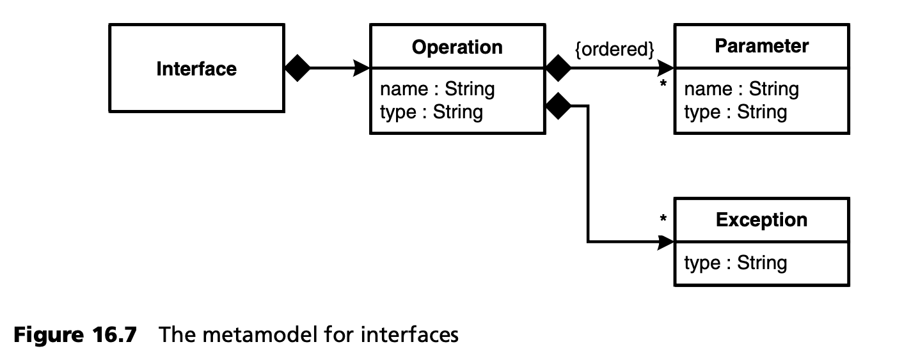
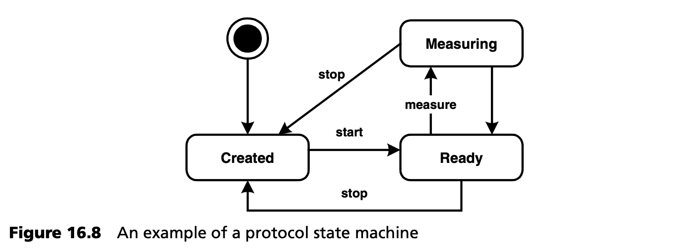
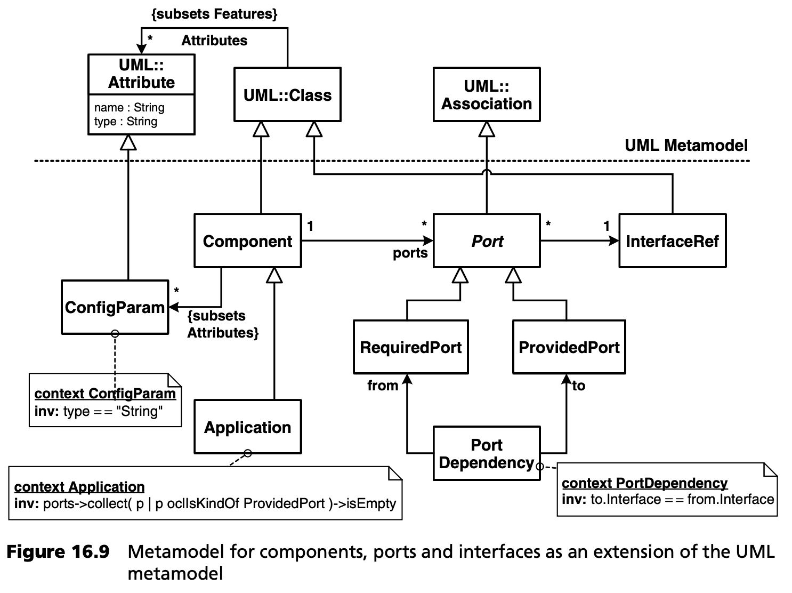
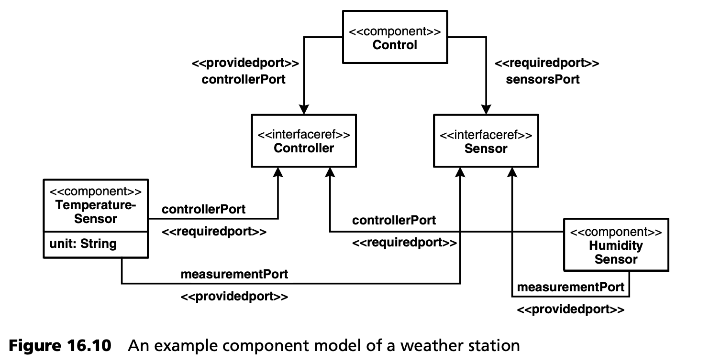
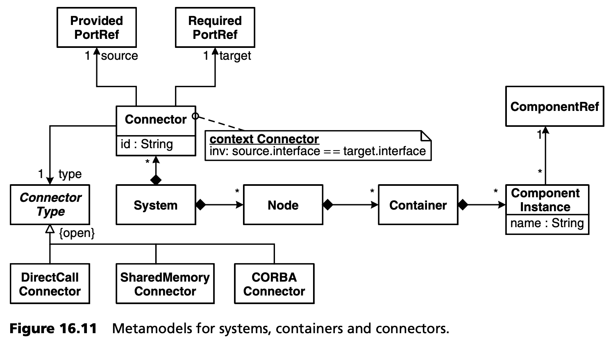
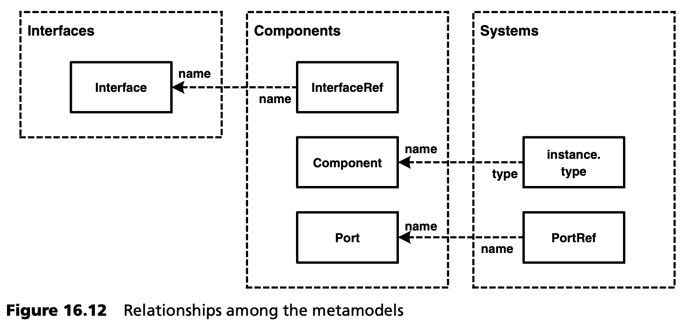
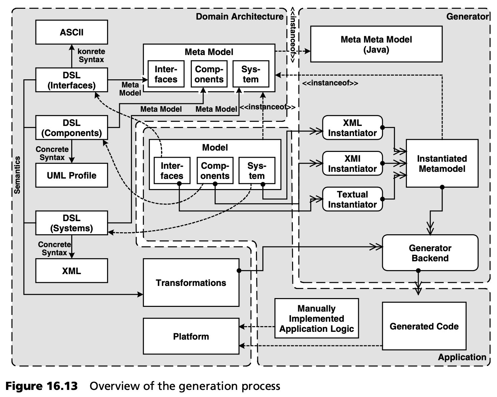

## 16.3 建模
本节介绍系统各子域中的模型。为此，三个子域分别使用了一个定制的 DSL。与所有 DSL 一样，这些 DSL 也包括

- 定义抽象语法和静态语义的元模型。
- 具体语法，定义呈现模型的符号。
- （动态）语义，定义元模型元素的含义。

元模型按照 openArchitectureWare 生成器的规定用 Java 实现。它们通过网关 (gateway) 和代理元类 (proxy metaclasses) 耦合。DSL 的具体语法在所有三种情况下都有所不同。 这里使用了 UML 配置文件 (profile) 以及文本符号（受 CORBA IDL 启发）和特殊的 XML-DTD。在所有三种情况下， DSL 语义是通过生成器，生成实现代码时使用的转换来实现的。

### 16.3.1 接口定义
如何定义组件？组件由一系列提供或使用接口服务的端口组成。图 16.7 显示了接口的元模型。



具体语法将是文本语法，因为图形符号对这一目的没有更多的作用。让我们从接口的定义开始：
```Java
interface Sensor {
   operation start() :void;
   operation stop() :void;
   operation measure() :float;
}
interface Controller {
   operation reportProblem(Sensor s,
         String errorDesc ):void;
}
```
除了接口的语法定义外，协议状态机也可以建模，例如使用 UML。这些状态机定义了可以调用接口操作的顺序。根据这个状态机，可以生成代码，在运行时监控客户端是否遵守了状态机定义的约束条件。如果没有遵守，就会在错误存储区 (error store) 中存储一个错误，随后用于诊断。图 16.8 显示了协议状态机的一个示例。



用于此目的的元模型与众所周知的状态机元模型相对应，由状态、转换、保护和事件组成。这里的事件是指可在接口上调用的操作。后续，我们会探讨接口如何找到其协议状态机，以及如何生成运行时监控代码。

### 16.3.2 组件和端口的定义
接下来我们对组件及其端口进行建模。这里使用的元模型如图 16.9 所示。



由于具体的语法将是 UML 配置文件，我们使用 UML 元模型作为基础。元模型元素 *InterfaceRef* 特别有趣 -- 它是对其它模型中定义的接口的引用。将引用分配到定义它的模型是基于名称等价。图 16.10 是一个基于 UML 的组件模型实例的具体语法。



### 16.3.3 系统的定义
系统由多个节点组成。每个节点上部署一个或多个容器。一个容器承载一个或多个组件实例。组件实例的端口通过 *连接器 (connectors)* 连接。从元模型中可以看出，连接器有不同的种类。图 16.11 展示了这种元模型。



在这里，我们也使用元模型引用来引用其他模型中定义的元素。

对于系统模型，具体的语法是一个 XML schema，它是专门为此目的而设计的。首先，我们定义组件实例、系统节点和容器。
```XML
<system name=“weatherStation”>
   <node name=“main”>
     <container name=“main”>
       <instance name=“controller” type=“Control”/>
     </container>
   </node>

   <node name=“inside”>
     <container name=“sensorInside”>
       <instance name=“tempInside” type=“TemperatureSensor”>’
         <param name=“unit” value=“centigrade”/>
       </instance>
     </container>
   </node>

   <node name=“outside”>
     <container name=“sensorsOutside”>
       <instance name=“tempOutside” type=“TemperatureSensor”>’
         <param name=“unit” value=“centigrade”/>
       </instance>
       <instance name=“humOutside” type=“HumiditySensor”/>
     </container>
   </node>
```
接下来，我们以连接器的形式描述组件实例之间的连接。
```XML
  <!-- temperature sensor outside -->
  <connector name=“toSensorTempOutside”>
     <providedPort instance=“tempOutside” port=“measurementPort”>
     <requiredPort instance=“controller” port=“sensorsPort”>
  </connector>

  <connector name=“fromSensorTempOutside”>
     <providedPort instance=“controller” port=“controllerPort”>
     <requiredPort instance=“tempOutside” port=“controllerPort”>
  </connector>
 
  <!-- humidity sensor outside -->
  <connector name=“toSensorHumOutside”>
    <providedPort instance=“humOutside” port=“measurementPort”>
    <requiredPort instance=“controller” port=“sensorsPort”>
  </connector>

  <connector name=“fromSensorHumOutside”>
     <providedPort instance=“controller” port=“controllerPort”>
     <requiredPort instance=“humOutside” port=“controllerPort”>
  </connector>
 
  <!-- temperature sensor inside -->
  <connector name=“toSensorTempInside”>
     <providedPort instance=“tempInside” port=“measurementPort”>
     <requiredPort instance=“controller” port=“sensorsPort”>
  </connector>

  <connector name=“fromSensorTempInside”>
    <providedPort instance=“controller” port=“controllerPort”>
    <requiredPort instance=“tempInside” port=“controllerPort”>
  </connector>
</system>
```
这就定义了系统的逻辑结构。目前缺少的是对连接器特征的精确描述。现在，第 [16.2.2](2.md#1622-可变性分析和领域结构化) 节中定义的特征模型开始发挥作用。就特征模型而言，以下两种配置是有效的：
```properties
connector.technology=CAN
connector.paradigm=async-cs, polling, blocking
 
connector.technology=local
connector.paradigm=sync
```
对于上述连接器定义，必须额外说明此类配置设置。在这种情况下，会出现一个限制条件：只有当两个实例在同一个容器中活动时，才能在这两个实例之间定义本地 (local) 连接器。生成器必须对此进行检查，并在必要时发出相应的错误信息。

### 16.3.4 完整模型
完整元模型由不同子域的元模型的超集组成。图 16.12 显示了在不同子域之间建立关系的引用类 (reference classes)（代理元素）。



### 16.3.5 处理
图 16.13 显示了生成器如何处理不同的工件。


