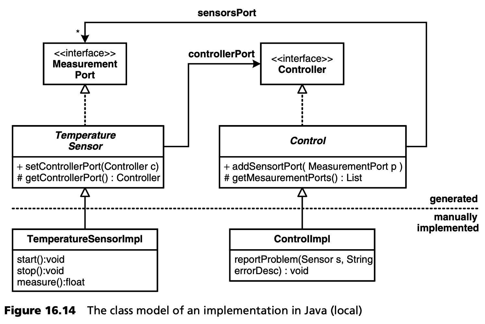
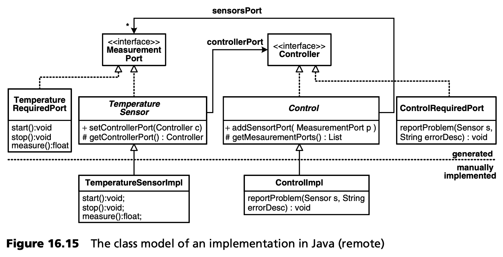

## 16.4 组件的实现
本节展示了组件概念如何映射到编程语言，以及容器如何与组件交互。为了简化问题，我们仅使用 Java 作为示例实现语言。当然，我们也知道，对于 “真正的 ”嵌入式系统，映射到 C 语言会更有意义。不过，映射到 Java 更容易理解，而且在实践中也得到了应用，例如手机。

***映射到 Java***

由于 Java 是一种面向对象的语言，因此可以对组件进行相当直接的映射。图 16.4 给出了一个例子：
- (客户机/服务器)组件接口映射到 Java 接口。
- 对于每个组件，都会生成一个抽象基类，开发人员从中派生出实现组件所提供操作的自定义类。



容器负责在系统启动时正确设置端口引用。然后，开发人员就可以在执行过程中从执行代码中访问这些端口。
```Java
public class TemperatureSensorImpl
                 extends TemperatureSensor {
   public void start() { … }
   public void stop() { … }
   public float measure() {
     float value = // use driver to measure
     if ( /* there is a problem */ ) {
       getControllerPort().reportProblem(this, “cannot measure….” );
     }
   }
}
```
生成代码和非生成代码是完全分离的。如果两个组件都在同一个容器中实例化，也就是在同一个进程、同一个 JVM 中实例化，那么上面的示例就可行。对于分布式组件，必须自动生成代理，如图 16.15 所示。



只有当分布式通信实际发生时，才会生成这些代理。代理包含实现所选通信范例所需的代码：编译、连接管理等。这些功能尽可能以库的形式作为平台的一部分来实现。

由于代理实现了与提供相应服务的组件相同的接口，因此在分布式通信的情况下，组件的实现不会改变，容器只需将代理而不是组件链接起来即可。
