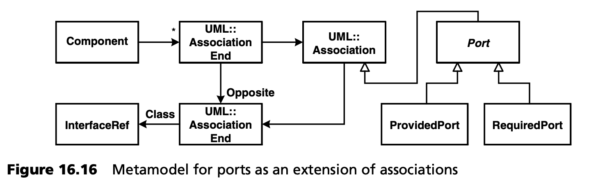

## 16.5 生成器适配
必须对生成器进行适配，使其能够完成以下任务：

- 解析文本语法
- 解析 XML 配置
- 合并不同的部分模型并解决引用问题 
- 验证完整模型
- 生成不同的实现

我们将在下文中简要讨论上述各项要求。

### 16.5.1 文本语法分析
我们使用解析器生成器 *JavaCC* [JCC](../ref.md#jcc) 生成解析器。我们在此不详述这一步骤，只处理与生成器的集成。也可以使用其他解析器生成器代替 *JavaCC*。

我们首先对以下类型的接口定义进行解析：
```java
interface Sensor {
  operation start():void;
  operation stop():void;
  operation measure(): float;
}
```
<ins>*JavaCC* 的任务是解析文本并创建抽象语法树（AST）</ins>。这最终只是一棵对象树，而每个语法节点都使用一个相应的对象。不同的 AST 类用于表示不同的语法元素。这些类与 openArchitectureWare 生成器中的元类相对应。由于后者希望所有元类都继承自 *ModelElement* 类，因此我们必须确保 *JavaCC* 使用的 AST 节点的基类也继承自 *ModelElement*。所有 AST 类都是模型元素。

我们对 *JavaCC* 提供的 *SimpleNode* 类做如下修改，它是所有 AST 节点的基类：
```java
public class SimpleNode
   extends ModelElement implements Node {
 
  public SimpleNode(int i) {
     id = i;
     JCCHelper.getMetaEnvironment().
                      addElement( this );
     setName(“”);
  }
 
  // rest as before…
 
}
```
*SimpleNode* 扩展了 openArchitectureWare 生成器提供的 *ModelElement* 类。构造函数将当前元素添加到生成器的 *元环境 (MetaEnvironment)* 中。如果没有这一行，整个系统就无法运行，因为生成器不会 “知道” 这个对象。

假设我们已经根据合适的 JavaCC 语法定义文件生成了解析器（*InterfaceParser.java*）。然后，我们必须为生成器实现一个相应的前端。生成器前端用于读取模型的具体语法，并提供一组运行时在生成器中可用的 *模型元素 (Model
Elements)* ，作为生成的基础。前端必须实现 *InstantiatorInterface*。前端的实现将解析委托给 JavaCC 生成的解析器。因此，我们的前端看起来像这样：
```java
public class JCCInstantiator
   implements InstantiatorInterface {
 
  public ElementSet loadDesign(
                      InstantiatorEnvironment env)
                      throws ConfigurationException,
                      InstantiatorException {
     JCCHelper.setMetaEnvironment(
                        env.getMetaEnvironment() );
     ElementSet result = new ElementSet();
     String spec = // read specification from somewhere…
     StringBufferInputStream s =
                        new StringBufferInputStream( spec );
     InterfaceParser p = new InterfaceParser(s);
     try {
          ASTStart start = p.Start();
          ASTClass cls = (ASTClass)start.Child().get(0);
          result.add( cls );
     } catch ( Exception ex ) {
            ex.printStackTrace();
     }
     return result;
  }
}
```
这里有两点值得注意：
- 在操作的第一行，当前的 *MetaEnvironment* 被保存到了 *JCCHelper* 中 -- 如上所示，AST 类在其构造函数中会从这里获取 *MetaEnvironment*。
- 在 *try* 代码块中，*ASTClass* 实例被检索。这是写入操作 *result* 的唯一元素。实际上，实例化器 (instantiator) 返回的接口声明是模型的顶层元素。

现在，与生成器的集成已基本完成。我们只需告诉生成器使用实例化器，而不是标准的 XMI 前端。为此，我们编写了一个生成器插件，提供上图所示的 *实例化器 (instantiator)* 。您可以在 openArchitectureWare 文档中找到详细的操作方法。

### 16.5.2 解析系统定义 XML
为了解析 XML 配置，我们使用了一个通用 XML 解析器，它可以从任何 XML 文档创建 openArchitectureWare 模型。这样做的目的是直接使用 XML 文档渲染 AST（模型结构）。然后，解析器只需创建一个代表相同结构的 Java 对象图。

解析器希望在特定包（可由开发人员自由选择）中存在与相应 XML 元素同名的元类。让我们看看下面的例子：
```XML
<system name=“weatherStation”>
  <node name=“main”>
    <container name=“main”>
      <instance name=“controller”
                     type=“Control”/>
    </container>
  </node>
</system>
```
读取 XML 文件后，生成器首先会尝试实例化一个 *System* 类。然后，生成器在相应对象上调用 *setName()* 方法，并提供参数 *“weatherStation”* 。然后，解析器会实例化一个 *Node* 类，设置其名称，并尝试在先前生成的 *System* 对象上调用 *addNode()* 方法。新创建的 *Node* 对象在这里充当参数。

<ins>通过这种机制，解析器可以实例化任何 XML 结构，但前提是必须有与 XML 结构相匹配的元类</ins>。openArchitectureWare 生成器已经提供了一个合适的前端，可以完成此处描述的任务。

### 16.5.3 解析和合并完整模型
只有将所有三个子域的模型放在一起考虑时，完整模型才有意义。生成器必须解析所有三个模型并将它们合并。引用对象（例如 *InterfaceRefs* ）必须与被引用对象（即同名接口）相连接。图 16.12 展示了这些关系。

***解析各种模型***

要解析不同的模型，我们必须向生成器提供所有实例器 (instantiators)。为此，我们创建了一个插件来贡献这些实例器。
```java
package util;
 
public class ECModelReaderPlugin extends GeneratorPlugin {
     private String systemConfFile;
     private String interfaceFile;
     private String componentsFile;
 
     public void init() {
          systemConfFile = getProperty(“EC.SYSTEM”);
          interfaceFile = getProperty(“EC.INTERFACE”);
          componentsFile = getProperty(“EC.COMPONENTS”);
     }
 
     public List contributeInstantiators() {
        return makeList(
          // a frontend that reads the UML model
          new XMIInstantiator( componentsFile ),
          // a frontend that reads the XML system spec
          // use ecMetamodel as package prefix when
          // attempting to load metamodel classes
          new XMLInstantiator( systemFile, “ecMetamodel” ),
          // a frontend that reads the textual spec
          // for the interfaces
          new JCCInstantiator( interfaceFile )
      );
    }
}
```
要让生成器使用该插件，我们必须在实际启动生成器的 Ant 文件中对其进行配置。

***合并模型***

openArchitectureWare 会自动确保各种已解析模型中的模型元素，作为各自 Java 元类的实例出现在一个模型中。模型解析完成后，我们就有了 *Interface* 类和 *InterfaceRef* 类的不同实例。下面的示例节选了 *InterfaceRef* 的定义，它确保 *InterfaceRef* 找到相应的 *Interface*：
```java
package cmMetamodel;
 
public class InterfaceRef extends Class {
 
   private Interface referencedInterface = null;
 
   public Interface Interface() {
      if ( referencedInterface == null ) {
       String myName = Name().toString();
       referencedInterface =
                      (Interface)MMUtil.findByName( this,
                      Interface.class, myName,
                      “Cannot find interface named “+myName );
      }
      return referencedInterface;
   }
}
```
这段代码需要解释一下。操作 *Interface()* 返回相应 *InterfaceRef* 所引用的接口。正如我们已经解释过的，连接是通过名称建立的。操作 *MMUtil.findByName()* 会为我们完成所有工作：它会搜索当前对象（*this*）所属模型中 *Interface* 类的所有实例。如果正好找到一个，则返回该实例。如果一个也没有找到，则会生成一个带有指定错误信息的错误。

请注意，*InterfaceRef* 是一个模型元素，最初是在基于 UML 的组件模型中定义的，而接口则是在文本接口模型中定义的。在生成器的模型表示中，这些差异不再重要，因为它只对实例化的元模型（抽象语法）进行操作。

<ins>在这种方法的帮助下，所有引用都得到了解决，包括接口与其可选协议状态机之间的连接</ins>。

***模型的划分***

我们现在已经回答了如何用不同的具体语法将系统的不同子域（接口、组件、部署）表示为不同的模型，并在生成器中进行合并的问题。DSL 和模型的分区是一个相关的主题，将在第 [15](../ch15/0.md) 章中讨论。为此，如果建模工具不能为分布式建模提供足够的支持，可以在生成器层面使用相同的引用和集成机制。

### 16.5.4 伪声明元模型实现

***约束检查***

解决引用问题只是众多验证步骤之一。如果引用的模型元素不可用，则必须发出错误信息。在复杂的 MDSD 系统中，存在着各种各样的此类约束，生成器必须对其进行检查。

openArchitectureWare 在生成器工作流程中提供了一个单独的步骤来处理这个问题。在解析完整模型后，代码生成开始前，会对所有模型元素调用 *CheckConstraint* 操作。开发人员可以在此操作中加入元类特有的约束（模型不变式）。

我们认为，我们必须能够尽可能简明扼要地表述这些约束条件。基于声明式语言（如 OCL）的语法在这方面有很大帮助。openArchitectureWare 包含许多辅助函数，如 *Checks, Filters* 和 *MMUtil* 等类。下面我们将展示几个示例。

某个模型约束规定，组件不得定义自己的操作。此外，超类或实现的接口也是不允许的：
```java
public class Component extends Class {
 
   public String CheckConstraints() {
      Checks.assertEmpty( this, Operation(),
          “must not have attributes.” );
      Checks.assertEmpty( this, Generalization(),
          “must not have superclasses or subclasses.” );
      Checks.assertEmpty( this, Realization(),
          “must not implement any interface.” );
```
另一个要求是，组件的端口必须有唯一的名称。
```java
      Checks.assertUniqueNames( this, Port(),
            “a component’s ports must have unique names.” );
   }
   // more …
}
```
请注意，*Port()* 操作会返回组件所有已定义端口的集合。

现在考虑接口的约束验证。假设我们只支持 *int* 和 *long* 基础类型。在这种情况下，我们需要检查参数的类型实际上是否只是这两种值中的一种：
```java
public class ASTParameter
            extends SimpleNode { // SimpleNode extends
                                 // ModelElement
     private String type;
     private String name;
     private static String[] types = new String[]
                                     {"int”, “long"};
 
     public void CheckConstraints() {
       Checks.assertOneOf( this, type, types,
                 "Type must be one of int, long” );
     }
 
     public ASTParameter(int id) {
          super(id);
     }
 
     public void setType(String type) {
          this.type = type;
     }
 
     // set name implemented in ModelElement
}
```
正如本例所示，具体语法（UML、文本、XML）的差异已完全消除 -- 我们可以用与文本模型相同的方式检查约束。

***过滤***

在元模型层面，端口是指向 *InterfaceRef* 的 UML 关联。通过过滤组件的所有关联，可以创建所有端口的集合<sup>[5](#5)</sup> 。下面是 *Port()* 操作的实现：
```java
public class Component extends Class {
 
   // as before
 
   public ElementSet Port() {
     return Filters.filter( this, AssociationEnd(),
       new AssocEndOppositeClassTypeFilter(
             InterfaceRef.class ),
       new AssocEndAssocMapper() );
   }
}
```
<ins>要理解这里发生了什么，研究一下元模型相关部分的结构是很有帮助的。由于我们将元模型实现为 UML 元模型的扩展，因此我们也可以在其中找到 UML 元模型的构造。具体来说，模型中的关联表示为：一个 *AssociationEnd* 实例、一个 *Association* 和另一个 *AssociationEnd* 。我们把端口看作 *Association* 的子类。图 16.16 显示了元模型的相关部分。</ins>



根据这个元模型，代码应该可以理解了：调用 *filter()* 操作，它需要四个参数：

- 与所有辅助函数一样，需要提供当前的模型元素。这对于在错误信息中报告正确的上下文非常重要。
- 提供需要过滤的模型元素集合（更准确地说：*ElementSet* ）。这些是相应的 *AssociationEnds*，即以当前元素（此处为组件）为终点的关联末端。
- 过滤器对象。在我们的示例中，这是一个 *AssocEndAssocTypeFilter*。它假定提供了一个 *AssociationEnd* 作为其 *filter()* 操作的输入，然后获取关联并根据指定的类型进行过滤。
- 我们提供了一个 *mapper* ，将每个关联末端映射到其对应的关联对象，因为我们希望获取端口（作为 *Association* 的子类）作为操作结果，而不是关联末端。

如果使用这里介绍的结构，就可以用很少的代价， “伪声明 (pseudo-declaratively)” 地实现功能强大的过滤器。另一种方法是嵌套 *for* 循环。

---
#### 5
组件还可以有其他类型的关联，但我们在此不做讨论。
