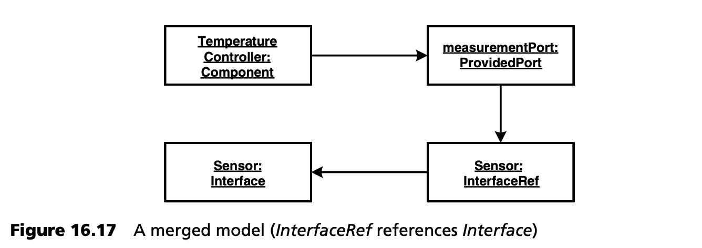
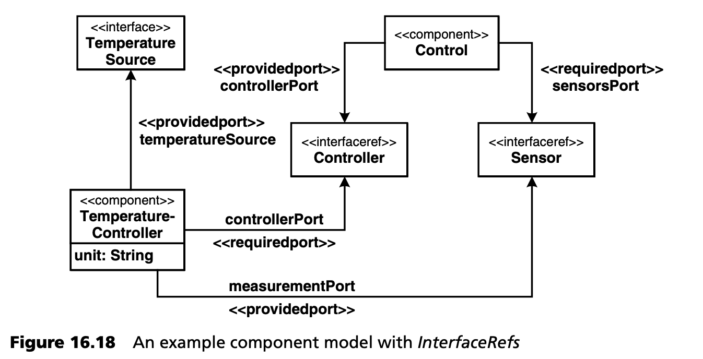
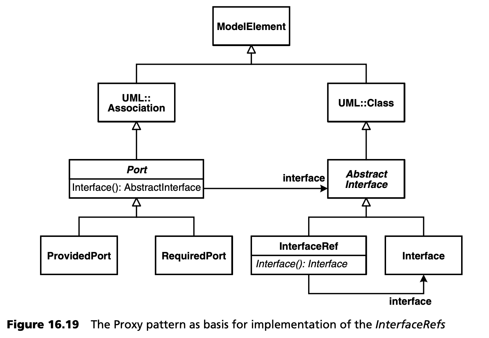
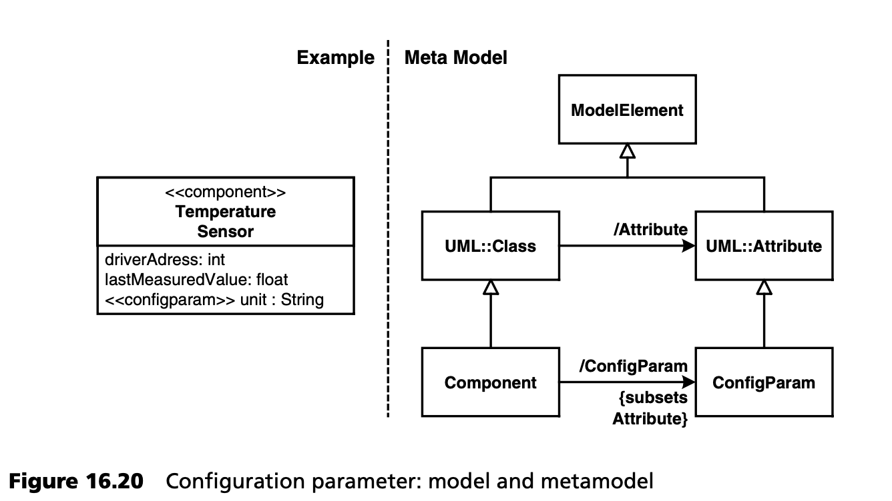

## 16.6 代码生成
代码生成使用模板语言 *Xpand* ，它是前面章节所述 openArchitectureWare 的一部分。在本节中，我们将回避模板语言语法的细节，但会指出其重要特征，并介绍一些有用的元模型实现技术，这些技术可大大简化模板编程。

### 16.6.1 引用
通过引用可以合并不同的模型。模型合并后，组件、端口和相应接口的外观如图 16.17 所示：



不过，从模板的角度来看，接口是否通过引用进行整合并不重要 -- 概念元模型认为端口与接口相关联。为了允许从模板的角度进行这种抽象，我们只需在 *Port* 类中引入 *Interface()* 操作，隐式地去掉引用：
```java
public abstract class Port extends Association {
 
  public InterfaceRef InterfaceRef() {
     // return the model element on the ‘target’ side
     // of this association; remember ports are modeled
     // as associations that point from component to
     // interface reference.
  }
 
  public Interface Interface() {
     return InterfaceRef().Interface();
  }
}
```
因此，*Xpand* 模板的写法如下：
```c
«EDEFINE Something FOR Component»
   public class «Name» implements
   «FOREACH ProvidedPort AS pp EXPAND»
     «Interface.Name»
   «ENDFOREACH»
   {
      // more stuff to come
   }
«ENDDEFINE» 
```
在分布式应用开发中，经常出现这样的情况：特定的模型构造要么直接描述一个元素， 要么对它进行引用。在前一种情况下，我们可以想象：假设接口也可以在 UML 模型中定义。那么，一个特定的接口可能与使用它的组件定义在同一个模型中，也可能位于不同的模型中。在第一种情况下，可以完全不使用引用，让 *Port* 直接指向 *Interface*。在第二种情况下，就必须使用同名的引用，如上图所示。因此，端口既可以直接指向接口，也可以指向自身指向接口的引用。图 16.18 举例说明了这一点：



因此，端口要么与 *Interface* 相关联，要么与 *InterfaceRef* 相关联。为了优雅地解决这个问题，我们可以利用久经考验的面向对象原则，在元层次上实现代理模式 (Proxy pattern)，如图 16.19 所示。



端口的 *Interface()* 操作很有意思。这里我们要区分引用和接口。
```java
public abstract class Port extends Association {
 
   protected AbstractInterface AbstractInterface() {
      // return the “other” end’s class of the
      // association
   }
 
   public Interface Interface () {
     AbstractInterface f = AbstractInterface();
     if ( f instanceof InterfaceRef ) {
       return ((InterfaceRef)f). Interface();
     }
     return (Interface)f;
   }
 
}
```
前面例子中的 *Xpand* 模板可以 “原样” 使用。端口的 *Interface()* 操作总是返回接口，并在必要时在内部取消引用。

实现引用代理 (reference proxys) 的另一种方法是：让引用对象（proxy）以委托 (delegate) 给被引用对象的方式实现所有操作。在这种情况下，proxy 的使用方式与被其引用的对象完全相同。显式区分 -- *Interface()* 操作中的 *Port()* 类-- 就不再适用了。但是，在使用这种方法时，必须确保所有（元模型相关的）操作都是实际委托的。如果被引用的元类发生了变化，则很容易忘记对 proxy 的修改。为了解决这个问题，可以自动生成引用 proxy 和元模型实现。openArchitectureWare 框架已经包含了这样一个元盒 (meta-cartridge)。

### 16.6.2 多态性
生成器支持模板级别的多态性：如果在一个模板文件中存在多个对不同元类有效的模板定义，生成器总是使用与模型元素动态类型最匹配的类型声明来展开该模板。我们可以用一个简单的例子来说明这一点：除了配置参数，组件还可以有描述组件状态的普通属性。图 16.20 显示了一个例子及其在元模型中的表示。



因此，所有属性的集合包含普通属性和 *ConfigParams* 。因此可以编写以下 *Xpand* 模板：
```
«DEFINE Something FOR Component»
   public class «Name» {
      «EXPAND AttrDef FOREACH Attribute»
   }
«ENDDEFINE»
 
«DEFINE AttrDef FOR Attribute»
   private «Type» «Name»;
«ENDDEFINE»
 
«DEFINE AttrDef FOR ConfigParam»
   private String «Name»; // config param
   public void configure«UpperCaseName»( String value ) {
      this.«Name» = value;
   }
«ENDDEFINE» 
```
在第三行中，该模板会遍历所有属性，并为每个属性展开 *AttrDef* 模板。如果当前属性确实是 *ConfigParam*，则运行特定模板。通过这种方式，可以避免典型的 *if-isInstanceOf* 级联：因此模板更易于维护。

### 16.6.3 元模型中的关注点分离

***实用工具***

元模型代表了问题空间的概念 -- 至此，一切顺利。然而，元类中往往会出现与问题空间无关的方面。例如，我们在上面使用了模板中的 *UpperCaseName* 属性。这意味着我们当前处理的元类（在上面的例子中为 *ConfigParam* ）中必须存在以下操作：
```java
public String UpperCaseName() {
    String n = // format Name().toString() appropriately
    return n;
}
```
我们不仅要在 *ConfigParams* 中使用 *UpperCaseName*  属性，还要在所有有名称的模型元素中使用该属性。还有更多有用的实用工具，例如当前日期、增量计数器的值等等。在元模型中实现所有这些操作，以便在任何地方（即在 *ModelElement* 中）都能使用，并不是一件特别优雅的事。如果能按需 “修补 (patch in)” 这些实用程序就更好了。

使用 *invokers* 就可以做到这一点。如果在模板中调用一个不存在的属性，先前注册的 invoker --[POSA2](../ref.md#posa2) 中拦截器模式 (Interceptor pattern) 的实现-- 就会被调用。invoker 现在有机会返回相应属性的值。下面的 invoker 提供了 *UpperCaseName*：
```java
package genfwutil.mmutil.invoker;
 
public class UtilInvoker
           implements PropertyInvoker {
 
   public Object handleInvocation( Element element,
            Syntax syntax, Element name, String propertyName)
            throws EvaluationException {
      if ( propertyName.equals(“UpperCaseName”)) {
        String n = element.getNameProperty();
        return n.substring(0,1).toUpperCase()+
                 n.substring(1);
      }
      throw new DesignError( “Property “+propertyName+
                                       ” not found on “+element );
   }
}
```
生成器会对 invoker 调用 *handleInvocation()* 操作。该操作有各种参数，包括要调用的属性（*propertyName* ）及当前模型元素（*element*）。如果 invoker 无法提供所需的属性，就会抛出 *DesignError*。

为了让 invoker 发挥作用，我们必须让生成过程知道它。为此，我们一如既往地将其作为插件的一部分与 *CounterInvoker* 一起提供，后者使用 *CounterReset、CounterInc* 和 *CounterValue* 属性在模板中提供计数器：
```java
package util;
 
public class ECCodeGenPlugin extends GeneratorPlugin {
 
    public List contributeInvokers() {
      return makeList(
         new UtilInvoker(),
         new CounterInvoker()
      );
    }
}
```
***不同的目标语言***

如果需要为多种目标语言生成代码，也会出现类似的问题，就像这里的例子一样。我们需要在元模型中为每种目标语言提供实用方法。以 Java 为例，*PackageDirectory* 可以返回当前模型元素的 *Package* 的相对目录。
```
«DEFINE JavaImpl FOR Component»
    «FILE PackageDirectory"/"Name”.java"»
    package «JavaPackage»
    public class «Name» {
        …
    }
«ENDDEFINE» 
```
我们不难想象，元模型的实现很快就会被不同目标语言的各种工具属性所 “污染” 。因此，必须找到一种结构更好的解决方案。这种解决方案可以通过一种特殊的 invoker, *SubpackageInvoker* 来实现。该 invoker 试图实例化另一个类，并通过反射调用相应的属性。假设我们有以下元类：
```java
package ecMetamodel;
public class Component extends Class {
    // some Operations
}
```
如果我们现在希望实现 Java 平台特有的操作，我们可以在另一个类中实现这些操作：
```java
package ecMetamodel.java;
public class Component_Java implements StatefulDelegate {
 
   private Component component;
 
   public void setModelElement(ModelElement me) {
      this.component = (Component)me;
   }
 
   public String JavaPackage() {
      …
   }
 
   public String PackageDirectory() {
      …
   }
}
```
由于这些操作不是在元类的上下文中实现的，*this* 并不指向当前模型元素，而是指向辅助对象。因此，当前模型元素是通过 *setModelElement()* 操作提供给辅助对象的。现在，开发者可以实现这些属性，就像直接在元类中定义属性一样。但他们必须（显式地）通过 *component* 而不是 *this* 来访问模型元素。

要实际使用这些辅助类，需要像在第 [335](#1663-元模型中的关注点分离) 页的示例中注册 CounterInvoker 和 UtilInvoker 一样贡献 SubpackageInvoker。
```java
public class ECCodeGenPlugin extends GeneratorPlugin {
 
     public List contributeInvokers() {
        return makeList(
            new UtilInvoker(),
            new CounterInvoker(),
            new SubpackageInvoker( “java”, “Java” )
        );
     }
}
```
上面配置的 *SubpackageInvoker* 会尝试为元类 *p.q.C* 实例化辅助类 *p.q.java.C_Java* 并在其上调用属性操作。这样就可以将元模型中的各个方面委托给不同的类，并使用 invoker 将它们显式地 “贡献” 到模型中。

### 16.6.4 生成编译文件
在代码生成过程中，不仅要创建 Java、C 或 C++ 源代码。还必须创建配置操作系统平台的配置文件。在大多数情况下，实时操作系统都提供了大量的配置选项，以便使系统尽可能小，并为各自的应用提供特定的配置。此外，还必须创建 makefile 和 Ant 文件，以便根据各自平台的要求，将生成的代码与手工代码进行编译、链接和打包。

下面的示例展示了 *Jar* 文件的创建过程。只要我们处理的是 Java 容器，就会为系统中定义的每个容器创建自定义 *Jar* 文件。
```
«DEFINE BuildFile FOR System»
      …
   «FOREACH Container AS c EXPAND»
       «IF c.LanguageID == “java”»
          <jar jarfile=”«c.Name».jar”>
             <fileset dir=“${APP.BUILD}”>
                «FOREACH c.UsedComponent AS comp EXPAND»
                  <include name=“generated.comp.«comp.Name»/**/*.class”/>
                  <include name="manual.comp.«comp.Name»/**/*.class"/>
                     «FOREACH comp.UsedInterface AS i EXPAND»
                         <include name="generated.interfaces.«i.Name»/**/*.class"/>
                     «ENDFOREACH»
                «ENDFOREACH»
            </fileset>
         </jar>
     «ENDIF»
  «ENDFOREACH»
     …
«ENDDEFINE» 
```
正如您在模板摘录中看到的，各组件使用的所有接口也都包含在内。

### 16.6.5 AspectJ 的使用
本节说明了 AspectJ 在 MDSD 生产流程中的集成可能，涉及 MDSD 与 AOP 之间的关系。

这里我们以跟踪 (tracing) 为例。这实际上是 AOP 的标准示例，但它在嵌入式系统领域的应用却非常现实，因为在目标平台上进行调试通常并不容易。同样重要的是，如果有必要，我们可以关闭跟踪 (tracing) 产生的任何开销，以节省实际应用中的资源。

我们的想法是在系统配置过程中定义应为哪些容器生成跟踪 (tracing) 代码：
```xml
<node name=“outside”>
   <container name=“sensorsOutside” tracing=“app”>
       …
   </container>
</node>
```
XML 属性可以有以下值：

- *no*：关闭跟踪。
- *app*：只跟踪组件的应用逻辑操作。
- *all*：跟踪容器中的所有操作。

我们还假设，生成的代码只能是无法更合理地手工编写的那种。我们定义了一个抽象 aspect，其中包含作为平台一部分的跟踪功能。这个 aspect 包含一个抽象 pointcut，我们随后将使用代码生成将其 (pointcut) 具体化。
```java
package aspects;
 
public abstract aspect TracingAspect {
 
      abstract pointcut relevantOperationExecution();
 
      before(): relevantOperationExecution() {
               // use some more sophisticated logging,
               // in practice
        System.out.println( thisJointPoint.toString() );
      }
 
}
```
该 aspect 会在由 pointcut *relevantOperationExecution* 标识的所有位置创建跟踪信息。它仍被定义为 abstract。在生成过程中，我们将继承它并定义该 pointcut。下面的模板展示了如何实现这一点：
```
«DEFINE LoggingAspect FOR System»
       …
    «FOREACH Container AS c EXPAND»
      «IF c.Tracing == “app"»
         «FILE “aspects/"c.Name"Tracing"»
         package aspects;
         public aspect «c.Name»Trace extends TracingAspect {
             pointcut relevantOperationExecution() :
                 «FOREACH c.UsedComponent AS comp
                                   EXPAND USING SEPARATOR “||”»
                 execution( * manual.comp.«comp.Name»..*.*(..) )
               «ENDFOREACH»
           ;
        }
       «ENDFILE»
     «ENDIF»
   «ENDFOREACH»
      …
«ENDDEFINE» 
```
因此，外部容器将生成以下代码：
```java
package aspects;
public aspect sensorsOutsideTrace extends TracingAspect {
   pointcut relevantOperationExecution() :
      execution( * manual.comp.temperatureSensor..*.*(..) )
      ||
      execution( * manual.comp.humiditySensor..*.*(..) )
      ;
}
```
如果我们现在使用 AspectJ 编译器而不是 *javac*，这个切面 (aspect) 会自动添加。它会在执行实现包中代码的所有操作之前生成跟踪输出。*AspectJ* 还支持更丰富的跟踪功能，例如记录调用位置。

正如本例所示，MDSD 生成器和 AOP 的连接可以产生强大的解决方案。有关 MDSD 和 AOP 交互作用的详情，请参阅 [Voe04](../ref.md#voe04)。
