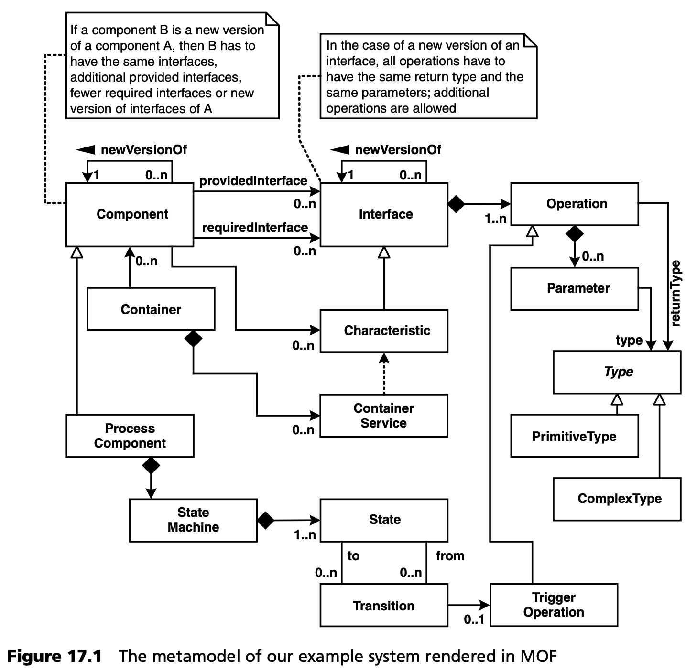
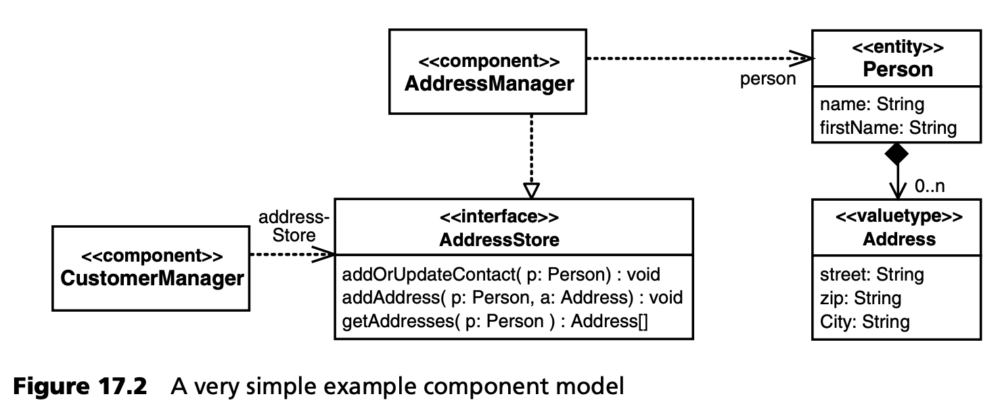
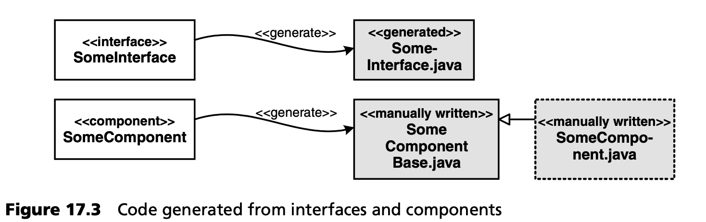
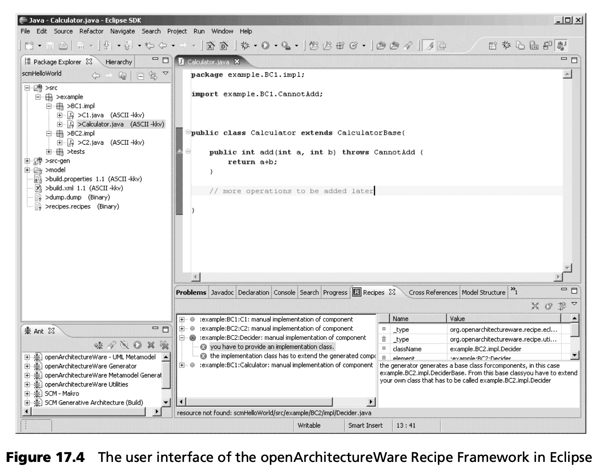
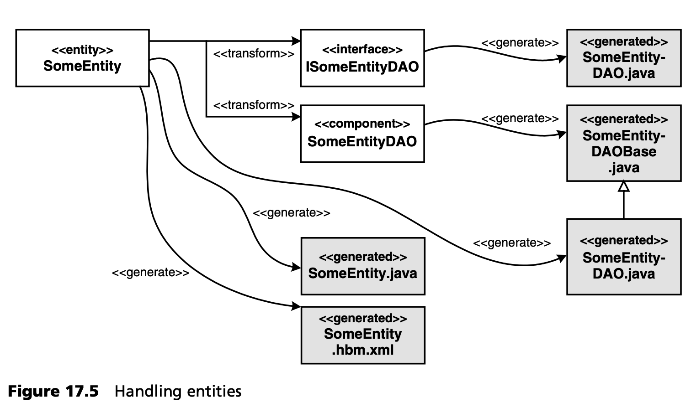
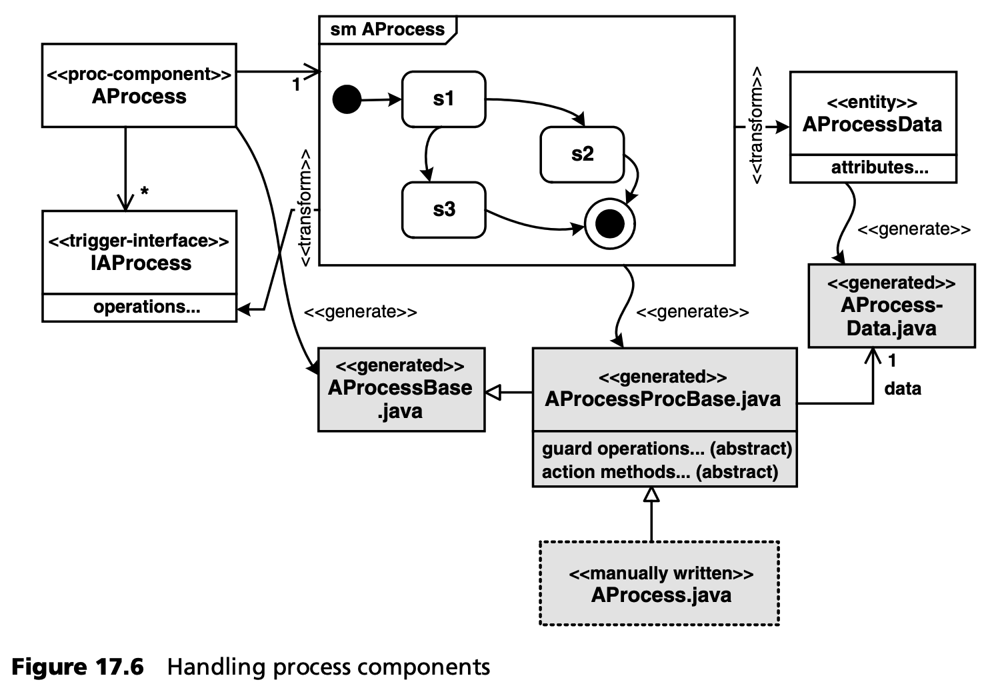
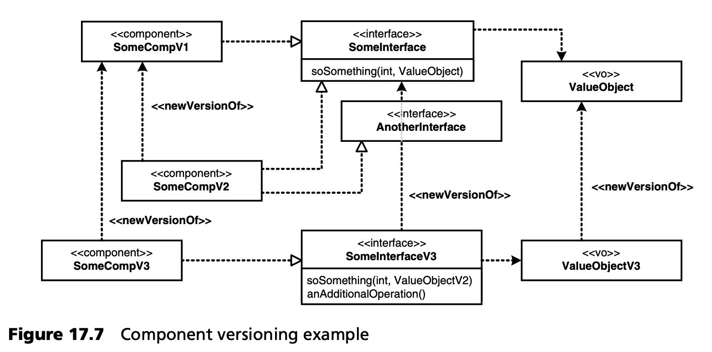

## 17.4 第三阶段：自动化

### 17.4.1 架构元模型
系统的简化元模型如下所示，它以 MOF 模型的形式呈现。



值得注意的是，即使是承载组件的组件容器，其服务也是模块化的。Characteristics（特殊类型的接口）是用于标记组件所需的服务。持久性或生命周期等容器服务将负责提供相应特性接口的组件。下面的源代码片段就是一个例子：
```java
public @component class ComponentWithState
            implements IPersistentCharacteristics {
 
   private ComponentWithState_State state;
 
   // required by IPersistentCharacteristics
   public IEntity getPersistentState() {
   return state;
   }
 
   // required by IPersistentCharacteristics
   public void setPersistentState( IEntity state ) {
      this.state = state;
   }
}
```
### 17.4.2 胶水代码生成
我们的方案有几个有用的胶合代码生成位置：

- 我们根据实体生成 Hibernate 映射文件。
- 我们根据用于通信的接口和数据类型生成 Web 服务和 CORBA 适配器。生成器使用反射来获取必要的类型信息。
- 最后，我们根据状态机实现生成流程接口。

在编程模型中，我们使用 Java 5 注释来标记那些仅靠反射无法导出的方面。注解可以帮助代码生成器知道应该生成什么，而不会使编程模型过于难看。

### 17.4.3 基于 DSL 的编程模型

***组件和接口***

在组件、接口和依赖关系等几个方面，使用 DSL 是非常有意义的。在模型中描述这方面的内容有两个好处：首先，GLUE 代码生成可以使用语义更丰富的模型作为输入；其次，如第 17.4.4 节所述，模型允许进行非常强大的基于模型的架构验证。



图 17.2 包含两个组件、一个共享接口和两个数据结构的逻辑模型。从这些图中，我们可以生成各种东西。根据组件及其接口，我们可以生成一个骨架组件实现类以及所有必要的 Java 接口。开发人员只需继承生成的骨架，并实现所提供接口定义的操作即可。下面的插图说明了这一点。



我们描述的编程模型要求开发人员编写扩展生成基类的实现类。问题在于，这种方法让开发人员承担了做正确事情的责任：如果他们忘记提供实现类，系统将无法编译，或者在运行时出现奇怪的故障。为了尽量减少这些问题，我们使用了一个配方框架（见第 11.1.4 节），以便在代码生成器完成工作后进一步指导开发人员：

- 我们对模型中的每个组件都要进行两次检查。一个是检查是否存在符合要求的命名模式的类：对于模型中的组件 X，必须在代码中存在一个名为 X 的类，并位于正确的包中。另一项检查是验证该类是否实际扩展了正确的（生成的）基类：对于模型中的组件 X，实现类 X 必须扩展 XBase。
- 这些检查存储在生成代码的随附文件中。
- 在IDE中，配方框架的集成开发环境部分会加载该文件，并根据代码库评估检查。每当工作区内容发生变化时，就会重新评估检查。该视图为开发人员提供了一种优雅的方式来查看使软件结构完整所需的未完成任务。

图 17.4 显示了IDE（在本例中为使用 openArchitectureWare Recipe Framework 的 Eclipse）如何渲染检查。底部中央窗格显示了三项已通过的检查（因为组件实现类可用）和一项未通过的检查（针对 Decider 组件）。



***实体***

如图 17.5 所示，实体的处理比较有趣。首先，我们生成相应的 Java Bean（SomeEntity.java），包括其 Hibernate 映射文件 SomeEntity.xbm.xml。除此之外，我们还想为每个实体创建数据访问对象（DAO）组件。DAO 组件提供创建、读取、更新和删除相应实体实例的操作。我们不直接从实体生成这些组件的代码，而是使用模型到模型的转换来创建类似 DAO 组件及其接口的模型元素。经过这种转换后，模型就包含了一个额外的接口和一个额外的组件。这些接口/组件与其他接口/组件一样，由现有的代码生成模板生成 Java 界面和实现骨架类。我们无需编写新的模板！



然而，DAO 组件还缺少实现。实现代码通常是由开发人员手动编写到一个实现类中，该类扩展了生成的实现骨架类。但是，对于 DAO，我们也可以为其操作生成实现--这些操作只需创建、读取、更新和删除相应实体的实例--只需几行（Hibernate）代码。

因此，我们现在创建一个额外的模板，按照开发人员创建实现类时遵循的相同规则为 DAO 组件生成实现：实现类扩展生成的实现骨架。

这种方法有很多优点：我们只需编写较少的模板，我们可以重复使用已经测试过的模板，而且 DAO 及其接口在模型中显示为模型元素，而不仅仅是 “哑 ”代码文件。这对编程模型的下一个方面，即系统建模非常重要。

***系统建模***

现在，我们可以创建自己的系统组成和部署模型。这样我们就能生成更多有用的工件。让我们从组成模型开始。我们在这个模型中定义了各种命名的配置。每个配置（customerStuff 和 addressStuff）都包含若干组件实例及其接线。测试配置比较特殊，它没有定义自己的实例，而是将其他两个配置合并成一个用于测试。值得注意的是，我们还可以创建从实体中创建的 DAO 组件实例。由于我们不仅仅是为这些组件创建代码，而是通过使用模型到模型的转换创建了真正的模型元素，因此我们现在可以 “抓取 ”该组件并为其定义实例。如果我们直接从实体生成代码，就无法做到这一点。
```xml
<configurations>
 
   <configuration name="addressStuff">
      <instance name=“am” type=“AddressManager”>
         <wire name=“personDAO” target=“personDAO”/>
      </instance>
      <instance name=“personDAO” type=“PersonDAO”/>
   </configuration>
 
   <configuration name=“customerStuff”>
      <instance name=“cm” type=“CustomerManager”>
         <wire name=“addressStore” target=“:addressStuff:am”/>
      </instance>
   </configuration>
 
   <configuration name=“test” includes=“addressStuff, customerStuff“/>
</configurations>
```
第三个模型描述了我们在其上部署组合模型中定义的配置的系统。
```xml
<systems>
 
   <system name=”production”>
      <node name=”server” type=”spring” configuration=”addressStuff”/>
      <node name=”client” type=”eclipse” configuration=”customerStuff”/>
   <system>
 
   <system name=”test”>
      <node name=”test” type=”spring” configuration=”test”/>
   <system>
</systems>
```
在这里，我们定义了一个名为 “生产” 的系统，它由两个节点组成：一个节点扮演服务器的角色，另一个节点扮演客户端的角色。服务器托管 addressStuff 配置，客户端托管 customerStuff。请注意，我们还定义了各自节点的类型（服务器为 Spring，客户端为 eclipse）。根据这两个模型，我们可以生成

- 服务器的 Spring 配置文件。
- 客户端所需的插件。
- 创建必要部署工件的构建文件。
- 远程通信基础设施（CORBA、Web 服务）。
- 组装必要部署工件的构建文件。

如果我们实际生成了测试系统，那么我们只会得到一个 Spring 节点，所有组件实例都会部署到这个节点上进行单元测试。不会生成远程基础设施。这是因为我们将测试配置（包含所有实例）部署到了系统模型中的单个节点上。

***测试支持***

在实际案例中，我们为测试提供了更多支持。例如，对于每种配置，我们都会生成一个测试用例基类，其中包含所有设置信息，以便按照组合模型和系统模型的规定构建系统。开发人员可以从这些生成的骨架测试中扩展实现测试功能。

在这种情况下，支持测试的另一种非常有趣的方法是使用模拟对象。我们以一种非常温和的方式集成了 EasyMock 框架 [EASY](../ref.md#easy)：要为特定组件实例（而不是实现类实例）获取一个 mock 对象，我们唯一需要做的就是在组成文件中添加 mock=“true” 属性：
```xml
<configurations>
 
   <configuration name=“addressStuff”>
      <instance name=“am” type=“AddressManager” mock=“true”>
         <wire name=“personDAO” target=“personDAO”/>
      </instance>
   </configuration>
 
<!– rest as before –>
 
</configurations>
```
由于 am 实例的 mock 标记被设置为 true，因此生成的测试上下文现在包含一个 EasyMock 模拟控制对象，可用于测试。下面的代码片段展示了如何在一个简单的测试中使用这些模拟：
```java
public class AddressManagerTest extends TestSystemTest {
   public void testAddressManager() {
      Address a = new Address( “Ziegelaecker 11”, “89520”, “Heidenheim” );
      setupMock(a);
      Person p = new Person();
      Address[] addresses = context().getAm().getAddresses(p);
      assertEquals( 1, addresses.length );
      assertEquals( a, addresses[0] );
   }
   private void setupMock(Address a) {
      context().getMockControlAm().reset();
      context().getAm().getAddresses(null);
      context().getAm().setReturnValue( new Address[]{a} );
      context().getMockControlAm().replay();
   }
}
```
我们还为流程组件提供了特定的测试支持。例如，您可以编写断言，检查在以特定方式触发流程组件后，是否调用了特定的操作。

有了这些测试支持功能，就可以将 MDSD 与测试驱动开发结合起来。通常，开发人员会对组件和接口以及简单的测试配置和系统进行建模。在此基础上，除了业务逻辑和测试方法之外的所有内容都会生成。然后，开发人员将继续实施测试，通常使用模拟设施。最后，再添加实施代码，直到满足测试要求。流程的开发方法与此类似，都是基于为流程组件提供的特定测试支持。

***流程组件***

为了完成模型到模型的转换和级联 MDSD，让我们来看看我们是如何处理流程组件及其机器的。



在此模型中，我们将创建一个名为 AProcess 的流程组件。该组件提供了一个接口 IAProcess。我们不会在该接口中模拟任何操作--它是空的。我们还将流程组件的状态机（smAProcess）与组件关联起来。它的状态图包含状态、转换、触发器、操作和保护，就像其他状态图一样。下面的流程在生成器运行时启动：

- 根据状态图中的触发器，我们使用模型到模型转换将必要的触发器操作添加到空接口中。
- 通过另一种模型到模型的转换，我们创建了一个实体，该实体包含描述相应状态图所描述的流程实例所需的所有数据。
- 处理实体的机制现在 “抓取 ”实体，并创建 DAO 组件、其接口、Java Bean 和 Hibernate 映射文件。这与处理实体一节（第 348 页）中定义的过程完全相同。无需编写特定的转换或模板。
- 流程组件的接口与其他接口一样处理：从中生成一个 Java 接口。
- 组件的处理与其他组件一样：生成一个实现骨架类。
- 现在，我们需要提供一个专门针对流程组件的额外模板。正如 DAO 组件的实现可以自动生成一样，我们现在也可以生成执行进程状态机的进程组件（AProcessProcBase.java）的实现：我们为此使用了一个大的 switch 语句。根据规则，该类扩展了生成的实现骨架类。但是，由于我们必须在操作方法和防护操作中添加业务逻辑，因此生成的类仍不完整：开发人员必须对其进行扩展，并覆盖防护和操作方法。我们再次使用配方框架来指导开发人员。

我们再次大量使用了模型到模型的转换。虽然这种方法最初看起来可能相当错综复杂，但在实际生活中却非常有用，因为只需要开发很少的转换代码。如果我们将持久化机制从 Hibernate 更改为其他机制，持久化流程的实现也会自动更改。

模型到模型转换的几个层级相互叠加，使我们最终得到了一个用于业务流程建模的 DSL，这对必须定义流程的业务分析师来说非常有吸引力。整合这些项目团队成员的机制如下：

- 分析人员最初创建了一个状态图，直观地描述了业务流程，就像他们习惯使用状态图一样。
- 然后，一名开发人员加入了分析师的行列。他们一起将直观的状态图标注为足够正式的状态图，作为代码完成的输入。这涉及到定型的应用、以结构化的方式制定防护措施，以及检查图表的完整性。代码生成器的验证功能用于检查状态图在代码生成方面的完整性。
- 对状态图的进一步修改主要由分析人员直接在正式版本上进行。在某些情况下，开发人员也参与其中。

这种方法大大提高了分析人员和开发人员之间的融合，使分析过程比以前更加 “有形” 。

### 17.4.4 基于模型的架构验证
由于系统将由大量开发人员构建，因此架构约束检查是必不可少的。我们会进行一些基本的模型检查，例如检查流程中的所有触发器是否都有调用触发器的组件。其他检查包括依赖关系管理。组件之间的循环依赖关系很容易发现。组件被分配到不同层（应用程序、服务、基础层），只允许在特定方向上存在依赖关系。编程模型以依赖注入和控制反转为基础，再加上从模型中生成组件签名这一事实，可防止开发人员创建模型中未描述的组件依赖关系。模型中无效的依赖关系也很容易被检测出来。

在我们的示例系统中，另一个非常重要的方面是接口的演变。请看下图



请注意该图是如何明确指出新版本的内容的。这对于检查和执行兼容性规则是至关重要的，这些规则可以确保期望使用 SomeInterface 的客户端也能处理新版本，例如 SomeInterfaceV3。生成的 SomeInterfaceV3 实现继承自 SomeInterface。这使得接口类型兼容。生成器还能确保接口的新版本具有相同的操作（可能还有附加操作）。接口可以通过使用新版本的值对象来完善操作，新版本的值对象继承于旧版本的值对象。因此，生成器的验证阶段会执行一些规则，确保组件和接口的新版本始终与旧版本兼容。
