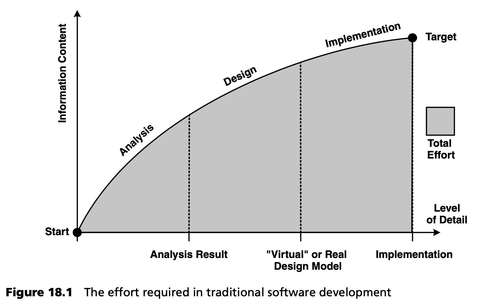
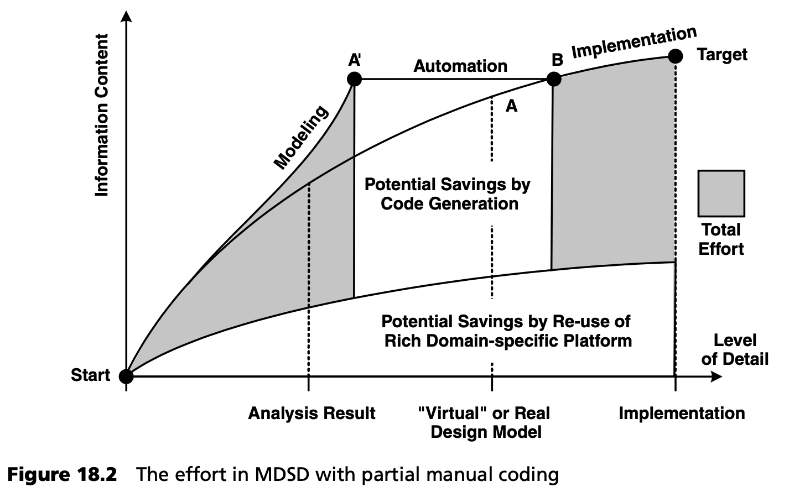
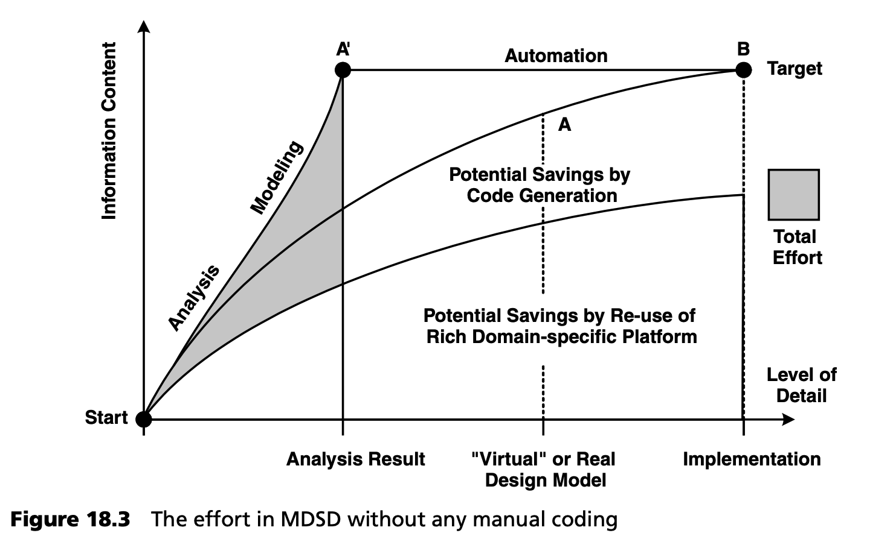

## 18.2 自动化和重用
在经典的面向对象开发过程 [JBR99](../ref.md#jbr99) 中，设计模型是通过逐步细化模型的一部分来逐步和迭代地创建的，该模型是通过将模型投影到几个用例来建立的。该模型经过完善后，或多或少可以直接转化为实现。

这样的模型也可以通过逆向工程从实现中自动提取出来。我们称这种抽象层级为 *实现模型 (implementation model)* ，因为它包含了实现的所有特征细节（但通常不会超过这些）。

图 18.1 显示了开发增量[1](#1)  从分析到实现的理想化开发过程。随着时间的推移，对增量的理解程度和详细程度都会提高。<ins>在开始阶段，会有更多的理解：到最后，会有更多的细节。草图或幻灯片形式的 GUI 设计，与使用 JSP 页面或类似东西完成的 GUI 实现，所包含的信息几乎相同。这意味着，实现增量的过程主要是一项需要繁琐工作的任务，它增加了增量的详细程度，但却很难提高理解程度</ins>。尽管如此，为了将基本信息转换成计算机可读的形式，这项工作还是必要的。

至于这是否是反复进行的，在这里并不重要。总体努力基本上由前面提到的两个维度的进展组成，即与曲线下方的区域相对应。

实现模型 (implementation model) 的缺点可归纳如下：

- 实现模型无法提供清晰的整体视图，因为关键信息在海量细节中被淹没。
- 当需要培训新的团队成员时，这种模型相对不适用。
- 从分析结果到实现模型的路径非常漫长，且没有明确的里程碑。不同开发人员得出的中间结果往往各不相同。从整体上看，它们很难构成一个可用的、完整的模型。
- 设计变更最好在源代码中进行。之后，通过逆向工程使静态实现模型保持一致。<ins>较抽象的中间结果很少得到维护，特别是因为通常不清楚实现模型的变化可能或应该对中间结果产生哪些影响。其结果是，只有静态实现模型是最新的（如果有的话）。动态方面的内容被忽视，甚至从模型中删除，因为它们不再适合。在大多数情况下，项目结束时并不存在比源代码本身更抽象的一致文档。</ins>

如果采用足够抽象的视角，图 18.1 可以转换为敏捷流程。实现模型 (implementation model) 通常只以虚拟形式存在，即源代码的形式。当然，这也避免了一些缺点，部分原因是我们有意省略了具体的工件。然而，与重量级流程一样，必须在开发过程中获得必要的理解程度。软件或增量中包含的功能需求（分析结果）也是如此。换句话说：根据流程的不同，图中的里程碑可能有其他名称，也可能不明确存在，但曲线的形状基本相同。

<ins>为了便于讨论，我们将软件开发的整体努力，简化为 *信息获取 (information gain)* 和 *详细程度 (level of detail)* 这两个因素</ins>，并有意识地忽略了，需求变化或新见解 (new insights) 给理解程度带来的困扰。我们这样做并不是因为这些影响无关紧要，而是因为它们可以与本文所述问题分开单独研究。

我们现在将 MDSD 的核心优势 -- *自动化 (automation)* 和 *重用 (reuse)* -- 引入本次讨论。

在这里，我们可以清楚地看到抽象的效果，即建模语言向问题空间的转移（见图 18.2）：

- 所创建的，非常紧凑的模型具有统一的、正式定义的抽象层次，远高于实现模型 (implementation model) 的抽象层次。例如，A' 点明显位于实现模型 A 的左侧，这意味着它包含的细节更少。
- 本文中描述的这些形式化 MDSD 模型（在点 A' 处）包含的信息量远多于相应的实现模型，这主要得益于其形式化语义，尤其是因为不仅定义了签名，还定义了部分实现。例如，A' 点高于实现模型 A，意味着其信息量更大。
- <ins>这正是自动化的潜力所在：生成器无法获取更多信息，但却可以轻松提高详细程度。因此，图中的自动化效果严格来说是横向的，不费吹灰之力就能到达 B 点[2](#2)。根据领域和具体方法（见第 [4](../ch4/0.md) 章）的不同，B 点离目标更近或更远，决定了剩余（手工）编码的工作量。</ins>

在极端情况下，模型指定了（部分）应用的完整语义，因此根本不需要手工编码（见图 18.3 ）。这在什么情况下是可能的或有用的，将在后面的第 [18.6.2](../ch18/6.md#1862-功能专业-mdsd-领域) 节中讨论。

<ins>生成器无助于提高理解水平。因此，所有信息都必须已经存在于模型中，并使用特定领域建模语言（DSL）表达出来 -- 见第 [2.3](../ch2/3.md) 节和第 [4.1.1](../ch4/1.md#411-建模) 节。参照图 18.2，曲线在靠近 A' 点的地方比靠近 A 点的地方上升得更陡。这意味着您必须花更多的精力去理解这个领域 -- 这有一个积极的副作用，就是迫使您真正去思考这个领域。</ins>

在这里，我们也会遇到一种极端情况：如果建模语言与问题空间非常接近，分析结果就可以直接转化为形式化模型 -- 也就是说，A' 点在包含相同信息量的情况下更接近分析结果，或者说，A' 点的位置与分析结果相同，从而成比例地提高了自动化潜力。另一方面，这也意味着分析必须更加正式（见图 18.3）。

以汽车工程领域的比喻为例：在当地的汽车经销商处，您需要填写一份订购单，上面列出您想要的汽车类型和任何特殊功能。订购单上的特征构成了特定领域语言。在订购汽车时，您不必担心实现细节，如发动机结构。工厂会根据领域模型（您的订单），使用预制构件生产出所需的产品（您的汽车）。显然，工程设计的成就在于建立生产线 (production line)，并将您的功能订单映射到生产线上。物品的生产本身是自动化的。

<ins>提高效率的第二个重要方面是由组件、框架等组成的特定领域平台的 *可重用性 (reusability)* 。在这里，只需将精力从应用开发转移到平台的创建上（见图 18.2 和 18.3 ），而平台是可重复使用的。这种可重复使用的工件几乎可以在所有其他开发流程中得到有效利用。但是，创建这些平台通常不会明确纳入方法论中：在 MDSD 中，平台是生成器和 DSL 的补充。</ins>

现在，我们可以清楚地看到自动化与特定领域平台相结合所带来的节约潜力。图 18.3 显示了一个极端案例。从应用开发的角度来看，这显然能提供最高的效率，但另一方面，必须建立强大的特定领域软件生产线 (production line) 。不过，要充分发挥 MDSD 的优势，必须进行一些投资，而这些投资必须与优势相权衡。我们将在后面讨论这个问题。

一般来说，与标准开发流程相比，它具有以下优势：
- 建模（设计）阶段更早结束。
- 只需花费创建实现模型 (implementation model) 所需的一小部分精力：关键在于特定领域的建模语言。

<ins>通过使用 “理解” 特定领域建模语言的生成器，可以大大减少实现工作。在以架构为中心的方法中（第 [2.5](../ch2/5.md) 节），仍有大量的 “经典” 编程工作，但开发人员可以专注于功能需求的编码工作。架构基础代码是生成的（第 [3](../ch3/0.md) 章），也可作为实现指南。一个包含编程模型的、形式化的、可生成的软件架构就诞生了。</ins>

---
#### 1
在瀑布模型的特殊情况下，只存在一个全局 “增量”。

#### 2
我们在此不考虑创建生成器所需的工作量。
