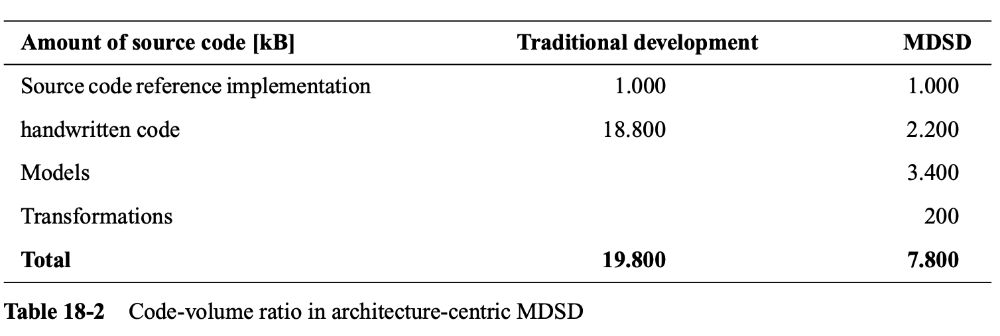
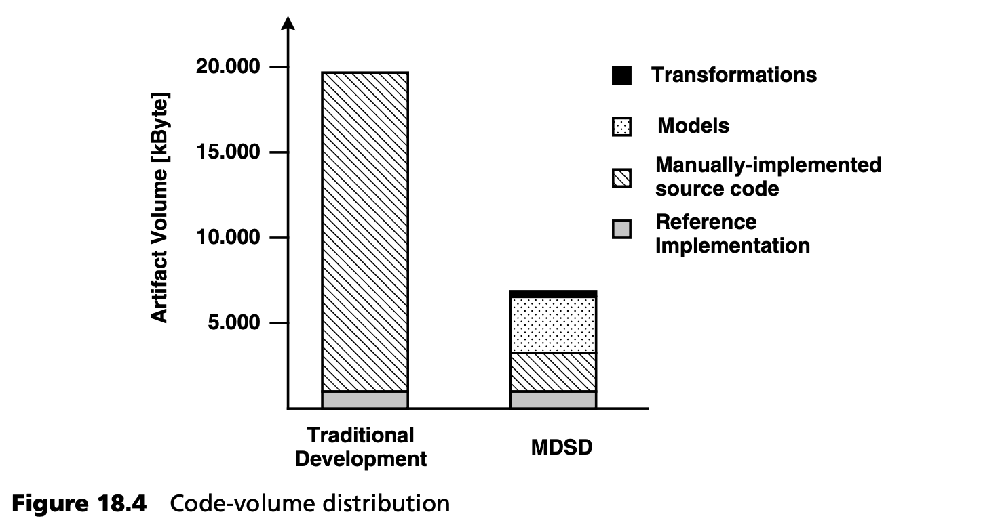
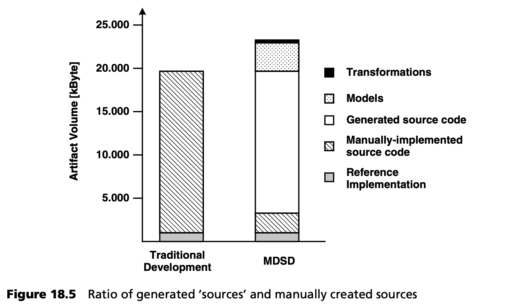
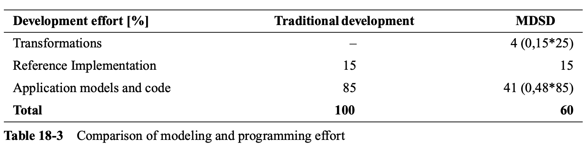
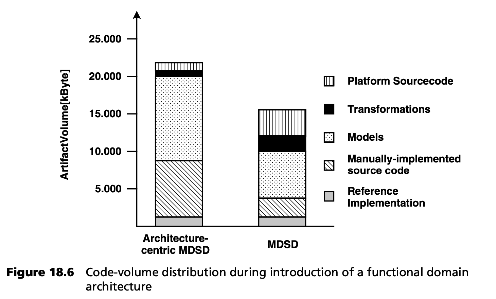

## 18.6 投资和可能的效益
我们已经看到了 MDSD 的潜力和作用。遗憾的是，即使在信息技术领域，也没有免费的午餐：要能够享受这些优势，必须投资于培训和基础设施 -- 无论是技术层面还是组织层面，具体取决于所需的复杂程度。本节将通过分享一些实际项目中的经验和提炼出的关键信息，帮助您更清晰地了解 MDSD 中的成本、实用性以及盈亏平衡点。

### 18.6.1 以架构为中心的 MDSD
<ins>我们建议您，首先通过以架构为中心的 MDSD 来实现 MDSD，因为这需要的投资最小，而引入 MDSD 的努力甚至可以在六个月的项目过程中得到回报。以架构为中心的 MDSD 并不以特定领域的功能/专业平台为前提，基本上仅限于生成在商业和开源框架或基础设施通常需要使用的重复代码。</ins>

投资主要由各种培训组成，如操作 (handling) MDSD 生成器及其相应模板语言的所需的培训，以及定义用于建模的合适的 DSL 所需的培训。

***对代码量的影响***

为了进行定量分析，我们从一个真实的 MDSD 项目验收时获取了样本数据。该项目是一个大型金融服务提供商的战略性，基于 Web 的后台 (back-office) 应用。表 18-2 以整数显示了以架构为中心的 MDSD 对源代码量的影响。

为了体现模型对代码量的影响，我们选择了存储所有必要 UML 文件所需的千字节 (kilobytes) 数。我们还假设将开发一个手工创建的参考实现来验证应用架构。

<ins>我们针对以架构为中心的 MDSD 所做的具体示例表明，需要手工维护的代码量减少到了非模型驱动开发场景（包括转换源）中需要维护的代码量的 34% ！</ins>这个数字看似很低，但根据我们的经验，它很有代表性。工具制造商通常会公布反映生成代码百分比的数据。但是，如果不清楚表 18-2 所示的必要模型和转换源代码是否已包含在计算中，那么这些数字就毫无意义。在我们的示例中，模型和转换源代码占需要维护的源代码的 50% 以上。图 18.4 提供了我们示例中数据的图形视图。

当然，除了手工实现外，如果使用 MDSD，需要编译的源代码量将保持不变，如图 18.5 所示。传统开发与 MDSD 的不同之处在于，生成的代码并不构成源代码，而是一种中性的中间结果。

如果我们忽略模型和转换源代码以及参考实现，那么生成代码和手工创建代码的比例分别为 88% 和 12%。但我们认为，这些数字只是 “表面文章” 。在 MDSD 中，模型与普通源代码具有相同的价值，而参考实现应始终保持在 MDSD 中，因为它是所有架构细化和扩展的基础。

从这个角度看，生成代码和手工创建代码的比例是 72% 对 28%。这些数字仍然令人印象深刻，足以说明以架构为中心的 MDSD 即使只使用给定的基础架构开发单个应用，也能获得回报，特别是如果考虑到中期维护要求的话。为了证明我们的说法是正确的，我们必须考虑项目实现的整个过程，而不仅仅是编程过程。

***对项目时间和精力 (effort) 的影响***

除实现外，项目时间和精力(effort)还包括

- 分析和记录需求。
- 架构和设计工作，定义建模语言（如 UML 配置文件）（如适用）。
- 测试生成和执行。
- 项目管理。

此外，还必须考虑项目前期的业务流程分析、所需的项目文件（用户手册、帮助菜单文本）以及生产成本。MDSD 对其中某些活动产生了积极影响，但很难用一般数字来记录这种影响。因此，我们只研究了 MDSD 在哪些方面影响了实现工作 (effort) ，以及这又是如何影响整个核心活动工作的 (effort)。

上一节给出的数字只对评估总工作量有用，因为它们没有反映出在创建模型和转换，以及对参考实现和特定应用源代码 (application-specific source code) 进行手工编程方面，花费了多少时间和金钱。同样，这里也没有考虑创建 DSL 所涉及的脑力劳动。

<ins>在一个小的实际的实验 [Bet02](../ref.md#bet02) 中，我们根据数据输入和鼠标点击，研究了创建和维护模型所需的时间。然后，我们使用一个近似公式将这些信息转换为源代码行数：</ins>

- <ins>如果我们将总的编程工作量，定义为所有剩余的手工创建源代码行数的总和，我们就会得到一幅有趣的结果 (picture) 。在我们的实验中，MDSD 使编程工作量减少到完全手工编程的 48%。</ins>
- <ins>如果不使用 MDSD，使用典型的 UML 工具而不是从模型中生成骨架源代码，则编程工作量会增加到完全不使用 UML 手工编程的 105% 到 149%，这取决于模型包含多少交互图（类图除外，因为类图对骨架生成没有贡献）。</ins>

这些数字清楚地表明，MDSD 与 UML 往返 (round-trip) 工程不同。这也说明了为什么许多软件开发人员对 UML 工具的使用持怀疑态度。

在以架构为中心的 MDSD 中，平台几乎完全由外部商业和开源框架组成。需要创建的领域架构，主要由参考实现和由此衍生的转换（代码生成模板）组成。

表 18-2 示例中的数字（参考实现的源代码约 1000 kB，转换源代码约 200 kB）支持我们的论点，即从参考实现中推导转换，只需花费创建实际参考实现所需工作量的 20% 到 25%，尤其是如果您考虑到参考实现的大部分脑力劳动已经完成。

创建参考实施所需的工作不受 MDSD 的影响。为便于进一步讨论，我们假定参考实现的编程工作量占项目总编程工作量的 15%。在表 18-2 的示例中，参考实现的大小仅占整个应用的 5%（以 kB 为单位），因此，即使考虑到参考实现更难编程，15% 也是相当保守的估计。

表 18-3 显示，在上述条件下，以架构为中心的 MDSD 可以将编程工作量降低 40%。这个数字也证实了我们的实际经验，同时也是计算引入 MDSD 成本的一个很好的参考。不过，最好还是使用自己团队的指标来计算需要多少编程工作量，并与项目总时间和工作相比，从而计算出 MDSD 的潜力。

- 如果我们假设编程占项目活动的 40%，那么节省资金的潜力可达 16%。
- 参考实现和转换开发的工作在后续项目中不再需要，因此编程工作减少了 59%，可避免的潜在成本高达 24%。
- 一个成熟的领域架构，可提高使用 MDSD 的所有项目的可维护性和可变更性，从而大幅降低维护成本[4](#4)。

当然，在现实生活中，还必须考虑：团队的学习成本 (effort)，以及为第一个项目聘请一位 MDSD 专家做顾问。

我们可以做一个经验评估：如果一个 MDSD 试点项目持续六个月或更长的时间，团队成员超过五人，那么即使整条生产线必须从零开始建设，MDSD 的引入也可以早在第一个项目期间就获得回报。第 [20](../ch20/0.md) 章介绍了应遵守的采用策略和前提条件。

### 18.6.2 功能/专业 MDSD 领域
正如您从上一节已经推断出的，以架构为中心的 MDSD 为 MDSD 提供了一条简单而低风险的采用途径。正如我们示例中的数字所示，大约一半需要维护的源代码由模型和转换组成：另一半由参考实现和手工编写的应用逻辑的 “传统” 源代码组成。

<ins>如果有了成熟的以架构为中心的 MDSD 实现，剩下的传统源代码就不能再减少了。只有将 MDSD 范式不仅应用于 *架构/技术领域 (architectural/technical domain)* ，还应用于 *功能/专业领域 (functional/professional domains)* ，才能提高效率。这样，我们就可以通过领域分析或产品线工程（第 [13.5](../ch13/5.md) 节）发现 *特定功能领域 (functional domain-specific)* 应用的共性 (commonalities) 和变异性 (variabilities)，并进一步提高应用模型的抽象程度：这样，模型就可以描述与领域相关的问题和配置，而不是架构方面的问题和配置，从而进一步减少建模工作量，特别是手工编码的工作量。</ins>

为了举例说明这一点，我们可以看一下同一领域中多个应用在开发过程中的代码量分布情况。图 18.6 展现了：在开发三个应用的过程中，通过引入功能领域架构，减少代码量的情况，同时假设应用模型和特定于应用的手工源代码可以减少 50%。请注意，图 18.6 纯粹是说明性的：实际情况在很大程度上取决于领域及其复杂性。领域的边界定义得越清晰，就越能以可重用的形式，将更多的功能集成到功能性 MDSD 平台中。

<ins>实际上，功能领域架构的开发是一个基于以架构为中心的 MDSD 的渐进过程。</ins>

功能领域专用语言（DSL）和相应框架的开发工作不容低估。成功开发此类语言需要在相关领域积累丰富的经验，因此不应在第一个 MDSD 项目中尝试。

当然，也有一些情况下，功能框架已经存在，无需模型驱动生成器的帮助也可以使用。在这种情况下，MDSD 可以像以架构为中心的情况一样建立在它们之上，也就是说，现有的框架被视为定义目标架构的 MDSD 平台（见第 [7](../ch7/0.md) 章）。然后从配置选项中导出 DSL。与以架构为中心的情况一样，只需相对较少的投资，就能显著提高生产率。

----
#### 4
这种效果很难用数字来表示。
