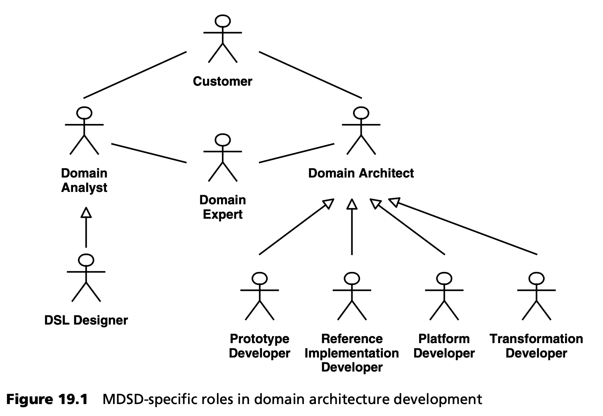

## 19.1 角色分配
本节将讨论针对 MDSD 的角色分配。我们将以第 13 章中的开发流程为指导。

### 19.1.1 领域架构开发
要成功开发领域架构，需要对该领域有深入的了解和丰富的经验。这些知识和经验通常分散在一群人身上。其中一些角色与传统软件开发项目中的角色并无不同，而其他角色在 MDSD 中则具有特殊意义。我们将主要讨论后者，这并不是为了提供一种工作描述，而是为了说明在实际项目中必须开展的各种活动。当然，一个人可以在一个项目中担任不止一个角色，同样，一个角色也可以由许多人担任。

***领域专家***

开发一个好的领域架构（见第4.1.1节）需要有关MDSD领域的专家知识，即有关MDSD所支持领域的知识。我们认为，这些人要么是领域专家，过去至少在该领域实现过两个应用；要么是潜在用户，他们是该领域的部分专家。例如，在开发保险应用程序时，可以咨询专门从事损害赔偿的法学家、精算师、直销专家等领域专家。(请注意，在以架构为中心的 MDSD 中，领域专家是在目标架构技术方面经验丰富的软件架构师--参见第 7 章）。

专家知识与传统的应用程序开发有关，但对于开发领域架构来说却是必不可少的。这就是为什么领域架构开发不适合离岸外包的原因之一，至少在项目启动阶段是如此。

***领域分析师***

在产品线工程部分（第 13.5 节），我们讨论了领域分析的各个方面。对一个领域内的共性和变异进行分析，最好是通过与领域专家、产品经理（如适用）、客户、需求分析师和领域架构师进行多次反复研讨来完成。

***语言设计师***

语言设计师是一种特殊的领域分析师。他们一方面负责元模型和 UML 配置文件的开发，另一方面负责其他具体语法的开发（见第 4.1.1 节）。换句话说，他们定义特定领域语言（DSL）。为此，语言设计者与领域专家和其他领域分析师密切合作。在实现方面，语言设计者是与领域架构师之间的决定性纽带，特别是因为语言设计者还创建了与参考实现相匹配的参考模型（见第 13.2.2 节）。

***领域架构师***

领域架构师负责实现领域架构（见第二部分和第 13 章）。这尤其包括目标架构的定义（见第 7 章）和领域架构内子系统结构的开发。后者是与语言设计者合作完成的。与领域架构的各个部分类似，领域架构师也可以分为不同的类型：

- 原型开发人员。原型开发人员负责创建技术原型。在大多数情况下，他们是技术专家或与技术专家密切合作。与传统开发相比，MDSD 可以非常经济地利用技术专长--通过生成式方法将其转移到应用程序开发中，从而减少对辅导的需求。
- 参考实现人员。参考实现者根据原型将 DSL 的构造映射到目标架构。为此，他们使用领域分析（见上文）中的参考模型作为规范。
原型具有相当实验性的特点，而参考实现则具有非常正式的特点。这是因为转换必须从原型中导出。
- 平台开发者。我们在第 4.1.2 节和第 7.6 节中讨论了特定领域 MDSD 平台的重要性。具有框架开发经验的人员尤其适合担任平台开发人员的角色。平台开发人员必须与参考实现人员密切合作，因为 MDSD 平台是参考实现的重要组成部分。换句话说，参考实现建立在特定领域的 MDSD 平台之上，并示范其使用。
- 转换开发人员。转换开发人员必须能够高效地使用生成或转换工具。例如，他们可以根据参考实现生成源代码，或定义模型到模型的转换。模板开发也与特定领域平台的开发密切相关。其目标是调整转换和平台开发，使平台的内部复杂性和转换的复杂性都不会失控。

***协调员***

领域分析和领域架构团队都需要一名协调人，负责协调结果。根据团队的能力和规模，这两个角色可以由同一人担任。领域分析协调员的角色与语言设计师的角色是一致的。

***其他角色***

除上述角色外，以下角色也与领域架构开发相关：
- 客户。客户应尽可能参与图形用户界面和应用程序原型的开发。为确保实际可用性标准不被忽视，还应提供潜在的最终用户。客户也可以是上述意义上的领域专家。
- 产品经理。在开发产品和产品系列时，不仅要考虑单个客户的意愿，还要考虑产品或产品系列的战略重点。产品经理应充分了解现有客户对产品的使用情况。同样，他们还应了解目标市场中更多潜在客户的需求。
- 项目经理。与传统的软件开发一样，MDSD 也需要一名项目经理。在这方面，迭代软件开发经验至关重要。
- 需求分析员。与传统软件开发一样，分析师需要以用例和类似工件的形式分析和定义客户需求。
- 测试工程师。测试工程师负责制定测试策略，其中要考虑到 MDSD 在这方面的特殊潜力（见第 14 章）。

19.1.2 应用开发
如果忽略以下几个方面，MDSD应用开发中的角色与传统软件开发中的角色是相同的，因为在MDSD中，这些角色被委托给领域架构开发主线：

- 开发框架，即开发 MDSD 平台。
- 开发应用原型和参考实现，以及新实现技术的实验。
- 分析与整个目标市场相关的需求。

很明显，正是那些经常导致延迟或质量损失的关键活动被委托给领域架构开发，因此它们能更好地与日常开发的时间压力脱钩（见第 13.3 节）。

除了传统的软件开发知识外，应用程序开发人员还需要对 MDSD 有基本的了解，特别是对领域架构的 DSL 有基本的了解。
