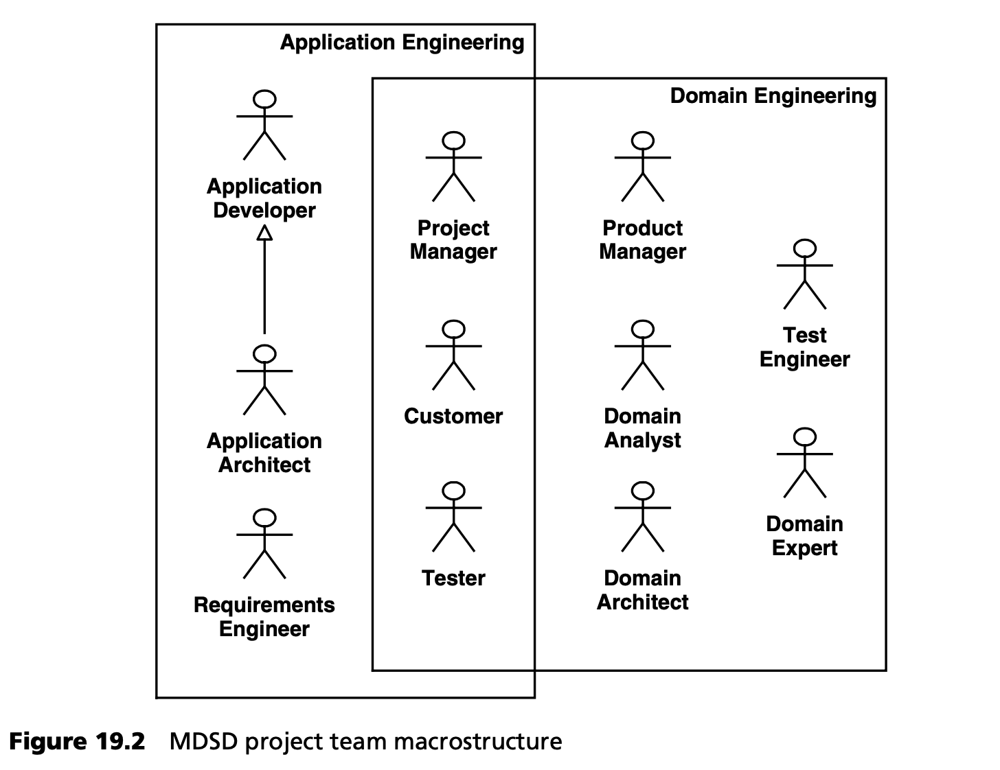
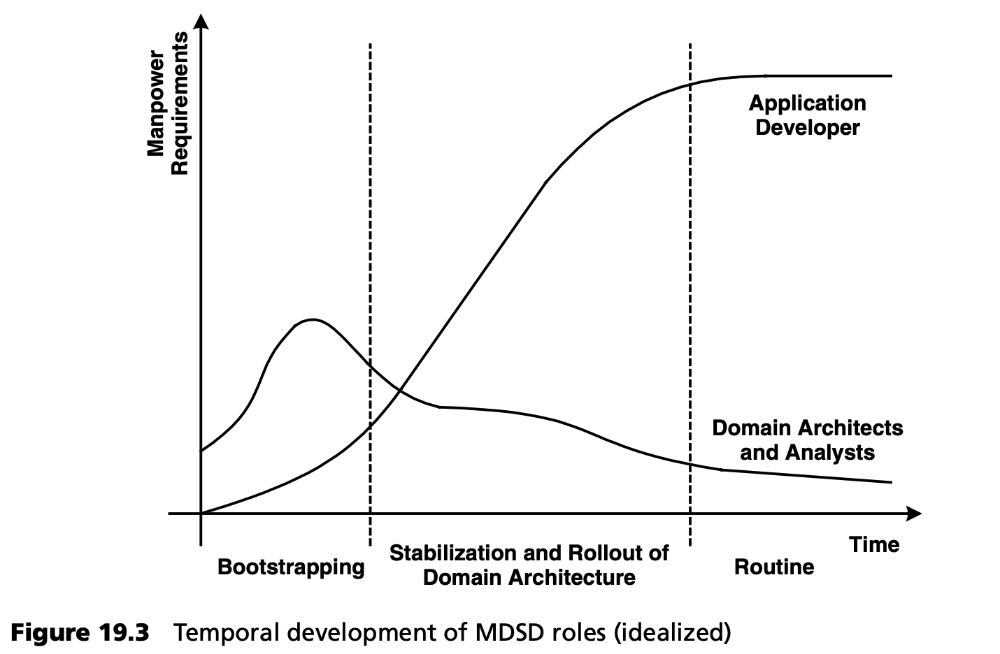

## 19.2 团队结构
试图强加一种通用的团队结构不会有任何好处。毕竟，不同的团队会形成自己的工作风格，并根据团队成员的知识和性格特点加以调整。如果试图把僵化的（新）角色强加于人，就会损害士气。应根据现有知识和个人偏好分配任务。我们更看重团队的合适的宏观结构，例如将领域架构开发和应用开发分开。

图 19.2 总结了应用开发和领域架构开发中的重要角色。

正如您所看到的，有些角色在两个开发主线中都能找到。如果领域架构开发和应用开发在不同的物理地点进行，那么这些角色的代表就必须同时出现在两个地点。从事领域架构开发的专家必须通过研讨会和培训向应用开发人员传达他们的知识。

此外，团队结构应与领域架构的组件结构保持一致，以支持领域架构开发的可伸缩性。例如，如果领域架构中包含三个重要部分，那么团队中也应相应地划分出三个知识/经验组。合理的职责分配能够支持自上而下的方式，勾勒领域架构的设计模式。先明确接口定义，随后便能更高效地并行开展，各子系统及框架的开发工作。

### 19.2.1 角色定义和人员配备要求

实际角色的扮演取决于项目规模、团队能力分布以及 MDSD 领域的重点。例如，在以架构为中心的 MDSD 项目中，领域分析师和领域架构师的角色可以由同一人担任，因为在这种情况下，MDSD 领域所需的知识就是领域架构师的知识。在一个非常小的、以架构为中心的 MDSD 项目中，图 19.1 所示的所有角色都可以由一个人担任，甚至可能包括实际的应用开发（因此是一个单人项目）。在一个更全面的产品家族 (product family) 中，领域分析师和领域架构师的角色尤其应该由不同的人来承担。

与应用开发相比，领域架构开发的角色分配比例 (scaling) 极为重要：例如，一个 MDSD 项目有一百多名应用开发人员，但只有一名转换开发人员，除非领域架构已经成熟，否则该项目必将失败。请记住，领域架构师必须指导应用开发人员，尤其是在项目开始阶段，而对领域架构的反馈是随之而来的结果。

<ins>当然，我们无法提供一个简单的经验法则，特别是因为领域架构的引导阶段，通常比其迭代演进阶段需要更多的人员。应用开发人员的数量应按比例增加，只有在引导阶段结束后才会逐渐减少 (fan out)。图 19.3 展示了我们随着时间推移，面向角色比例的理想化经验。</ins>

### 19.2.2 横向 (Cross-Cutting) 团队
团队间有效沟通的规则与传统的大规模软件开发相同：只要多个开发团队并行工作，就应通过建立 “水平 (horizontal)” 小组来补充开发过程中确定的角色，从而支持符合标准和持续改进。作为指导原则，我们建议建立以下横向小组。(<ins>在这种情况下，只有架构小组是强制性的。其他小组只有在团队人数达到或超过 15 人时才有意义</ins>）。

- <ins>*架构小组 (architecture group)* 负责领域架构的规范和优先事项。该小组通常由来自应用开发或产品开发团队的软件架构师，和至少一名领域架构开发的协调员组成。</ins>
- *质量保证小组 (quality assurance group)* 负责定义和遵守质量标准。
- *产品管理小组 (product management group)* 负责用例和其他需求定义的质量，以及产品开发的优先级。该小组应包括每个产品家族 (product family) 的产品经理、领域专家和需求分析师。
- *项目管理小组 (project management group)* 负责守住最后期限、控制预算限额、控制和定义必要的项目管理标准。

### 19.2.3 架构小组的任务
如果基于单一领域架构开发的应用不止一个，那么横向 (cross-cutting) 架构小组就显得尤为重要。<ins>我们必须再三强调，架构小组必须将自己的角色视为服务提供者和 “软件生产线的守护者”，这样才能取得成功。避免 “象牙塔 (ivory tower)” 架构至关重要。该小组的主要任务是根据项目或产品开发要求，控制领域架构的演进。因此，优先级不是由领域架构师确定的，而是由架构小组确定的。领域架构师还必须确保他们的架构能在实践中取得成功。让他们临时担任应用开发人员或项目架构师可能非常有用。</ins>

<ins>架构小组的次要任务是维护领域架构的质量属性，即监控性能、可扩展性、可重用性和可维护性。架构小组必须将这两个目标合并为一个切实可行的综合方案。</ins>

<ins>我们 *不建议* 让架构团队承担领域架构的运营开发和演进工作：该团队通常没有足够的时间来完成这些任务。为此，具有自身规划、迭代和发布周期的（部分）项目的组织结构 - 类似于框架开发 - 更为合适。架构小组应仅负责控制领域架构的演进，具体而言，即横向关注点的代表 (cross-cutting representation of interests) -- 也就是说，那些在同一领域内多个产品中均存在的架构特征。</ins>

这种演变通常包括两个方面 -- 变体定义和改进：

- <ins>当交换平台组件时就会出现变体，例如将数据访问层从 X 技术交换到 Y 技术时</ins>。 如果领域架构的模块化良好，那么负责生成数据访问层的转换，将在领域架构中创建一个松耦合模块（通常称为 *cartridge* ）。现在，您可以用 Y cartridge（您可能需要先构建 Y cartridge）替换 X cartridge ，而无需更改业务逻辑接口或建模语言（DSL）。您得到的是领域架构的衍生品。为了进一步实现这一想法，您的主要目标将是：能够提供最大组合可能性且冗余性最小的 cartiridge 构件。这一目标并不能通过理论来实现，而只能通过进化来实现。
- <ins>改进是通过项目中的反馈循环实现的</ins>。例如，纠正 DSL 抽象层级过低的缺陷，或为被忽视的应用领域提供额外的生成支持，或为以前尚未认识到其自动化潜力的应用领域提供额外的生成支持。在大多数情况下，改进将带来现有 cartridges 的新版本。透明的版本和发布管理流程，应使项目能够自行决定是改用新版本还是保留旧版本（见第 [15](../ch15/0.md) 章和第 [13.3](../ch13/3.md) 节）。

原则上，进化的两个方面（变体定义和改进）都可能对领域架构的具体复用产生负面影响：例如，必须先创建一个变体，或者改进可能不兼容旧版本。然而，如果因为这个原因而阻止进化，结果将适得其反，因为进化是创新和附加值的最终来源。不过，在这个层面上及时进行模块化，对于创建领域架构的构件非常重要。以模块为基础的软件系统的生产线是一项应受到保护的投资。其价值远远超出了单个项目的范围，应由架构小组来体现 (represented)，该小组应从组织的最佳利益出发，控制领域架构的发展。

我们的思考当然是基于我们的视角：它们显然不适用于你的第一个 MDSD 项目。根据贵组织的规模，它们适用于两到五年的规划间隔期。不过，这些思考并非假设或纯理论，而是基于实际经验。
