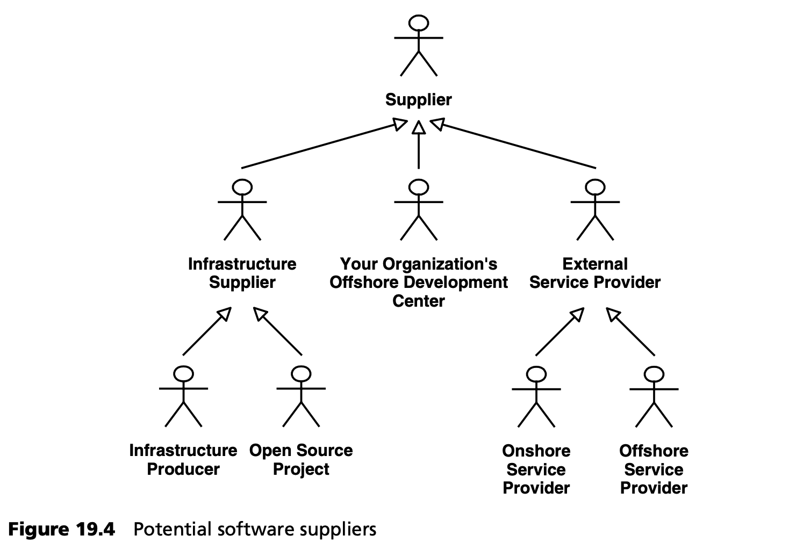

## 19.3 软件产品开发模式
在下面的章节中，我们将从一家生产和销售软件产品的公司的角度，来研究软件开发模式。我们以 MDSD 为重点分析应用领域。同样的模型也可用于应用的开发，但为了简单起见，我们使用面向产品的术语。

### 19.3.1 术语
一个软件产品的开发可能涉及多个组织，各方之间存在各自的客户-供应商关系 -- 通常称为 *供应链*。"客户" 一词通常也用来描述产品的目标市场。为避免潜在的误解，我们在此使用以下术语：

- *贵公司 (Your company)* 是软件制造商，向特定市场销售产品。
- *软件服务提供商是 (Software service providers)* 指贵公司在产品开发过程中使用其服务的企业。如有必要，我们在使用 “软件服务提供商” 一词时会加上相应的前缀，如 *在岸 (on-shore)、离岸 (off-shore)、外部 (external)* 等。
- *客户 (Customers)* 是指属于贵公司产品目标市场的公司。

关于 *资产 (assets)* ，仅仅谈论 “软件组件” 是不够的：
- *软件资产 (Software assets)* 是在软件开发过程中发挥作用的所有增值人工制品：模型、组件、生成器、语言、技术和流程构件。企业只能开发一种产品、整个产品家族或产品线。单个产品由一个代码库组成，以标准配置交付给客户。这种配置可以在安装时更改，也可以稍后在客户现场更改。
- *产品家族 (product family)* 由在同一基础上开发的若干产品组成，也就是说，这些产品至少共享一种软件资产，通常共享更多。就 MDSD 而言，这种共性通常是领域架构，因此产品家族成为软件系统族（见第 [4.1.4](../ch4/1.md#414-软件系统族) 节）。产品家族的元素被称为 *家族成员*。
- *产品线 (product line)* 由若干具有共同目标市场的产品组成，也就是说，这些产品的排列是针对特定客户群的。经济上可维护的产品线最好由一个产品家族组成。但在实践中，由于软件公司往往通过收购其他软件制造商来发展壮大，因此产品结构往往与这一理想不符。产品线的元素就是 *产品线成员* 。
- *产品合理化 (Product rationalization)* 是产品家族的整合和重构过程。
- 如果产品家族成员可以通过大致自动化的流程，从客户规格中衍生出来，并且该流程的效率达到了大规模生产的水平，那么我们就可以称之为 *软件大规模生产 (software mass production)* -- 这也是特定功能领域平台的 MDSD 目标。

### 19.3.2 内部开发
这种模式的优势在于巩固领域知识和技术诀窍 -- 这是在市场上占据有利地位的理想前提。此外，它还有助于满足关键的上市时间 (time-to-market) 要求。

毫无疑问，内部开发非常适合使用敏捷软件开发方法和让 *现场客户 (on-site customers)* 参与开发过程。然而，在过去的几年里，由于经济压力和大制造商的竞争，这种模式的吸引力已有所下降。

- *使用 MDSD* 。通过这种开发模式，贵组织可以运用 MDSD，并从由此带来的成本优势中获益。
- *风险* 。风险是人员成本高。
- *适用性 (Applicability)* 。这种方法主要适用于：目标市场相对于贵公司业务而言是本地市场的情况，在这种情况下，贴近市场可以为产品上市时间带来显著优势。

这种方法不适合全球目标市场，因为在全球目标市场中，不可能在所有地点都靠近市场。

### 19.3.3 传统外包
这种将软件开发委托给外部服务提供商的模式流行已久。这种模式对电信服务提供商等需要复杂软件支持其服务的企业很有吸引力。

这种开发模式在定制软件的生产中十分普遍，我们不妨来看看这种模式在产品开发阶段是什么样子的。它鼓励外部软件服务提供商开发一种普遍适用的产品（或产品家族），从而通过多次销售提供更多的收入来源。外部软件服务提供商既可以在原型开发阶段就参与进来，也可以在产品开发的后期参与进来。

这一领域的典型服务提供商是大型跨国公司，如 IBM、EDS、CSC 等。这些服务提供商打着 *战略外包 (strategic outsourcing)* 的旗号，推销产品或产品系列的开发。

- *成本和优势*。贵公司在开发某些软件产品时，可从商定的成本限额中获益，同时还可降低贵公司内部软件开发的员工成本。由于该领域的软件服务提供商大多是财力雄厚的大公司，因此贵公司可以将这种模式作为一种保障。由于贵公司与软件服务供应商之间的实际距离很近（通常至少位于同一国家），因此可以顺利采用诸如 *现场客户 (on-site customer )* [Bec00](../ref.md#bec00) 等久经考验、值得信赖的风险最小化策略。
- *使用 MDSD* 。在这种开发模式下，外包服务提供商可能会从 MDSD 中获益。
- *风险* 。软件服务提供商通常会使用贵公司的员工（通常是整个部门），以获得必要的专业知识。这意味着大量知识将永久性地离开贵公司。为了抵御这种风险，外包合同的期限通常为五年或更长。
- *适用性 (Applicability)* 。如果你自己使用软件，同时希望将软件作为产品销售，那么只有在软件不构成你的核心业务时，才应考虑这种模式。您必须考虑到您的竞争对手可能会购买和使用您的产品。

### 19.3.4 离岸外包
在当今世界，软件开发成本高昂已成为制约增长的一个因素，因此，离岸外包 --将软件开发活动外包给低成本地区-- 变得越来越有吸引力。分布式软件开发成为常规。从事过跨时区、跨文化和跨语言的软件项目的人都知道，离岸外包并非没有风险。即使可以节省软件开发费用，但也不一定能保证按时实现上市目标和产品符合市场要求。为了最大限度地降低风险，一些离岸软件服务提供商在客户（在岸）所在地为离岸团队提供支持资源。这有助于克服基本的沟通问题，但整个产品开发过程的效率还是取决于所使用的软件开发方法的质量。

软件行业已经深刻认识到，*前期的大型设计 (big design up front)* 是行不通的，尤其是在要求高质量和设定里程碑的情况下。在某个地方的团队，如果能让最终用户参与进来，就能够充分利用客户在现场的优势。

那么，在分布式软件开发过程中，需要采取哪些降低风险的策略，来弥补与客户沟通的不足呢？离岸外包合作伙伴可能会在现场提供各种在岸资源，以便与客户的产品管理、 领域专家和离岸开发中心建立联系。为了确保所需的产品质量，至少有几名在岸团队成员必须在在岸和离岸两地之间往返。这对成本和上市时间有什么影响？在接下来的章节中，我们将针对 MDSD 讨论这些问题，并说明 MDSD 在最大限度降低分布式软件开发风险方面发挥着重要作用。

### 19.3.5 完全离岸外包
在 *完全的离岸外包 (radical offshoring)* 中，软件开发工作被尽可能地委托给低成本的地方。在理想情况下，贵公司应拥有离岸软件服务供应商的大量股份，以确保支持的连续性。

这种模式可以通过建立离岸软件公司来实现，也可以通过寻找合适的公司来实现，甚至可以收购。*小规模起步 (start small)* 原则适用：首先，应该与离岸服务提供商合作开展一个小型、非关键的项目，然后对项目进行评估。只有这样，才能为今后的项目建立结构。

要成功应用这种模式，必须向离岸软件公司传授大量的专业知识。

- *成本和优势* 。这种方法需要大量的人员交流，因此需要大量的旅行。你的领域专家和产品经理必须指定离岸团队的成员，并传授必要的知识。这种模式试图最大限度地利用低成本地点的优势，但这些优势必须与高昂的差旅费用和延迟上市时间相权衡。
- *使用 MDSD* 。如果采用这种开发模式，只有离岸合作伙伴才能从 MDSD 中受益。
- *风险* 。完全离岸外包的主要风险是必须转移大量知识。语言障碍，特别是在特定行业的术语方面，可能是另一个障碍。与一般的外包不同，完全离岸外包不提供，将整个团队及其各自的专业知识永久迁移到离岸外包软件公司的选择。离岸团队必须从零开始建立，或者从离岸软件公司的未知资源库中组建。

  一旦掌握了必要的专业知识，您的业务就会在很大程度上依赖于离岸软件公司。因此，确保离岸软件公司的所有权是有意义的。

  根据目标市场的位置，上市时间可能会成为一个问题。此外，实施风险最小化战略，如 *现场客户 (on-site customer)* [Bec00](../ref.md#bec00) 可能会很困难。

  完全离岸外包背后的理念是试图复制传统外包的简单结构。产品管理和软件开发之间的物理距离，所造成的问题很容易成为一个陷阱。总之，这种模式风险极大。
- *适用性 (Applicability)* 。如果对上市时间要求不高，特别是如果贵公司已经拥有一家经验丰富的离岸软件公司，那么就可以采用这种模式。然而，母公司缺乏技术专长（这种情况可能随着时间的推移而加剧）意味着，在整个产品生命周期内，不同地点之间的差旅需求将持续存在。

### 19.3.6 受控离岸外包
这种做法是指只把开发过程的一部分外包给低成本地区。我们之所以说 *受控的 (controlled)* 离岸外包，并不是因为其他离岸外包方式不具有控制性，而是因为在受控离岸外包方式中，相当多的专业领域知识、技术专家知识以及对公司知识产权的控制权主要还是在企业内部。这种模式为离岸软件服务供应商提供了参与的选择，同时又不会产生类似垄断的依赖风险。

- *成本和优势* 。在这种模式下，贵公司与客户紧密合作，指定产品、开发产品原型、参考实现以及设计软件架构。这种模式需要精通技术的在岸资源，如果贵公司一直采用内部软件开发模式，那么这些资源是完全可以利用的。乍一看，这似乎会导致高昂的成本，但经验表明，离岸原型开发在理论上的财务优势，却因未能有效沟通而化为乌有。产品管理、客户和软件开发团队重要成员之间的实际距离得以保持，这就比完全离岸外包降低了总风险。如果使用了相关的方法和工具，这种模式可以降低对特定离岸软件服务提供商的严重依赖风险。
- *使用 MDSD* 。从贵公司的角度来看，使用这种离岸变体可以充分发挥 MDSD 的优势：因为领域架构开发（包括领域分析和语言设计）是在贵公司内部进行的，所以 MDSD 不仅以模型的形式提供了正式定义的（因而可以理解的）软件需求，而且还提供了离岸软件服务提供商可以使用的，完整的产品架构框架。首先，这保证了重要的架构标准得到遵守。其次，正式规范允许使用测试驱动方法（见第 [13](../ch13/0.md) 章和第 [14](../ch14/0.md) 章）。MDSD 允许对产品的技术质量进行高度控制，从而降低了离岸外包的风险和出差的需要。因此，MDSD 足以实现受控的离岸外包，甚至可能是必要的。
- *风险*。与完全的离岸外包相比，这种方法会导致更高的在岸成本 -- 至少在岸 (onshore) 成本与离岸 (offshore) 成本的比率要好一些。实际上，使用 MDSD 可以降低总成本。企业一旦决定采用哪种离岸外包战略，就有可能高估离岸外包的优势。应当重新评估剩余的手工开发工作，以确保离岸外包确实是最佳选择，特别是如果通过 MDSD 可以实现高度自动化的话。
- *适用性 (Applicability)* 。如果贵公司与目标市场位于同一地区，这种方法尤其适用。如果这意味着离岸团队的规模可以缩小，从而使项目管理开销减少，那么采用 MDSD 方法就可以节省大量人员。MDSD 方法易于扩展，适用于整个产品族和产品线的开发。但是，领域架构开发不应该外包 -- 这将标志着向完全离岸外包的过渡，相应的风险也很高。

### 19.3.7 按组件决策
具有良好设计的产品或产品家族，由相对松散耦合的组件组成。新产品的开发，或现有产品的优化（见第 [19.3](#3.md) 节）都是实现良好组件架构的绝佳机会 [Bet04b](../ref.md#bet04b)。

为什么一个清晰的组件架构如此重要？首先，这种架构允许 *应用分而治之 (divide and conquer)* 的技术，将大型系统的工作分解为可操作 (tangible) 且可并行处理的部件。其次，它支持在组件层面做出 *构建/购买/开源 (build/buy/open source)* 的决策。

*在设计产品家族时，重要的是按每个组件而不是按全局，来决定软件开发模式（内部、传统外包、完全离岸外包、受控离岸外包）。相关的供应链也应如此。*

事实上，当今大多数软件产品的结构设计并不特别简洁。它们由难以分离的紧密耦合组件组成。因此，大多数产品都与特定的实现技术组合紧密相连。对其中一种技术的更改会导致相当大的维护工作量。因此，可替换组件的概念在当今大多数产品中都是虚构的。只有当企业认识到产品家族概念的全部潜力时，实施清晰的组件架构才会变得有吸引力。

资料来源 [Bos00](../ref.md#bos00) 、[Coc01](../ref.md#coc01) 和 [Bet04b](../ref.md#bet04b) 包含有与 MDSD 有关的组织主题的更多材料。

