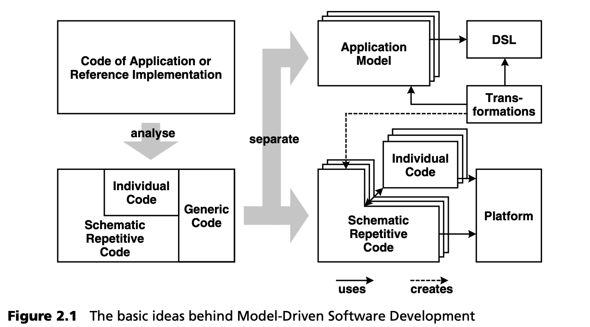

## 2.3 MDSD的方法
每个软件都有其固有的构造范式，这些范式在源代码中表现为一种内在结构。这种结构的合理性和显著性直接影响软件的开发速度、质量、性能、可维护性、互操作性和可移植性。这些都是极其重要的关键经济因素。

问题在于，在编程语言层面上很难识别实际的构造范式，因为它们的抽象程度要低得多。换句话说，备受珍视的内在结构是以一种模糊的、分布式的，当然也是强烈个性化的形式存在的。它不再直接体现在系统本身中。其质量参差不齐，取决于开发人员的技能和理解能力。

建模的概念并不新鲜，主要用于复杂的开发过程，以记录软件的内部结构。然后，开发人员试图通过耗时的审查来解决不可避免的一致性问题。在实践中，当时间紧迫时，这些审查和模型就会成为首当其冲的受害者 --从实用的角度来看，这也是理所当然的。另一种方法是 “往返”(round-trip) 或逆向工程，大多数 UML 工具都提供这种方法，它只是用 UML 语法将源代码可视化：也就是说，这些模型的抽象层次与源代码本身相同[6](#6)
 。视觉上可能更清晰，但本质问题仍然相同。

模型驱动软件开发提供了一种更为有效的方法： 模型既抽象又正式。这里的抽象并不代表模糊，而是指紧凑和还原本质。MDSD 模型具有程序代码的确切含义，因为最终实现的大部分内容，而不仅仅是类和方法的骨架，都可以从模型中生成。在这种情况下，模型不再仅仅是文档，而是软件的一部分，是提高软件开发速度和质量的决定性因素。我们强调 “模型驱动”（model-driven）而不是 “基于模型”（model-based），是为了在口头上突出这一区别。

模型所使用的表达方式面向各自领域的问题空间，从而实现从编程语言层面的抽象，并实现相应的紧凑性。所有模型驱动方法都遵循这一原则，无论其领域是 “软件架构”、“金融服务系统”、“保险” 还是 “嵌入式系统” 。为了使这些模型形式化，需要一种更高级别的特定领域建模语言（DSL）。从这个 “鸟瞰图” 来看，是否是基于 UML 的语言并不重要。

除了正式和抽象的模型，“语义丰富” 的特定领域平台构成了第二个基础支柱：预制的、可重复使用的组件和框架提供了比 “赤裸裸” 的编程语言或 J2EE 等技术平台更强大的基础。首先，这意味着，一旦生成的代码可以依赖于质量高得多的 API ，本应转换形式模型的生成器就会得到简化。引入可重复使用的框架、超级类和组件以避免代码冗余并不是什么新想法，但在 MDSD 中，它们的作用是以良好平台 (well-formed platform) 的形式对模型转换进行中途拦截，从而显著降低代码生成器的复杂性[7](#7)
。

图 2.1 显示了使用 MDSD 开发应用程序的关系。

让我们来看看现有的应用程序或参考实现（图的左上角）。这些都是具有独立结构的独特项目。我们可以在脑海中重组这些应用程序的代码，从而将其分为三个部分[8](#8)
 （左下角）：对未来所有应用程序都相同的通用部分 (Generic) ；对所有应用程序都不相同，但具有相同系统性（例如，基于相同的设计模式）的示意部分 (Schematic) ；最后是无法通用的特定应用程序部分 (Individual) 。在此，我们不对每个部分的重要性做任何说明：在极端情况下，特定应用部分甚至可以是空的。模型驱动软件开发旨在从应用模型中导出示意图部分 (Schematic) 。在转换过程中可能会出现中间阶段，但无论如何，DSL、转换 (transformation) 和平台都将构成关键要素。每个领域只需创建一次，例如 “企业软件架构” 或 “保险库存系统” （右下图）。

---
#### 6
与此同时，UML 工具也得到了改进，可以处理 J2EE 编程模型，因此可以通过 UML 模型来表示 EJB Bean。
EJB Bean 可以通过 UML 类来表示。然而，抽象化还不能更进一步，因为工具并不 “了解 ”应用架构的概念。与源代码的唯一映射也是不可能的。

#### 7
转换变得不那么复杂，因为它们不必生成在低级平台上运行的代码，而是可以假设存在一个提供基本服务的平台。这就降低了转换的复杂性，因为 “抽象差距 ”缩小了。

#### 8
适当时通过重构。
