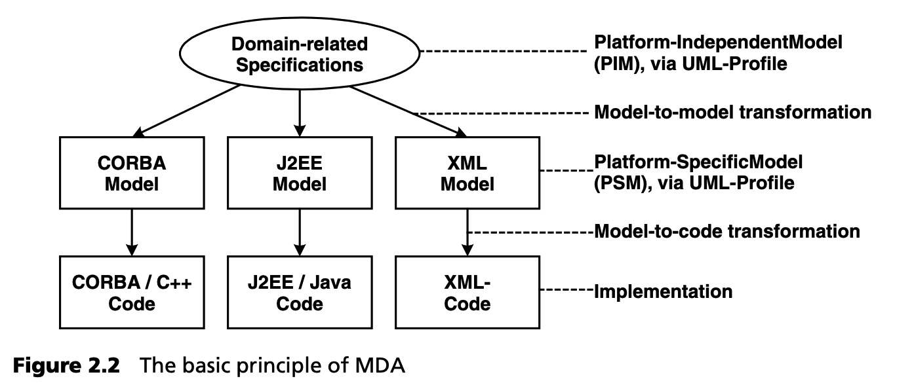
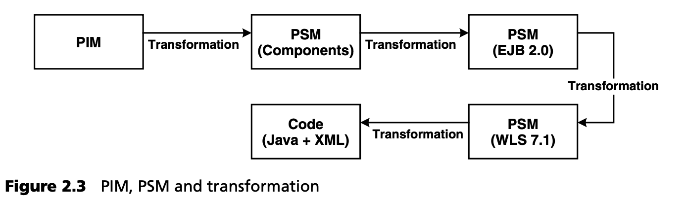
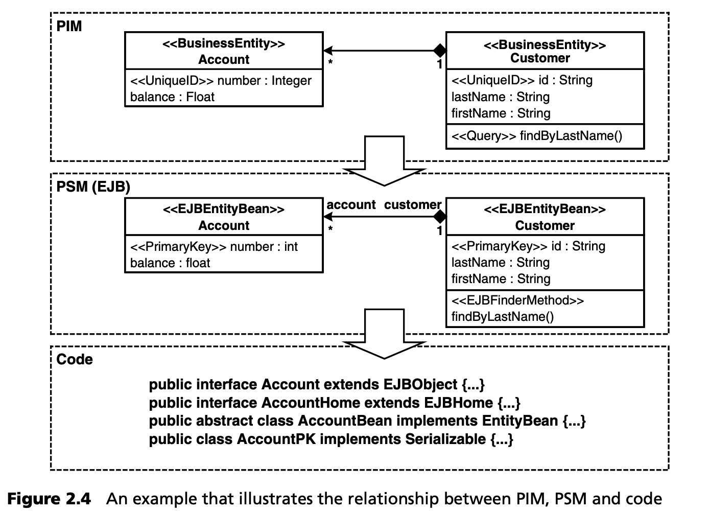
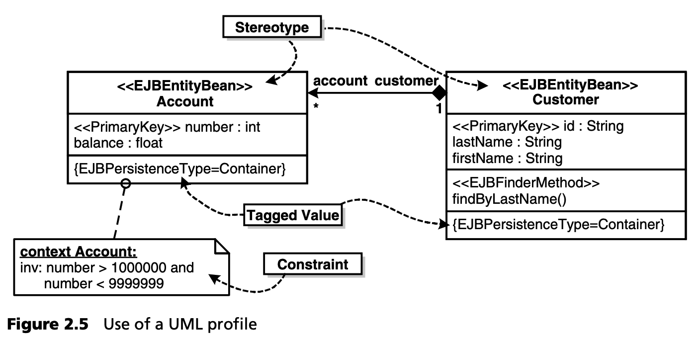
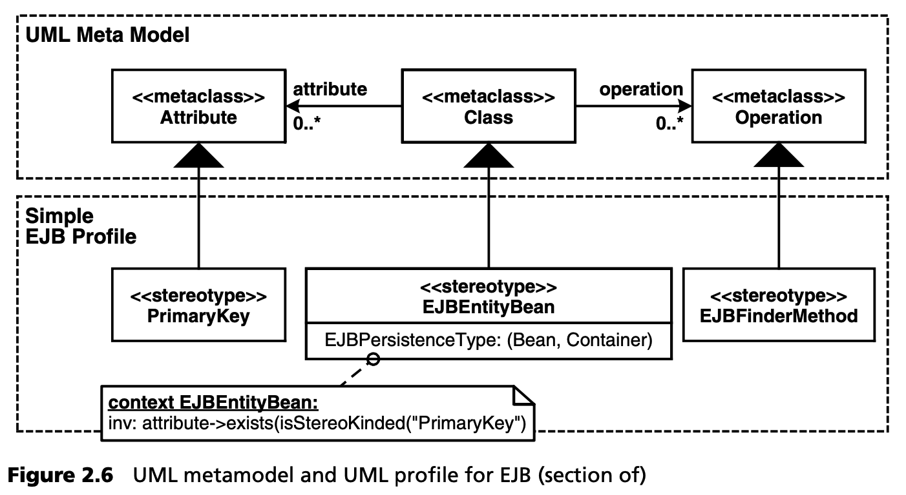
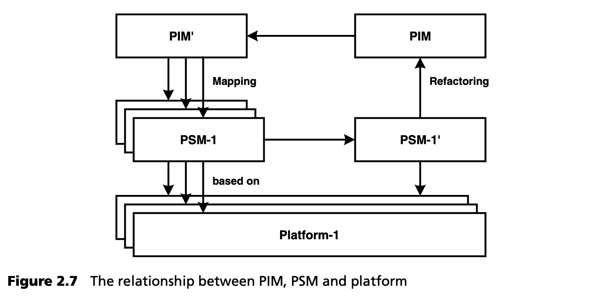

## 2.4 基本术语
本节介绍 MDA 标准中最重要的概念和术语，以建立 MDSD 的基本术语。

<ins>与领域相关的规范在独立平台模型（PIM）中定义。为此，需要使用一种针对要建模的领域概念的正式建模语言。</ins>在大多数情况下，我们会使用通过配置文件适应相应领域的 UML，这主要是因为其工具支持（见第 [6.5](../ch6/5.md) 节）。<ins>这些特定领域的描述与目标平台上的实现完全无关。</ins>例如，目标平台可以是 CORBA、J2EE、.NET 或专有框架/平台。图 2.2 说明了这一基本原则。

<ins>通过模型转换（通常使用工具自动转换），可以从独立平台模型中创建特定平台模型（PSM）。这些特定平台模型包含目标平台的特定概念。</ins>然后，在一个或多个 PSM 的基础上，通过另一种工具支持的转换，生成具体目标平台的实现（见图 2.3）。

要注意的是，PIM 和 PSM 是相对概念 -- 相对于平台而言。在上面的例子中，EJB-PSM 是 EJB 2.0 平台特有的，但它在具体的、特定于应用服务器的实现方面是独立的。

我们再来看看另一个例子。图 2.4 显示了 PIM 的一小部分。它显示了一个包含两个领域类的类模型： 客户和账户。这两个类都有 “业务实体 (Business Entity)" 定型，并且都有一个属性被赋予 “唯一 ID (UniqueID)" 定型。在 Customer 下，findByLastName 方法具有 “查询 (Query)" 定型。

<ins>在 UML 模型元素上标注定型可以改变或指定元素的含义。</ins>具有 “商业实体 (Business Entity)" 定型的类不仅仅是一个简单的类，而是商业应用中一个自足的实体。这在实践中的含义是由转换决定的，这些转换定义了如何将 “业务实体” 等定型映射到 J2EE 等现有平台。

<ins>这种通过定型对 UML 标准语言词汇的扩展称为（UML）配置文件。它是 OMG 为确保开放性而指定的标准机制，在这里用来定义正式的建模语言。</ins>要把 UML 模型转换成 MDA 模型，必须进行这种形式化。 “业务实体”、“唯一 ID” 和 “查询” 等概念完全独立于目标平台。从 PIM 到 PSM 的转换过程中会产生依赖关系。在这里，我们可以找到 J2EE 特有的定型：“EJBEntityBean”、 “PrimaryKeyField” 和 “EJBFinderMethod” 。这些概念原本也是通过转换获得其含义的，这里指的是转换为 Java 编程语言。

转换最终会将 PSM 转化为源代码，在源代码中可以找到此处描述的概念的具体表现。

### 2.4.1 MDA 概念概述

***模型***

<ins>模型是系统结构、功能或行为的抽象表示。</ins>MDA 模型通常用 UML[9](#9)
 来定义。原则上，MDA 正式将经典程序语言也视为 MDA 建模语言，反过来与平台保持联系。毫无疑问，这是正确的，但我们认为这种方法偶尔会妨碍概念的阐释，因此从现在起，我们将把模型和建模语言这两个术语与程序和编程语言这两个术语明确分开。

<ins>UML 模型本身并不是 MDA 模型。普通 UML 模型（例如分析模型）与 MDA 模型最重要的区别在于，MDA 模型的含义（语义）是正式定义的。这是通过使用相应的建模语言来保证的，而建模语言通常是通过 UML 配置文件及其相关的转换规则来实现的。</ins>我们将在本章后面更详细地讨论这些机制。总之，这意味着模型与现有平台的映射是明确定义的。

***平台***

起初，MDA 对平台的抽象层次只字未提。平台可以相互构建，例如英特尔 PC 就是 Linux 的平台。同样，CORBA、J2EE 或网络服务都是电子商务系统的可能平台，而 C++ 则是 CORBA 的可能平台。<ins>一个定义良好的应用架构，包括其运行系统，也可以是一个应用的平台。</ins>我们将后一种想法视为模型驱动软件开发的关键概念，并在后面进行更详细的讨论。

***UML配置文件***

<ins>UML 配置文件 (profiles) 是扩展 UML 词汇的标准机制。它们包含通过基本 UML 结构，如类和关联、定型、标记值和建模规则（约束）定义的语言概念</ins> -- 见图 2.5。

<ins>UML 配置文件被定义为 UML 元模型的扩展。元模型定义了具体模型中可能出现的基本构造等。</ins>从概念上讲，模型是元模型的 “实例”。因此，UML 元模型包含 *类 (Class)*、*操作 (Operation)*  、*属性 (Attribute)* 或 *关联 (Association)* 等元素。元模型概念是 MDSD 中最重要的概念之一。因此，我们用了整整一章来讨论它，即第 [6](../ch6/0.md) 章。不过，现阶段我们只需获得直观的理解即可。图 2.6 用一个简化的例子 -- 企业 Java Beans (EJB) 的 UML 配置文件，阐明了元模型和配置文件之间的关系。

在 UML 配置文件中，标准 UML 概念 *属性 (Attribute)* 、*类 (Class)* 和 *操作 (Operation)* 被特定概念 *PrimaryKeyField*、*EJBEntityBean* 和 *EJBFinderMethod* 补充。此外，还使用了一种新的 UML 2.0 语言构造 -- *扩展 (extension)*。这由填充的继承指针表示。为了避免混淆，我们将其放大了。

其他扩展通过标记值 (tagged values) 和建模准则以约束 (constraints) 的形式进行定义。一个约束条件通常被注释为相应模型元素的注释：我们在此使用正式的约束语言 OCL。标记值作为定型的属性呈现。

因此，UML 配置文件提供了从模型引用元模型的具体符号，并确定某个模型是否 “良好 (well-formed)" ，即是否有效。简而言之，它定义了一种正式的建模语言，作为 UML 的扩展。

有关这些关系的更多细节将在第 [6](../ch6/0.md) 章中详细阐述。

***PIM 和 PSM***

<ins>独立平台模型（PIM）和特定平台模型（PSM）的分离是 OMG MDA 的一个关键概念。其背景如下：概念比技术更稳定，形式 (formal) 模型对自动转换更有用。PIM 抽象了技术细节，而 PSM 则使用平台概念来描述系统</ins>（见图 2.7）。从 PSM 中提取 PIM 的反向过程极难实现自动化，在某些情况下甚至是不可能的。这通常需要人工进行的智力工作，在 MDA 规范中被称为 "重构 (Refactoring)"。(重构的含义更倾向于等价转换 -- 参见 [Fow99](../ref.md#fow99) ）。

***转换***

<ins>转换 (Transformations) 将模型映射到相应的下一级，无论是细化的模型还是源代码。</ins>就 MDA 而言，转换必须以现有的配置文件为基础，灵活而正式地进行定义。这是通过生成器实现所需的自动化转换的先决条件。

目前大多数可用的 MDA/MDSD 工具都不是在两个元模型之间定义转换规则，而是使用模板直接生成源代码，而生成器并不正式了解编程语言的元模型。不过，有一些生成器可以将转换规则分别附加到 UML 配置文件或相应的元模型上。这种方法在实践中绝对可行，将在第 [3](../ch3/0.md) 章和第 [9](../ch9/0.md) 章中介绍。基于两个元模型（源模型和目标模型）的转换的优势主要在于从一个元模型到另一个元模型的优雅映射。不过，我们怀疑这种模式在实际生成源代码时是否可行。

当前的生成器通过使用专有的转换语言，以不同的方式解决了这一问题。在这种情况下，会使用 JPython、TCL、JSP、XSLT 或自定义脚本/模板语言[10](#10)
 。使用这些语言定义的生成器模板主要像宏一样工作，并将模型作为输入数据。因此，目前还不存在模型转换的互操作性：不过，标准化工作正在进行中 -- 见第 [10.5](../ch10/5.md) 节。在这里，我们将不得不等待标准化的完成。

第 [12](../ch12/0.md) 章将深入介绍 MDA 标准。

---
#### 9
根据基于 MOF 模型的标准--见第 6 章。

#### 10
这些语言本身就是定义代码生成模板领域的特定领域语言。
