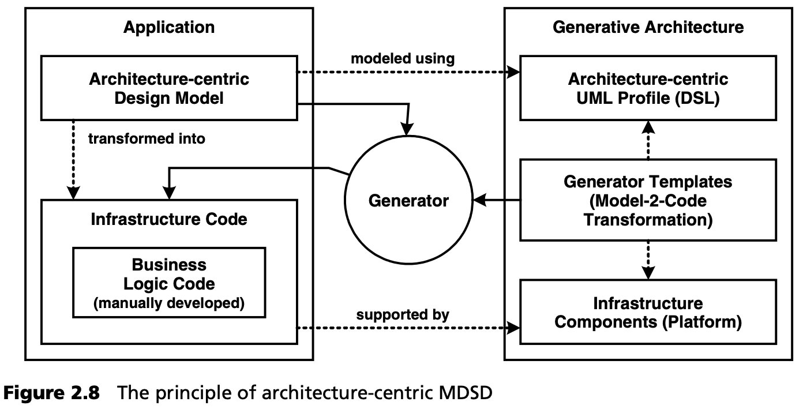
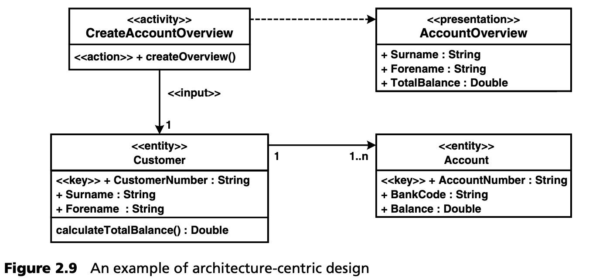

## 2.5 架构为中心的MDSD
在本节中，我们将为您提供基础知识，帮助您理解后面的案例研究：MDSD 的一种形式，即Architecture-Centric MDSD（AC-MDSD）。这里所描述的方法是在六年来许多项目的实践经验中逐步形成的，尤其注重实际可用性。

### 2.5.1 动机
与 OMG 的主要目标（互操作性和软件可移植性）相比，AC-MDSD 的目标是提高开发效率、软件质量和可重用性。这尤其意味着要把软件开发人员从繁琐和容易出错的日常工作中解脱出来。如今，开发人员面临着极其复杂的软件基础设施：应用服务器、数据库、开源框架、协议、接口技术等，所有这些都需要连接起来，才能创建出稳健、可维护的高性能软件。由于这一领域的复杂性不断增加，软件架构学科变得越来越重要。

软件基础设施的存在也意味着在使用它的软件系统中存在相应的基础设施代码。这些源代码，其主要作用是建立基础架构与应用程序之间的技术耦合，以便于在基础架构之上开发特定领域的代码。在这种情况下，J2EE/EJB 编程模型就是一个典型的例子：主界面（home interface）和远程界面(remote interface)、Bean 类、描述符 -- 这些技术代码固然包含与领域相关的信息（如方法签名），但也表现出高度的冗余性。J2EE 开发人员在手动创建了四五个 Enterprise Bean 之后（如果不是在此之前），就会渴望有一个生成器来创建这类基础架构代码 -- 而且可以获得这类支持，通常是以预处理器或 IDE 向导的形式。

最好的情况下，一些基础架构组件会自带 “助手” 来生成自己的基础架构代码。这里的问题在于这些工具并不 “了解” 彼此，这就是为什么它们无法实现以架构为中心的整体方法，我们将在案例研究中看到这一点。

因此，AC-MDSD 的目标必须是基础架构代码生成的集成自动化，从而最大限度地减少应用程序开发中多余的基础架构代码。

当我们谈论基础架构代码时，我们并不是在谈论花生：测量数据（第 [18](../ch18/0.md) 章）显示，60% 到 70% 的现代电子商务应用程序通常都包含基础架构代码。

### 2.5.2 生成式软件架构
正如 “以架构为中心” 这一形容词所暗示的那样，软件架构在本文所讨论的 MDSD 中起着核心作用。事实上，只有在彻底完善和正规化的软件架构基础上，创建基础架构代码的整体生成方法才能发挥作用。

可以这样想象：软件架构越完善，使用该架构的应用程序的源代码就会越简洁。如果架构的定义只包括代表系统基础架构（数据库、应用服务器、大型机、网络等）的幻灯片，也许还包括最重要的层，那么两个开发团队就很可能以完全不同的方式实现同一个应用程序，包括软件架构的实现：两个独特的应用程序就会诞生。

不过，如果我们假定一个架构师团队做了一些基础工作，并开发了某种技术参考实现，在源代码层面展示了最重要的软件架构方面的具体实现，那么应用程序开发人员就可以将这种参考实现作为蓝图。由于相同的技术实现（尽管领域不同）在开发实践中经常出现（例如使用特定的接口技术或 MVC 模式），因此大部分工作量将是复制和粘贴编程。当然，这种编程方式要比从头开始单独设计代码更有效率。

从本质上讲，软件架构的定义在源代码中体现得越多，应用程序开发过程就会变得越模式化和重复性越强。模式化编程主要是指复制和粘贴，然后根据领域上下文进行修改。这部分工作显然是非智力性的。如果我们按照这个思路走下去，把繁琐且容易出错的复制/粘贴/修改工作交给生成器来完成，最终形成一个*生成式软件架构*也不是太牵强。在这里，架构定义的所有实施细节，即所有架构模式，都以软件的形式纳入。这需要一个应用程序的领域模型作为输入，作为输出，生成应用程序的完整基础架构代码，否则这些代码就需要通过繁琐的复制/粘贴/修改过程来生成。为此，该模型只需要有特定的注释，这些注释引用了架构概念，这些概念作为生成式软件架构的一部分。

在 AC-MDSD 中，通常使用以架构为中心的 UML 配置文件进行建模。这样就创建了一个正式的、以架构为中心的应用*设计*。模型到代码的转换通常以生成器模板的形式定义，这样就能从以架构为中心的设计模型自动生成完整的基础架构代码。需要注意的是，模型必须包含生成基础架构代码的所有相关信息，只是比扩展代码更加抽象和紧凑。如第 2.3 节所述，模板可以使用整个基础架构的能力，并在此平台上生成代码，从而简化模板。由于代码的生成是出于技术和架构方面的考虑，因此仍然存在一个 “语义空白” ：开发人员必须手动创建应用程序的实际领域代码，即实际的、特定领域的功能，而不是基础架构代码。

集成生成代码和手动创建代码的技术多种多样。我们将在第 [8](../ch8/0.md) 章和第 [9](../ch9/0.md) 章详细介绍这些技术。图 2.8 展示了这些相关性。在下一章的案例研究中，我们将通过一个以实践为导向的真实例子进一步解释这些关联。

生成式软件架构是实现第 [2.2](2.md) 节所列目标的有力手段。它最重要的优势在于更高的开发速度和软件质量、更好的可维护性和实用的可重用性 -- 在一个应用程序内的可重用性，当然，在单个应用程序之外的可重用性更强。生成式软件架构可以支持整组或整族架构相似的应用程序 -- 软件系统族 (software system family)。实际上，AC-MDSD 是为软件系统族创建生成式软件架构，而不是创建独一无二的产品。

### 2.5.3 架构为中心的设计
预定义的设计语言（通常是 UML 配置文件）以 “独立平台” [12](#12) 的抽象形式包含了软件系统族的架构概念。设计人员使用这种设计语言以 PIM 的形式创建领域的应用设计。除了在处理 OMG-MDA 构想时，在大多数情况下，他们在使用 AC-MDSD 时都会有意放弃将这些 PIM 转换为显式可见的、与平台无关的 UML 模型（PSM）。

实际项目经验证明，这种简化通常比 PSM 带来的额外自由度更有用。因此，我们不需要对各种中间转换结果进行控制、处理，也不需要用特定信息[13](#13)
 来充实这些结果。这不仅能提高开发效率，还能避免潜在的一致性问题：手动更改中间模型可能会导致与更高抽象层次的不一致，而这种不一致是无法自动纠正的。

同样，我们也放弃了从源代码到 PIM 的逆向工程，因为这在一般情况下是不可行的。从源代码 “逆向” 创建的模型自然与源代码本身一样抽象。只是表现形式不同，也许在某些情况下更容易理解。对于源代码中的特定任意部分，可能不存在可通过转换[14](#14)
 得出程序的 PIM，尤其是当 PIM 建模语言侧重于特定领域（如电子商务系统的软件架构）时更是如此。然而，在 MDA 规范中，OMG 或多或少地忽略了这一事实。

一些 MDSD 工具构建者社区的成员期望有工具支持的向导或类似的解决方案，至少可以实现 半自动化的逆向工程。在我们看来，这是一种让步，而不是以目标为导向的概念[15](#15)
 -- 至少在涉及新开发的软件时是这样。诚然，根据个人的工作偏好，这种观点可能首先会被认为是不利的，但实际上它是一种优势，正如我们稍后将了解到的那样。基本上，AC-MDSD 建立在前进工程(forward engineering)的基础上。

这种以前进工程为基础的生成式方法使我们能够从以架构为中心的模型的 “硬事实” 中得出有关生成应用程序的结论。生成式架构可以保证组件之间的松散耦合或不同应用层之间不存在访问路径。例如，它可以确保表现层（如网络用户界面）不能直接访问数据库的 SQL 接口。

在这一点上需要注意的是，不要把前进工程误认为是采用瀑布式开发方法的模型。它仅仅意味着必须对模型而不是源代码进行设计更改，当然这并不意味着必须一次性对整个应用程序进行建模。我们承认，前进工程并不排除这种方法，但这并不意味着它是强制性的。事实上，我们更倾向于迭代、渐进的过程 [Oes01](../ref.md#oes01)。

现在我们来看看图 2.9 所示的一个 PIM 例子。这个模型没有透露任何有关所使用技术的信息 -- 这种模型的技术实现只有在映射到具体平台后才会被定义。通过使用定型、标记值和约束来丰富模型的语义，可以创建正式的 UML 设计语言。对于 AC-MDSD，这种语言的抽象层级是架构概念层级，这也是我们说以 *架构为中心* 的设计的原因。换句话说：AC-MDSD 的领域是软件架构。

图 2.9 中与领域相关的含义相当明显：其核心是一个活动，它是上层流程模型的一个模 块，能够执行创建特定客户账户总览的操作。客户实体作为输入，传送给活动。除了两个与领域相关的属性外，客户实体还具有一个识别特征（key），并能通过添加相关账户的余额来计算总余额。活动或其操作使用带有三个领域相关属性的演示 (presentation) 来显示结果。

标准的 Java 代码生成器会忽略附加 (annotated) 的定型，生成四个简单 Java 类的符号。在 AC-MDSD 中，模型在编程语言方面的实现是通过映射到具体平台来实现的。下面的两个例子可以说明这一点。

**基于 EJB 的架构与 HTML 客户端**

活动类是实现服务器端进程引擎接口的 stateless session Bean 。每个操作都是声明性事务。实体类是具有相应本地接口的 Bean。key 类型的属性构成了主要的 key 类。对于公共属性，使用 getter 和 setter 方法。容器管理持久性（CMP）用于持久性。可以从模型中推导出必要的描述符。对于关联，可使用基于关联模型的finder方法的访问方法。presentation 类指定了用于填充 JSP/HTML 页面的 JSP 模型。演示实现由 FrontController 框架激活。

**基于 C++/CORBA 的客户端-服务器架构**

每个活动类都有一个 IDL 接口。设计的所有属性和参数类型都映射到相应的 IDL 类型。有一个合适的 C++ 骨架。活动类实现了特定工作流系统的接口。操作（动作操作）是对象事务监控器（OTM）上的事务。所有实体类都是不可分发的 C++ 类：它们的实例通过对象关系映射提交到 RDBMS。key 类型的属性作为主键。presentation 类是 Java Swing 图形用户界面，实现了特定客户框架的接口。

通过这个简单的模型示例，我们可以很容易地认识到这种方法的主要优点：以架构为中心的模型结构紧凑、信息充分丰富，不包含任何会妨碍可移植性和降低抽象程度的多余细节。因此，它们更简洁，更易于维护。此外，由于不包含技术细节，它们更适合与其他项目成员进行讨论。

### 2.5.4 开发过程
生成式软件架构和以架构为中心的设计只有在开发方法完全适配的情况下才能有效应用。这个极其重要的问题并不是MDA关注的重点。我们将用第 [13](../ch13/0.md) 章的全部篇幅来讨论这个问题，从过程的角度来阐明MDSD。由于我们在这里讨论的是以架构为中心的设计这一特例，为下面的案例研究打下基础，因此我们在这里只介绍几个方面。

**架构开发与应用开发的分离**

我们已经看到，生成式软件架构导致了应用程序开发的模块化： 一方面是 UML 配置文件、生成器模板和基础架构组件，另一方面是以架构为中心的设计、生成的基础架构代码和手动实现的代码。

很明显，应用程序依赖于生成式软件架构，反之亦然。这就促使我们考虑将这些工件的创建分成两条不同的路径：与框架开发一样，一个团队可以负责创建生成式软件架构（架构开发轨道），而另一个团队则负责应用程序的开发（应用程序开发轨道）。必须通过适当的迭代同步或发布管理来缓解这种依赖关系 -- 有关该主题的更多信息，请参阅第 [13](../ch13/0.md) 章。无论我们是否希望将不同的人员分配到这两条路径上，我们在这里处理的显然是截然不同的活动，因此采用面向角色的视角是有意义的：

- 架构师开发生成式软件架构。
- 设计人员创建以架构为中心的应用程序模型。
- 开发人员对应用逻辑进行编程，并将其集成到生成的基础架构代码中

**参考实现的重要性**

实用的生成式软件架构不是凭空实现的 -- 生成代码需要一个蓝图。这个蓝图被称为 *参考实现* 。我们指的是一个可运行的样本，它在实际领域功能方面尽可能简洁，但在源代码层面上显示了以架构为中心的 UML 配置文件构造的语义。下一步，生成器模板可以从这样的参考实现中衍生出来。我们将在案例研究中具体介绍这些模板，并在第 [13](../ch13/0.md) 章中进行更详细的讨论。

### 2.5.5 以架构为中心的 MDSD 特性
在开始下一章的案例研究之前，我们先简要总结一下以架构为中心的 MDSD 的正确关系。这里主要涉及方法论方面： AC-MDSD 支持单个架构需求。它的重点显然是工程原理，而不是集成开发环境（CASE 或 MDA 工具/IDE）。换句话说，AC-MDSD 不会生成任何未经参考实现验证的内容。因此，我们可以跳过生成式方法中经常出现的问题，如: “生成代码的运行性能有多好？” 或 "生成源代码的质量有多好？” 生成的代码与生成器模板所来源的参考实现一样好（或一样差）。

- *软件系统族，而不是单独的项目*。AC-MDSD 不仅旨在提高开发一次性应用软件的效率和质量，还旨在为架构相似的应用软件重复使用生成软件架构，从而构成软件系统族。这方面并不是 MDA 的明确主要关注点。
- *以架构为中心的设计*。除 MDA 外，我们（通常）不使用特定平台模型。相反，我们在以架构为中心的设计中采用与平台无关的模型。这种方法一方面带来了局限性，另一方面却明显地带来了优化。我们减少了中间结果的维护工作，避免了一致性问题。
- *前进工程*。与 MDA 的愿景相反，我们有意避免往返 (round-trip) 工程。由于以架构为中心的 MDSD 模型需要真正的抽象，因此逆向工程要么不可能，要么没有意义。设计变更必须在实际设计（即模型）中进行。因此，模型将始终与生成的源代码保持一致。
- *模型到模型的转换仅用于模块化*。我们使用的 PIM 尽可能抽象，但最好能直接（当然也可以反复）转换为源代码。 "转换间隙" (transformation gap) 可以通过模型到模型的转换实现模块化，但途中出现的中间模型是应用程序开发人员看不到的实现细节。
- *无需明确使用目标元模型即可生成源代码*。编程语言源代码的生成对于 AC-MDSD 是必不可少的（第 [9](../ch9/0.md) 章）。然而，我们认为目前在 MDA 标准化背景下讨论的模型转换只有助于模型到模型的转换。以这种方式生成以架构为导向的基础架构源代码是非常繁琐的，而使用生成器模板则是行之有效的，而且可以非常直观地处理。除目标元模型外，源元模型（即设计语言的元模型）对源代码的生成非常有用，可用于构建转换规则，我们的案例研究将证明这一点。
- *不能 100% 生成*。通常，“只有” 60% 到 80% 的软件是由以架构为中心的模型生成的。我们认为，只有在极少数特殊情况下，100% 生成是可能的，也是明智的[16](#16) 。应用程序的架构基础代码是 100% 生成的，但在目标语言中补充了单个/领域相关方面的代码。
- *软件架构变得易于管理*。生成式软件架构本身就是为了更好地与时俱进。开发人员不能随意或故意离开已设定的基础架构代码框架。就质量而言，这显然是一个优势。开发人员和设计人员可以立即检测到架构中的所有变化，并在正确的地方进行处理 -- 即在生成式软件架构中集中处理，而不是分布在整个应用程序中。技术和领域相关方面被明确分开。因此，AC-MDSD 可确保架构在应用程序中的真正一致性，并有助于实现贯穿整个系统的架构变更。这也为开发过程的可扩展性提供了支持。换句话说，AC-MDSD 是软件架构管理方面非常有用和强大的工具。

那么，我们该何去何从呢？在建立了稳定的 AC-MDSD 基础架构后，在此基础上级联其他 MDSD 层通常很有用。第 [8.2.8](../ch8/2.md#828-级联模型驱动开发) 节将解释这种称为级联 MDSD 的方法。

---
#### 12
平台独立性是一个相对的术语。这里指的是标准软件平台（如 J2EE）的独立性。

#### 13
在这里，我们并不反对通过连续执行对转换进行模块化，但我们并不赞成明确可见和可操作的中间结果。

#### 14
数学家们会说，PIM 模型到编程语言的映射不是递归的。

#### 15
在为 MDSD 改造传统软件的过程中，逆向工程可以起到类似于引导的作用。

#### 16
本声明仅适用于 AC-MDSD，不适用于一般的 MDSD。
