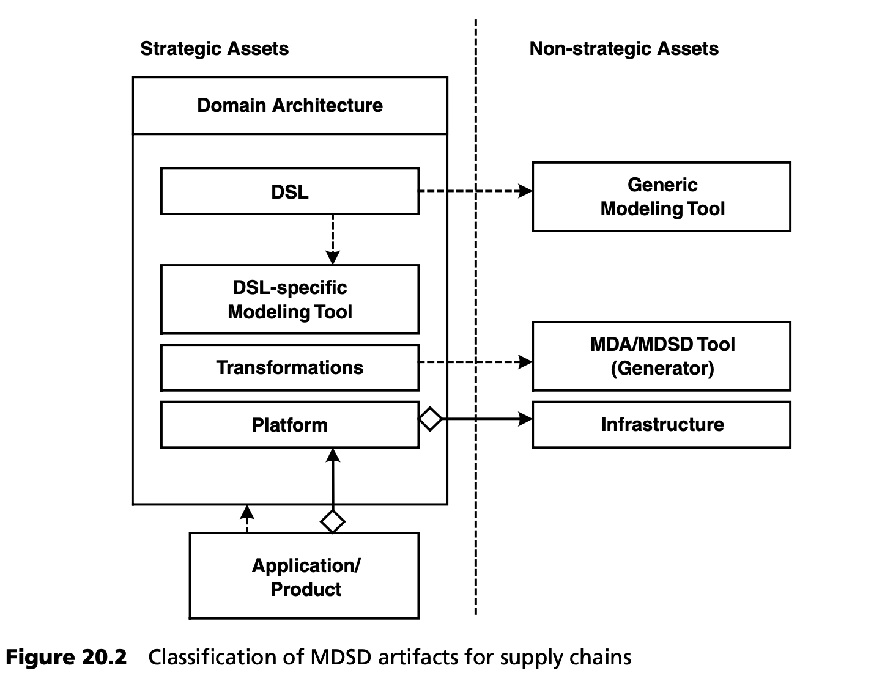

## 20.6 设计供应链
在对软件进行分类并了解哪些软件资产是战略资产或非战略资产后，就可以开始为未来的产品系列设计供应链了。

为此，我们对最重要的 MDSD 工件（第 4.1.4 节）进行了上述分类--战略性、非战略性、遗留性：

应用程序从领域架构中获得其结构。应用软件包括 MDSD 平台，也包括基础设施。"基础设施" 一词概括了在软件库分类过程中归入的所有非战略性资产。因此，我们可以非常实用地定义平台与基础架构之间的界限。

通用建模工具（如 UML 工具）不具有战略意义，而针对具体 DSL 创建和优化的特定编辑器则被视为具有战略意义--它们拥有相关领域的知识。对于非战略性软件资产，第 20.5 节中的阐述是有效的：例如，这里可以使用开源工具、框架或商业产品。

一般来说，应用软件和软件产品当然具有战略意义。我们可以建议在公司内部开发，也可以是有控制的离岸开发，详见第 19 章。在这种情况下，重要的是在设计软件开发流程时，要考虑到在离岸软件服务提供商之间进行潜在转换的成本不会过高。在这方面，MDSD 具有相当大的优势，因为它将应用/产品与领域架构分离开来。这就是为什么领域架构的开发以及平台的开发不应外包的原因（见第 [19.3.6](../ch19/3.md#1936-受控离岸外包) 节）。

必须强调的是，只有在成功引入 MDSD 后，才能进行离岸外包。这就保证了在离岸外包的时候，已经有了明确的开发流程和确定的软件架构，并得到相应工具的支持。
