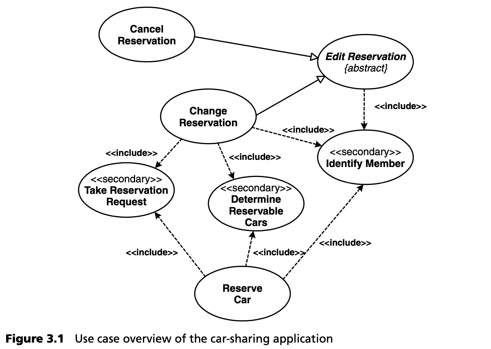
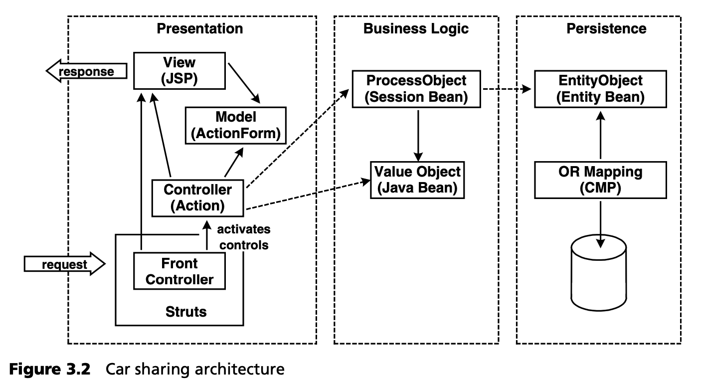
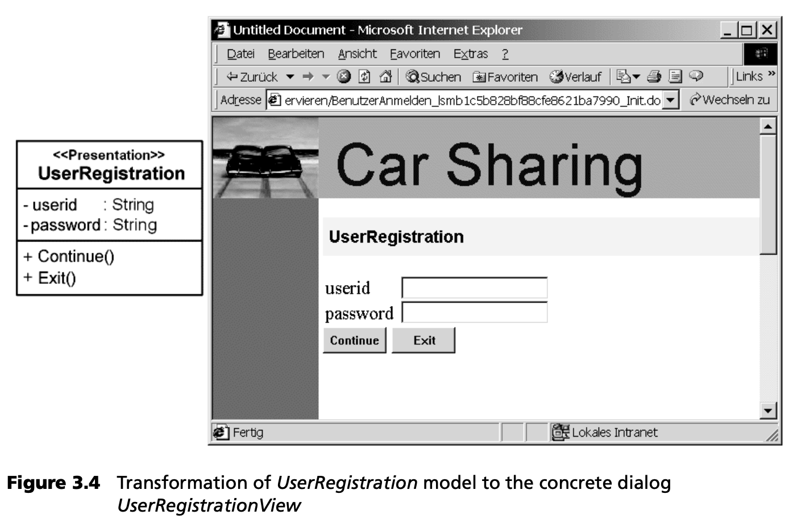
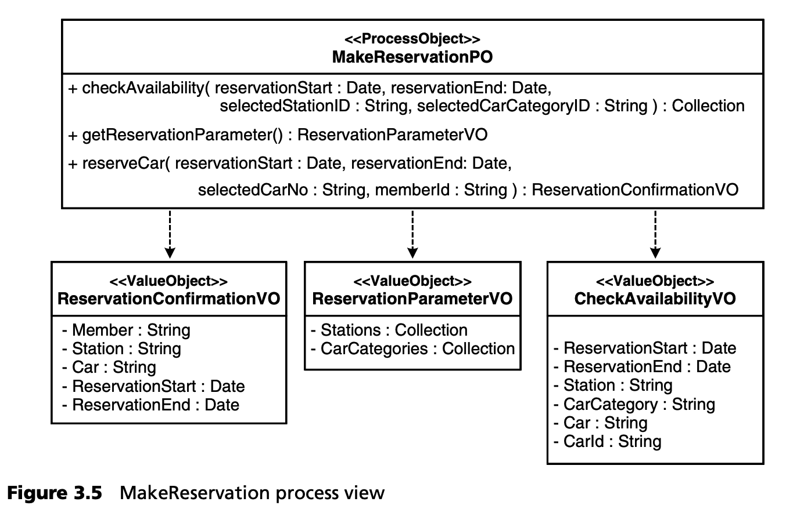
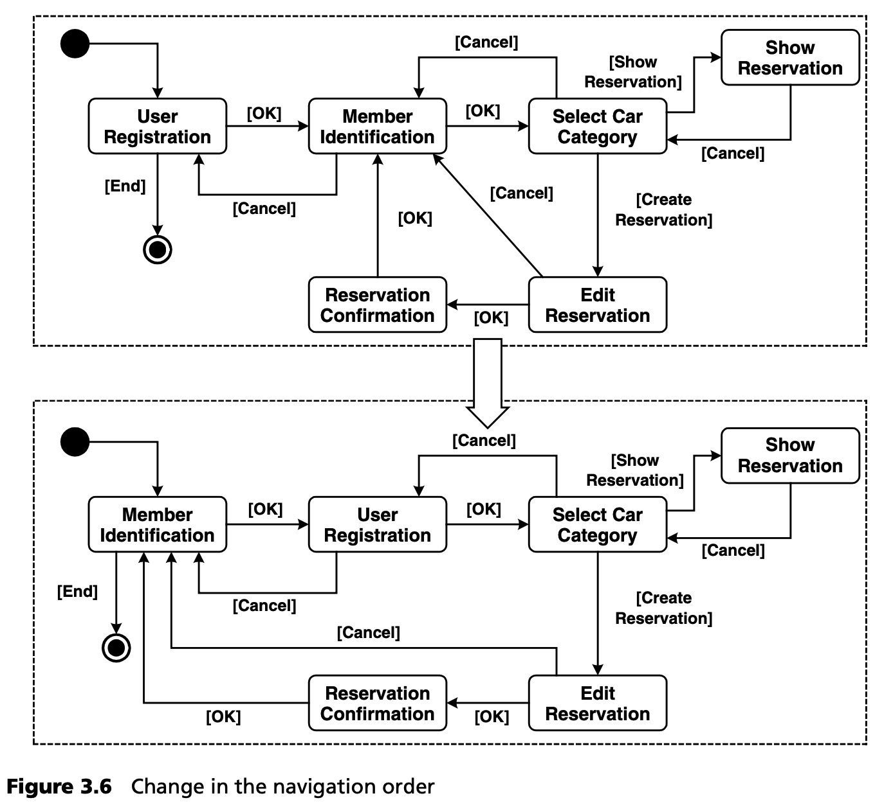

## 3.1 应用程序开发

首先，我们假设应用程序开发人员的立场，并预先假定存在第 2.5 节所述的生成性软件架构。这通常是在应用程序开发的同时，以迭代和渐进的方式创建的。我们将在第 13 章详细讨论为此所需的方法。

值得一提的是，该视图是一种基于角色的表示法。不过，我们暂且不讨论人员的角色分配，因为这是项目组织的问题，将在第 19 章中讨论。在这里，我们主要关注对各种活动进行分类，以帮助理解主题内容。基于一个应用实例，我们将解释最重要的步骤，然后继续描述应用开发与生成式架构之间的关系。

应用程序开发的迭代从创建或扩展应用程序设计开始，本例中使用的是 UML 工具。从 UML 工具导出的应用设计 XMI<sup>[1](#1)</sup> 表示法通过 MDSD 生成器转换为实现骨架。实际业务逻辑由人工编程，并集成到生成的基础架构代码中。为此，我们使用了保护区域，也称为保护区。从语法上讲，这些区域是目标语言中的注释，但由 MDSD 生成器解释。生成代码中的每个保护区域都有一个伪装成注释的全局唯一标识符，并因此与模型元素唯一关联。通过这种方式，生成器可以保护这些区域的内容，因为在迭代再生过程中，生成器会在生成代码的正确位置重新插入这些内容。由于受保护区域的 ID 是根据模型的 UUID<sup>[2](#2)</sup>
 生成的（更准确地说，是根据 XMI 格式生成的），而不是根据模型元素的名称（如类名或类似名称）生成的，因此该程序对模型中的重命名也相当稳健。使用这种方法，受保护区域的内容也能在模型重命名后继续存在。只有在删除模型元素时，受保护区域的内容才会被删除。

保护区域并不总是集成生成代码和手工编写代码的最佳方法，但这还不是我们所关心的。

### 3.1.1 应用实例

下面的示例摘自 MDA/MDSD 教程，曾作为 “实践 ”环节在各种会议（JAX、OOP 等）上成功演示。创建该应用程序的目的是为了说明一种全面的软件开发方法，包括业务流程分析、以架构为中心的设计、模型驱动的代码生成，以及业务逻辑的实现，同时基于一个简单但并不复杂的示例。分析模型来自 oose.de GmbH 的教程材料，生成式软件架构由 b+m Informatik AG 构建。

该示例描述了一家汽车共享公司的信息系统开发过程。图 3.1 显示了虚构应用程序 “汽车共享 1.0 ”的用例概览。



汽车共享 1.0 版实现了系统用例 “汽车预订”，允许汽车预订和汽车管理。汽车共享社区的成员在系统中注册，以便进行授权和随后的计费。该系统的主要目的是通过呼叫中心代理以电子方式执行汽车预订。

汽车共享应用程序的架构是一个经典的三层架构，由表现层、处理层和持久层组成--见图 3.2。它基于 J2EE 框架。

表现层采用基于 Struts [STRT](../ref.md#strt) 的 Servlet Model 2 架构的 MVC 模式。来自浏览器的所有 HTTP 请求都由前端控制器 集中拦截，然后进行评估并分派到相应的视图中显示。前端控制器评估和处理，图形用户界面触发的操作，以及将导航的请求交给相应的子控制器。子控制器以 ViewModel 的形式提供视图显示所需的数据。为实现流程控制的目的，该层使用 Struts 框架。与处理层的数据交换通过 ValueObjects 进行。处理层用 ProcessObjects 的方法的为表现层的控制器提供无状态事务服务。这些处理对象允许控制器读取与视图相关的数据，并存储新接收到的数据。同时，持久层中的实体受到保护，不会被表现层中的对象直接访问。



持久层拥有一个使用 Java 实体Beans实现的持久业务对象模型（BOM）。持久性由 CMP 机制（容器管理持久性）和 SQL 数据库共同处理。应用程序的目标平台和运行环境完全由开源软件构建：Tomcat Web 服务器 [TOMC](../ref.md#tomc)、符合 EJB 2.0 标准的应用程序服务器 JBoss [JBOS](../ref.md#jbos) 和 HyperSonic SQL [HSQL](../ref.md#hsql) 数据库。运行环境的核心要素是 Struts 框架，它控制着应用程序的进程。此外，运行时环境还包括一些超级类和辅助类。

以 PIM 的形式创建汽车共享应用程序的设计是在描述架构概念的设计语言（UML 配置文件）的帮助下进行的。在 UML 配置文件中，我们可以找到在概念架构概述中以简化形式列出的概念（例如 EntityObject、ValueObject 等）。我们稍后会讨论具体的配置文件定义。向目标平台的转换（平台绑定）是通过一组生成器模板实现的，这些模板可根据模型信息生成所需的源代码。设计语言和平台绑定以模板的形式构成了生成式软件架构（第 2.5 节），如图 3.3 所示。


### 3.1.2 MDSD 工具
要在实践中应用 AC-MDSD，我们需要一个 UML 建模工具和一个 MDSD 生成器。UML 工具必须能够使用 UML 语言扩展的 UML 配置文件。目前，主流的 UML 工具都不能评估建模约束，也就是说，不能检查以 OCL<sup>[3](#3)</sup>
 表达式形式在元层面上提出的断言。因此，MDSD 生成器需要支持检查约束。

生成器工具必须读取相应 UML 工具提供的模型，并将其作为生成的输入。如今，大多数 UML 工具都能以 XMI 格式保存模型，但 XMI 的质量参差不齐。因此，MDSD 生成器应为不同的建模工具提供预定义和可定制的适配器。

有关工具和要求的更详细讨论可参见第 11 章。

在我们的方案中，我们使用 Gentleware 的 UML 工具 Poseidon UML Community Edition [POSE](../ref.md#pose)，其 XMI 输出通过生成器模板被 openArchitectureWare 生成器框架 [OAW](../ref.md#oaw) 转换为源代码。然后在 Eclipse IDE [ECLI](../ref.md#ecli) 中进一步修改这些源代码。生成器框架辅以 Eclipse 插件，因此可在集成开发环境中使用。它还能满足上述要求。

以下示例概述了开发人员在设计/生成/构建循环过程中，在应用程序设计的各个层次上所开展的活动。

### 3.1.3 示例 1：对模型的简单修改
第一个示例描述了对汽车共享应用程序静态类模型的一个简单更改，以及一个设计、生成和构建周期的执行情况。由于汽车共享应用程序所需的 JSP 完全是根据具有 “Presentation”定型的类中的信息生成的，因此最好对表现层中的某些内容进行修改（见图 3.4）。



图 3.4 左侧显示的是表现类 UserRegistration，右侧显示的是在 HTML 渲染后由该类生成的对话框（JSP）。表现类的方法与浏览器 JSP 中的 Continue（继续）按钮相对应。在 UserRegistration 类中，将方法 Finish 更名为 Exit 会导致相应按钮的标签发生变化，这一点可以从对话框中看到。除了 JSP 之外，构成视图模型的 Struts ActionForm 也完全由表现类生成。这两个产出物都是转换的结果。

以下代码显示了生成的 JSP UserRegistration.jsp。

```html
...
<html:form action="<%= (String) request.getAttribute(“FormAction”) %>“ method=“Post”>
  <table border=“0” cellspacing=“0” cellpadding=“0” >
  <tr>
   <td><bean:message key=“de.amg.carsharing.user.presentation.UserRegistration.userid”/> </td>
   <td>
    <html:text property=“userid”/>
   </td>
   </tr>
  <tr>
    <td><bean:message key=“de.amg.carsharing.user.presentation.UserRegistration.password”/> </td>
    <td>
     <html:password property=“password”/>
    </td>
  </tr>
  <tr>
   <td>
    <input type=“hidden” name=“registration.jsp.Event” value=“Continue”>
    <input type=“submit” name=“Event” value=“Continue”/>
   </td>
   <td>
    <input type=“hidden” name=“registration.jsp.Event” value=“Exit”>
    <input type=“submit” name=“Event” value=“Exit”/>
   </td>
  </tr>
  </table>
</html:form>
```

下面的列表显示了其背后的表单类：

```java
package de.amg.carsharing.user.presentation;
 
import org.apache.struts.action.ActionForm;
public class UserRegistrationForm extends ActionForm
{
  private String userid;
  private String password;

  public String getUserId()
  {
     return userid;
  }

  public void setUserId(String aUserId)
  {
     userid = aUserId;
  }

  public String getPassword()
  {
     return password;
  }

  public void setPassword(String aPassword)
  {
     password = aPassword;
  }
}
```
对于开发过程中的简单更改，我们只在模型层面进行。在进行这些更改后，模型将被导出为 XMI 格式。生成器解释 XMI 并生成相应的源代码。构建和部署都在集成开发环境或通过 Ant [ANT](../ref.md#ant) 进行。

显然，模型在这里取代了源代码。- 所有与变更相关的信息都保存在模型中。因此，除了实际源代码外，最好还将模型集成到应用程序的发布管理中。

### 3.1.4 示例 2：模型更改和受保护区域
第二个示例说明了如何在受保护区域中提供业务逻辑的各个部分。为此，我们来看看如何在处理层中确定预订所需的参数，并将其提供给表现层。



图 3.5 显示了处理层所需的模型部分。在这里，MakeReservationPO 有 getReservationParameter() 方法，该方法返回 ReservationParameterVO。ReservationParameterVO 是一个数据容器，用于将数据从处理层传递到表现层。在生成过程中，在会话 Bean 中执行 MakeReservationPO 所需的所有类、Java 接口和部署描述符都将从该模型生成。此外，我们还根据 J2EE 核心模式 [CORE] 中的业务委托模式生成了 MakeReservationBusinessDelegate。ReservationParameterVO 是 100% 生成的，而 getReservationParameter() 方法只生成了方法签名。必须在集成开发环境中手动添加实现。如下代码摘录所示，这是在保护区域中完成的：

```java
public ReservationParameterValueObject getReservationParameter() throws RemoteException {
   // PROTECTED REGION ID(12Operation_MethodBody) START
   ReservationParameterValueObject vo = null;
   try
   {
    CarSharingModuleComponent component = new CarSharingModuleComponentImpl();
    StationHome home = component.getStationHome();
    Collection stations = home.findByAll();
    Collection colStations = new ArrayList();
    for (Iterator i = stations.iterator();
      i.hasNext(); ) {
      Station station = (Station) i.next();
      colStations.add(station.getName());
    }
    Collection colCarCategories = new ArrayList();
    colCarCategories.add(CarCategory.COMPACT);
    colCarCategories.add(CarCategory.VAN);
    colCarCategories.add(CarCategory.SPORT); colCarCategories.add(CarCategory.LUXURY);
    vo = new ReservationParameterValueObject( colStations, colCarCategories);
  }
  catch (Exception e) {
    e.printStackTrace();
    throw new RemoteException(“Error: “+ “Registration parameter search failed”, e);
  }
 
  return vo;
 
  // PROTECTED REGION END
}
```

在创建生成器模板时，必须在架构层面决定是否需要保护代码区域（见第 3.2 节）。不允许在这些保护区域之外进行添加或更改，因为这将破坏建模与编程之间以及应用建模与架构建模之间的明确分离：设计更改必须在设计（应用模型）中进行，而架构更改--即对生成代码的系统更改--必须在生成架构中进行。生成器框架确保了这一点：在受保护区域外进行的更改将在迭代再生过程中丢失。这并不是要限制应用程序开发人员的自由，而是为了保证一致性，以及应用程序和架构开发之间的定期交流。如何定义生成代码和非生成代码之间的界限至关重要，处理这个问题需要一些经验。第 7 章将对此进行详细介绍。

### 3.1.5 示例 3：使用动态模型
除了前面示例中介绍的基于静态模型生成源代码的选项外，动态模型（如活动图和状态图）也可用于生成代码。本例将介绍如何使用。图 3.6 显示了生成的应用程序导航顺序改变前后的活动图。在新版本中，必须在用户注册之前完成识别调用成员的步骤。(这是否合理还有待商榷）。



由于我们选择 Struts 作为示例的控制流框架，因此必须根据活动图生成必要的流控制配置。下面摘录的 Struts 配置说明了这一点：

```xml
<!-- ControllerState “UserRegistration” -->
<action path=“/ UserRegistration_a64aa2a7d0162ba7ffb_Init” 
  type=“de.amg.carsharing.user.presentation.UserRegistrationController”
  name=“UserRegistrationForm”
  input=“/UserRegistration.jsp”
  scope=“request”
  parameter=“UserRegistration_Init,a6488aa27d162ba7ffb”>
    <forward name=“Ok”
          path=“/UserRegistration.jsp”
          contextRelative=“true”
    />
</action>
<action path=“/UserRegistration_a64aa2a7d0162ba7ffb_Exit”
  type=“de.amg.carsharing.user.presentation.UserRegistrationController”
  name=“UserRegistrationForm”
  input=“/UserRegistration.jsp”
  scope=“request”
  parameter=“UserRegistration_Exit, a6488aa27d162ba7ffb “>
    <forward name=“UserRegistration_To_Exit”
          path=“/MemberIdInput_a6affa_Init.do”
    />
    <forward name=“Continue”
          path=“/SelectCategory_a64aac9_Init.do”
    />
    <forward name=“Error”
          path=“/UserRegistration_a64aa30f0fbfb_Init.do”
    />
</action>
```
下面的 XML 片段是从相应的 Struts config.xml 中提取的，其中包含了对成员 ID<sup>[4](#4)</sup>
 的获取。

```xml
<!-- ControllerState “MemberIdInput” -->
<action
  path=“/MemberIdInput_a64aa3a062ba7ffa_Init”
  type=“de.amg.carsharing.member.presentation.MemberIdentificationController”
  name=“MemberIdentificationForm”
  input=“/MemberIdentification.jsp” scope=“request”
  parameter=“MemberIdInput_Init,a60f06b7f”>
    <forward name=“Ok”
        path=“/MemberIdentification.jsp”
        contextRelative=“true”
    />
</action>
```
控制流可以完全从应用程序设计中生成。无需对 Struts 配置进行进一步的手动操作。我们的经验表明，这样做特别有利，因为活动图也能很好地记录导航过程，因此可用于与领域专家进行讨论。

### 3.1.6 开发与架构之间的互动
应用开发与架构之间的良好协调是 MDSD 项目成功的关键。生成式架构的开发并不是在生成式软件架构交付后就结束了。正如我们在示例中描述的应用程序开发步骤所示，在大多数情况下，生成式软件架构的变更要求会在项目过程中出现。一方面，需要增加受保护的代码区域，以便进行个性化调整。另一方面，新的架构模式也会被识别出来，而这些模式必须得到生成式支持。团队只有设法接受应用开发的反馈并将其纳入生成式软件架构，才能获得满足要求的最佳可持续解决方案。在这方面，生成式软件架构的发展就像一个框架。同样，它也必须进行版本控制，并使使用它的项目可以访问。我们将在本书的第三部分对这些主题进行更深入的探讨。

要检查自己对所使用的生成式软件架构的改进意见，可以在本地的 “沙箱 ”中进行测试。受保护区域外的代码将保持不变，直到重新生成。如果修改产生了理想的结果，就可以通过对生成式软件架构的调整，让整个项目都能使用。这种方法的优势在于，生成式软件架构始终处于定义明确和一致的状态。

### 3.1.7 中间结果
当你承担起开发者的角色时，你就有更多的时间来处理基本任务--实现项目特定的业务逻辑。MDSD 生成器或生成式软件架构将承担繁琐的复制和粘贴工作，以开发对业务相关程序毫无意义的技术基础架构代码。与非生成式方法相比，纠正技术代码中的错误要容易得多，也更有效率。基础架构代码中的错误只需在生成式软件架构的转换规则中的一个地方进行修正，这与框架中的错误修正类似。再生后，所有有缺陷的代码片段都会被替换为修正后的代码片段。

由于我们将手工编写的业务逻辑代码整合到生成的骨架中，因此我们的应用程序失去了完全的平台独立性和自动可移植性。很明显，受保护区域的内容依赖于 Java 编程语言和 Struts 框架。虽然有一些模式（比如这里使用的 BusinessDelegate）可以帮助我们减少这些依赖性，但我们还远远没有实现 OMG 关于可执行模型的愿景。在这里，不同的目标变得清晰起来（见第 2.5 节）： AC-MDSD 注重实效，强调提高开发效率、质量、可维护性和可重用性，而 MDA 则强调可移植性和互操作性。

---
#### 1 
XMI：XML 元数据交换。MOF-XML 映射，主要用于将 UML 模型序列化为 XML 格式。几乎所有的 UML 工具都支持 XMI，它是一种可互操作的导出格式。

#### 2
模型元素的通用唯一标识符。

#### 3
OCL：对象约束语言，UML 的一部分。

#### 4
config.xml 文件用于配置 Struts 框架中的页面和页面流。
