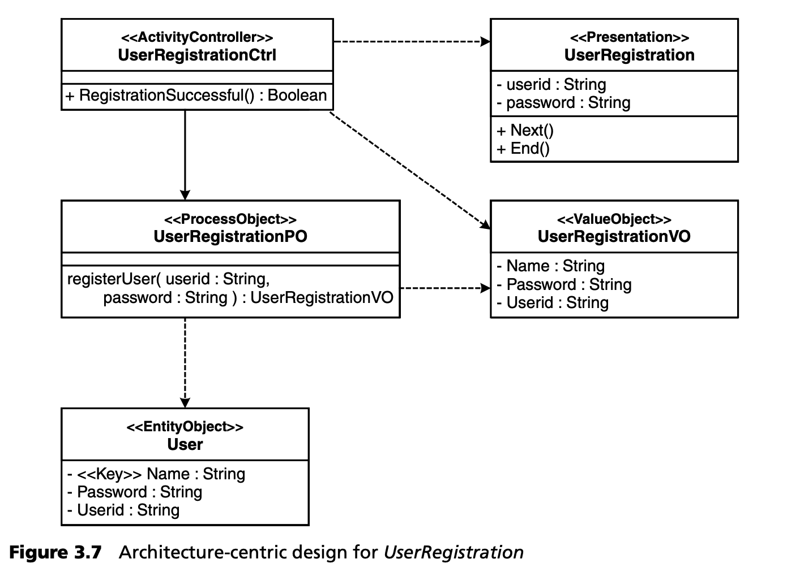
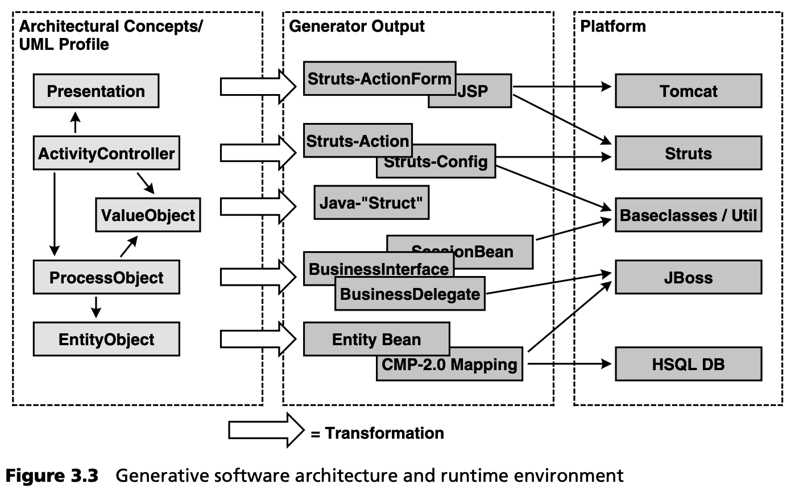
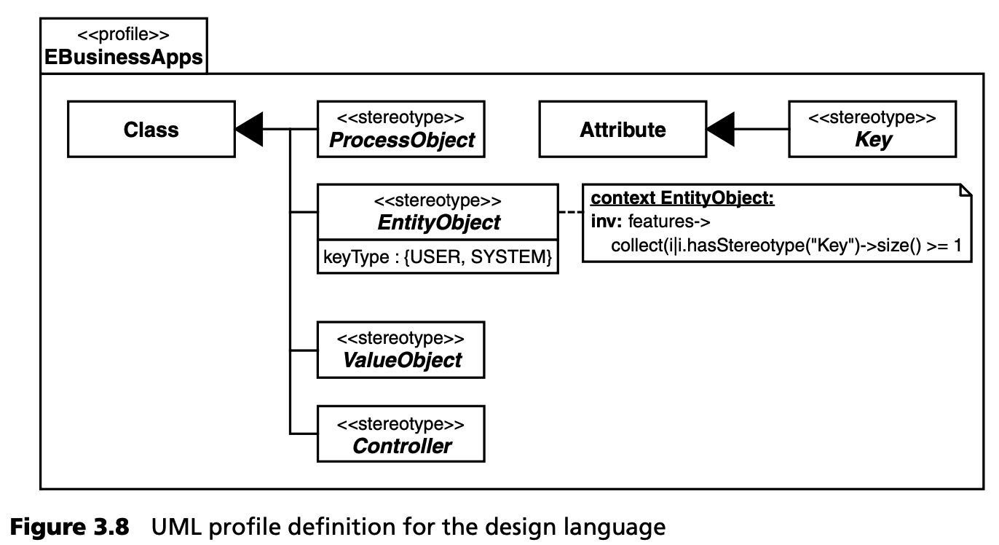
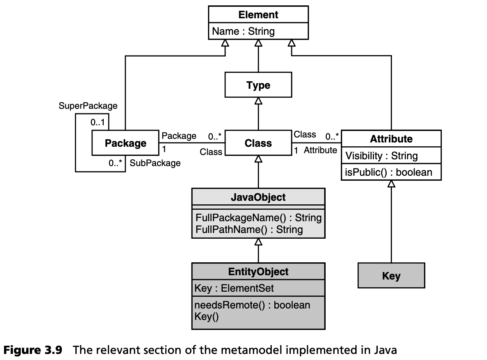
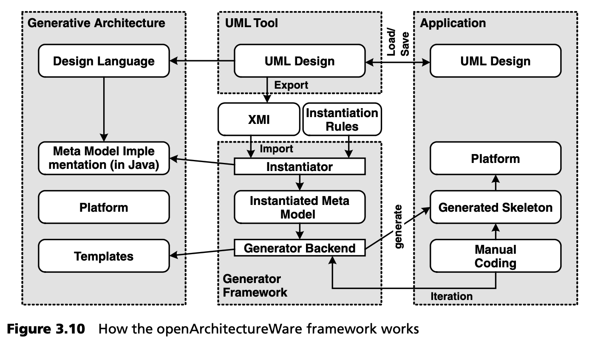
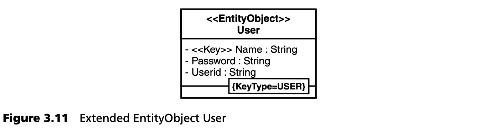
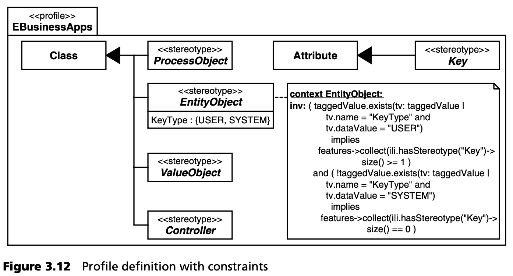

## 3.2 架构开发
上一节从应用开发的角度探讨了 AC-MDSD。在这种情况下，我们假设存在一个 UML 配置文件（设计语言）、一个平台（J2EE、Struts、持久层等）以及一个适合我们的生成式软件架构。现在，我们将详细了解这些工件 (artifacts) 是如何出现的。

其中一个关键概念是避免冗余。冗余（在不同实例中多次出现的工件）不仅存在于 EJB 层面，也存在于现代软件架构的所有其他层面：流控制（如 Struts）、表现形式（如 JSP 和 ActionForms）、控制器、遗留集成等。我们的目标是将这种复杂性尽可能完全委托给一个生成式软件架构，它 “了解” 各层的所有构造原理和编程模型，而不仅仅是单一的部分或方面。正如第 3.2 节中的示例所示，这种方法的好处是可以极大地提高应用开发效率。

这种生成式软件架构远远超越了 XSLT 或 XDoclet 等简单的生成工具，而且不依赖于特定的应用。它可以重复使用，并支持具有相同技术特性的整个软件系统族。汽车共享应用软件和保险应用软件就属于这样的系列，只要它们具有相同的技术原理。在本节中，我们将为应用创建一个制造流程，使我们能够在很大程度上根据模型自动开发应用。这类似于汽车工程中的生产线概念。我们的 MDSD 流程中的架构开发环节就是创建这样的软件 “生产线” 。第 [13.5](../ch13/5.md) 节将详细阐述这一概念。

### 3.2.1 UML 配置文件
首先，我们需要一个以架构为中心的 UML 配置文件 (profile) ，它允许我们创建正式的 MDSD 模型。让我们来看看图 3.7 中的模型。



该模型与领域相关的含义很清楚：作为控制流中的一个步骤，类 UserRegistrationCtrl 能够激活一个界面，在界面中输入用户 ID 和密码并提交给系统。控制器使用 UserRegistrationPO 的 userRegistration() 服务对系统进行身份验证。

流程对象（ProcessObject）根据用户 ID（构成用户的识别特征）获取代表用户的实体，并验证提供的密码。如果注册成功，服务就会向控制器发出一个带有相应访问数据的 UserRegistrationVO。

为了建模，使用了一种设计语言来捕捉应用中使用的架构概念。这种设计语言的重点是架构的可重用性，其结果是以架构为中心的设计，完全抽象出技术细节。通过适当的规则，该模型可以转化为适用于各种目标平台的源代码。

我们已经在图 3.3 左栏中熟悉了 UML 配置文件中最重要的元素。生成器中的转换用于实现与汽车共享应用所用平台的绑定，如图 3.3 右栏所示。



图 3.8 显示了正式 UML 配置文件定义的一部分：



该配置文件代表了标准 UML 元模型（第 [6](../ch6/0.md) 章）在类、属性和操作层面上的特殊化，从而为汽车共享应用的三层架构中的特定需求提供了一种特殊的语言配置文件。

这里使用了 UML 扩展机制的定型 (stereotype) 和标记值 (tagged value)。例如，被赋予 Presentation 定型的类，如 UserRegistration ，负责数据的展示和输入。标有 EntityObject 的类，如 User ，构成了应用的持久业务数据类型，并提供了识别和查询机制。设计约束（建模规则）也是配置文件的重要组成部分，可借助对象约束语言(Object Constraint Language)来制定。

理想的情况是，配置文件定义（包括约束条件）在 UML 工具中进行，并由 UML 工具进行解释，这样就可以准确地允许，为某个定型定义标记值，并检查配置文件的建模规则（约束条件）。遗憾的是，许多常用的 UML 工具还不具备这些功能，因此正式的 UML 配置文件定义仍具有文档的特征。

### 3.2.2 转换
在定义了 UML 配置文件后，我们就可以处理实际的代码生成了。这不是一项简单的任务。幸运的是，有些部分任务具有较强的通用性，有一些 MDSD 工具可以帮我们完成这些工作。这包括中和 UML 工具的 XMI 输出、模板扩展控制、输入/输出流处理，以及扫描和持久化用于业务逻辑实现的受保护代码区域。大多数 MDSD 生成器都是框架，使用类似模板的语言来直接描述从模型到代码的转换。

在这种情况下使用 XSLT，很快就会发现它的局限性，特别是当样式表直接转换 UML 工具的 XMI 输出时。在这种情况下，XMI 结构之间的纠缠和间接引用如此之深，以至于 XSLT 样式表很快就变得难以理解，从而无法维护。编程语言的功能也不复存在，即使是受保护的代码段也很难实现，而且非常笨重。遗憾的是，目前还没有 MDA（或 MDSD）生成器或转换的标准，因此市场上提供了许多具有不同功能的不同方法。在下面的章节中，我们将使用开源生成器框架 openArchitectureWare 和汽车共享示例来详细演示生成式软件架构中的元编程是如何工作的。

***元模型/配置文件的实现***

为了让生成器框架为目标平台生成实现骨架，它需要应用 UML 配置文件的 Java 实现（见第 [3.2.3](#323-mdsd-生成器的运行模式) 节）。openArchitectureWare 框架使这项任务变得更容易，因为它具有 UML 类的 Java 实现和活动核心元模型，可以通过 Java 继承进行专门化。因此，我们必须为配置文件中的每个定型创建一个同名的 Java 类，该类又必须继承于应用相应定型的元类，即 UML 配置文件中指定为定型类型范围的元类。例如

```java
public class EntityObject extends Class
{}
public class Key extends Attribute
{}
```

Class 和 Attribute 并不是 java.lang.reflect 包中的类，而是 -- 如前所述--由 openArchitectureWare 框架提供的元类。

这里的线索是生成器框架可以实例化这种专门的元模型 -- 在生成器运行之初，它会为每个具有 EntityObject 定型的模型元素创建一个元类 EntityObject 的实例。在生成器的 JVM 中，输入设计模型的每个元素（类、关联、属性、操作、参数、活动、转换）都由相应类型的 Java 对象精确表示。当然，非定型元素将导致相应核心元类的实例化。因此，元模型的实现将被实例化，也就是说，设计模型将被转化为 Java 对象图 (object graph)，生成器模板可随时访问该对象图。

在 openArchitectureWare 中，除了表示定型外，特殊类还有其他重要任务：

- 标记值。UML 配置文件中特定于定型的标记值可以简单地映射到相应 Java 元类的同名字符串属性。
- 生成服务方法 (Service methods for generation) 。为简化模板编程并防止模板语言成为完全的编程语言，代码生成所需的辅助方法在 Java 中被编程为元类的公共方法。这些方法可以作为元类属性从模板中调用。

下面的列表显示了下一步<sup>[5](#5)</sup>
：

```java
public class EntityObject extends Class {
  /** set contains all Key-attributes of this EntityObject */ 
  protected ElementSet KeyList = null;
  /** returns set with all Key-attributes of this EntityObject */ 
  public ElementSet Key() throws DesignException
  {
    if (KeyList == null) {
      KeyList = new ElementSet();
      for (int i=0; i < Attribute.size(); i++){
        if (Attribute().get(i) instanceof Key) { KeyList.add(Attribute().get(i));
        } 
      }
    }
    return KeyList;
  }
}
```

属性（Attribute）从类（Class）继承而来，是类与其属性之间元关系的 Java 表示：换句话说，你可以通过此 API（在本例中甚至是 EntityObject ）了解设计者在当前类上建模了哪些属性。

openArchitectureWare 的模板语言不区分元类的属性访问和方法访问 -- 它们只是属性。方法会隐藏同名的属性。这里定义的 Key 属性返回实体对象中所有应用了 key 定型的属性。例如，这样就可以在模板中优雅地生成 PrimaryKey 类。

如果使用的 UML 工具不支持设计约束 (design constraints) ，可以在元模型实现中指定：生成器会在实际生成前自动调用相应的操作。在元模型实现实例化后，生成器会调用所有模型元素的 CheckConstraints() 操作来测试所有约束。正如你在下一个列表中所看到的，这就是如何确保每个 EntityObject 都至少定义了一个 Key 的方法。

```java
// EntityObject.CheckConstraints() defines the
// DesignConstraints for Elements with
// stereotype <<EntityObject>>
public String CheckConstraints() throws DesignException {
  if(Key().isEmpty())
    throw new DesignException(“Constraint violation:
        “+No Key found for EntityObject ‘” +
        this.Name() + “’”);
    return “”;
}
```
如果出现建模错误，将生成描述性错误报告，而不是难以理解的生成器异常。这种功能对于在实际项目中有效使用 MDSD 是不可或缺的。

***模板编程***

特定平台的实现骨架由模板生成。模板与生成的代码非常相似，因此可以很容易地从参考实现中衍生出来。创建模板时，参考实现的常量部分会以纯文本形式复制到模板定义中，并借助模板语言的控制结构与从元模型中读取的属性相结合。例如，汽车共享应用 EJB EntityBean 的所有类和描述符，以及它们的部署、持久性和关系的适当纽带，都是完全从标有 EntityObject 的类中生成的，与业务逻辑相关的查找器的 EQLs 除外。

我们在此使用平台特定部署描述符 jbossDD.xml 中 Entity Bean 命名条目的生成模板作为简单示例：

```xml
«EDEFINE DeplDescr FOR EntityObject»
  «FILE FullPathName“/“Name“jbossDD.xml”»
   <entity>
    <ejb-name>«Name»EJB</ejb-name>
    «IF needsRemote»
      <jndi-name>
        «FullPackageName».«Name»RemoteHome
      </jndi-name>
    «ENDIF»
    <local-jndi-name>
      «FullPackageName».«Name»Home
    </local-jndi-name>
   </entity>
  «ENDFILE»
«ENDDEFINE»
```
我们示例中 User 类的输出被写入文件 UserjbossDD.xml，看起来像这样：
```xml
<entity>
    <ejb-name>UserEJB</ejb-name>
    <local-jndi-name>
      de.amg.carsharing.user.entity.UserHome
    </local-jndi-name>
</entity>
```


这个简短的模板示例已经暗示了模板语言的简洁性。只有大写的标识符是模板语言的元素。 «» 
内的其他标识符是元模型的属性。其余标识符以静态文本字符串的形式扩展到目标文件中。用 Java 实现的元模型中与本模板相关的部分如图 3.9 所示：



 EntityObject 类与设计语言的同名定型相对应。其他类是类图核心元模型的一部分（见第 [3.2.3](#323-mdsd-生成器的运行模式) 节）。图 3.7 中示例的设计将提供一个 EntityObject 类的实例。名称为 User 的实体实例将有三个相关的属性实例，名称分别为 Name、Password 和 UserID。

如我们所见，集合属性 Key 提供了相关属性的 key 实例集合。Boolean 属性 needsRemote 可让您查询实体是否可远程调用，在远程情况下，必须为现有平台生成相应的远程接口。超类 JavaObject 的字符串属性 FullPackageName 和 FullPathName 会遍历设计的包层次结构，并返回符合目标语言的字符串，用于生成 Java 导入语句或文件名，包括其路径。从模板的角度来看，这些都是可重复使用的服务。之所以插入新的超类，是因为其属性不仅对 EntityObject 有意义，而且对 ProcessObject、Value Object 和其他元类也有意义。不过，它是抽象类，因此不能直接实例化。

即使是这个小例子也证明了元模型实际上是 MDSD 中的一个关键问题 (pivotal issue) 。为此，我们在第 [6](../ch6/0.md) 章中专门讨论了这个问题。

DeplDescr 模板是在一个特殊的模板文件（后缀为 .tpl 的简单文本文件）中借助 DEFINE 块（DEFINE ... ENDDEFINE）定义的。它通过 FOR EntityObject 与元模型的一个类（EntityObject）相关。在进行属性访问时，可以使用 Java 侧继承，这样 JavaObject 及其超类 Class、Type 和 Element 的所有属性（例如 FullPackageName）都可以由它来支配。

FILE 块（FILE ... ENDFILE）可将模板直接扩展到文件中，而示例中的文件名是通过字符串属性和字符串常量的组合动态创建的。在元模型实现中，FullPathName 是一个方法，而 Name 是一个属性。从模板的角度看，这与访问类型没有区别。

通过 IF ... ENDIF 块支持模板部分的有条件扩展。在我们的例子中，这意味着可以在 jboss.xml 部署描述符中生成远程或本地主界面。

这种模板语言的一个特别有用的功能是它支持模板级的多态性：在生成器运行时，同名的模板定义通过模型元素的动态类型绑定，类似于 Java 中的方法。这是最重要的 OO 概念之一，其作用是避免 “类型转换”（使用 instanceof），因为 “类型转换” 很难维护，而且通常会遍布整个代码。

openArchitectureWare 框架的整个模板语言<sup>[6](#6)</sup>
 由不到 30 个结构体 (constructs) 组成。

### 3.2.3 MDSD 生成器的运行模式
图 3.10 展示了 openArchitectureWare 框架如何处理生成式软件架构。



各组件及其功能如下：
- 生成软件架构包含生成器使用的所有必要模块。
- 设计语言 (Design language) 。UML 配置文件通常被用作设计语言：定型、标记值和约束用特定领域的概念来扩展标准 UML<sup>[7](#7)</sup>
。
- UML 设计 (UML design) 。UML 设计是软件系统族具体应用的模型。设计语言用于建模。
- XMI input。UML 设计通过建模工具输出为 XMI 表示。生成器可进一步处理设计的 XMI 表示。每个模型元素必须分配一个 UUID（通用唯一 ID）。
- 元模型实现 (Metamodel implementation) （用Java）。MDSD 生成器有一个可自由配置的元模型。它是用 Java 实现的，这意味着元模型中的每个标准 UML 元素和设计语言中的每个定型都有一个 Java 类。这样，生成器框架的实例化器就能使用 XMI 输入信息，通过反射 API 实例化元模型。为此，它使用一个实例化规则来定义哪个 XMI 元素映射到哪个元模型类。从此，UML 设计就可以作为 Java 对象图出现在生成器 JVM 的堆中。该图的对象只是元模型类的实例：这种技术类似于 XML 文档解析时实例化的 DOM 树 -- 编译器构建者称之为 “抽象语法” 。实例化的元模型构成了生成器的后端接口，并将模板与复杂的 XMI 结构隔离开来。同时，它还支持基于 Java 开发的辅助方法，用于生成和测试 UML 配置文件的建模规则。
- 模板 (Templates) 。openArchitectureWare 框架使用一种模板语言，该语言与用 Java 实现的元模型一起，是一种面向对象的生成器：元模型的构造会自我转换 (translate themselves) 。模板语言可以根据元模型对所需的转换进行简单而优雅的表述 -- 请参阅本节中的示例。模板通过生成器后台与实例化的 Java 元模型动态连接，并控制实际源代码的生成。
- 生成器后台 (Generator backend) 。后端负责解释模板、处理文件、扫描受保护区域以及在新生成的骨架中保留内容和现有的手动编写代码。为确保不丢失任何内容，例如在设计中重新命名类时，生成器会使用 XMI 表示法中的 UUID 来识别受保护区域。
- 实例化规则 (Instantiation rule) 。该生成器允许以 XML 文件的形式定义 XMI 表示法和元模型之间的映射。因此，XMI 格式（例如来自不同 UML 工具的格式）和元模型可以相互独立地变化。原则上，甚至可以处理非 UML 的 XML 输入。由于采用了抽象语法规范（元模型），模板不会受到具体输入格式变化的影响。
- 运行系统 (Runtime system) 。从逻辑上讲，运行时系统或平台是生成式软件架构的一部分，因为它并不依赖于具体的应用。然而，每个  生成的应用都会使用运行时系统。换句话说，生成的代码 -- 方法调用、扩展或实现关系等 -- 都依赖于平台。

第 [11.1.2](../ch11/1.md#1112-模型验证和代码生成) 节描述了这一过程的更详细版本。

### 3.2.4 引导
创建上述元模型、模板和配置文件需要某种引导过程。在生成式软件架构出现之前就开始开发模板是不合理的，也是困难的。相反，应该先 “手工制作” 以后要生成的代码，作为以后提取模板的蓝本。可运行的参考实现为此提供了基础。静态代码片段可以逐一转移到模板中。代码的可变部分则在元模型的基础上，借助模板语言进行处理。这样，模板的生成就变成了一项主要处理优雅文本替换的任务，而不再是定义架构概念。这种区分简化了两个子任务的执行。

第 [13](../ch13/0.md) 章进一步详细介绍了模型驱动软件开发的流程相关方面。

### 3.2.5 对生成式软件架构的调整
在应用的生命周期中，对功能需求的更改和扩展是必要的，但与应用架构相关的需求也会发生变化，例如，由于软件在不同的应用服务器上使用，或迁移到新版 本的 EJB 或 Struts。通常情况下，所有受影响的类都必须进行手动调整，而使用 MDSD 生成器则只需在一个地方进行修改即可。在模板中对转换进行相应调整，并重新生成新的基础结构代码。只有在源代码的受保护区域，而且只有在结构变化影响到编程模型（即手动开发的代码与生成代码的交互方式）时，才需要进行手动调整。

即使是从这里使用的示例中摘录的一小部分内容，也能清楚地说明如何简化开发人员的工作。如果描述符的结构因 EJB 组件模型的新版本而发生变化，或因使用了另一个应用服务器而发生变化，则只需修改下图所示的模板，而无需修改所有 EntityObject 类的所有应用 *jbossDD.xml 文件。例如，如果我们假设将 JBoss 容器迁移到 Bea Weblogic 服务器的容器中，我们示例中的 EntityObject User (除其他外) 将需要以下描述符：

```xml
<weblogic-enterprise-bean>
   <ejb-name>UserEJB</ejb-name>
  <entity-descriptor>
   <persistence>
    <persistence-use>
     <type-identifier>
      WebLogic_CMP_RDBMS
    </type-identifier>
    <type-version>6.0</type-version>
    <type-storage>
       META-INF/weblogic-cmp-rdbms-jar.xml
     </type-storage>
    </persistence-use>
   </persistence>
  </entity-descriptor>
  <local-jndi-name>
    de.amg.carsharing.user.entity.UserHome
  </local-jndi-name>
</weblogic-enterprise-bean>
```
为了将这些更改推广到所有 EntityObject 类型的类中，我们要按照下面的列表修改描述符文件的生成模板，然后重新运行生成器。

```xml
«DEFINE DeplDescr FOR EntityObject»
«FILE FullPathName"/"Name"weblogic-ejb-jarDD.xml"»
  <weblogic-enterprise-bean>
  <ejb-name>«Name»EJB</ejb-name>
    <entity-descriptor>
    <persistence>
    <persistence-use>
    <type-identifier>
      WebLogic_CMP_RDBMS
    </type-identifier>
    <type-version>6.0</type-version>
    <type-storage>
      META-INF/weblogic-cmp-rdbms-jar.xml
    </type-storage>
    </persistence-use>
    </persistence>
  </entity-descriptor>
  «IF needsRemote»
    <jndi-name>
    «FullPackageName».«Name»RemoteHome
    </jndi-name>
  «ENDIF»
  <local-jndi-name>
    «FullPackageName».«Name»Home
  </local-jndi-name>
  </weblogic-enterprise-bean> 
«ENDFILE»
«ENDDEFINE»
```
架构方面的要求不仅需要对现有结构进行更改，还需要进行扩展。为了解释扩展生成式软件架构的必要步骤，应为业务类引入一个标记值。该标记值应标记为 KeyType，其值可以是 USER 或 SYSTEM。通过 KeyType 可以确定业务类唯一 key 的类型。在 KeyType==SYSTEM 的情况下，会生成一个属性和一个唯一 key，否则，在 KeyType==USER 的情况下，key 是通过识别具有 Key 定型的属性来确定的。在图 3.11 提供的示例中，业务类 User 拥有 KeyType==USER 和标为 «Key» 的属性 Name。



由于扩展了 EntityObject 配置文件元素，建模约束必须相应调整：«Key» 属性必须且只能在 KeyType==USER 的情况下定义。图 3.12 显示了分别经过调整的带有标记值和 OCL 约束的正式配置文件定义。



在我们的生成式软件架构的实现中，元模型的标记值作为一个属性被引入到 EntityObject 类中，由生成器框架在元模型实例化过程中进行设置。因此，必须分别扩展 CheckConstraints() 方法的实现：

```java
public class EntityObject extends JavaObject {
  public String KeyType = “USER”; //TaggedValue Default
  …
 
  // EntityObject.CheckConstraints()
  // defines the DesignConstraints for
  // Elements with stereotype <<EntityObject>>
  public String CheckConstraints()throws DesignException {
    if( Key().isEmpty() &&
      KeyType.equals(“USER”)) {
     throw new DesignException(“Constraint “+
        +“violation: No Key found for “+
        +“EntityObject ‘” + this.Name() + “’”);
     }
    return “”;
  }
  …
}
```
UML 配置文件更强的表达能力也体现在模板上。如下所示，实体 Bean 类必须根据 KeyType 进行以下转换：

```java
«IF KeyType == "SYSTEM"»
  // init-method
  private void init() {
    long time;
    time = System.currentTimeMillis();
    setImplId(String.valueOf(time) + "+" +
      System.identityHashCode(this));
  }
  public «Name»PK ejbCreate() throws CreateException {
    init();
    …
«ELSE»«REM KeyType==”USER”»
  public «Name»PK ejbCreate(
    «EXPAND Attribute::Signature FOREACH Key
        USING SEPARATOR ", "»)
      throws CreateException {
    «FOREACH Key AS CurKey EXPAND USING SEPARATOR "\n"»
    setImpl«CurKey»(«CurKey.asPARA»);
    «ENDFOREACH»
    …
«ENDIF»
```
你可以直接从模板中看到生成的 Entity Bean 类在实现过程中的样子。根据 KeyType 的不同，要么在构造函数中设置 «Key» 属性，要么分配一个系统 ID。

正如我们所展示的，架构方面的更改和扩展只需在生成式软件架构中的一个地方进行，而不是在应用代码中的许多分散地方进行。

### 3.2.6 基础结构代码的边界
到此为止，我们已经展示了在架构开发中必须承担的任务，以及如何定义基础架构代码。但是，手工开发的代码（通常是业务逻辑）如何在此骨架内实现，以及在发生迭代更新和结构变化时如何维护？整合生成的基础架构代码和手动编写的业务代码有多种方法，我们将在第 [9](../ch9/0.md) 章中详细介绍。

本例中使用的 MDSD 生成器支持保护区域：也就是说，可以指定代码的某些区域，让开发人员在其中实现业务逻辑。为了在再生过程中保留代码，有必要将这些区域标记为唯一区域。为此，相关的受保护区域被分配了唯一的、恒定的模型 ID，即 UML 工具 XMI 输出中的 UUID。模板保护区域的定义如下

```java
«PROTECT CSTART "//" CEND "" ID Id"Operation_MethodBody"»
  //add custom initialization here ...
«ENDPROTECT»
This leads to the following generator output:
// PROTECTED REGION ID(12aaaeOperation_MethodBody) START
  ReservationParameterValueObject vo = null;
  try {
    CarSharingAutoModuleComponent component =
    new CarSharingModuleComponentImpl();
  ...
  } catch ( ... ) { ... }
  return vo;
// PROTECTED REGION END
```

### 3.2.7 构建元程序
这里介绍的模板 -- 连同在 Java 中实现的元模型的属性 -- 构成了 MDSD 转换的一种可能的实现技术，在这种情况下，MDSD 转换分布在两种语言中。在这里，我们实际上是在处理元程序，因为它们服务于程序的创建。不过，我们应该记住，元程序也是程序。这意味着，在这个（元）层面上，软件也是在现实生活中的项目中创建的 -- 软件必须结构化，以便能够迭代和渐进地发展。

在这种情况下，就需要我们所熟知的面向对象机制。例如，组件的构建是可取的。例如，可能需要切换生成 Entity 层的组件，以便于从 EJB 1.1 迁移到 EJB 2.0。继承和多态在这里也是有用的盟友。这些功能的可用性说明了您的 MDSD 工具到底有多好。

有关该主题的更多信息，请参见第 [11](../ch11/0.md) 章以及第 [16](../ch16/0.md) 章中的第二个案例研究。

---
#### 5
对于常见的约束条件，例如下表中的约束条件，openArchitectureWare 提供了预定义的辅助函数。为了保持示例的简洁，我们在此不使用这些函数。第 16 章中的第二个案例研究说明了这种方法。

#### 6 
openArchitectureWare 的模板语言称为 XPand。

#### 7 
也可使用任何其他建模语言。
