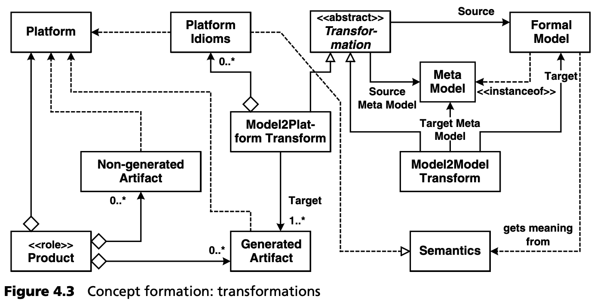
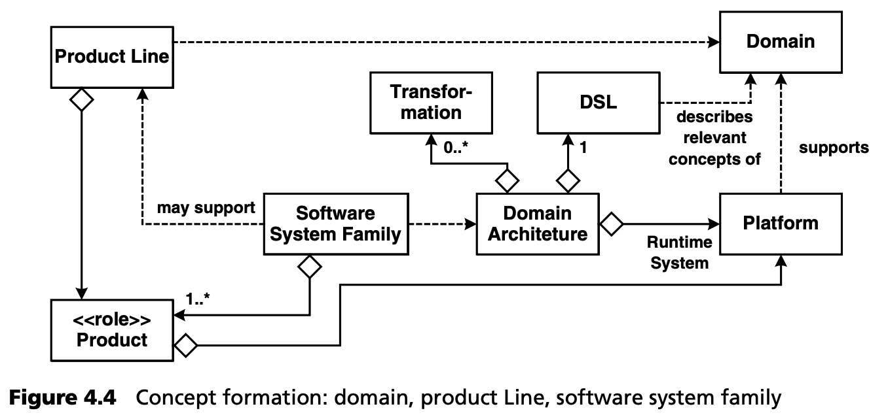

## 4.1 共同的MDSD概念和术语
MDSD 的某些技术、子领域或具体内容并不新鲜。诸如 “生成式编程”、“特定领域建模”、“产品线工程”，尤其是 “代码生成 ”等术语早已有之，尽管它们在流行程度上差别很大。OMG 通过其 MDA 计划启动了某些核心概念的标准化进程，尽管其主要重点是互操作性和可移植性。MDA 很快就获得了相对较高的普及率，因此在一定程度上盖过了上述技术，但又没有完全盖过它们。因此，我们认识到需要有一个统一的共同背景，包括其术语，我们将大胆地创造这两者。这个概念背景就是模型驱动的软件开发，OMG 的标准术语将在合理和可能的范围内作为基础。

我们将以静态 UML 模型的形式开发通用概念及其关系，即 MDSD 概念空间，并逐步扩展和完善。

### 4.1.1 建模

**领域**

MDSD 的起点总是一个领域。这个术语描述了一个*有边界的兴趣或知识领域*。为了内化和处理这些知识，创建一个领域概念的本体是非常有用的。如果要对领域进行区分，可以从技术和专业两方面来考虑。例如，第 3 章中的案例研究就属于“商业软件架构”领域，因为它包含实体、系统用例、控制器和展示等概念。“专业”领域可以是“保险”，包含保险产品、费率、损失或损害、服务、投保人、保险合同等概念。其他领域的例子可能包括 “嵌入式系统”、“EAI”或 “天文学”。

域可以由更小的子域组成。子域可分为两种：
- 技术子域描述的是整个系统中适合使用专门建模语言的单个部分或方面。典型的例子包括图形用户界面布局和持久性。
- 综合系统可细分为分区或内容增量。例如，在保险领域，可以为单个部分或产品类型定义分区，如 “人寿”、“车辆”、“责任 ”等。

**元模型**

就 MDSD 而言，明确一个领域的结构(即本体)是绝对必要的，这样才能将该结构或其相关部分形式化。这是一切自动化的基础。形式化是以元模型的形式进行的。第 3.2.1 节中的 UML 配置文件就是这样一个元模型的例子。它将基本 UML 元模型与该领域的相关概念进行了特殊化。一般来说，元模型不一定是基于 UML 的。

元模型包含语言的抽象语法和静态语义，是元元模型的一个实例。

**元元模型**

元一词是相对的。元模型描述了可用于模型建模的概念（即元模型实例中的概念）。因此，元模型本身必须有一个元模型来定义可用于元建模的概念。这就是元元模型的作用。元元模型在两个方面非常重要：对于定义元模型的人来说，元元模型定义了用于定义元模型的语言。对于工具集成者来说，元元模型更为重要，因为它是元模型之间集成的基础。因此，作为工具构建者，通常需要使用特定的元元模型来构建元模型。元模型的知识被硬编码到工具中。

关于模型、元模型和元元模型的更多详情，请参阅第 6 章。

**抽象语法和具体语法**

Java 等语言的具体语法规定了该语言的解析器所接受的语法，而抽象语法则仅仅规定了该语言的结构。例如，从关键字的拼写等细节中引入抽象。因此，可以说具体语法是抽象语法的实现。有趣的是，各种具体的语法形式可以有一个共同的抽象语法。换句话说，一个领域的元模型可以用不同的符号来表达，例如基于 UML 的图形符号或文本符号。

从技术角度看，语言的抽象语法通常由解析器实例化，也就是说，编译器用它来表示编译过程堆中的输入（程序源代码），以便进一步处理。这种范式在 XML 领域很常见：XML 文档是用 XML 的具体语法编写的，通用 XML 解析器从中实例化出内存中的表示形式--DOM[1](#1) 树。DOM 本身就是 XML 的抽象语法。

UML 是另一个例子：它的具体语法是由小方框和箭头组成的图形符号，而抽象语法则包含类、属性、操作、关联、依赖等构造以及这些构造之间的关系。

自然而然就会出现这样一个问题：如何才能真正指定或写出一个领域的抽象语法或元模型？为此，通常会有一个元元模型。在 OMG 标准中，这就是 MOF--元对象设施（第 6 章）。元模型可以用这种原始形式来描述。UML 配置文件是这种情况下的一个特例--换句话说，MOF 只为元模型的规范提供了一种可能的具体语法。

**静态语义**

语言的静态语义决定了它的良好格式标准。编程语言世界中的一个典型例子是变量必须声明的规则。语言的语法（包括抽象语法和具体语法）通常无法确定这一点，也就是说，解析器不会将未声明的变量视为错误，但编译器的静态分析却会失败[2](#2)。

在第 3 章中，我们看到了如何使用 OCL 表达式正式定义 UML 配置文件的静态语义，这些表达式建立在语言的抽象语法（即配置文件的类结构）之上。在 MDSD 中，静态语义尤其重要。它们的作用是检测形式化领域的建模错误。

**特定领域语言(DSL)**

我们现在有了理解特定领域语言（DSL）概念所需的概念。特定领域语言的作用是使一个领域的关键方面（但不是其所有可以想象的内容）可以正式表达和建模。为此，它拥有元模型（包括静态语义）和相应的具体语法。但仅有这些还不够：还缺少赋予元模型构造意义所需的动态语义。DSL 的语义与几个方面有关：一方面，建模者必须知道他们所掌握的语言元素的含义，才能创建合理的模型；另一方面，模型的自动转换必须准确地执行这些语义。关于这一点，稍后再详述。

DSL 的语义必须有详细的文档说明，或者对建模者来说直观明了。如果 DSL 采用了问题空间的概念，那么领域专家就能识别它的 “领域语言”[3](#3)
，这就更容易了。

建模语言通常与 DSL 同义。我们更喜欢 DSL 这个术语，因为它强调我们总是在特定领域的背景下进行操作。

DSL 的功能和复杂程度各不相同。带有有效性测试的简单文本配置选项就可以构成 DSL，而 DSL 的另一端则是带有相应特定语言编辑器的图形语言。

DSL 编辑器分为两类：通用工具（如通过配置文件配置的 UML 工具）和定制的 DSL 专用工具。

**形式化模型(Formal Model)**

下面我们将结合 MDSD 讨论形式化模型。形式化模型是自动转换的起点--即使是纯粹的解释性方法也需要形式化
模型。形式化模型需要 DSL，因此显然与相应的领域有关。它是用 DSL 的具体语法表述的，至少在概念上构成了给定元模型的一个实例，在大多数情况下，在技术上也是如此。

因此，形式化模型是用 DSL 拟定的句子，其含义来自 DSL 的语义。因此，在 MDSD 中，领域的上下文显然是最重要的。

现在我们来看几个例子：
- 第 3 章案例研究中以架构为中心的设计就是 MDSD 背景下的形式化模型。它们的领域是商业软件的架构。
- Java 程序是编程语言 Java 或其相应元模型的实例。Java 也具有语义。但 Java 的领域是什么呢？可以说是 “图灵可计算函数”--原则上就是 “一切可以用计算机完成的事情”。可执行 UML 也是如此，它是第 12 章描述的 UML 的直接可执行变体。在 MDSD 的语境中，这样的领域没有什么帮助，因为我们的方法是将更高层次的问题空间概念形式化，以便将它们与编程语言的抽象层次区分开来。
- Powerpoint 幻灯片本身并不是 MDSD 的正式模型，尽管它拥有一个非常通用的元模型（矩形、箭头、日蚀、文本），但这种模型并没有语义。一旦用基于 Powerpoint 的具体语法定义了真正的 DSL，就可以进一步处理相应地形成正式模型的 Powerpoint 幻灯片，例如，从中生成图形用户界面 (GUI) 的代码。

### 4.1.2 平台
现在，我们通过下一个分区来扩展我们的领域 MDSD 本体：我们借助 DSL 来表示问题空间，允许对形式化模型进行进一步处理（转换）或解释。为此，我们需要在 “另一侧”--也就是在解决方案空间--有某种东西支持转换或解释--有某种东西作为转换生成的代码的基础。

**平台**

平台一词用于 MDA（第 2 章和第 12 章）以及软件生产线工程中。它具有足够的通用性，可用于描述 MDSD。平台的任务是支持领域的实现，也就是说，形式模型的转换应尽可能简单。在第 3 章的案例研究中，我们使用了带有 Apache Struts 的 J2EE 作为平台，外加一些我们自己创建的超类和辅助类。领域的 DSL（这里使用的以架构为中心的 UML 配置文件）描述了问题空间（实体、控制器、表现形式），但没有描述解决方案空间，即平台。显然，转换越容易构建，平台就越强大。如果我们将 Struts 和辅助类从平台中移除，那么在代码生成过程中映射 DSL 的动态结构（其活动图）所需的工作量就会大得多。平台也可以级联。

在解释的极端情况下，平台扮演着可执行模型虚拟机（解释器）的角色，因此模型转换变得微不足道。

**构建块(Building Block)**

平台可以建立在现有的构件基础上。这些构件可以是中间件、库、框架、组件或 AOP[4](#4)的各个方面。

### 4.1.3 转换
在了解了建模和平台之后，我们现在可以将概念空间中的这两个分区连接起来：

**转换**

MDSD 转换总是基于源元模型，因为要转换的源模型正是该元模型的一个实例。转换规则只能基于元模型的构造，这是它的主要目的，因为转换实现了 DSL 的语义。

我们区分了模型到模型的转换（Model2ModelTransform）和模型到平台的转换（Model2PlatformTransform），后者通常也称为模型到代码的转换。

模型到模型的转换会创建另一个模型。然而，这个模型通常基于与源模型不同的元模型。这种转换通常描述源元模型的构造如何映射到目标元模型的构造。MDA 通过其查询/视图/转换规范实现了这种方法，详见第 12 章。

相反，从模型到平台的转换 “了解 ”平台，并生成基于平台的工件（生成工件）。适合现有框架的生成源代码就是一个例子。对于这类转换，不需要目标元模型，因为我们通常只处理简单的文本替换。第 3 章中的模板定义就属于这一类。请注意，除了转换，解释器也可以用来执行模型（见第 8.4 节）。

**平台成语**

模型到平台的转换可以使用有关平台的完整知识，这为它们提供了一个强大的工具--特定于平台的成语（Platform-specific Idioms），转换可以透明地使用这些成语。在第 3 章的案例研究中，我们生成了使用业务委托模式的代码，使领域模型与 EJB 编程模型保持一致。这种模式的使用不需要在模型的任何地方指定--关于在哪里以及如何应用这种模式的知识仅存储在转换中。

**产品**

MDSD 追求的目标是，通过一次或多次转换，创建部分或全部软件产品。产品可以是一个完整的应用程序，也可以只是一个组件，用作其他地方的构件。就 MDSD 而言，这种产品汇聚了平台、生成的、有时甚至是非生成的工件。例如，非生成工件可以是特定于应用程序的辅助类，也可以是手动编程的业务逻辑。

### 4.1.4 软件系统族

下一个 MDSD 分区将研究领域产品之间的相关性，并解决可重用性问题。

**领域架构**

领域元模型、平台和相应的转换（包括已实现的成语）是实现从模型到产品（无论是完全自动化还是部分自动化）过渡所需的工具。这些所有的集合就是我们通常所说的领域架构--MDSD 的核心概念。除平台架构外，领域架构还决定了哪些概念在形式上得到支持（尽管不一定是具体语法），以及如何将这些概念映射到现有平台上。在这种情况下，平台扮演着运行时系统的角色：领域架构总是相对于平台而言的。第 3 章案例研究中的生成式软件架构就是领域架构的一个例子。

**软件系统族**

显然，一个领域体系结构适用于构建所有可以用给定元模型表示并在同一平台上实现的产品。

使用特定领域架构可以创建的所有产品的集合通常被称为软件系统族。换句话说，软件系统族使用领域架构来实现它，而领域架构对软件系统族的所有产品都是可重用的。领域架构必须具有足够的灵活性，以便表达构成软件系统族的各种产品之间的差异（可变性）。

**产品系列**

产品系列是一组互补的单一产品。从用户的角度来看，产品系列中的产品可以是替代产品，即适用于不同但相关的环境，也可以在内容上相互补充，从而形成一个 “套件”。值得注意的是，软件系统族的产品并不一定具有任何技术共性。软件系统族可以构成产品系列的基础，但并非必须如此。

---
#### 1
DOM： 文档对象模型。

#### 2
从概念上讲，静态语义属于语言的语法而非语义。

#### 3
在以架构为中心的语境中，领域专家更像是软件架构师，因为这里的领域是软
器架构。

#### 4
面向方面的编程 [Lad03](../ref.md#lad03)。

