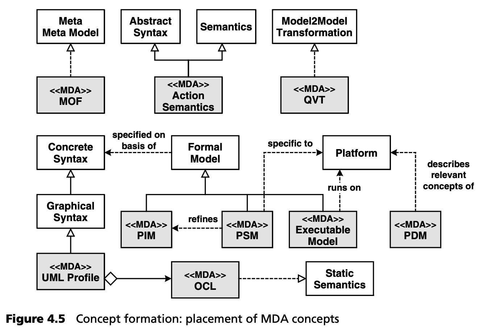

## 4.2 模型驱动架构

第 [12](../ch12/0.md) 章讨论了 MDA 的内容、方向和趋势。本节将讨论如何从概念上把这一标准置于上一节所述的 MDSD 总体框架中。图 4.5 显示了 MDA 在 MDSD 概念空间中的位置。

从本体论上讲，MDA 是 MDSD 的一种特殊化，具有以下特点：
- 软件系统族和产品线在 MDA 术语中没有直接对应的术语，而且这些术语在本上下文中也没有直接相关性。
- MDA 使用 MOF 作为其元元模型，即作为定义元模型的一种手段。
- MDA 希望 DSL 以 MOF 为基础。只要是在 OMG 元元模型的帮助下定义的，任何符号和元模型都是可行的。在实践中，MDA 建议使用 UML 配置文件作为 DSL 的具体语法。因此，DSL 的核心是 UML。因此，静态语义是由 OCL 表达式指定的。
- 正式模型有多种定义：相对于平台，领域模型可以是特定的（PSM），也可以是非特定的（PIM）。MDA 建议模型之间的转换分几个步骤进行，但并不禁止从 PIM 到代码的直接转换。
- 为了能够将连接平台的最终转换描述为模型到模型的转换，还必须通过元模型来描述平台。为此，需要使用 PDM（平台描述模型）。
- 现阶段还没有标准化的转换语言。OMG 的 QVT 预计将于 2006 年底完成（另见第 [10.5](../ch10/5.md) 节）。它的目标主要是描述源元模型和目标元模型之间的转换，用于模型到模型的转换。
- 可执行的 UML 模型非常突出，也是许多 MDA 代表的主要目标之一：它们或多或少可以直接 在一个功能强大的通用平台上执行 -- 也就是说，它们可以被 UML 虚拟机解释，或通过转换完全编译，从而可以在低级平台上执行。与 “保险业务” 这样以专业为重点的领域相比，我们这里处理的 “领域” 与编程语言的表现力相对应，因此不需要 UML 配置文件。这显然增加了建模语言与专业领域之间的语义差距。
- UML 的动作语义是可执行 UML 的基本构件，因为它们允许以抽象形式规范算法。当使用 (特定工具，因此非标准化的) 具体语法时，您可以像使用其它编程语言一样使用动作语义编程，尽管程序与静态模型的内容是集成在一起的。
