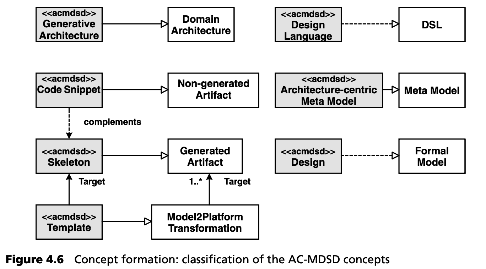

## 4.3 以架构为中心的 MDSD
AC-MDSD 是本书的主要议题之一，现在我们可以正确地介绍这一术语了。图 4.6 显示了该方法在 MDSD 一般背景下的分类：

AC-MDSD 是 MDSD 的专业化，在概念上与 MDA 重叠。它建立在以下基础之上：
- 领域以架构为动机，例如 “商业软件的架构 ”或 “嵌入式系统的组件基础设施”。
- 要创建的产品通常是完整的应用程序。
- 从黑盒观点来看，通常只存在从模型到平台的单步转换，或者更准确地说，从模型到代码的转换。不过，这些转换可以是相互结构化的（白盒），以模块化为目的，连续执行多个转换。
- 因此，正如第 3 章所述，DSL 的元模型包含尽可能抽象的架构概念。
- DSL 也被称为设计语言。这里通常使用 UML 配置文件，有时还结合附加的文本规范。
- 正式模型也称为设计。
- 通常，模型到平台的转换是一种模板，与生成的代码非常相似，因此可以很容易地从参考实现中提取出来（第 2.5 节）。
- 转换的目的不是创建完整的应用程序，而只是创建一个包含架构基础代码（骨架）的实现框架。
- 非生成的执行代码（“业务逻辑”）用目标语言手动执行，以创建代码片段。为此，生成的骨架可包含保护区域，以补充迭代再生后仍会存在的应用程序逻辑。另外，还可以使用合适的设计模式整合生成代码和非生成代码，详见第 9 章。
- 设计语言、模板和平台构成了生成式架构。在这里，我们要处理的显然是一种支持软件系统族的特殊领域架构。

通过创建一个提供最重要架构概念的平台，AC- MDSD 试图最大限度地缩小模型与目标平台之间的差距。用于应用建模的元模型可以与目标架构/平台紧密结合--这也是 AC- MDSD 名称的由来。因此，我们可以轻松实现单一生成步骤，而不必应用多个连续的转换步骤。
