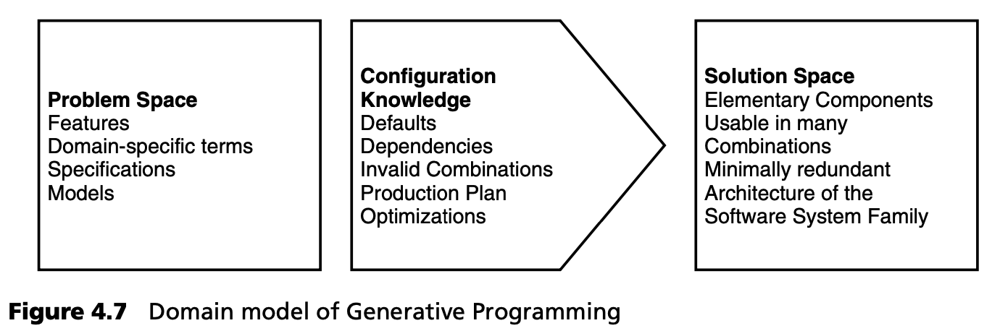
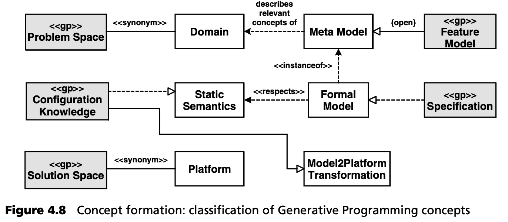

## 4.4 生成式编程
由于我们是第一次在这里讨论这种方法，因此我们不仅要探讨它与 MDSD 的关系，还要简要介绍它的动机、历史和主要关注点。

生成式编程（Generative Programming，GP）一词已使用了数年。Krzysztof Czarnecki 和 Ulrich Eisenecker 的著作《生成式编程》[EC00](../ref.md#ec00) 对 GP 下了如下定义，因此该术语开始流行起来：

*生成式编程是一种基于软件系统族建模的软件工程范式，在给定特定需求规格的情况下，通过配置知识 (configuration knowledge) ，可根据需求从基本的、可重复使用的实现组件中自动生成高度定制和优化的中间产品或最终产品。*

推动 GP 发展的因素有
- 遵循工业生产模式，如汽车制造模式。生产线和订单的比喻被广泛使用。
- GP 声称能根据规格生产完整的产品（应用）-- 100% 自动化。
- GP 强调从预定义的原子组件创建（配置）应用程序。
- 生成针对特定方面（如性能或代码大小）进行优化的产品。

因此，GP 的目标是根据正式需求规格等模型创建精确匹配和优化的产品。为了说明这一点，让我们来看看生成式领域模型：

应用程序的正式要求是在领域的问题空间中定义的。这可以通过不同的模型和规范来实现，其中包括借助特征模型（见第 [13.5.3](../ch13/5.md#1353-方法) 节）。在解决方案空间中，相应的应用 --产品-- 是通过基本组件实现的。就其功能而言，这些组件必须组合良好且不多余。在这种情况下，组件也可以是 AOSD 的一个方面。它们之间的关系是由配置知识建立的，其中包括有用的默认值、依赖性和非法组合：因此，非法规格的产品将不会被创建。此外，配置知识还包括生产计划和可能的优化。因此，它还包含生成器。

现在，让我们结合 MDSD 的分类来看看这种方法及其术语（图 4.8）：

从本体论上讲，GP 是 MDSD 的一种特殊形式，具有以下特点：
- 软件系统族的概念在 GP 中起着核心作用。其假定一个领域通过特征模型建模（第 [13.5.3](../ch13/5.md#1353-方法)  节），并在此基础上生成单一产品。
- 传统上，（UML）建模的概念并不明显。取而代之的是基于领域分析定义的 DSL（通常是文本 DSL），它的作用是使产品系列可描述。
- 特征模型通常是 DSL 或元模型的基础，尽管这不是强制性的。原则上，任何类型的元模型或 DSL 都可用于 GP。
- 如果使用特征模型来描述产品规格，那么它在 MDSD 中就扮演了形式模型的角色。
- 领域也被称为 *问题空间* (problem space)，而构成产品的平台和组件则被称为 *解决方案空间* (solution space)。
- 配置知识存储在生成器中，生成器执行一步式模型到代码的转换，就像 AC-MDSD 中那样。静态语义（识别无效的产品配置）同样是通过配置知识实现的。
- 该平台通常由可最大限度组合且冗余度最小的组件组成，最终实现 DSL 的表达能力。
- GP 中使用的工具通常是特征建模工具。当然，这并非不可避免：根据 DSL 的不同，也可以使用其他工具。例如，在 C++ 模板元编程中，C++ IDE 就是首选的建模工具。

尽管 GP 的定义并不强制要求使用静态生成技术，但静态生成技术还是经常被使用。这是因为 GP 强调优化产品以提高效率（性能或占用空间）。配置框架或创建虚拟机并不常见。尽管如此，重要的是要明白 GP 不只是简单的代码生成。GP 也不应等同于 C++ 模板元编程，后者只是 GP 的一种实现技术。

传统上，GP 更侧重于创建小型但高效的产品。大型分布式企业应用程序或系列一直不太受关注。有关 GP 领域最新发展的详细信息，请参阅 Krzysztof Czarnecki 的网站 [CH05](../ref.md#ch05) 。
