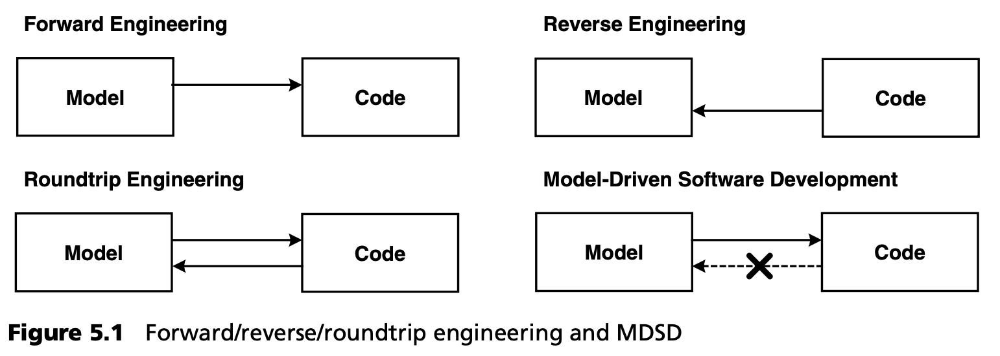

## 5.2 MDSD vs. 往返工程

往返工程的概念是能够对模型以及由该模型生成的代码进行任何类型的更改。变更总是双向传播的，两个工件总是一致的。在这种情况下，从代码到模型的转换（逆向工程）尤其有趣。

在这些方法中，模型的抽象程度通常与代码相同（即 “一个类一个矩形”）。它实际上是程序结构的可视化。在这种情况下，自动跟踪模型中代码的变化既可行又有用。

MDSD 采用的是另一种方法：模型肯定比从中生成的代码更加抽象。因此，在人工修改生成的代码后，一般不可能自动保持模型的一致性。因此，应避免手动修改生成的代码。因此，有必要给出一个精确的定义，说明哪些部分是生成的，哪些部分是手动执行的。要在不使用往返工程的情况下获得所需的代码，可以采用其他各种方法[Fra02]：
1. 抽象。决策的抽象层被提升到模型层。只有在模型层面上找到相应的抽象层次，这样做才有意义。
2. 标记模型。这包括在不提高抽象层级的情况下，将代码中的决策采纳到模型中。这一过程被称为用实现决策 “标记 ”模型。这种做法很快就会使模型受到实施概念的污染，而这些概念并非来自建模者或领域专家的领域，因此可能会造成错误。在对模型进行标记时，最好引入一个技术子域（见第 8.3.3 节），这样建模者和领域专家就不会受到实施概念的影响。
3. 代码类的分离。这包括对目标架构进行调整，使手动创建的代码必须写入专门为此目的创建的类中。
4. 对代码进行标记。这包括在代码中引入保护区域，并通过使用特殊标记来实现，这些标记可保护置于其间的代码在再生过程中不被覆盖。这是一种实用的程序，用于在生成时混合生成的代码和手动创建的代码。这种程序有不同的变体，包括不仅允许插入手工创建代码，还允许选择性替换生成指令的程序。

这份清单严格按照从高到低的顺序列出了各种解决方案的优越性。对模型进行标记仍然可以明确划分责任，并实现全自动再生，而无需进一步的人工处理。对代码进行标记则需要小心谨慎，因为这会妨碍版本控制等工作。
