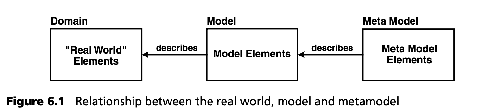
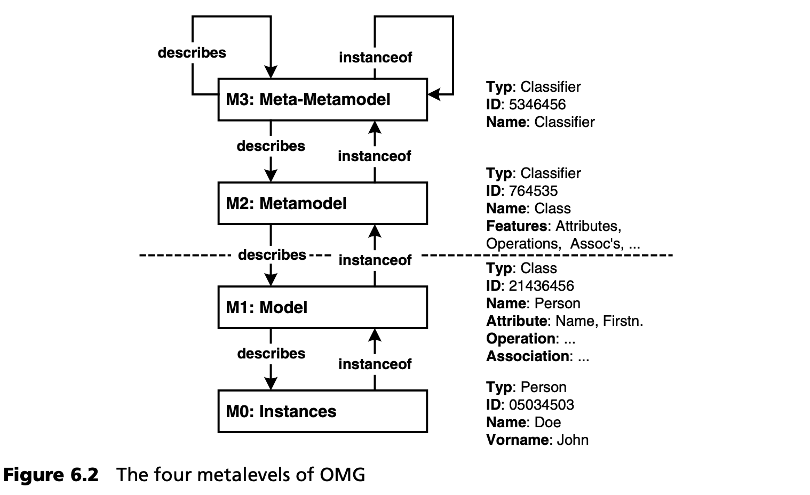
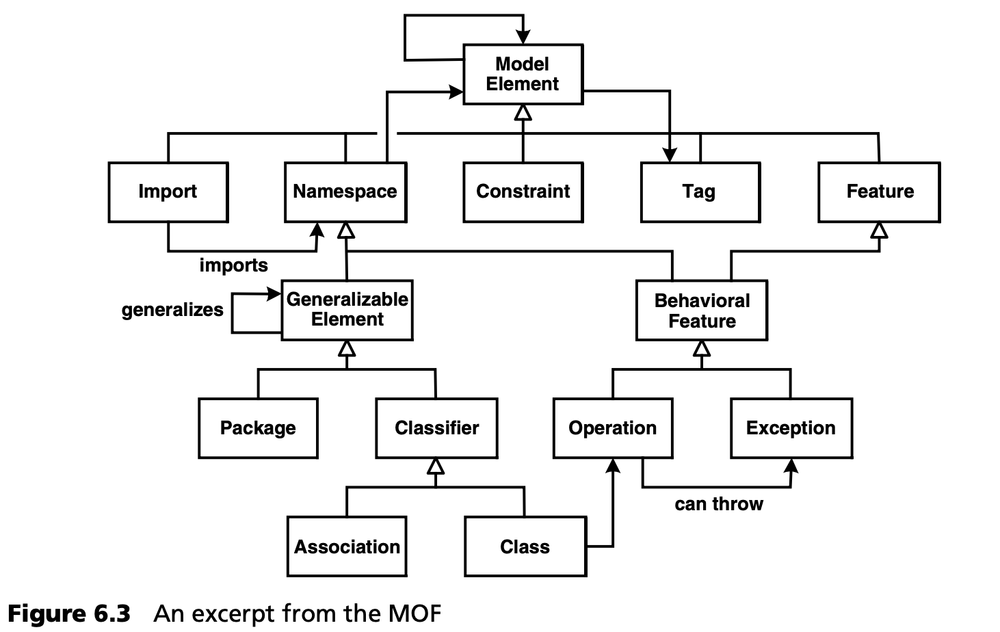
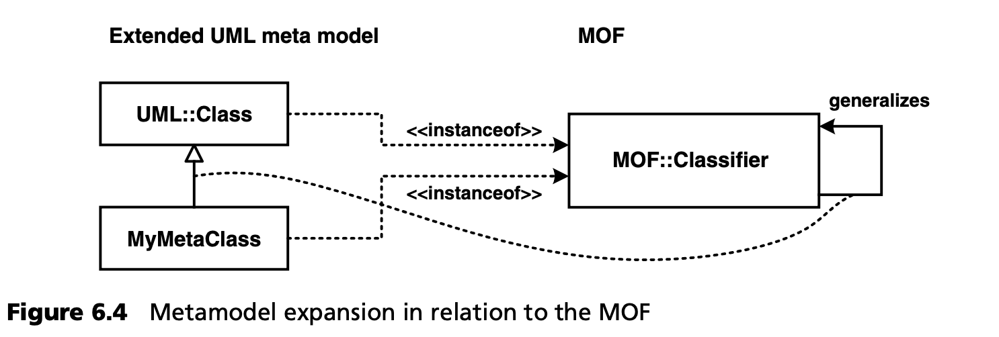

## 6.1 什么是元建模
元模型是对建模进行陈述的模型。更确切地说，元模型描述了模型的可能结构--它以抽象的方式定义了建模语言的构造及其关系，以及约束和建模规则--而不是建模语言的具体语法。我们说元模型定义了建模语言的抽象语法和静态语义（见第 4 章）。反之亦然，每种形式语言，如 Java 或 UML，都有一个元模型。

元模型和模型有类-实例的关系：每个模型都是元模型的实例。因此，要定义元模型，就需要一种元建模语言，而元建模语言又由元模型来描述。从理论上讲，这种抽象'级联'可以无限延续下去，但在实践中还需要采取其他步骤，我们很快就会了解到这一点。

就 MDSD 而言，领域的 DSL 是由元模型定义的。具体语法--即建模所使用的文本或图形构造的具体形式--在概念上是无关紧要的：它必须仅仅以一种毫不含糊的方式呈现元模型。在这里，抽象语法和具体语法之间的区别非常重要，因为元模型（而不是具体语法）是自动处理模型的基础，也是工具支持的基础。另一方面，合适的具体语法是建模者的接口--没有它，就无法创建模型--它的质量决定了模型的可读性[1](#1)。

由于这种解耦，DSL 的元模型和具体语法可以保持 1:n 的关系：同一个元模型既可以通过图形语法实现，也可以通过文本语法实现。

原则上，模型可以用任意建模语言来描述。语言的选择应基于语言是否适合要描述的领域。在现实生活中，这一决定往往取决于建模语言是否有实际可用的工具，这意味着如今 UML 在许多情况下被用于建模。因此，在 UML 的背景下研究元建模具有特别重要的意义。

元关系总是相对于模型而言的。元模型一词的绝对定义在理论上没有意义，但在实践中却非常有用。因此，OMG 定义了四个元级别。它们如图 6.2 所示，并将在下面的章节中进一步描述。

在虚线下方，我们发现自己正处于软件开发人员熟悉的位置。在模型 M1 中，定义了一个类。这个类有一个名称 Person 和一些属性，这里是姓名。这个类的实例在 M0 中创建，通常在程序运行时创建：在图中的例子中，这个人的（内部）ID 是 05034503，姓是 Doe，名是 John，更确切地说，这个实例的属性 name 和 first name 的值分别是 Doe 和 John。因此，在类的实例化过程中，值会分配给类的属性。请注意，一个类可以有多个实例。尽管图 6.2 中没有显示，但模型（这里指 “人 ”类）是通过语言定义的，在我们的例子中就是 UML。

我们现在提升一个元级别。在元模型 M2 中，定义了在 M1 模型中使用的构造。因此，M1 模型的元素就是 M2 层元模型元素的实例。由于我们在 M1 模型中使用类，因此必须在 M2 中定义构造 Class。UML 元模型[2](#2)
 实际上就是这种情况。

UML 元模型中的构造类（Class）现在是元元素 MOF 分类器（MOF Classifier）的实例。MOF 类在 M3 中定义。元对象设施（MOF）是 OMG 的元元模型（见第 12 章）。MOF 的作用是在 M2 中定义建模语言，例如 UML。这样做的目的是，UML 将不再是唯一的建模语言，而是在 MOF 的基础上定义更多特定领域的建模语言，也可能是标准化的建模语言。MOF 还能定义非 OO 建模语言。下面我们将举例说明这种能力。

在 OMG 模型中，没有高于 MOF 的元级别--基本上，MOF 是自己定义自己的。

图 6.3 是 MOF 的节选（简化且不完整）。

顾名思义，MOF 是一种基于面向对象范式的元语言。为此，MOF 借用了 UML 的类核心，从而使用了相同的概念和具体语法。

每当我们扩展 UML 元模型时，例如通过从 UML::Class 派生一个元类 MyMetaClass，我们都是通过 MOF 来实现的。这两个元类之间的继承关系是分别在 MOF::Classifier 或其超类 MOF::GeneralizableElement 中定义的继承关系。

#### 1
以上所述不仅适用于模型/建模语言，同样也适用于编程/编程语言。

#### 2
因为我们在 M1 中使用 UML 作为语言，所以 M2 必须定义 UML 语言--UML 元模型在这里的应用是
M2。

