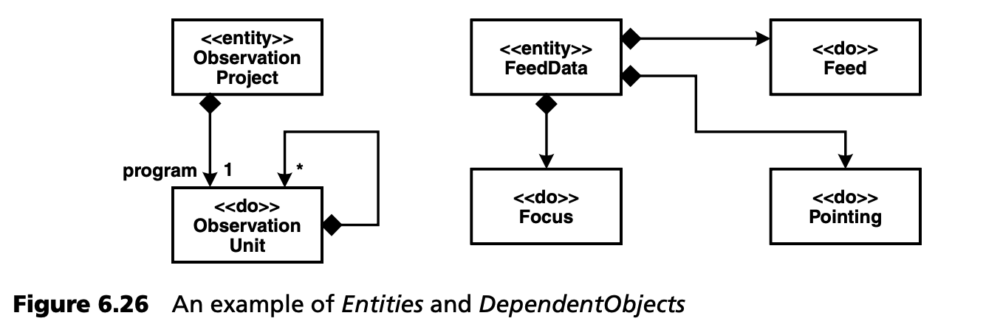
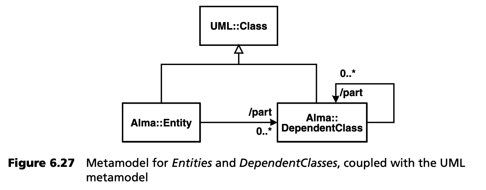
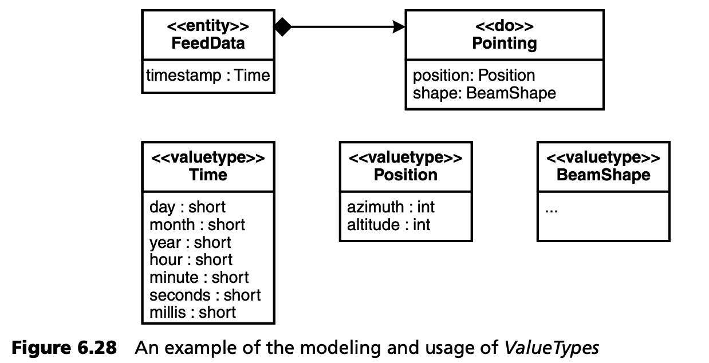
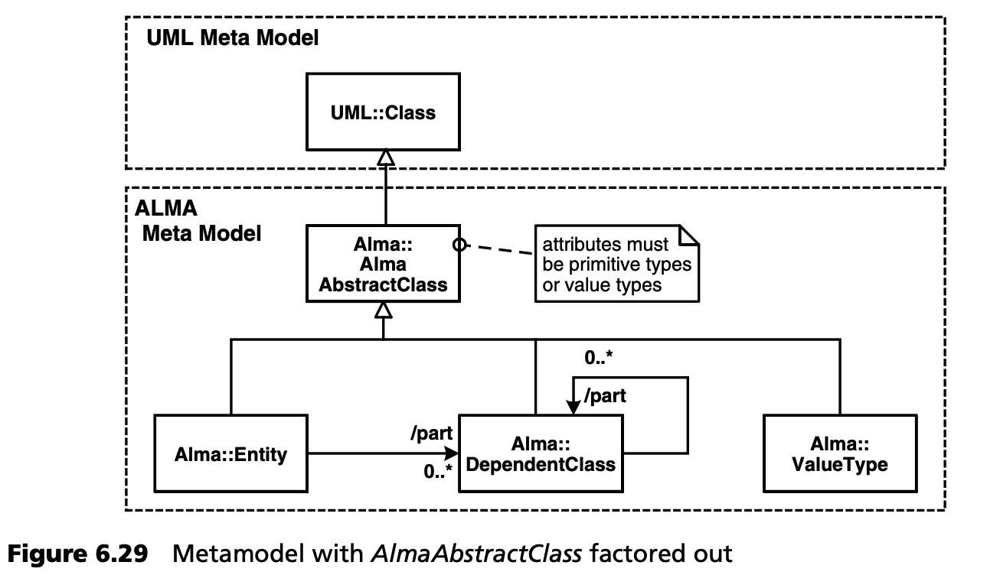
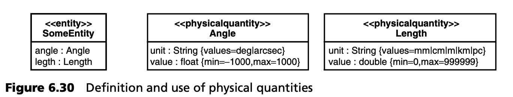
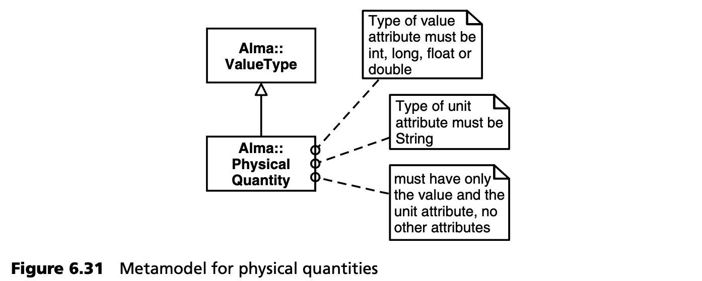
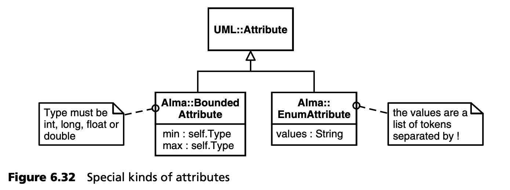
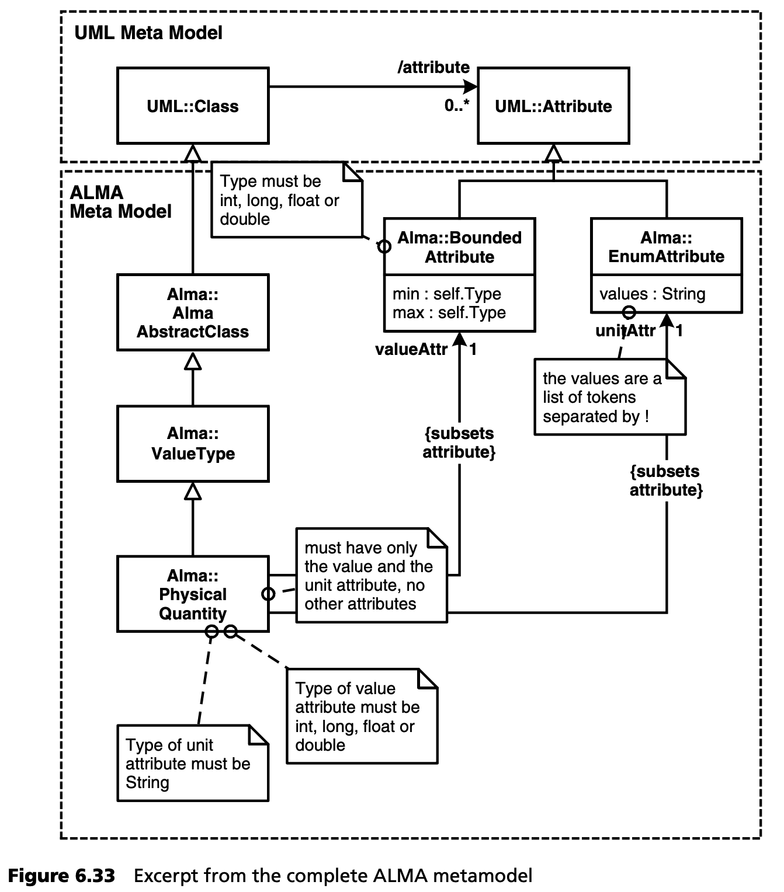

## 6.11 更复杂的示例
本节包含一个更为复杂的元建模示例。我们在这里讨论的是 ALMA 望远镜的一部分<sup>[11](#11)</sup>。ALMA [ALMA](../ref.md#alma)是一个国际天文学项目，其目标是在智利阿塔卡马沙漠建造一个由 50 个射电天线组成的阵列。多个国际组织参与了该项目： 欧洲航天局（ESO）、国际宇航科学院（IRAM）、国际和平研究所（MPI）、国家天文台（NRAO）。这五十个天线都通过计算机连接起来，成为一个无线电干涉仪，以达到比单个天线高得多的分辨率。为了改变望远镜的分辨率，可以使用叉车实际改变所有 50 个天线的位置。

当然，这样一个项目需要一个相当复杂的软件基础设施。这包括
- 用 C++ 和 CORBA 实现的天线转向实时部分。
- 工作定义 (Job definition) 脚本，用 Python 实现。
- 高性能计算模块，用于数字图像的关联和后处理。
用 C++ 实现。
- 用 Java 实现的 “经典” IT 基础设施，用于项目定义 (definition of the projects) 、数据管理和远程访问望远镜基础设施 -- 望远镜位于智利 5000 米的高空，而科学家们则在家中通过网络开展工作。

上述几个子系统都需要系统的许多数据结构。由于有许多非功能性要求，数据结构必须有不同的表现形式： 用于存储和远程传输的 XML、望远镜控制系统中的 CORBA 结构，以及一些天文学专用格式，以便更有效地处理原始数据。

因此，决定用 UML 定义数据结构，并以此为基础生成其他各种工件<sup>[12](#12)</sup>：
- XML schema
- XML 封装类以及各种语言（C++、Java、Python）的（反）序列化器 ((de-)marshalers)
- 专有数据格式的转换器
- 数据模型的 HTML 文档

### 6.11.1 基础知识
我们必须首先区分 *实体 (Entities)* 和 *从属对象 (DependentObjects)* 。实体有自己的 ID，可以根据多个属性进行搜索。实体可被细分。实体的各个部分就是从属对象。这些部分没有自己的标识，不能被搜索 -- 只有拥有实体才知道它们并引用它们。部分可以包含更多的部分。图 6.26 显示了两个例子：



一个 *ObservationProject* 包含多个 *ObservationUnits* 。这些单元组成一棵树，其根由 *ObservationProject* 用 *program* 引用。在另一个示例中，显示的是观测数据。在此不做过多赘述，我们可以看到 FeedData 由各种子结构组成。

将元模型与 UML 耦合（即扩展 UML 元模型）后，这类模型的元模型如图 6.27 所示：



### 6.11.2 值类型
数据模型中还存在其他数据区别。特定信息，如恒星在天空中的位置，既不是 *DependentObjects*，也不是基础类型。因此，我们引入了 *ValueType*。*ValueType* 没有标识：它们只包含其值。具有相同值的两个 *ValueType* 实例被认为是相同的。按照惯例，*Entities* 或 *DependentObjects* 的属性只能是基础类型或 *ValueType* 。这样做的原因是，这些值会在系统中重复出现。使用 *ValueType* 的示例如图 6.28 所示：



元模型也相应扩展。由于 *Entities* 、*DependentObjects* 和 *ValueType* 对其属性有相同的限制，因此引入了相应的抽象元类 *AlmaAbstractClass* 。如图 6.29 所示，这是面向对象编程中的常见做法，在这里也用于元级别。



在这种情况下，我们同意用自然语言而不是 OCL 来编写约束，因为生成器需要用 Java 手工编写约束。属性类型的约束可以用 OCL 约束描述如下：

```
context AlmaAbstractClass
inv: attribute->forAll( a |
        (a.oclIsKindOf(ValueType) ||
         a.oclIsKindOf(PrimitiveType) ) )
```

### 6.11.3 物理量
由于 ALMA 毕竟是一种物理测量仪器，其工作数据涉及大量物理量。因此，在元模型中明确提供物理量是合理的。物理量既有数值也有单位，例如 “10 弧秒” -- 10 是数值，弧秒 (arcsec) 是单位。各种量都有明确定义的单位和数值范围。例如，角度的单位有 *度 (degree)* 或 *弧秒 (arcsecond)* 。距离以毫米 (mm) 、厘米 (cm) 、公里 (km) 和 帕秒 (pc, parsecs) 为单位。所有这些方面都必须反映在模型中。在模型中将这些信息可视化的方法有很多种，我们决定使用图 6.30 所示的方法。这里还是以 *角度 (angle)* 和 *距离 (distance)* 为例。



单位以属性 *unit* 的形式出现，属性单位必须是 *String* 类型。值的类型必须是 *int、long、float* 或 *double* 。*unit* 属性的有效值列表通过标记值给出：我们使用一个用 “|” 分割的列表。物理量可以像 *ValueType* 一样使用，因此它们也必须作为 *AlmaAbstractClass* 的属性出现。

接下来，我们要开发相应的元模型。首先，*PhysicalQuantity* 是 *ValueType* 的子类（经过上面的讨论，这一点应该很清楚了）-- *PhysicalQuantity* 是 *ValueType* 的一种特殊类型。请看图 6.31 中的元模型 -- 为了简单起见，我们还是用简单的英语来表述这些约束。





*BoundedAttribute* 必须是 *int、long、float* 或 *double* 类型。此外，还定义了两个属性 *min* 和 *max*。元类的这些属性在模型中显示为标记值，实际上是模型中定义的物理量的特征。最小值和最大值与属性本身的类型相同。*EnumAttribute* 可以有任何类型。标签值 *values* 定义了要定义的类型的有效值。

然而，物理量和两个新元类型之间的关联性仍然缺失。图 6.33 显示了这一点。



---
#### 11
感谢欧洲航天局（ESO）允许我们在此使用此示例。

#### 12
对于读者中的天文学家来说：当然，这个例子有些简化。
