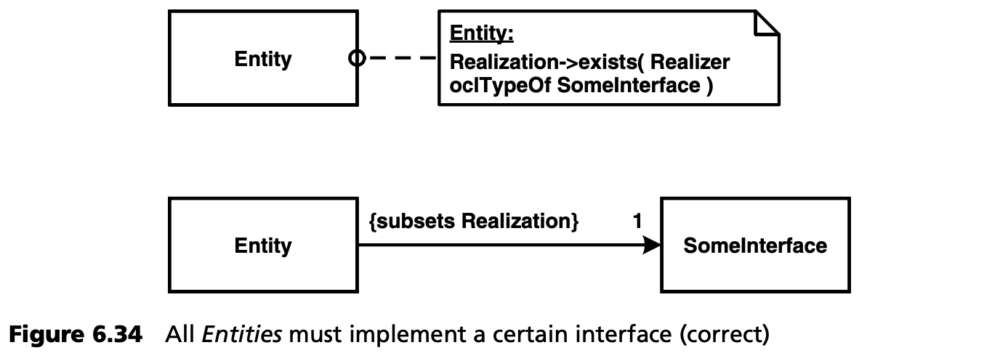
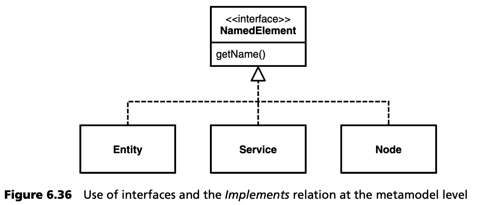
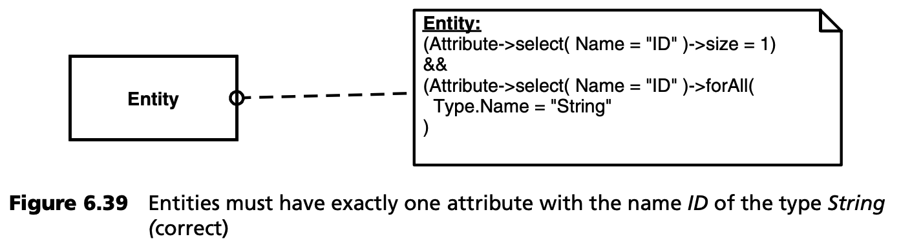
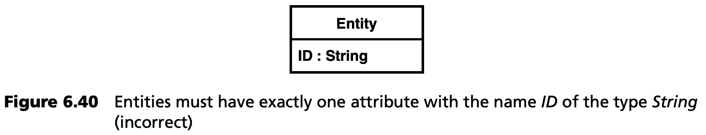
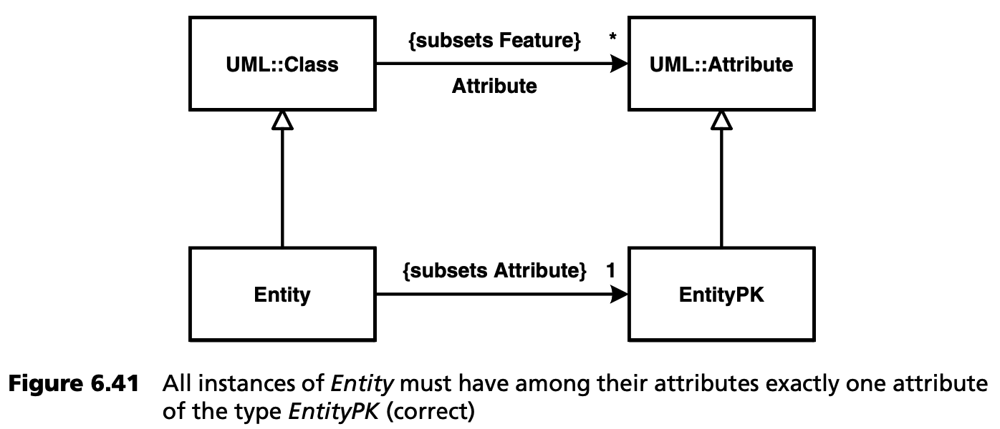
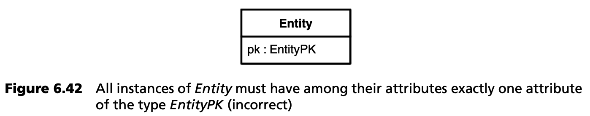
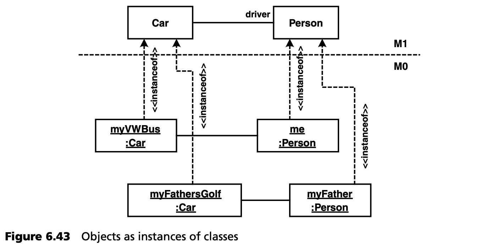
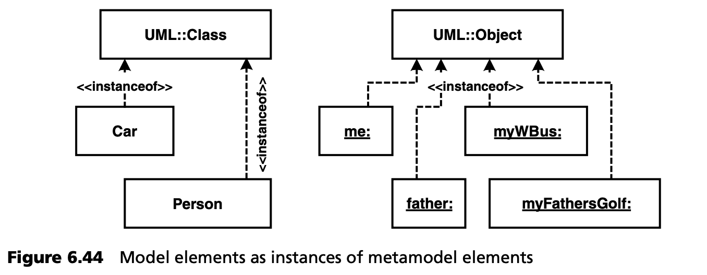
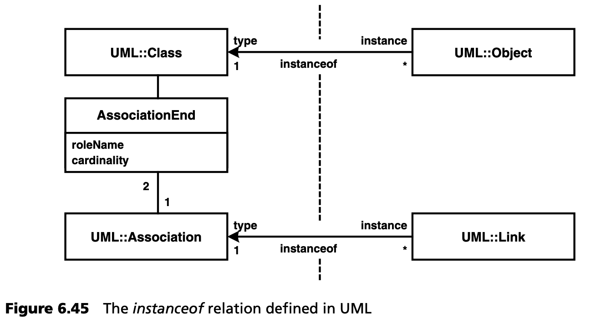

## 6.12 元建模中的陷阱
本节将介绍一些技巧和窍门，并揭示元建模中特别与 UML 有关的一些陷阱：
- 在元建模中，我们经常会遇到这样的问题：必须使用哪种符号已经不明显了。
- 意外发现自己进入了错误的元层次。

一般来说，提出如何用编程语言实现元模型这一核心问题是有用的。如果反过来看，这种观点可以为我们揭示哪种符号才是正确的符号提供提示。

### 6.12.1 接口
**问题**：您希望表达元类 *Entity*（即所有实体）的实例必须实现某个接口这一事实。

**正确的解决方案**：*Entity* 的已实现接口集合必须包含 *SomeInterface* 。这既可以通过 OCL 约束来表达，也可以通过 *subsetting* 相应的元关联来表达（见图 6.34）。



**不正确的解决方案**： 图 6.35 显示元类 *Entity* 实现了接口 *SomeInterface* 。这与原来的描述不同。


有时，由于其他原因需要后者。假设有许多元模型元素，它们的实例都必须有名称。在元级别上定义一个包含 *Name()* 操作的接口可能是有意义的。图 6.36 展示了这一点。



### 6.12.2 依赖关系
**问题**：您想表达这样一个事实，即组件可以依赖于多个接口，因为它们会调用接口的操作。

**正确的解决方案**：在组件和接口之间定义关联，并将其称作 *uses*。图 6.37 演示了一个组件可以使用许多接口，一个接口可以被许多组件使用。


**不正确的解决方案**：图 6.38 中的模型说明元类 *Component* 在某种程度上依赖于元类 *Interface*。


请注意，像图 6.38 中这样的 *Dependency* 是不可能有基数 (cardinalities) 的。因此，“依赖于多个接口” 的语句不能被准确反映。

### 6.12.3 ID
**问题**：实体必须有一个名称为 *ID* 的 *String* 类型的属性。这代表标识属性或主键。我们的前提是元类 *Entity* 继承自 *UML::Class*，因此拥有继承关联 *Attribute*，它定义了类的属性。

**正确的解决方案**：图 6.39 中的正确解决方案使用了 OCL 约束，规定在实体的属性中，必须有一个名称为 *ID*，类型为 *String* 的属性。



**不正确的解决方案**：如图 6.40 所示，定义名称为 *ID* 的 *Entity* 属性，并不能得到正确的结果。相反，它代表了元类实体的标记值定义。



顺便说一句，在正确的模型中，下面的约束条件也是不正确的：

```
context Entity inv:
Attribute->select(
        (Name = “ID”) && (Type.Name = “String”)
    )->size = 1
```

该约束允许存在名称为 *ID* 的各种属性，但只允许存在一个 *String* 类型的属性。

### 6.12.4 主键
**问题**：所有 *Entity* 实例的属性中都必须只有一个 *EntityPK* 类型的属性。这里，*EntityPK* 是元类 *Attribute* 的特殊化。

**正确的解决方案**：图 6.41 显示了正确的元模型：



**不正确的解决方案**：图 6.42 显示了我们在第 [6.12.3](#6123-id) 节中处理过的相同问题，即标记值的定义。



### 6.12.5 元层次和实例
本例以 UML 为例，说明了使用复杂建模语言的一个误区。

图 6.43 显示 UML 类图 (M1) 和 UML 对象图 (M0)。对象是类图中定义的类的实例。到目前为止，对象-类关系很明显是一种 *instanceof* 关系，同一个类可以存在多个对象这一事实进一步证明了这一点。链接 (link) 和关联 (association) 之间的关系也是如此。



从图 6.43 中可以看出，对象和类位于不同的元层次上。另一方面，它们在 UML 中处于*same (同一)* 元层。类和对象模型都是 UML 元模型元素的实例。图 6.44 显示了这一点：



仔细观察，这个明显的矛盾很容易解决：这两个 *instanceof* 并不是同一个语言结构。在第一个例子中，*instanceof* 是 UML 的一部分，并在该上下文中定义（见图 6.45）。



*UML::Class* 和 *UML::Object* 之间的关系是 *MOF::Association*。它定义了 *UML::Class* 和 在这个 (元) 模型 - 即 UML 模型 - 中的实例之间的 *instanceof* 关系。尽管如此，所有模型元素 *(me, my father, myVS-Bus, myfathersGolf)* 当然都是 UML 元类的实例，这里是 *UML::Class* 或 *UML::Object*。<sup>[13](#13)</sup>

---
#### 13
译注：这段的描述显然有笔误。
